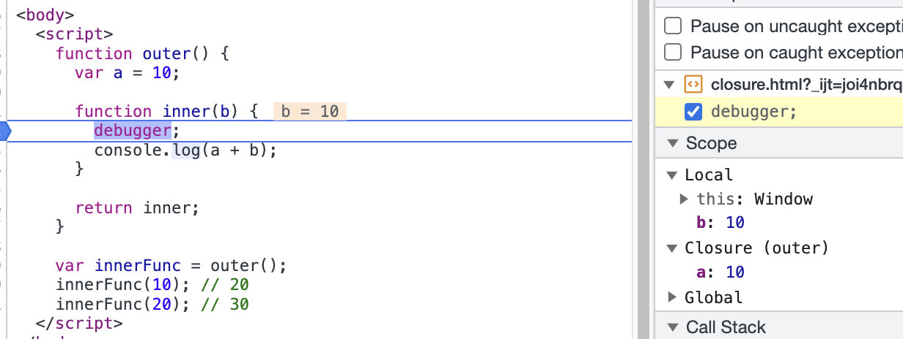

### TL;TR

클로저는 자신이 생성될 때의 스코프에서 알 수 있었던 변수 중 언젠가 자신이 실행될 때 사용할 변수들만 기억하여 유지시키는 함수다.

이는 자바스크립트에서의 함수가 일급 객체(함수)로 평가되어 함수의 반환값으로 사용될 수 있는 특성과, 클로저라 칭하는 내부 함수 객체가
생성될 때 [[Environment]] 내부 슬롯이 현재 실행되고 있는 실행 컨텍스트의 스코프를 저장하고, 이를 렉시컬 환경의 외부 렉시컬 환경에
대한 참조를 구성할 때 사용되어 외부 스코프가 소멸되어도 자신이 참조하고 있는 식별자를 기억할 수 있게 된다.

## 일급 객체(함수)

클로저는 함수를 일급 객체로 취급하는 함수형 프로그래밍 언어에서 사용되는 중요한 특성이다.
여기서 일급 객체이자 일급 함수라는 것은 다음과 같은 조건을 충족한다.

- 변수에 담을 수 있다.
- 함수나 메서드의 인자로 넘길 수 있다.
- 함수나 메서드에서 리턴할 수 있다.

## 렉시컬 스코프

자바스크립트는 렉시컬 스코프를 따르는 프로그래밍 언어이다. 자바스크립트 엔진은 함수가 어디서 호출되었는지가 아니라
어디서 정의되었는지에 따라 상위 스코프를 결정한다. 이를 렉시컬 스코프 (정적 스코프)라고 한다. 즉 함수의 상위 스코프는
함수를 정의한 위치에 의해 정적으로 결정되고 변하지 않는다.

```js
const x = 1;

function foo() {
  const x = 10;
  console.log(x);
}

function bar() {
  console.log(x);
}

foo(); // 10
bar(); // 1
```

렉시컬 환경의 외부 렉시컬 환경에 대한 참조에 저장할 참조값인 상위 스코프에 대한 참조는 함수 정의가 평가되는 시점에 함수가
정의된 환경에 의해 결정된다.

## [[Environment]]

렉시컬 스코프가 가능하려면 함수는 자신이 정의된 환경인 상위 스코프를 기억해야 한다.
이는 **함수 객체의 내부 슬롯인 [[Environment]]가 자신이 정의된 환경을 기억하고 있다.** 이는 해당 함수가 평가되고 있는 시점(해당 함수를
포함하는 상위 코드가 평가되거나 실행되고 있는 시점)에 저장된다.

이후 해당 함수가 호출되었을 때 해당 함수의 실행 컨텍스트가 생성되고 해당 함수의 렉시컬 환경이 생성된다. 여기서 **렉시컬 환경의
외부 렉시컬 환경에 대한 참조값에 함수 객체의 [[Environment]]에 저장되어 있는 상위 스코프의 참조값을 통해 채워진다.**
이러한 과정을 통해 상위 스코프를 기억하고 렉시컬 스코프를 구현할 수 있다.

### 클로저

**클로저는 외부 함수보다 내부 함수가 더 오래 유지되는 경우 내부 함수는 이미 생명 주기가 종료한 외부 함수의 변수를 참조할 수 있게 된다.**
이러한 내부 함수!!를 클로저라 한다.

```js
const x = 1;

function outer() {
  const x = 10;
  const inner = function() {
    console.log(x);
  };
  return inner;
}

const innerFunc = outer();
innerFunc(); // 10;
```

outer 함수를 호출하면 inner를 반환하고 생명 주기를 종료(실행 컨텍스트 스택에서 outer의 실행 컨텍스트를 제거)한다.
그러나 inner는 outer에서 선언된 x라는 식별자를 참조할 수 있다.

이는 **inner 함수가 평가되어 inner 함수 객체를 생성할 때
inner 함수의 [[Environment]] 내부 슬롯에 outer의 렉시컬 환경을 기억하고 inner 함수의 실행 컨텍스트가 생성될 때 렉시컬 환경의
외부 렉시컬 환경에 대한 참조에 사용된다.** 즉 outer의 실행 컨텍스트는 소멸되지만, outer의 렉시컬 환경까지 소멸되는 것이 아니다.

## 상위 스코프를 기억하는 모든 함수는 클로저인가

이론적으로 자바스크립트의 모든 함수는 상위 스코프를 기억하므로 모든 함수는 클로저이다. 하지만, 일반적으로 모든 함수를 클로저라 하지 않는다.

> **클로저는 자신이 생성될 때의 스코프에서 알 수 있었던 변수 중 언젠가 자신이 실행될 때 사용할 변수들만 기억하여 유지시키는 함수다.** [함수형 자바스크립트 프로그래밍]

자신의 상위 스코프에서 알 수 있는 변수를 자신이 사용하고 있지 않다면 그 환경을 기억해야 할 필요가 없다.
자바스크립트 엔진에 따라 기억하는 경우도 있지만 사용하지 않기 때문에 메모리 낭비이다.

외부 스코프에 있었던 변수 중 클로저 혹은 다른 누군가가 참조하고 있지 않는 모든 변수는 실행 컨텍스트가 제거된 후 가비지 컬렉션 대상이 된다.
어떤 함수가 외부 스코프의 변수를 사용하지 않았고, 그래서 외부 스코프의 환경이 가비지 컬렉션 대상이 된다면 그렇게 내버려 두는 함수를 클로저라
보기 어렵다.

V8과 파이어폭스는 내부 함수가 사용하는 변수 중 외부 스코프의 변수가 하나도 없는 경우에는 클로저가 되지 않는다. 클로저가 된 경우에도
자신이 사용한 변수만 기억하며 외부 스코프의 나머지 변수는 전혀 기억하지 않는다.

### 1. outer에서 a, b를 참조하기 때문에 a, b의 식별자가 관리되는 전역 렉시컬 환경이 살아있는 것인가

아니다. 전역 렉시컬 환경의 스코프에서 관리되는 전역 변수나 함수는 사용되든, 사용되지 않든 관계없이 유지된다.
즉, a, b 변수가 outer 함수에서 참조했다고 살아있는 것이 아니기 때문에 outer는 클로저가 아니다.

```js
var a = 10;
var b = 20;

function outer() {
  return a + b;

  debugger;
}

outer();
```

### 2. inner에서 outer의 식별자를 사용하지 않아도 inner 함수는 클로저인가

inner 함수에서 outer 스코프에서 관리되는 식별자인 a, b를 참조하고 있지 않다. 즉, inner에서 기억해야 할
outer의 식별자는 없다.

```js
function outer() {
  var a = 10;
  var b = 20;

  function inner(c, d) {
    console.log(c + d);

    debugger;
  }

  return inner;
}

var innerFunc = outer();
innerFunc(5, 7);
```

### 3. 진짜 클로저

outer가 반환한 innerFunc는 호출될 때마다 outer의 식별자인 a가 사용된다. 즉 클로저의 조건을 충족하는 함수이다.
내부 함수가 상위 스코프의 식별자를 참조하고 있고 중첩 함수가 외부 함수보다 더 오래 유지되는 경우이기 때문이다.

```js
function outer() {
  var a = 10;

  function inner(b) {
    console.log(a + b);
  }

  return inner;
}

var innerFunc = outer();
innerFunc(10); // 20
innerFunc(20); // 30
```



## 활용

### 1. 은닉

클로저는 상태를 안전하게 변경하고 유지하기 위해 사용되는데 리엑트의 useState가 클로저의 은닉 활용의 사례를 잘 보여준다.
특정 함수(useState)에게만 상태 변경을 허용하도록 하여 예상치 못한 상태 변경의 가능성을 제거할 뿐만 아니라 외부에서
지역 변수에 접근하지 못하도록 private한 지역 변수(\_idx)를 통해 외부에서 참조하거나 변경할 수 없도록 한다.

(리엑트의 useState를 클로저를 통해 간단하게 구현한 것.)

```js
let hooks = [];
let idx = 0;

function useState(initialValue) {
  const state = hooks[idx] || initialValue;
  const _idx = idx;

  function setState(newValue) {
    hooks[_idx] = newValue;
  }
  idx++;

  return [state, setState];
}

const [count, setCount] = useState(0);
```

## 실수

var은 함수 스코프를 가진다. 따라서 for문에서 정의된 i의 경우 전역 변수가 된다.
해당 전역 변수는 for문에 의해 0~3까지 할당된다. 이후 i를 반환하는 함수를 호출했으니, 3이 세 번 반환된다.

```js
var funcs = [];

for (var i = 0; i < 3; i++) {
  funcs[i] = function() {
    return i;
  };
}

for (var j = 0; j < funcs.length; j++) {
  console.log(funcs[j]());
}

// 3
// 3
// 3
```

즉시 실행 함수에서 반환하는 클로저를 생성하여 클로저로 하여금 즉시 실행 함수의 매개변수의 값을 기억하도록 하는 방법으로 해결할 수 있다.

```js
var funcs = [];

for (var i = 0; i < 3; i++) {
  funcs[i] = (function(id) {
    return function() {
      return id;
    };
  })(i);
}

for (var j = 0; j < funcs.length; j++) {
  console.log(funcs[j]());
}
```

또한 블록 스코프를 따르는 let을 사용하면 쉽게 해결 가능하다. 다음과 같이 for문이 반복해서 실행될 때 마다 해당 블록에서 선언과 할당된
지역 변수의 값을 유지하기 위해 전역 렉시컬 환경의 선언적 환경 레코드가 새롭게 생성되어 대체된다.
이후 해당 코드 블록이 종료되면 기존의 선언적 환경 레코드로 다시 복구된다.

```js
const funcs = [];

for (let i = 0; i < 3; i++) {
  funcs[i] = function() {
    return i;
  };
}

for (let j = 0; j < funcs.length; j++) {
  console.log(funcs[j]());
}
```
