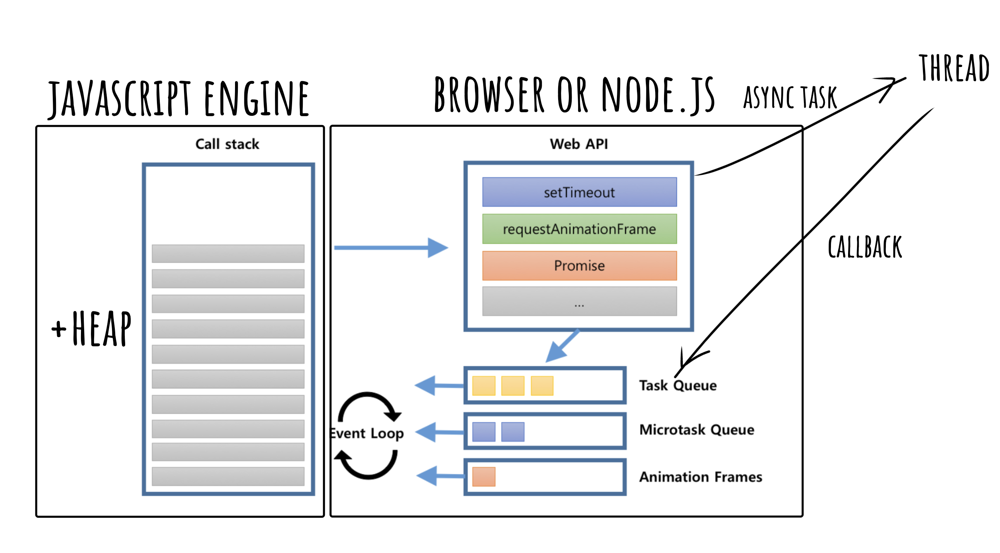

브라우저는 단일 스레드에서 이벤트 드리븐(event-driven) 방식으로 동작한다. 단일 스레드는 한번에 하나의 작업만을 처리할 수 있지만, 웹은 마치 여러 작업을
동시에 처리하는 것처럼 보인다. 이처럼 **자바스크립트의 동시성을 구현하는 방식이 이벤트 루프이다.**

자바스크립트 엔진은 단순히 작업이 요청되면 콜스택을 사용하여 요청된 작업을 순서대로 실행하는 역할을 한다. 동시성을 지원하기 위해 필요한 비동기 요청이나 이벤트
처리는 자바스크립트 엔진을 구동하는 환경인 브라우저나 node.js가 담당한다.

## 자바스크립트 엔진 영역

### Call Stack

작업이 요청되면 순차적으로 콜스택에 쌓이게 되고 순서에 따라 처리된다. 자바스크립트는 하나의 콜스택을 사용하기 때문에 해당 작업이 종료되기 전까지 다른 작업을
진행할 수 없다.

### Heap

동적으로 생성된 객체 인스턴스가 할당되는 영역이다.

## 자바스크립트 엔진을 구동하는 환경 (Browser, node) 영역

### Event Loop

콜 스택 내에서 현재 실행 중인 작업이 있는지 작업 큐에 작업이 있는지 반복하여 확인하고, 만약 콜 스택이비어 있다면 작업 큐의 작업을 꺼내 콜 스택으로 전달한다.

### Web API

Timer 함수, 네트워크 요청, 파일 입출력, 이벤트 처리 등 브라우저에서 제공하는 다양한 API를 포괄한다. Web API는 브라우저에서 처리된다.
브라우저는 멀티 스레드를 제공하기 때문에 비동기 작업을 처리하는 동안 메인 스레드를 차단하지 않고 다른 스레드를 사용하여 작업을 처리한다. 이렇게 처리된 작업들의
콜백이 텍스크 큐에 담겨 관리된다.

### Task Queue

비동기 처리 함수의 콜백 함수나 비동기식 이벤트 핸들러, Timer 함수 (setTimeout, setInterval)의 콜백 함수가 보관되는 영역이다. **이벤트 루프에 의해
콜 스택이 비어있는 시점에 순차적으로 콜 스택으로 작업이 이관되어 실행된다.**

여기서 비동기 작업들도 모두 우선순위를 가지고 있고, 이를 구분하기 위해 세 가지 큐로 구성되어 있다.

**1. Micro Task Queue**

현재 실행되고 있는 작업 이후 바로 처리되어야 하는 우선 순위가 높은 비동기 작업을 가지고 있다. Promise, Observer API, node의 process.nextTick 등
일반적인 우선 순위의 작업들보다 우선적으로 실행되고, 마이크로 텍스크 큐의 작업들이 모두 처리되어야만 매크로 텍스크 큐의 작업이 실행된다.

**2. Macro Task Queue**

기본적인 작업들의 작업 큐이다. 해당 큐의 단일 작업을 처리하고 난 직후 다른 작업들을 진행하기 전에 마이크로 텍스크 큐의 작업들을 모두 처리한 후 돌아와 다음 작업을
처리한다. 스크립트를 실행하거나, DOM 이벤트, Timer 함수가 이곳에서 관리된다.

**3. Animation Frame Queue**

자바스크립트 애니메이션 동작을 제어하는 requestAnimationFrame 메서드를 통해 등록된 콜백이 해당 큐에서 관리되고,
브라우저가 리페인트를 진행하기 직전에 본 큐에 있는 작업들을 순차적으로 처리한다. 해당 작업들 또한 마이크로 텍스크 큐가 비어있을 때만 처리된다.
