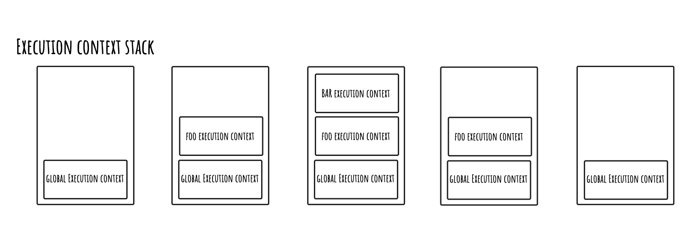
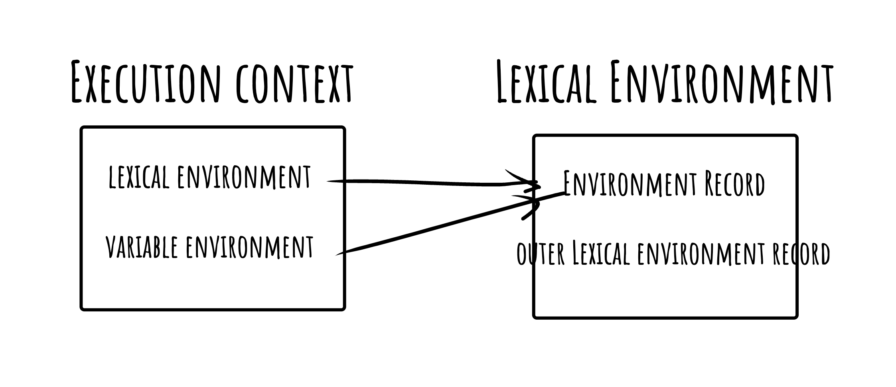
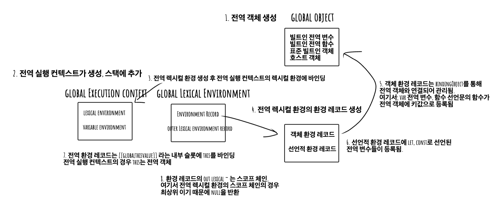

모든 실행 가능한 코드(전역, 함수, eval, 모듈)는 코드 실행 이전에 평가 단계를 거치는데, 이는 실행 가능한 코드가
실행되기 위한 환경을 생성하기 위함이다. 평가 과정을 거쳐 생성된 실행 환경을 물리적인 객체로 관리하며 이를 실행 컨텍스트라 한다.
해당 코드의 식별자(변수, 함수, 클래스 등의 이름)을 등록하고 관리하는 스코프를 **렉시컬 환경**에서 관리하며,
이러한 실행 컨텍스트는 코드 실행 순서를 보장받기 위해 **실행 컨텍스트 스택**으로 관리된다.

### 실행 컨텍스트 스택

실행 컨텍스트는 스택 자료 구조로 관리된다. 코드 실행과 흐름에 따라 새롭게 생성되어 추가되거나, 제거되는데 이를 통해
코드 실행 순서를 보장한다.

```js
// 1. 2. 3.
const x = 1;

function foo() {
  // 6.
  const y = 2;
  function bar() {
    // 9.
    const z = 3;
    // 10.
    console.log(x + y + z);
    // 11.
  }
  // 7. 8.
  bar();
  // 12.
}

// 4. 5.
foo();
// 13.
```

#### 1. 전역 실행 컨텍스트가 생성 및 스택에 추가

자바스크립트 엔진의 코드 실행권이 전역 코드에 진입하기 전 전역 실행 컨텍스트가 생성된다.

#### 2. 전역 식별자 등록

이후 전역 변수 x와 전역 함수 foo가 전역 실행 컨텍스트에 등록된다.

#### 3. 전역 코드 실행

전역 실행 컨텍스트가 생성되고, 전역 코드가 실행되어 전역 변수 x와 foo 함수가 호출된다.

#### 4. foo 호출

foo 함수가 호출되면, foo 함수를 실행하기 위한 실행 컨텍스트가 생성되어야 한다. 따라서 전역 코드의 실행이 중단되고,
foo 함수 내부로 코드 제어권이 넘어간다.

#### 5. foo 함수 실행 컨텍스트 생성 및 스택 추가

foo 함수가 실행되기 위한 실행 컨텍스트를 생성하고, 실행 컨텍스트 스택에 푸시한다.

#### 6. foo 함수의 식별자 등록

foo 함수 실행 컨텍스트에 지역 변수 y와 중첩 함수 bar가 등록된다.

#### 7. bar 호출

foo 내부에서 bar 함수가 호출되면, bar 함수를 실행하기 위한 실행 컨텍스트가 생성되어야 한다. 따라서 foo 함수 코드의 실행이
중단되고, bar 함수 내부로 코드 제어권이 넘어간다.

#### 8. bar 함수 실행 컨텍스트 생성 및 스택 추가

bar 함수가 실행되기 위한 실행 컨텍스트가 생성되고, 실행 컨텍스트 스택에 푸시한다.

#### 9. bar 함수의 식별자 등록

bar 함수 실행 컨텍스트에 지역 변수 z가 등록된다.

#### 10. console.log 메서드 호출 후 bar() 함수 종료

bar 함수에 의해 console.log 메서드가 호출되고 bar 함수의 코드 실행이 종료된다.

#### 11. foo 함수 코드로 복귀 bar 함수 실행 컨텍스트 제거

bar 함수의 코드 실행이 종료됨에 따라 foo 함수로 다시 코드 제어권이 복귀되고, bar 함수 실행 컨텍스트는 실행 컨텍스트 스택에서
pop되어 제거된다.

#### 12. 전역 실행 코드로 복귀 및 foo 함수 실행 컨텍스트 제거

foo 함수의 코드 실행이 종료됨에 따라 전역 실행 코드로 코드 제어권이 복귀되고, foo 함수 실행 컨텍스트는 실행 컨텍스트 스택에서
pop되어 제거된다.

#### 13. 전역 실행 코드의 종료와 전역 실행 컨텍스트 제거

전역 코드 또한 더이상 전개할 이후 작업이 없으므로 전역 실행 컨텍스트 또한 pop되어 제거된다.



위와 같이 실행 컨텍스트를 관리하여 코드 순서를 보장받는다. 정리하자면,

**실행 가능한 코드(전역, 함수, eval, 모듈)가 실행되기 전에**

1. 해당 코드의 실행 컨텍스트 생성
2. 식별자 등록
3. 실행 컨텍스트 스택에 추가

**이후 코드 실행이 종료되면,**

1. 실행 컨텍스트 스택의 최상위 실행 컨텍스트(항상 현재 실행되고 있는 코드의 실행 컨텍스트)를 제거
2. 이전 실행 코드로 코드 제어권 복귀

### 렉시컬 환경

**렉시컬 환경(Lexical Environment)는 식별자와 식별자에 바인딩된 값, 그리고 상위 스코프에 대한 참조를 기록**하는
자료구조로 실행 컨텍스트를 구성하는 컴포넌트이다.

실행 가능한 코드(전역, 함수, eval, 모듈)을 평가하여 키와 값을 가지는 객체 형태의 스코프를 생성하고, 해당 코드를
실행하기 위해 필요한 식별자를 키로 등록하고 식별자에 바인딩된 값을 관리한다. 즉 각각의 코드의 스코프를 구분하여
식별자를 등록하고 관리하는 저장소 역할이며 렉시컬 스코프의 실체이다.

실행 컨텍스트는 `LexicalEnvironment`, `VariableEnvironment` 컴포넌트로 구성된다.
이 둘은 최초 실행 시 동일한 `LexicalEnvironment`를 참조한다. 다만, **코드의 전개에 따라 변경되는 최신 상태를
`LexicalEnvironment`에 저장하고, `VariableEnvironment`는 초기 상태의 렉시컬 환경을 기억한다.**

`LexicalEnvironment`는 `EnvironmentRecord`와 `OuterLexicalEnvironmentReference`로 구성된다.



`EnvironmentRecord`는 **스코프에 포함된 식별자를 등록하고 등록된 식별자에 바인딩된 값을 관리하는 저장소다.**
소스 코드 타입에 따라 관리하는 내용에 차이가 있다.

`OuterLexicalEnvironmentReference`는 상위 스코프를 가리킨다. 이때 **상위 스코프는 외부 렉시컬 환경, 즉 해당 실행 컨텍스트를
생성한 소스코드를 포함하는 상위 코드의 렉시컬 환경을 뜻한다. 외부 렉시컬 환경에 대한 참조를 통해 단방향 링크드 리스트인 스코프 체인을
구현한다.**

```js
// 1. 2. 3.
var x = 1;
const y = 2;

function foo(a) {
  var x = 3;
  const y = 4;

  function bar(b) {
    const z = 5;
    console.log(a + b + x + y + z);
  }

  bar(10);
}

foo(20);
```

#### 1. (전역 코드가 평가되기 전) 전역 객체 생성

전역 객체에는 빌트인 전역 프로퍼티, 함수, 표준 빌트인 객체가 추가된다. 또한 동작 환경에 따라 클라이언트 사이드의 경우 Web API나,
특정 환경을 참조하기 위한 호스트 객체가 포함된다.

#### 2. 전역 코드 평가

전역 객체가 생성되고 난 후, 전역 코드가 평가된다. 코드가 평가되는 플로우는 복잡해서 그림으로 그려봤는데 더 복잡하다.



**2.1) 전역 실행 컨텍스트가 생성되고 실행 컨텍스트 스택에 추가된다.**

**2.2) 글로벌 렉시컬 환경이 생성되고, 전역 실행 컨텍스트의 LexicalEnvironment에 바인딩된다.**

**2.3) 글로벌 렉시컬 환경을 구성하는 글로벌 환경 레코드가 생성된다.**

글로벌 렉시컬 환경을 구성하는 글로벌 환경 레코드는 전역 변수를 관리하는 스코프, 전역 객체의 빌트인 전역 프로퍼티,
함수, 표준 빌트인 객체를 제공한다.

여기서, 글로벌 환경 레코드는 객체 환경 레코드와 선언적 환경 레코드로 구성되어 있다. 이는 var 키워드로 선언된 전역 변수와
ES6에 추가된 let, const 키워드로 선언된 전역 변수를 구분짓기 위함이다.

**2.4.1) 글로벌 환경 레코드를 구성하는 객체 환경 레코드가 생성된다.**

객체 환경 레코드는 BindingObject라고 불리는 객체와 연결되고 등록되어, var로 선언한 전역 변수와 함수 선언문으로 정의된
전역 함수가 전역 객체의 프로퍼티와 메서드가 된다. (그래서 var로 선언된 변수나 함수 선언문으로 선언된 함수의 경우 전역 객체 식별자없이
참조가 가능해진다. (window.a -> a));

객체 환경 레코드에 추가된 var 키워드로 선언한 변수는 선언 단계와 초기화 단계가 함께 이루어진다. 초기화 단계에서 undefined로 초기화되어
호이스팅이 일어난다. 그러나 함수 선언문으로 정의한 함수가 평가되어 bindingObject를 통해 전역 객체의 메서드로서 등록될 때 함수 객체를
즉시 할당한다. 이러한 동작은 함수 선언문 이전에 함수를 호출하여도 문제없이 호출되도록 한다. **이것이 변수 호이스팅과 함수 호이스팅의 차이점이다.**

**2.4.2) 글로벌 환경 레코드를 구성하는 선언적 환경 레코드가 생성된다.**

let, const로 선언된 전역 변수는 선언적 환경 레코드에 등록되고 관리된다. 이는 bindingObject에 의해 전역 객체의 키로 등록하지
않기 때문에 가령 window.a 와 같이 참조할 수 없다.

추가적으로 let, const는 선언 단계와 초기화 단계가 분리되어 진행된다.
즉, 선언적 환경 레코드에 등록될 때 선언 단계가 이루어지지만, 초기화 단계가 이루어지지 않아 변수 선언문을 만나기 전까지 일시적 사각지대에
빠지게 된다. (let, const 또한 호이스팅되지만, 일시적 사각지대로 인해 호이스팅되지 않은 것처럼 동작한다.)

**2.5) 글로벌 환경 레코드의 [[GlobalThisValue]] 내부 슬롯에 this가 바인딩된다.**

일반적으로 전역 환경 레코드의 this의 경우 전역 객체가 바인딩된다.

**2.6) 외부 렉시컬에 대한 참조(Outer Lexical Environment Record)가 구현된다.**

현재 실행 중인 코드를 포함하는 외부 코드의 렉시컬 환경을 가리키며 이는 스코프 체인의 종점인 전역 스코프를 가지는 전역 렉시컬 환경까지
단방향 링크드 리스트 구조로 구현한다.

**3. 전역 코드 실행**

전역 코드가 실행되고 전역 변수(아래 코드 상에서 x, y)의 값이 할당되고, foo 함수가 호출된다.

여기서 x, y의 할당이나 foo 함수를 호출하기 위해서 먼저 해당 변수나 함수의 식별자가 등록되어 있는지 확인해야 한다. 또한 여러 스코프가 동일한
식별자를 사용하고 있을 수 있다. 따라서, 어느 스코프의 식별자를 참조하면 좋을지 결정하는 단계를 거치는데 이를 식별자 결정이라 한다.

식별자 결정은 해당 렉시컬 환경의 환경 레코드에서 가장 먼저 검색한다. 만약 검색되지 않았다면, OuterLexicalEnvironmentRecord
가 가리키는 상위 스코프의 렉시컬 환경의 환경 레코드에서 검색을 이어간다. 이러한 동작이 스코프 체인의 검색 메커니즘이다.

**4. foo 함수 코드 평가**

foo 함수가 호출되면 foo 함수 내부로 코드의 제어권이 넘어가 foo 함수 코드 평가가 이루어진다.

**4.1) foo 함수 실행 컨텍스트 생성**

가장 먼저 함수 실행 컨텍스트가 생성된다. 전역 실행 컨텍스트와는 달리 함수 실행 컨텍스트는 함수의 렉시컬 환경이 생성된 후에 실행 컨텍스트
스택에 푸시된다.

**4.2) foo 함수 렉시컬 환경 생성**

foo 함수의 렉시컬 환경이 생성되고, foo 함수의 실행 컨텍스트의 렉시컬 환경에 바인딩된다.
마찬가지로 렉시컬 환경은 환경 레코드와 외부 환경에 대한 참조로 구성된다.

**4.3) foo 함수 환경 레코드 생성**

함수의 렉시컬 환경을 구성하는 컴포넌트 중 하나인 환경 레코드는 **전역 객체와는 달리 매개변수, arguments 객체, 함수 내부에서
선언된 지역 변수와 중첩 함수를 등록하고 관리한다.**

**4.4) foo 함수 렉시컬 환경의 this 바인딩**

foo 함수 환경 레코드의 내부 슬롯인 [[thisValue]]에 this가 바인딩된다. 함수는 호출 방식에 따라 this가 결정되는데,
foo 함수의 경우 일반 함수로 호출되었기 때문에 this에는 전역 객체가 바인딩된다.

**4.4) 외부 렉시컬 환경에 대한 참조 결정**

외부 렉시컬 환경에 대한 참조는 foo 함수 정의가 평가되는 시점에 실행 중인 실행 컨텍스트의 렉시컬 환경의 참조가 할당된다.

foo 함수의 정의는 전역 코드에 존재하기 때문에 전역 코드가 평가되는 시점에 순차적으로 평가된다. 즉 **해당 시점에 실행되고 있는
실행 컨텍스트는 전역 실행 컨텍스트이다. 따라서 외부 렉시컬 환경에 대한 참조는 전역 렉시컬 환경의 참조가 할당된다.**

자바스크립트에서의 렉시컬 스코프는 **함수를 어디서 호출했는지가 아니라, 어디에 정의했는지에 따라 상위 스코프가 결정된다.**
자바스크립트 엔진은 함수를 평가하여 함수 객체를 생성할 때 현재 실행 중인 실행 컨텍스트의 렉시컬 환경을 함수 객체의 내부 슬롯인
[[Environment]]에 저장한다.

**외부 렉시컬 환경에 대한 참조에 할당되는 렉시컬 환경은 함수 객체의 내부 슬롯인 [[Environment]]에 저장된 렉시컬 환경의 참조이다.
이는 렉시컬 스코프를 구현하는 메커니즘이다.**

**4.5) foo 함수 코드 실행**

코드가 실행되면 매개변수에 인수가 할당되고, 변수할당문이 실행된다. 그리고 bar 함수가 호출된다.

**5) bar 함수 내부에서 호출된 console 식별자 검색**

bar 함수가 평가되는 과정은 foo 함수와 동일한 과정을 거치기 때문에 생략한다. 다만, bar 함수 내부에서 참조되는 console의 경우
bar 함수의 렉시컬 환경의 외부 렉시컬 환경에 대한 참조를 따라 전역 렉시컬 환경까지 올라가게 되고, 전역 렉시컬 환경의 객체 환경 레코드의
bindingObject를 통해 전역 객체를 찾아 console을 참조할 수 있게 된다.

**6) bar 함수 코드 실행 종료**

console.log 메서드 호출 이후 더이상 실행할 코드가 없으므로 bar 함수 코드의 실행이 종료된다.
이때 실행 컨텍스트 스택에서 bar 함수 실행 컨텍스트가 팝되어 제거되고, foo 실행 컨텍스트가 현재 실행 중인 컨텍스트가 된다.

**7) foo 함수 코드 실행 종료**

마찬가지로 foo 함수 또한 더이상 실행할 코드가 없으므로 foo 함수 코드의 실행이 종료되며 foo 함수 실행 컨텍스트는 스택에서 팝되어 제거되고,
현재 실행 중인 실행 컨텍스트는 전역 실행 컨텍스트가 된다.

### 블록 레벨 스코프 메커니즘

let, const는 함수의 코드 블록만 지역 스코프로 인정하는 것과는 달리, 모든 코드 블록을 블록 스코프로서 인정한다.

```js
let a = 10;

if (true) {
  let a = 1;
  console.log(a); // 1;
}

console.log(a); // 10;
```

만약 if문의 코드 블록이 실행되면, **let, const의 식별자가 관리되는 선언적 환경 레코드를 갖는 렉시컬 환경이 새롭게 생성되고
이를 통해 글로벌 렉시컬 환경의 선언적 환경 레코드를 교체한다.이후 코드 블록의 실행이 종료되면 기존 글로벌 렉시컬 환경으로
다시 교체하여 코드 블록의 외부 코드의 전개를 보장한다.** 이는 블록 레벨 스코프를 구현하는 메커니즘이다.
