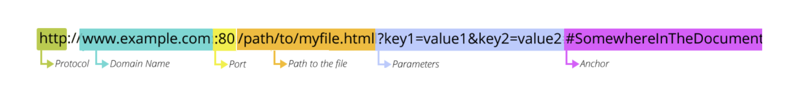
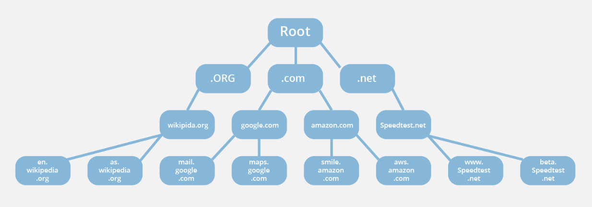
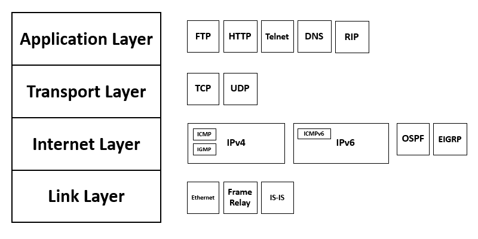
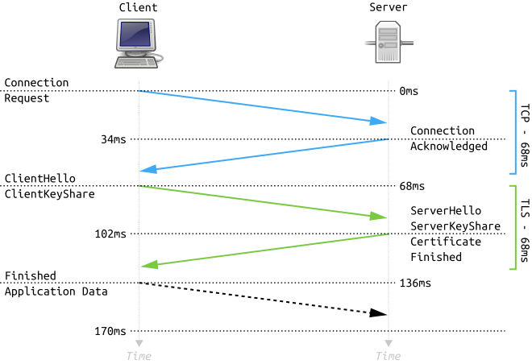

### 1. 브라우저는 입력된 URL를 해석한다.

주소창에 검색어를 전달받은 브라우저는 검색어가 URL 형식인지 확인한다. 여기서 URL 형식이란, 스키마, 프로토콜, 도메인, 포트, 경로와 같은 URL 구성을 모두
확인한다. 만약, 형식을 지키고 있지 않는다면 일반적인 검색으로 판단하고 검색 엔진으로 전달한다.

[이미지 출처](https://hanseul-lee.github.io/2020/12/24/20-12-24-URL/)

URL 형식으로 평가된 검색어라면, 실제 HTTP 메세지 포맷에 맞게 GET 요청 메세지를 작성할 준비를 한다. 크롬의 경우 브라우저 프로세스의 UI 스레드 (브라우저
애플리케이션의 최상위 프로세스)가 담당한다.

### 2. 브라우저가 HTTP GET 요청 메세지를 작성한다.

URL에서 취득한 정보를 바탕으로 자원을 요청하기 위한 HTTP 메세지 (상태 라인, 해더, 바디)를 가지고 있는 GET 요청 메세지를 작성한다.

### 3. DNS 요청 전, 로컬 호스트파일에 해당 도메인과 대응되는 IP 정보가 있는 지 확인한다.

로컬 디스크 호스트파일에 해당 도메인과 대응되는 IP 정보가 있다면, 캐싱된 데이터에 접근하여 해당 IP를 사용한다.

### 4. 브라우저가 DNS 요청을 OS에 의뢰하고 실행한다.

[이미지 출저](https://www.cloudflare.com/ko-kr/learning/dns/glossary/dns-root-server/)

DNS(Domain Name System)은 도메인 주소와 IP 주소를 대응시키기 위한 서버이다. 막대한 양의 도메인과 대응되는 IP 주소를 효율적으로 관리하기 위해
도메인을 `.`으로 분리하여 계층화된 도메인 정보를 DNS 서버에 분산시켜 다수의 DNS 서버에 등록한다.
가령, `youthfulhps.dev`를 검색한다면, `dev`를 DNS 서버의 TLD(Top Level Domain)에서 부터 서로 연대하여 검색을 시작한다.

DNS 요청의 프로토콜은 UDP이고, DNS 서버의 IP 주소는 컴퓨터의 TCP/IP 설정 항목 중 하나라 OS가 이미 알고 있다.
요청한 도메인에 대한 IP를 찾아 응답을 보내주면, 해당 응답을 OS의 DNS 리졸버가 이를 해석하고 IP 주소를 추출하여 메모리에 저장한 후 브라우저에서 접근 가능하도록
허가한다.

_브라우저는 직접 네트워크 요청을 할 수 없다. 모두 OS에게 의뢰하여 요청한다._

### 5. 브라우저가 OS의 프로토콜 스택에 메세지 송신을 의뢰하고 소켓을 작성한다.

[이미지 출처](https://commons.wikimedia.org/wiki/File:TCP-IP_Model_-_en.png)

일반적으로 HTTP 요청은 인터넷 프로토콜 중 TCP(Transmission Control Protocol)를 통해 이루어진다.
TCP/IP의 실제 구현체는 OS단에 존재하기 때문에 마찬가지로 OS에게 조회된 IP 주소의 서버와 연결을 위한 메세지 송신을 의뢰하고 TCP 소캣을 확보한다.

### 6. Three-Way Handshake를 통해 TCP 프로토콜 연결을 설립한다.

[이미지 출처](https://commons.wikimedia.org/wiki/File:Full_TLS_1.3_Handshake.svg)

1. 클라이언트의 접속 요청 프로세스가 SYN 패킷의 비트를 1로 만들어 연결 메세지를 전송한다.
2. TCP 해더를 받은 서버는 포트 번호에 해당하는 소캣을 찾고, 필요한 정보를 기록해서 접속 동작을 진행한다. 서버가 요청을 수락하면
   서버 또한 SYN 비트를 1, ACK 비트를 1로 만들어서 클라이언트에게 전송한다.
3. 서버에서 돌아오는 해더를 받은 클라이언트의 접속 요청 프로세스는 SYN이 1이면 접속 성공으로 해석하고 소켓의 서버 IP 주소나 포트 번호 등과
   같은 제어 정보를 기록하고, 서버에게 잘 전달 받았다는 의미로 ACK 비트를 1로 만든 TCP 해더를 다시 전송한다.

### 7. URL에 포함된 프로토콜이 HTTPS라면 TLS Handshake를 진행한다.

[이미지 출저](https://www.cloudflare.com/ko-kr/learning/ssl/what-happens-in-a-tls-handshake/)

URL의 포함된 프로토콜이 HTTPS이거나, 해당 호스트가 HSTS(HTTPS Strict Transport Security)가 적용된 호스트라면 HTTPS 연결을 위한
TLS 핸드 쉐이크를 진행한다.

1. **클라이언트 헬로우 메세지**, 클라이언트는 서버에게 브라우저가 사용하는 SSL 버전 정보, 사용가능한 암호화 방식, 무작위 바이트로 생성된 '클라이언트 무작위'
   문자열을 전송한다.
2. **서버 헬로우 메세지**, 클라이언트에서 전달받은 헬로 메세지에 대한 응답으로 서버의 SSL 인증서, 사용가능한 암호화 방식 중 서버가 채택한 암호화 방식,
   무작위 바이트로 생성된 '서버 무작위' 문자열을 전송한다.
3. **인증**, 클라이언트는 서버로부터 전달받은 SSL 인증서를 복호화한다. 암호화된 SSL 인증서를 복호화하기 위해서는 제 3자(CA)로 부터 전달받은 공개키로만
   복호화가 가능하기 때문에 복호화가 잘 되었다면, 신뢰할 수 있는 인증서로 판단한다.
4. **암호 전달**, 클라이언트는 '예비 마스터 암호' 라는 무작위 바이트 문자열을 하나 더 생성하고, 이를 SSL 인증서에 담겨 있는 비밀키로 암호화한 후 서버로 전달한다.
5. **개인 키 사용**, 서버는 전달받은 '예비 마스터 암호'를 복호화한다.
6. **세션(대칭) 키 생성**, 클라이언트와 서버는 '클라이언트 무작위', '서버 무작위', '예비 마스터 암호'를 통해 상호 통신에 사용할 세션키를 생성한다. 이때
   클라이언트와 서버는 동일한 결과가 나와야 한다.
7. **클라이언트 준비 완료**, 클라이언트는 세션 키로 암호화된 '완료' 메세지를 전송한다.
8. **서버 준비 완료**, 서버는 세션 키로 암호화된 '완료' 메세지를 전송한다.
9. **안전한 대칭 암호화 완료**, 핸드쉐이크가 종료되고, 세션 키를 통해 통신을 이어간다.

### 8. 클라이언트에서 실제 GET 요청 메세지를 전송하고 전달받은 서버는 응답 메세지를 작성한다.

서버에서 HTTP 요청을 받으면, 요청 URI를 실제 서버의 파일 시스템에서의 URI로 바꿔 해당하는 html 자원을 찾아 바디에 넣은 후
응답 해더와 함께 응답 메세지를 작성하고 반송한다.

### 9. 응답 메세지를 받은 클라이언트는 메세지를 해석하고 자원을 랜더링한다.

클라이언트는 HTTP 메세지의 content-type 해더를 통해 응답 데이터가 html임을 알아낸다. 이를 바탕으로 브라우저가 화면 표시 동작을 실행한다.
화면 표시는 브라우저 프로세스의 랜더러 스레드가 담당한다.

브라우저는 HTML을 파싱해서 Critical Rendering Path를 거쳐 해석된 HTML을 화면에 띄우고, 파싱하다가 script 혹은 link 태그를 만나면
랜더링을 중단, JS, CSS 자원 역시 위와 같은 과정을 거쳐 서버에 요청, 응답 받아 자원을 사용하며, 이후 이어 랜더링을 완료한다.

### 10. 요청이 종료되었다면, 4-Way-Handshake를 통해 접속을 끊고 소캣을 말소한다.

데이터 송수신 과정이 종료되었다면, TCP 접속을 종료하기 위해 4-Way-handshake를 진행한다.

1. 클라이언트는 연결을 종료하겠다는 의미로 TCP 해더의 FIN 비트에 1을 설정해 서버로 전달한다. 이때 FIN-WAIT 상태가 된다.
2. 서버는 종료의 요청을 받고, 확인의 의미로 TCP 해더의 ACK 비트를 전송한다. 이때 CLOSE_WAIT 상태가 된다.
3. 클라이언트는 해지 준비가 완료되었다는 것을 알리기 위해 ACK 비트를 서버에 전송한다. 이때 클라이언트는 TIME_WAIT 상태가 된다.
4. 클라이언트는 서버에서 전송할 응답 데이터가 남아있을 수 있는 여지를 염두하고 일정 시간 기다린 후, 세션을 종료하고 연결이 종료된 CLOSE 상태가 된다.

HTTP1.1 부터 도입된 keep-alive로 인해 요청이 종료되어도 바로 연결이 끊기지 않는 것이 일반적이고, keep-alive timeout에 설정된 시간이 흐른뒤
연결이 종료된다.
