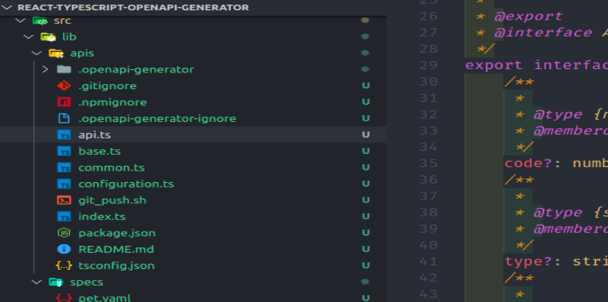
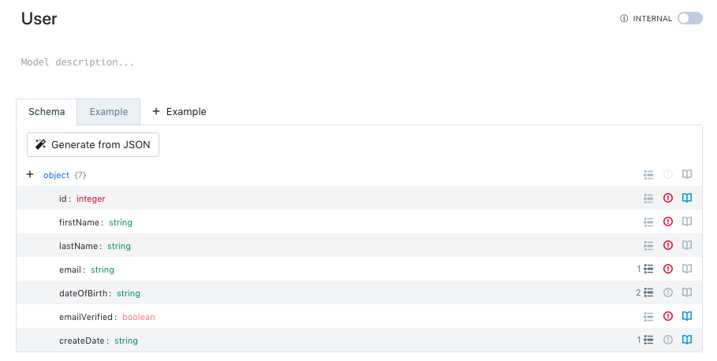
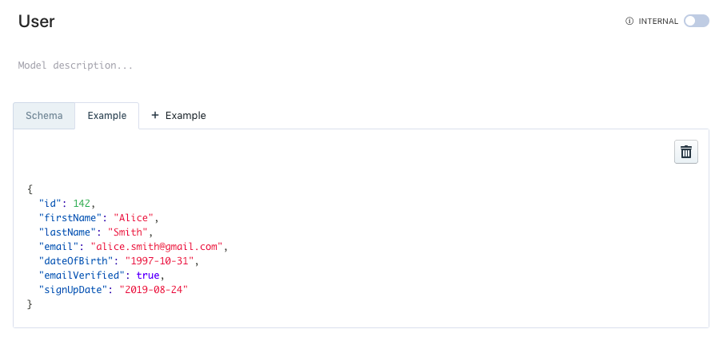

실무에서 프론트엔드 개발일을 하다보면 작업이 팬딩상태가 되버리는 경우를 자주 경험합니다.
기획과 API 개발이 되지 않아 기다리거나, 마이너한 기획의 변경 사항이 발생하는 경우,
최종산출물을 다루는 프론트엔드 개발 영역에서의 수정사항은 눈덩이처럼 불어납니다.

이러한 작업 단계의 블로커를 최소한으로 하고, 클라이언트도 API 개발과 함께 병렬적으로
진행될 수 있도록 스펙 기반 개발을 적극적으로 도입해서 개발 환경 개선을 위해 노력하고 있습니다.


## 스펙 설계 참여하기

기획과 함께 진행되어야 하는 스펙 설계 단계는 항상 반드시 참석하고자 했습니다.
순탄한 개발 루틴과 클라이언트 코드 레벨에서의 잡음을 최소화해야 하는 입장에서
기획을 보며 많은 시간 고민이 필요했는데요.

### 이거 클라이언트에서 처리하는 게 맞을까요?

가령 기능상의 특정 상태값을 산출해야 할 때, 많은 필드값을 전달받아 클라이언트에서
전처리하는 것이 과연 효율적일 지에 대해 밀고 당기기가 필요했습니다.

자신감을 구하기 위해 자료들의 관계를 파악하는 데 도움이 될 수 있도록
프론트엔드에 갇히지 않고 고민했었던 것 같아요.

가령 기능상의 특정 상태값을 산출해야 할 때, 많은 필드값을 전달받아 클라이언트에서
전처리하는 것이 과연 효율적일지에 대한 밀고 당기기부터, API 인터페이스의 네임스페이스가
대부분 클라이언트 코드 레벨에서 유지되기 때문에 필드값의 네이밍도 고민해야 하는
부분 중 하나였습니다.

누락되거나 변경될 여지가 있는 필드가 있는 지 충분히 이야기 나누어야 했습니다.

## API 함수와 인터페이스 자동 생성

_본 섹션에서 진행하는 과정은 [데모](https://github.com/youthfulhps/react-typescript-openapi-generator)에서 확인할 수 있습니다._

[opanapi-generator](https://openapi-generator.tech/)는 OpenAPI
Specification을 기준으로 API 관련 인터페이스를 정의해주고 명세에 맞춰 API 함수까지
작성해주는 생성기들을 제공합니다.

타입스크립트를 사용한다면, 인터페이스를 정의하는데 상당히 오랜 시간 투자하게 되고,
그 만큼 휴먼에러가 발생할 여지를 감수해야 하는데요. openapi-generator는
API 명세서에게 고충을 위임할 수 있습니다.

패키지 설치와, 프로젝트 환경에 적합한 생성기를 선택하고 스크립트를 돌려 API를
생성합니다.

```shell
~$ yarn add @openapitools/openapi-generator-cli -g
~$ openapi-generator-cli generate -i {yaml or json file} -g {generator name} -o {file path to be created} --config {config file}
```



API 함수들과 관련 인터페이스들이 자동으로 생성된 모습입니다.

인터페이스 함수를 담고 있는 클래스, 관련 객체 인터페이스를 자동으로 생성해준다니
, 사실 덤덤하게 말했지만 API, 인터페이스 자동 생성이 주는 장점은 엄청납니다.


타입스크립트에서 API 함수를 정의할 때 타이핑양이 상당히 많아지고, 응답 객체의 인
터페이스 또한 정확하게 정의해주어야 하는데요. 여기에 사용되는 리소스 또한 비지니
스 작업에집중할 수 있게 도와줍니다.

또한, 작업 과정에서 휴면에러가 발생할 여지를 최소화 해주어 API 스펙 기반의 타입
세이프한 개발이 가능하도록 도와줍니다.

### Mocking를 통한 병렬적인 개발 생산성 챙기기

특정 기능 개발을 진행하는 과정에서 현실적으로 병렬적으로 개발이 진행되는 문제를
위에서 언급했었는데요.

프론트엔드 개발 단계의 팬딩 상태를 최소화하기 위해 실제 API가 개발되기 전에
Mocking 서버를 동작시켜 Mock 데이터를 전달받아실제 데이터가 전달되는 것처럼 랜더
링 시켜주는 방식의 개발을 진행합니다.

API 스펙을 문서화하는 단계에서 인터페이스를 정의할 때 인터페이스의 예시 데이터를
기입해줄 수 있습니다.




이후 Mock 서버를 실행시켜 주어야 하는데요. 이때 Stoplight에서 제공하는
[Prism](https://stoplight.io/open-source/prism/)를 사용합니다.

Prism에 `yaml` 형식의 API 스펙을 제공하면 로컬에서 API 스펙을 기반으로 Mock 서버
를 실행시킬 수 있으며, 인터페이스를 정의할 때 기입한 예시 데이터를 응답받을 수있
습니다.

```shell
~$ prism mock {yaml or json file}`
```


Mock 서버를 통해 실제 API 개발이 완료되지 않아도 병렬적으로프론트엔드 개발에 집
중할 수 있게 되고 팬딩 상태를 최소화하여 생산성을 챙길 수 있는 이점을 제공합니다
.

### 마치면서

Openapi-generator를 통해 API 스펙 기반 개발을 적용해 병렬적인 개발 사이클에서 발
생할 수 있는 문제를 어떻게 해결할 수 있는 가에대한 이야기를 해보았는데요.

이상적인 루틴을 그리는 개발 사이클이 아닌 연쇄적이지만 병렬적으로 진행되어야 하
는 현실적인 작업 환경에서 API 스펙 기반으로 타입 세이프한 개발과 동시에 생산성까
지 챙겨보시면 좋을 것 같습니다:)
