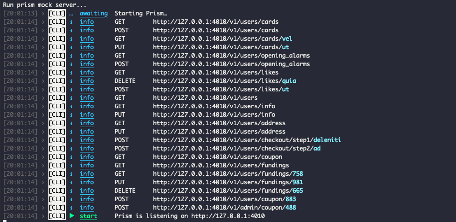

<blockquote class="warning">작성한 지 2년이 지난 글이에요. 지금과는 맞지 않을 수도 있지만, 당시의 고민과 노력이 담겨있습니다.</blockquote>

클라이언트 개발을 하다보면 작업이 대기 상태가 되버리는 경우를 자주 경험합니다.
기획과 API 개발이 완료되지 않아 기다리거나, 마이너한 기획의 변경 사항이
발생하는 경우, 최종 산출물을 다루는 클라이언트 개발 영역에서의 수정사항은
눈덩이처럼 불어납니다.


## 스펙 설계 참여하기

기획과 함께 진행되어야 하는 스펙 설계 단계는 항상 참석하고자 했습니다.
순탄한 개발 루틴과 클라이언트 코드 레벨에서의 잡음을 줄여야 하는 입장에서
기획을 보며 많은 시간 고민이 필요했는데요.

### 이거 클라이언트에서 처리하는 게 맞을까요?

기능상의 특정 상태값을 산출하는 비용을 클라이언트, 서버 중 어디서
담당하는 것이 효율적인 지에 대해 밀고 당기기가 필요했습니다.
이 과정에서 많은 응답 필드들의 효용성을 확인할 수 있는데요.
어떤 것이 불필요하고, 어떤 것이 누락되었는 지 한번 더 생각하게 되는 단계가 됩니다.

한편으로는 클라이언트 코드 레벨을 지키기 위한 어필이기도 했습니다.
간단한 예시로, 배열 형태의 응답을 특정 필드값으로 소팅을 하는 것을
클라이언트에서 진행해야 하는 경우가 있다면, 클라이언트 개발하는 입장에서
불필요하게 발생하는 비용에 대해 한번쯤은 사전에 공유해보는 것도 중요하다고 생각하게 됩니다.

### 클라이언트 네임스페이스는 주로 API 인터페이스를 따라가니까

클라이언트 코드레벨의 네임스페이스는 주로 API 인터페이스를 따라가는 경향이 큽니다.
그렇다보니, 썩 내키지 않은 이름이지만 오히려 변경했을 때 지저분해지는 코드덕에
유지한채 진행하는 경우가 많았습니다.

이름 짓기는 항상 고민되지만, 최적의 이름이 아니더라도 적합한 이름에 대해
함께 고민해야 하고 충분히 공감할 수 있는 이름 짓기에 욕심가지고 참여해야 합니다.

### 이 도메인은 처음이니까

새로운 도메인에 대한 문제를 풀어나가는 과정에서 CRUD가 어떻게 진행될 것이란 것에
대해 미리 큰 그림을 그릴 수 있다면, 작업을 킥오프할 때 큰 자신감을 얻을 수 있습니다.

주로 데이터를 담아내고 추상화하는 과정에 대한 기획부터 API 설계 단계에서
도메인에 대해 많은 이야기가 오고 가기 때문에, 담당하는 도메인 지식을 미리 파악하는
자세를 취하고자 했습니다.

## API 함수와 인터페이스 자동 생성

실무에서 V2 API가 등장하게 되었습니다. 새로운 API 함수와 관련 인터페이스들을
다수 새롭게 정의했어야 했는데, 번거롭고 휴먼에러가 발생할 여지가 많은 작업인 만큼
작업의 체력소모가 심했습니다.
[OpenAPI Specification으로 타입-세이프하게 API 개발하기: 희망편 VS 절망편](https://www.youtube.com/watch?v=J4JHLESAiFk)
을 보고 바로 적용해봐야 겠다 생각했던 작업이기도 했는데요.

세션에서 소개하는 [openapi-generator](https://github.com/OpenAPITools/openapi-generator)
는 API 명세서를 기준으로 API 함수와 인터페이스들을 자동으로 정의해주는 생성기들을 제공합니다.
간단하게 설치를 진행하고 설정 파일을 추가해서 데모를 진행해봅시다.

_openapi-generator는 jvm 환경에서 동작하기 때문에,
로컬에 java sdk가 설치되어 있어야 커멘드 가능합니다._

```shell
~$ yarn add @openapitools/openapi-generator-cli -g
```

```json
// openapi.json

{
  "modelPackage": "src/model",
  "apiPackage": "src/api",
  "withSeparateModelsAndApi": true
}
```

이후 서빙되어 있는 API 명세서의 주소를 입력으로 고정해두면 API가 업데이트됨에
따라 스크립트를 통해 업데이트된 API와 인터페이스들을 취할 수 있게 됩니다.

```json
// package.json

"script": {
  "generate-interface": "openapi-generator-cli generate -i https://.../openapi.json
}
```

```shell
~$ yarn generate-interface
```

API 함수와 인터페이스 정의 자동화를 통해 휴먼에러를 최소화하고 비즈니스 로직에
집중할 수 있게 해주고 또한, 스펙을 기준으로 백엔드단과 소통할 수 있는 환경을
이끌 수 있습니다.

_생성된 결과물은 [데모](https://github.com/youthfulhps-tutorial/react-typescript-openapi-generator)
에서 확인하실 수 있습니다._

## API 목킹하기

클라이언트 개발 단계의 대기 상태를 최소화하기 위해 실제 API가 개발되기 전에
API 목킹이 필요했습니다. [Prism](https://stoplight.io/open-source/prism)
을 통해 API 명세서에 따라 API 목킹하여 로컬에서 서버를 실행할 수 있습니다.

```shell
~$ yarn global add @stoplight/prism-cli
```

```shell
~$ prism mock https://.../openapi.json
```



목서버로 요청을 보내면, API 명세서에 정의되어 있는 모델 예시 데이터를 응답에 담아 전달하기 때문에
예시 데이터가 실제와 유사할 수록 좋습니다.

## 내친김에 목 데이터까지

API 목킹도 좋지만 정적인 목 데이터가 필요한 경우도 있습니다. 테스트를 할 때
일일히 정의해주어야 하거나, 스토리북 컴포넌트에 전달하고 싶은 경우인데요.

자동으로 생성된 인터페이스들에 맞춰 목데이터를 생성해주는 [intermock](https://github.com/google/intermock)
을 사용해서 목데이터를 생성해봅시다.

```shell
~$ yarn add intermock
```

간단하게 스크립트를 작성해서 우리가 원하는 인터페이스의 목데이터만을 생성할 수 있도록
구성해봅시다. 여기서 주의할 점은 import 문으로 참조된 인터페이스는 intermock에서
파싱을 해내지 못하기 때문에 우선 모든 인터페이스를 병합해서 하나의 파일로 만들어 주어야 합니다.

```js
let mergedInterfaces = '';

// 인터페이스가 담겨있는 파일을 모두 순회해서
// import 문이 제거된 인터페이스 파일들을 모두 병합한다.
fs.readdirSync(outputFolder).forEach(fileName => {
  const rawCode = fs.readFileSync(`${outputFolder}/${fileName}`, 'utf8');

  mergedInterfaces += getRawCodeRemovedImportStatement(rawCode);
});

fs.writeFileSync(
  `${outputFolder}/mergedInterfaces.ts`,
  mergedInterfaces,
  'utf8'
);
```

이후 병합된 인터페이스 파일 중 원하는 인터페이스를 입력으로 전달받아, 생성된 결과를 다시
파일로 생성해줍니다.

```js
const mocked = mock({
  files: ['../allInterfaces.ts'],
  interfaces: ['Admin'],
  language: 'typescript',
});

fs.writeFileSync(
  `mocks/${outputFileName}.js`,
  `export const mock${mocked}`,
  'utf8'
);
```

_생성된 결과물은 [데모](https://github.com/youthfulhps-tutorial/interface-mock-data-generator)
에서 확인하실 수 있습니다._

### 마치면서

기능 개발의 한 사이클에서 블로커를 최소한으로 하여 클라이언트 개발 환경을
개선하기 위해 노력했던 내용들을 정리해보았습니다. 클라이언트도 API 개발과
함께 병렬적으로 진행될 수 있도록 스펙 주도 개발을 적극적으로 도입했고,
리소스가 불필요하게 낭비되는 것을 개선하고자 노력했는데요.

쉽지 않은 고민과 실제 적용을 위한 팀원들에게 동의를 얻기까지
인사이트를 전달하기 위해 고민했던 시간이었습니다.
클라이언트 개발 환경을 개선할 수 있는 무언가, 그리고 멀지 않은 곳에서
반복적으로 블로커가 되는 문제들을 찾아 해결할 수 있는 개발자가 되고 싶습니다.
