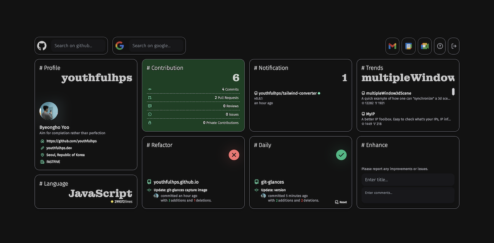

[GitGlances](https://github.com/youthfulhps/git-glances)라는 웹과 크롬 익스텐션 제품을 동시에 만들기 위한 개발 환경 구축과 선택한 기술 스택에
대한 늦은 회고이다. 이미 환경이 구축되어 있는 프로젝트에 합류해 개발하게 된 경험이 많아 초기 단계부터 환경을 만들어가는 작업은 낯설기도 하면서 클라이언트 개발 환경을
다시 정리하기 좋은 경험이었다.



## 패키지 매니저

프로젝트 관리를 용이하게 도와주는 패키지 매니저는 패키지 의존성 관리와 프로젝트의 메타데이터, 스크립트 등 관리 포인트를 묶어 한곳에서 관리할 수 있도록 도와준다.
`npm`을 시작으로 `yarn`, `pnpm` 등 여러 패키지가 있지만, 프로젝트를 시작한 시점에 가장 자주 사용하고 익숙했던 `yarn`을 사용했다.

```json
{
  "name": "git-glances",
  "version": "2.2.2",
  "main": "index.js",
  "repository": "git@github.com:youthfulhps/git-glances.git",
  "author": "youthfulhps <ybh942002@gmail.com>",
  "license": "MIT",
  ...
}
```

`yarn`은 lockfile을 도입해 협업 과정에서 일관된 의존성 버전 관리를 보장하고, 깊어지는 의존성 트리에 따라 중복 설치되는 의존성들을 호이스팅시켜 플랫하게
관리하는 컨셉을 가지고 있는 것이 특징이다.


[이미지 출처](https://toss.tech/article/node-modules-and-yarn-berry)

의존성 호이스팅을 통해 디스크 공간을 세이브할 수 있다는 장점이 있지만, 특정 의존성 패키지의 의존성이 호이스팅되어 프로젝트에 직접 추가하지 않은 의존성이 문제없이
불러올 수 있게 되는 유령 의존성 (Phantom Dependency) 현상이 발생하기도 한다.

외람된 이야기지만, 현재는 `pnpm`를 주로 사용한다. `pnpm`은 심링크, 하드링크를 통해 프로젝트에서 의존성을 로컬 디스크의 상위 스토어에 설치된 의존성과 연결시켜
사용하는 `Content-addressable-storage` 전략을 통해 여러 프로젝트에서 중복되게 사용되는 의존성에 대한 중복 설치를 방지하고 있다. 이 컨셉이 적잖게 충격이었다.


[이미지 출처](https://pnpm.io/motivation)

## 번들러

모듈 시스템을 기반으로 형성된 거대한 코드 베이스와 CSS, 이미지 등 웹을 구성하기 위한 모든 자원을 모듈이라 한다. 번들러는 스크립트 모듈 내의 파일 단위와
변수 유효 범위를 유지한 채 웹을 구성하는 모든 모듈들을 하나의 번들로 생성한다.

하나로 묶인 번들은 정량적인 요청 횟수를 줄여 브라우저별로 상이한 요청 횟수 제한에서 안전할 수 있으며, 원한다면 코드 스플리팅을 통해 원하는 때 분리된 번들을 로드할
수 있고, 사용하지 않은 코드들을 트리 쉐이킹해 번들링 과정에서 제거할 수 있다.

최근 `webpack`과 비교했을 때 빌드 속도가 현저히 개선된 `esbuild`, `vite`와 같은 번들러들이 많은 관심을 받고 있고, 최근 실무에서는 `vite`를 주로
사용하는데 역시나 번들링 설정이 매우 간결하고 개발자 친화적이다.

하지만 개선된 번들러를 신나게 칭찬하고선 `webpack`을 사용하기로 결정했다. 아직 번들러 시장에서 점유율이 견고할 뿐만 아니라, 실무에서 번들러에 문제가 생겨
누군가 해결해야 한다면 그 대상이 `webpack`일 가능성이 높지 않을까 싶어 설정 수정과 적용에 있어 부담이 적은 개인 프로젝트에서 다루어보는 것도 즐겁지 않을까
싶어서다.


`webpack`의 설정 파일은 기본적으로 다음과 같은 구조를 가진다. 몇 가지 필수적인 설정을 살펴보자.

```js
var path = require('path');

module.exports = {
  mode: 'none',
  entry: './src/index.js',
  output: {
    filename: 'main.js',
    path: path.resolve(__dirname, 'dist'),
  },
};
```

### entry, output

번들링이 시작되는 진입점은 `entry` 포인트로 제공하고 그 결과를 `output`에 반환한다. 싱글 페이지 어플리케이션을 제작할 경우 진입점을 하나로 두어 모든 페이지를 하나의
번들로 구성할 수 있고, 진입점을 여러 개로 나누어 멀티 페이지 어플리케이션을 구성하는 페이지 별 번들을 생성할 수도 있다.

```js
entry: {
  login: './src/LoginPage.js',
  main: './src/MainPage.js'
}
```

### loader

`webpack`은 자바스크립트 파일이 아닌 `image`, `css` 등과 같은 자원들을 해석하고 변환할 수 있도록 `loader`를 제공해주어야 한다.

```js
// ...
module: {
  rules: [
    {
      test: /\.(ts|tsx)$/,
      loader: 'ts-loader',
      options: {
        transpileOnly: true,
      },
    },
    {
      test: /\.css?$/,
      use: ['style-loader', 'css-loader', 'postcss-loader'],
    },
    {
      test: /\.(webp|jpg|png|jpeg)$/,
      loader: 'file-loader',
      options: {
        name: '[name].[ext]?[hash]',
      },
    },
    {
      test: /\.(ts|tsx|js|jsx)$/,
      exclude: /node_modules/,
      use: 'babel-loader',
    },
  ];
}
```

`loader`를 적용할 파일 유형이 같다면 `rules` 에서 먼저 오는 `loader`가 적용되고, 하나의 `rule`에 여러 개의 `loader`를 사용할 수 있다면, `use`
배열의 뒤에서부터 `loader`가 적용된다.

```js
// css-loader가 style-loader보다 우선 적용
module: {
  rules: [
    {
      test: /\.css$/,
      use: ['css-loader'],
    },
    {
      test: /\.css$/,
      use: ['style-loader'],
    },
  ];
}
```

```js
// sass-loader -> css-loader -> style-loader 순으로 로더 적용
modules: {
  rules: [
    {
      test: /\.scss$/,
      use: ['style-loader', 'css-loader', 'sass-loader'],
    },
  ];
}
```

### plugin

`webpack`의 `plugin`은 `webpack`의 기본적인 번들링 동작에 추가적인 동작과 기능을 부가하는 데 사용된다. 가령 해당 결과물의 형태를 조작하거나, 추가적인
작업을 지시할 때 사용한다.

```js
plugins: [
  new CleanWebpackPlugin(),
  new HtmlWebpackPlugin({
    template: path.resolve(__dirname, 'public', 'index.html'),
    hash: false,
  }),
  new webpack.DefinePlugin({
    'process.env': JSON.stringify(process.env),
    'process.env.IS_WEB': JSON.stringify(isWeb),
  }),
  new CopyWebpackPlugin({
    patterns: [
      {
        from: path.resolve(__dirname, 'public/*.png'),
        to() {
          return '[name][ext]';
        },
      },
      {
        from: path.resolve(__dirname, 'public/icons'),
        to() {
          return 'icons/[name][ext]';
        },
      },
      {
        from: path.resolve(__dirname, 'public/manifest.json'),
        to: 'manifest.json',
      },
      ...(!isWeb
        ? [
            {
              from: path.resolve(__dirname, 'public/favicon.png'),
              to: 'icons/icon16.png',
            },
          ]
        : []),
    ],
  }),
];
```

프로젝트를 제작할 때 다음과 같은 `plugin`들을 사용했다. 초기 설정을 구성할 때 일괄적으로 적용해 주었다면 좋았겠지만, 빌드 결과물에 에셋 파일이 포함되어 있지 않다던지,
보일러 플레이트를 사용할 때는 당연하게 생각했던 `index.html` 파일이 생성되어 있지 않는 등 석연치 않은 불편함을 하나씩 느끼면서 `plugin`을 추가해 보는 것도
그 역할을 깨닫기 좋은 경험이었다.

### CleanWebpackPlugin

새롭게 빌드를 진행하기 전에 `output` 디렉토리를 정리해준다. 빌드 결과물들이 쌓여 구분이 어려워지거나 직접 제거해주어야 하는 난감한 상황을 방지한다.

```js
new CleanWebpackPlugin();
```

### HtmlWebpackPlugin

번들링이 완료된 자바스크립트 파일을 `script` 태그를 통해 로드하는 HTML 파일을 생성해준다.

```js
new HtmlWebpackPlugin({
  template: path.resolve(__dirname, 'public', 'index.html'),
  hash: false,
});
```

```html
<!DOCTYPE html>
<html>
  <head></head>
  <body>
    <script defer="defer" src="main.js"></script>
  </body>
</html>
```

### CopyWebpackPlugin

원하는 모듈을 복사해서 빌드 결과물에 포함시켜준다. 주로 `image`와 같은 에셋을 대상으로 사용했다.

```js
new CopyWebpackPlugin({
  patterns: [
    {
      from: path.resolve(__dirname, 'public/*.png'),
      to() {
        return '[name][ext]';
      },
    },
    {
      from: path.resolve(__dirname, 'public/icons'),
      to() {
        return 'icons/[name][ext]';
      },
    },
  ],
});
```

### 부가적인 설정들

### webpack-dev-server

`webpack-dev-server`는 개발 과정에서 코드를 수정하고 `webpack` 명령어를 따로 실행하지 않아도 변경된 결과물을 새롭게 적용해준다.

```shell
~$ yarn add --dev webpack-dev-server
~$ webpack serve
```

```js
// webpack.config.js
devServer: {
  host: 'localhost',
  port: PORT,
  open: true,
  hot: true,
  compress: true,
  historyApiFallback: true,
}
```

### experiments

ES2022 기능 중 하나인 `top-level await`를 사용해보기 위해 `experiments` 속성을 추가해주었다.

```js
experiments: {
  topLevelAwait: true,
}
```

## 트랜스컴파일러

브라우저마다 해석 가능한 자바스크립트 스펙 한계가 조금씩 달라 참고서에서 [브라우저 호환성](https://developer.mozilla.org/ko/docs/Web/JavaScript/Reference/Global_Objects/Promise#%EB%B8%8C%EB%9D%BC%EC%9A%B0%EC%A0%80_%ED%98%B8%ED%99%98%EC%84%B1)
를 제공해주곤 한다.

`babel`은 이러한 크로스 브라우징 이슈를 해결하기 위해 브라우저에서 이해할 수 있는 스펙의 자바스크립트로 트랜스파일링 해준다. 일반적으로 코드를 분석해서 추상 구문
트리를 생성하고, 추상 구문 트리를 통해 브라우저가 해석할 수 있는 적당한 스펙의 자바스크립트로 코드를 재생성한다.

`babel`의 설정 파일은 일반적으로 `presets`, `plugins`을 나열한다. `plugin`은 가령 자바스크립트 파일에 포함된 `react` 개발 구문과 `jsx`,
타입스크립트로 작성된 코드를 트랜스파일링 과정에서 해석할 수 있도록 도와주는 역할을 한다. `plugin`은 종종 하나의 목적을 이루고자 의존적으로 추가해 주어야 하는
`plugin`들이 있는데, 이들을 묶어둔 것이 `preset`이다.

```js
module.exports = {
  presets: [
    '@babel/preset-env',
    '@babel/preset-react',
    '@babel/preset-typescript',
  ],
  plugins: [
    'babel-plugin-macros',
    'styled-components',
    [
      '@babel/plugin-transform-runtime',
      {
        regenerator: true,
      },
    ],
  ],
};
```

### babel-env

`babel-env`은 브라우저와 버전을 제공해 해당 브라우저에서 동작 가능한 코드를 생산하고, 고스펙의 코드의 경우 `polyfill`을 제공하는 데 사용된다.
가령 `ES2015`의 `Promise` 객체를 트랜스파일링하면 다음과 같은 결과를 얻게 되는데,

```js
new Promise();
```

```js
'use strict';

new Promise();
```

여전히 `Promise`로 유지되는 코드는 윈도우 익스플로어와 같은 브라우저에서 해석이 불가능해 레퍼런스 에러를 던진다. `babel-env`는 이러한 이슈에 맞서
`Promise`를 해석할 수 있도록 `polyfill`이라는 코드 조각을 제공하여 문제를 해결한다.

```javascript{4-8}
[
  "@babel/preset-env",
  {
    useBuiltIns: "usage", // 폴리필 사용 방식 지정
    corejs: {
      // 폴리필 버전 지정
      version: 2,
    },
  },
],
```

```js
'use strict';

require('core-js/modules/es6.promise');
require('core-js/modules/es6.object.to-string');

new Promise();
```

### @babel/preset-react

`react`를 위한 `preset`도 브라우저에서 해석 가능한 코드로 변환하는데 사용된다.

```js
import React from 'react';

function Component() {
  return <button>Click me!</button>;
}

export default Component;
```

```js
import React from 'react';
import { jsx as _jsx } from 'react/jsx-runtime';
function Component() {
  return /*#__PURE__*/ _jsx('button', {
    children: 'Click me!',
  });
}
export default Component;
```

### @babel/preset-typescript

타입스크립트를 해석하기 위한 프리셋 또한 제공한다.

```ts
const foo: number = 1;
```

```js
const foo = 1;
```

### babel-loader

위에서 살펴본 `babel`은 일반적으로 `webpack`과 함께 사용한다. 빌드 과정에서 적절한 스펙의 자바스크립트로 트랜스파일링 한 뒤 이를 번들링하기 위함인데,
이는 `babel-loader`를 통해 기능을 제공한다.

```js{1, 6-10}
// webpack.config.js
module.exports = {
  ...
  module: {
    rules: [
      {
        test: /\.(ts|tsx|js|jsx)$/,
        exclude: /node_modules/,
        loader: 'babel-loader',
      },
    ],
  },
  ..
};
```

### babel-loader와 babel.config.js

`webpack`에 적용 가능한 `babel-loader`의 옵션으로 `presets`, `plugins`를 제공할 수 있어 `babel` 설정 파일을 따로 구성할 필요는 없지만,
만약 프로젝트 루트 폴더에 `babel` 설정 파일이 존재한다면 `babel-loader`가 적용될 때 해당 설정을 읽어드리기 때문에 설정을 제공하는 방법은 자유롭게 선택 가능하다.

## 테스트

테스트는 `jest` 환경에서 리엑트 테스트를 위해 `testing-library`를 사용하고 `ts-jest preset`을 통해 타입스크립트 기반 코드를 커버했다.

```ts
import type { JestConfigWithTsJest } from 'ts-jest';

const config: JestConfigWithTsJest = {
  preset: 'ts-jest',
  testEnvironment: 'jsdom',
  setupFilesAfterEnv: ['<rootDir>/jest.setup.ts'],
  ...
};

export default config;
```

만약 모듈을 불러오는 경로에 별칭을 부여해서 축약해 사용했다면, `jest` 환경에도 알려주어야 한다. `webpack`의 `alias` 속성과 동일하다.

```ts{3-7}
const config: JestConfigWithTsJest = {
  ...,
  moduleNameMapper: {
    '^@/(.*)$': '<rootDir>/src/$1',
    '^@layout(.*)$': '<rootDir>/src/_layout/$1',
    '^@shared(.*)$': '<rootDir>/src/_shared/$1',
  },
}
}
```

또한 타입스크립트를 변환해 테스트할 때 변환된 결과가 개발 결과물과 동일하도록 프로젝트에서 사용하는 타입스크립트 및 `babel` 설정 파일을 제공했다.

```ts{3-12}
const config: JestConfigWithTsJest = {
  ...,
  transform: {
    '^.+\\.tsx?$': [
      'ts-jest',
      {
        tsconfig: '<rootDir>/tsconfig.json',
        babelConfig: '<rootDir>/babel.config.js',
        useESM: true,
      },
    ],
  },
}
}
```

### 순수한 함수와 섹션 통합 단위 테스트

'정령 나는 테스트 코드를 의지하고 필요로 할까, 아니면 공개된 프로젝트라서 구색 맞추기 위함인 걸까?' 강한 결합들로 이루어진 코드를 작성하고
나서 테스트 코드를 작성할 때 후회하며 들었던 생각이다. 다시 한번 실패하는 테스트 코드가 구현 코드보다 먼저 작성되어야 한다는 걸 느꼈다.

100%의 테스트 커버리지를 자랑하는 것도 좋겠지만, 테스트 코드 작성 이유에 대해 경험을 통해 동의할 수 있는 부분들을 위주로 커버하려 했다.
그 시작점은 사이드 이펙트가 없는 순수한 함수 테스트이다. `moment.js`와 같이 의존성 모듈에서 제공하는 함수들을 사용하는 함수들의 테스트는
패키지에게 테스트를 맡길 수 있을 거라 기대하고, 내가 작성한 함수들에만 집중했다.

순수한 함수들의 테스트를 작성해두면 나중에 로직이 구구절절 불편하게 느껴질 때 함수의 결과가 이전과 동일하다는 것을 프로그래밍적으로 의지한 채
리팩토링해 낼 수 있다.

```ts
export const getSortedLanguageList: SortedLanguageList = mergedLanguageList => {
  return Object.entries(mergedLanguageList)
    .sort(([, a], [, b]) => Number(b) - Number(a))
    .reduce((r, [k, v]) => ({ ...r, [k]: v }), {});
};
```

```ts
describe('...', () => {
  it('getSortedLanguageList는 병합된 언어별 사용량을 기준으로 내림차순 정렬하여 반환한다.', () => {
    expect(getSortedLanguageList({})).toStrictEqual({});
    expect(getSortedLanguageList(mockedMergedLanguageList)).toStrictEqual(
      mockedMergedLanguageList
    );
  });
});
```

다음으로 커버한 테스트는 섹션별 통합 테스트이다. 본 프로젝트에서는 각각의 독립적인 기능을 담고 있는 섹션(아래 이미지의 빨간 박스)을 통합 테스트 단위로 잡았고,
서버에서 가져온 데이터라 가정한 가짜 데이터들과 전역 상태를 주입해 의존성을 해결해 주었다.


```tsx
import { render, screen } from '@testing-library/react';
import { ContributionsCollection } from '@shared/apis/contribution';
import Contribution from '../components';
import useContributionsCollectionQuery from '../queries/useContributionsCollectionQuery';
import { mockedContributionCollection } from './mocks';
import { RecoilRoot } from 'recoil';

const mockedUseContributionQuery = useContributionsCollectionQuery as jest.Mock<
  ContributionsCollection
>;

jest.mock('../queries/useContributionsCollectionQuery');

describe('Contribution 컴포넌트는 유저의 오늘 기여도 정보를 랜더링한다.', () => {
  beforeEach(() => {
    mockedUseContributionQuery.mockImplementation(
      () => mockedContributionCollection
    );
  });

  afterEach(() => {
    jest.clearAllMocks();
  });

  it('유저의 총 기여도는 섹션 요약 정보에서 제공한다.', async () => {
    render(
      <RecoilRoot>
        <Contribution />
      </RecoilRoot>
    );
    const totalContributions = await screen.findByText('3');
    expect(totalContributions).toBeInTheDocument();
  });
});
```

## 프로젝트 구조

`components`, `hooks`, `utils` 별로 디렉토리를 구성하고 로직 레벨과 UI를 융합하기 위해 거대한 코드 베이스를 다시 거슬러 올라가기도 하고, 원하는 의존성이
어디에 위치에 했는지 관련된 코드의 기억을 더듬어 검색해보기도 한다.

```js
import { getSortedLanguageList } from '../../../../utils/language';
```

본 프로젝트도 초기에는 동일한 구조로 진행하다가 레퍼런스 삼아 이전 회사 리드 분의 프로젝트 구조를 보고선 카톡을 드려 해당 프로젝트의 레퍼런스를 얻어냈다.
[지역성의 원칙을 고려한 패키지 구조: 기능별로 나누기](https://ahnheejong.name/articles/package-structure-with-the-principal-of-locality-in-mind/)
를 읽어보면 프로젝트 구조를 잡는데도 많은 고민을 담아내는 것에 놀라울 따름이다.

받아들이기 나름이지만, 섹션별로 각각의 기능을 구사하는 제품을 제작하고 있었기 때문에 글에서 언급하는 '캐시 미스'를 최소화할 수 있는 지역성이 발생하는 기능별 단위로
디렉토리를 구성했고, 작업 중인 기능의 맥락 블록을 기능별 디렉토리로 기준 삼아 머릿속에 적재한 상태로 작업해 코드 베이스 속에서 헤매지 않고 원하는 의존성을 찾아낼 수 있었다.
더불어 그 수정 범위 또한 예측 가능해지는 장점도 있다.

```js
src
├─ Contribution
│  └─ atoms
│  └─ components
│  └─ queries
│  └─ test
│  └─ utils
├─ Daily
├─ Language
├─ Notification
├─ Refactor
├─ ...
├─ _layout
├─ _shared
```

## react

`react v.18`은 동시성 기능을 담아내기 위해 5년에 가까운 시간을 들여 기저의 아키텍처부터 멘탈 모델을 고안해 만든 대규모 업데이트를 포함하고 있다. 충분한
공부가 필요했고 [메커니즘 구현체에 대해 열심히 톺아본 결과물](https://youthfulhps.dev/react/react-concurrent-mode-01/)을 글로 정리해 보기도 했다.

### Suspense

`Suspense`는 자신이 감싼 하위 컴포넌트에서 `throw`된 `promise`가 `resolve`될 때까지 하위 컴포넌트 작업을 낮은 우선순위로 레인을 변경해 우선순위를
다른 작업에 넘겨주는 역할을 한다. 그러곤 하위 컴포넌트 랜더링을 보장받을 수 있을 때까지 `fallback`에 제공된 노드를 노출시킨다.

여기서 `promise`는 `React.lazy`를 통해 동적으로 필요한 자원을 로드하는 것, 컨텐츠 랜더링에 사용될 데이터 요청하는 것을 포함한 기다릴 수 있는 모든 것이
그 대상이 되고, 덕분에 개발자를 피곤하게 했던 데이터 패칭에 대한 성공 여부에 따른 UI 구성 분기를 선언적으로 할 수 있게 한다.

```js
const resource = fetchProfileData();
function App() {
  return (
    <ErrorBoundary fallback={<Error />}>
      <Suspense fallback={<Loader />}>
        <UserProfile />
      </Suspense>
    </ErrorBoundary>
  );
}

function UserProfile() {
  const user = resource.user.read();
  return <div>{user.userName}</div>;
}
```

_Suspense에 대한 내용은 따로 자세히 정리할 예정으로 본 글에서는 축약해 정리했습니다._

### Error Boundary

자바스크립트로부터 발생하는 에러가 리엑트 내부 상태들을 훼손하고 제품 전체의 랜더링 문제를 발생시켰지만, 리엑트는 이를 대응할 만한 적절한 방법을 제공하지 않았었다.
그러다 `react v16`에서 새롭게 에러 경계라는 새로운 개념을 도입해 발생한 에러가 퍼지는 경계를 두어 앱 전역으로 에러가 영향을 끼치는 것을 제한하고, 랜더링 이슈가 발생한
컴포넌트 대신 `fallback`으로 전환될 수 있도록 한다.

에러 경계는 `static getDerivedStateFromError()` 혹은 `componentDidCatch()` 가 선언된 클래스 컴포넌트로 구현할 수 있고, 이 컴포넌트 자체가
에러의 경계가 된다.

```js
class ErrorBoundary extends React.Component {
  constructor(props) {
    super(props);
    this.state = { hasError: false };
  }

  static getDerivedStateFromError(error) {
    // 다음 렌더링에서 폴백 UI가 보이도록 상태를 업데이트 합니다.
    return { hasError: true };
  }

  componentDidCatch(error, errorInfo) {
    // 에러 리포팅 서비스에 에러를 기록할 수도 있습니다.
    logErrorToMyService(error, errorInfo);
  }

  render() {
    if (this.state.hasError) {
      // 폴백 UI를 커스텀하여 렌더링할 수 있습니다.
      return <h1>Something went wrong.</h1>;
    }

    return this.props.children;
  }
}
```

에러가 발생하면 `fallback`이 노출될 수 있도록 상태를 업데이트하는 것은 `static getDerivedStateFromError()`이 담당하고,
에러 정보를 기록하기 위헤 `componentDidCatch()`가 사용된다.
프로젝트에서는 각각의 섹션별로 에러 경계를 두고 다른 기능을 담당하는 섹션에 에러가 번져나가지 않도록 막았다.

```tsx
...

const initialState: ErrorBoundaryState = {
  hasError: false,
  error: null,
  errorMessage: null,
};

class ErrorBoundary extends React.Component<ErrorBoundaryProps, ErrorBoundaryState> {
  constructor(props: ErrorBoundaryProps) {
    super(props);
    this.state = initialState;
  }

  static getDerivedStateFromError(error: any) {
    return {
      hasError: true,
      error,
      errorMessage: typeof error.message === 'string' ? error.message : null,
    };
  }

  resetErrorBoundaryState = () => {
    const { reset } = this.props;
    this.setState({ ...initialState });
    if (reset) reset();
  };

  render() {
    const { hasError, error, errorMessage } = this.state;
    const { children, gridArea, hasToken } = this.props;

    if (!hasToken) {
      return <PulseSection gridArea={gridArea} />;
    }

    if (hasError && error) {
      return (
        <Error
          errorMessage={errorMessage}
          reset={this.resetErrorBoundaryState}
          gridArea={gridArea}
        />
      );
    }

    return children;
  }
}

export default ErrorBoundary;
```

에러 경계 컴포넌트는 `Suspense`와 함께 사용하기 좋다. `Suspense`는 로딩 중의 `fallback`을 담당하고, `ErrorBoundary`를 통해
`promise`의 `reject`에 담긴 에러를 핸들링한다.

```tsx
function SuspenseBoundary({ children, gridArea = '' }: SuspenseBoundaryProps) {
  const { reset } = useQueryErrorResetBoundary();
  const gitGlancesTokenValue = useRecoilValue(tokenAtom);

  return (
    <ErrorBoundary
      reset={reset}
      gridArea={gridArea}
      hasToken={!!gitGlancesTokenValue}
    >
      <Suspense fallback={<SectionSpinner gridArea={gridArea} />}>
        {children}
      </Suspense>
    </ErrorBoundary>
  );
}
```

```tsx
// UserProfile 섹션에서 발생한 에러는 Language 섹션에 영향을 끼치지 않는다.
<SuspenseBoundary gridArea="Profile">
  <UserProfile />
</SuspenseBoundary>
<SuspenseBoundary gridArea="Language">
  <Language />
</SuspenseBoundary>
```

## react-query

`react-query`는 뷰를 구성하는 데 필요한 데이터를 사용하기 위해 요청 작성과 응답을 받은 직후 데이터 참조 및 예외 처리를 해주어야 하는 개발자 책임을 위임할 수 있게 한다.

쿼리라는 각각의 인스턴스가 필요한 데이터를 알아서 캐싱, 리패칭해 요청 시점이 데이터 참조의 직전이 아니더라도 뷰에서 필요로 하는 최신화된 데이터를 사용할 수 있도록
보장해 준다. 관행처럼 리덕스 미들웨어에 비동기 로직을 담아 서버 상태 값을 매번 최신화해 주어야 했던 책임을 라이브러리에게 위임한다는 것은 충분히 좋은 경험이었다.

```ts
const useContributionsCollectionQuery = (from: string, to: string) => {
  const { data: contributionsCollection } = useQuery<
    ContributionsCollection,
    AxiosError
  >({
    queryKey: ['contributionsCollection', from, to],
    refetchOnWindowFocus: true,
    queryFn: async () => {
      const { data } = await getContributionsCollection(from, to);
      const destructuredContributionsCollection = getDestructuredContributionsCollection(
        data
      );

      return destructuredContributionsCollection;
    },
  });

  return contributionsCollection as ContributionsCollection;
};

export default useContributionsCollectionQuery;
```

`react-query`에서는 쿼리를 `stale`하게 혹은 `inactive` 상태의 쿼리를 특정 기간 동안 캐싱할 것인지 결정할 수 있는 `staleTime`, `cacheTime`을 지정할 수 있다.
본 프로젝트의 기능을 예시로 들면, `notification`이나 `contribution`의 경우 앱이 새롭게 마운트되거나, 포커스를 받았을 때 즉시 업데이트해주어야 했지만, 한달 단위의
트랜드 레포지토리를 보여주는 `trends`섹션의 경우 즉시 업데이트가 될 필요가 없어 하루 정도 쿼리를 `fresh`하게 유지해줘도 크게 문제되지 않는다는 점을 고려했다.

## recoil

`recoil`은 `atom` 단위로 전역 상태를 구성하고, `selector`를 통해 소비자에게 전역 상태를 구독, 업데이트할 수 있는 API를 제공한다. 리덕스를 다시 생각해 보면
서버로부터 전달받은 데이터와 클라이언트의 전역 상태가 공존하는 스토어 구조였지만, 서버 상태 관리를 `react-query`에게 맡기고 `recoil`은 클라이언트의 전역 상태에
집중할 수 있도록 사용했다.

더불어, 브라우저 스토어와 상태를 동기화시켜 `persist`하게 유지시켜 주어야 하는 전역 상태를 관리하기 용이했다. `atom effects`는 `atom`을 동기화하거나 초기화하기
위해 사용되는데 페이지가 새로고침 되었을 때 `localStorage`와 같은 브라우저 스토어에서 저장해 두었던 이전 상태를 불러와 `atom`을 초기화한다.

```ts
import { AtomEffect } from 'recoil';
import {
  getChromeStorageItem,
  setChromeStorageItem,
} from '@shared/utils/chrome';

const localStorageEffect = <AtomDataType>(key: string) => {
  const effects: AtomEffect<AtomDataType> = ({ setSelf, onSet }) => {
    const savedValue = localStorage.getItem(key);
    if (savedValue != null) {
      setSelf(JSON.parse(savedValue));
    }

    onSet((newValue, _, isReset) => {
      if (isReset) {
        localStorage.removeItem(key);
      } else {
        localStorage.setItem(key, JSON.stringify(newValue));
      }
    });
  };

  return effects;
};
```

```ts
export const dailyRepoAtom = atom<AtomRepoState>({
  key: 'dailyRepo',
  default: {
    prevRepo: null,
    updatedAt: '',
    hasTodayContribution: false,
  },
  effects: [storageEffect<AtomRepoState>('dailyRepo')],
});
```

## Reference

- [프론트엔드 개발환경의 이해: Babel](https://jeonghwan-kim.github.io/series/2019/12/22/frontend-dev-env-babel.html)
- [React 개발 환경 구축하며 알게된 자잘한 것들](https://maxkim-j.github.io/posts/frontend-tooling-ideas/)
- [지역성의 원칙을 고려한 패키지 구조: 기능별로 나누기](https://ahnheejong.name/articles/package-structure-with-the-principal-of-locality-in-mind/)
- [Suspense for Data Fetching의 작동 원리와 컨셉 (feat.대수적 효과)](https://maxkim-j.github.io/posts/suspense-argibraic-effect/)
- [React-Query 살펴보기](https://maxkim-j.github.io/posts/react-query-preview)
- [Atom Effects](https://recoiljs.org/docs/guides/atom-effects/)
