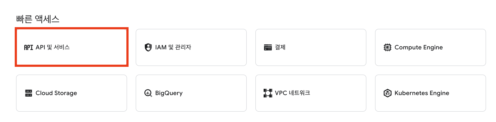
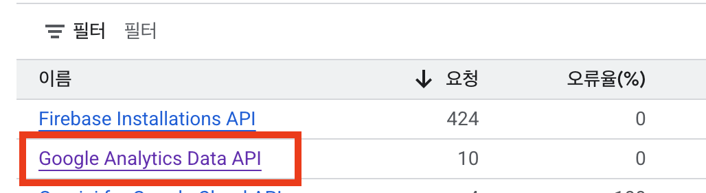
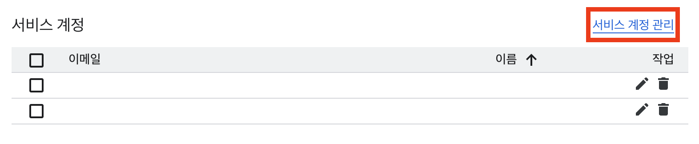
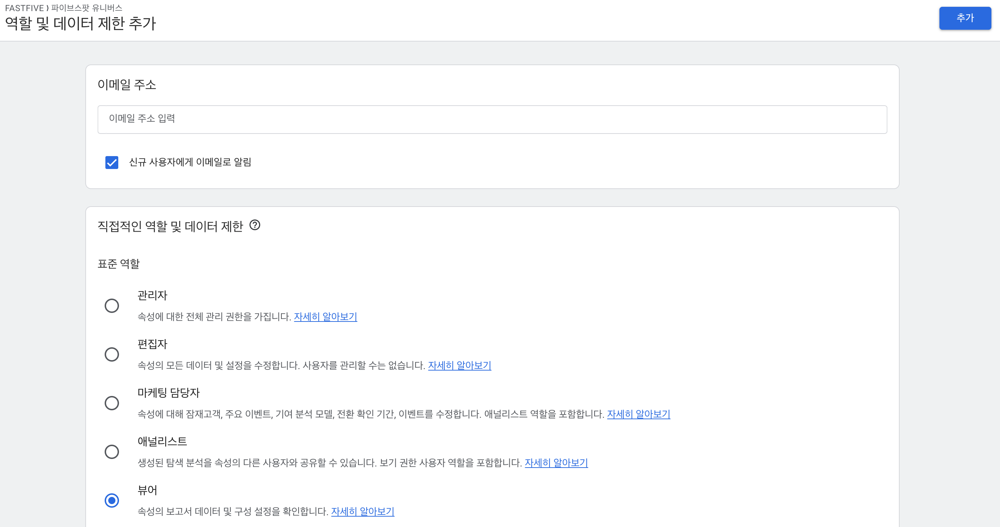
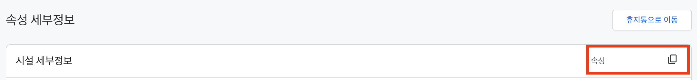
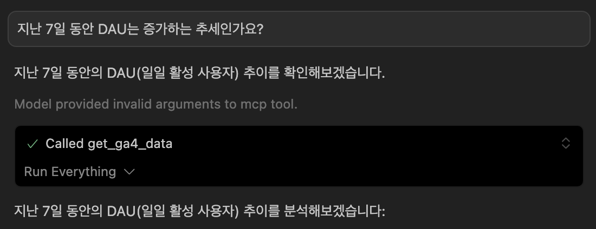

여러 컨텍스트에서 `Model Context Protocol(MCP)`를 제공하기 시작하면서 개발 단계에 도움을 많이 받고 있다.
가령 [`Figma-Context-MCP`](https://github.com/GLips/Figma-Context-MCP)를 통해 단순한 UI 구현을 요청하고선,
다른 비즈니스 로직을 짜는 것에 충분히 익숙해져 있다.

본 글에서는 구글 에널리틱스 데이터를 자연어로 분석하는 방법을 소개해보려 한다. 복잡한 분석 대시보드 설정 없이도 간단한 질문으로 원하는
인사이트를 얻을 수 있다. 해당 `MCP`는 `cursor`에서 사용해볼 수 있도록 연동해보자.

### google-analytics-mcp

[`google-analytics-mcp`](https://github.com/googleanalytics/google-analytics-mcp)는 아직 실험 단계이지만, 대시보드 설정과
쿼리 작성 과정을 대신하여 직관적인 질문으로 실시간 데이터 접근과 다양한 메트릭 분석이 가능하다.

> 지난 7일간 DAU는 상승 추세인가요?

> 지난 180일 동안 내 Google 애널리틱스 속성에서 가장 인기 있는 이벤트는 무엇인가요?

### 사전 준비사항

우선 `MCP`를 사용하기 위해 이미 속성을 제공하고 있는 컨테이너와 구글 클라우드 계정이 필요하며, `MCP` 서버를 실행하기 위해 파이썬 런타임이
제공되어야 한다.

- Python 3.10 이상
- Google Analytics 4 프로퍼티
- Google Cloud 계정

### 구글 클라우드 콘솔 설정

[Google Cloud Console](https://console.cloud.google.com)에서 새 프로젝트 생성 혹은 기존 프로젝트를 선택하고,
`API 및 서비스` -> `라이브러리` 탭으로 이동해 `Google Analytics Data API`를 활성화한다.





### 서비스 계정 생성

마찬가지로 `API 및 서비스` -> `사용자 인증 정보` 탭으로 이동해 서비스 계정을 생성해야 한다. 이때 이름은 자유롭게 입력하고,
권한 설정을 건너뛰고 생성한다.




### JSON 키 다운로드

생성된 서비스 계정을 사용하기 위해 해당 계정 상세로 들어가 키 탭으로 이동, 키 추가를 통해 키를 새롭게 생성하고,
생성된 `JSON` 로컬에 저장한다. 여기까지가 API 활성화 과정이다.


### GA4 액세스 권한 부여

이제 구글 에널리틱스에서 권한을 설정해야 한다. 우선 `JSON` 파일에서 `client_email`을 복사해 구글 에널리틱스 관리 ->
속성 -> 속성 엑세스 관리에서 복사해둔 서비스 계정을 추가하고, 뷰어 권한을 부여해준다.



### Property ID 확인

속성 -> 속성 세부 정보 탭으로 들어가 우측 상단 속성 ID를 복사한다.



### MCP 서버 설치

마지막으로 `MCP` 서버 설치가 필요하다. 깃헙 저장소 패키지를 설치하는 방법도 제공하지만,
`pip`를 통해 패키지를 설치하는 방법이 간단하다.

```shell
~$ pip install google-analytics-mcp
~$ python -m ga4_mcp_server --help
```

### Cursor MCP 설정

`GOOGLE_APPLICATION_CREDENTIALS`은 위에서 발급받은 json 파일의 실제 로컬 경로를,
`GA4_PROPERTY_ID`는 GA 속성 ID를 넣어준다.

```json
{
  "mcpServers": {
    "ga4-analytics": {
      "command": "python3",
      "args": ["-m", "ga4_mcp_server"],
      "env": {
        "GOOGLE_APPLICATION_CREDENTIALS": "/path/to/your/service-account-key.json",
        "GA4_PROPERTY_ID": "123456789"
      }
    }
  }
}
```

### 테스트

위 과정을 잘 마무리했다면, 다음과 같이 mcp 서버를 사용할 수 있다.


