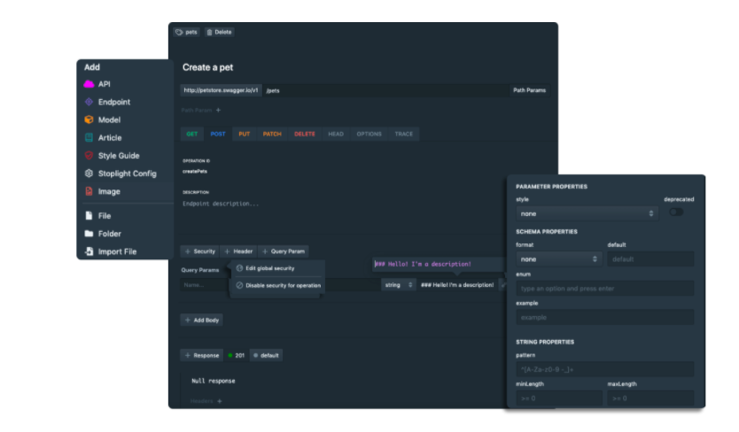
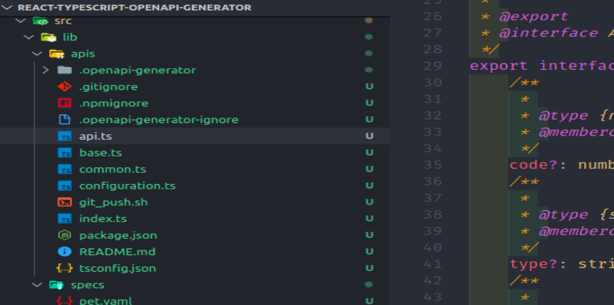
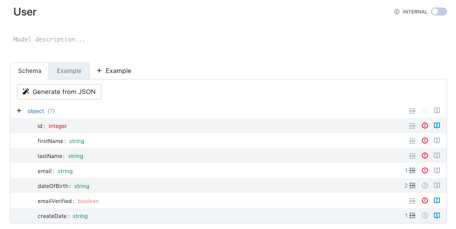
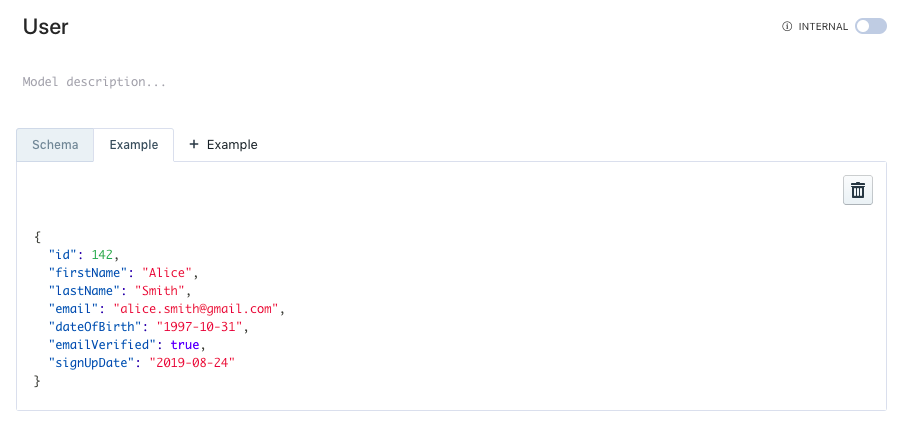
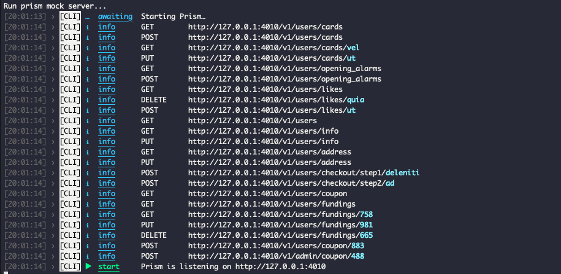

실무에서 프론트엔드 개발일을 하다보면, 작업이 팬딩상태가 되버리는 경우를 자주 경험합니다. 기획, 백엔드 개발이 순차적으로 마무리된 후에
프론트엔드 작업을 진행하는 것이 이상적이지만, 현실적으로 특정 기능 개발에 대한 킥오브와 동시에 작업이 병렬적으로 진행되는 경우가 많기 때문인데요.

API 개발이 되지 않아 기다리거나, 마이너한 기획의 변경 사항이 발생하는 경우, 최종 산출물을 다루는 프론트엔드 개발 영역에서의 수정사항은 눈덩이처럼 불어납니다.

이러한 작업 단계의 블로커를 최소한으로 하기 위해 스펙 문서 기반의 개발과 Mocking을 적극 활용하고 있습니다.

### API 스펙 픽스하기

요구 사항과 기획이 산출되면, 기능 개발을 들어가기 전에 API 스펙을 픽스하기 위한 단계에 들어갑니다. API 스펙을 픽스하고 공유하는 것은 정말 중요한 단계인데요.

일방적으로 API 스펙이 전달되거나, 누락이 되어 버리는 경우 특정 인터페이스에 예상한 프로퍼티가 없다던지, 타입이 일치하지 않은 문제를 야기할 수 있습니다.
사실, 일방적으로 API 스펙을 전달받았다 하더라도 공유받은 것은 맞으니까요.


이를 방지하기 위해 API 스펙을 픽스하고 공유하는 단계는 기능 개발에 참여하는 모든 개발자가 참여합니다. 최종적으로 합의된 API 스펙은 문서화 단계를 거치는 데
그 중 [Stoplight](https://stoplight.io/)를 사용하고 있습니다.

API, 앤드포인트, 모델 설계 등 다양한 기능을 제공하는 에디터입니다. 추가적으로 Github 저장소와 연동하여 스펙을 업데이트할 수 있습니다.
최종적으로 yaml 파일 형식으로 된 API 스펙 문서를 반환합니다.


### API 함수를 담고 있는 클래스, 인터페이스 자동 생성하기

본 섹션에서 진행하는 과정은 [깃허브 저장소](https://github.com/youthfulhps/react-typescript-openapi-generator)에서 예시로 확인할 수 있습니다.

이제, 픽스된 API 스펙을 통해 개발을 진행할 때가 되었습니다. Stoplight 에디터에서 최종적으로 yaml 파일을 반환해준다 했는데요.
이 yaml 파일을 [Opanapi-generator](https://openapi-generator.tech/)에게 제공하면 API 함수를 담고 있는 클래스와 API 함수 정의에 필요한 다양한 인터페이스를 자동으로 생성해줍니다.

패키지 설치와, 프로젝트 환경에 적합한 Generator를 선택하고 스크립트를 돌려 API를 생성합니다.

```shell
~$ yarn add @openapitools/openapi-generator-cli -g
~$ openapi-generator-cli generate -i {yaml or json file} -g {generator name} -o {file path to be created} --config {config file}
```



인터페이스 함수를 담고 있는 클래스, 관련 객체 인터페이스를 자동으로 생성해준다니, 사실 덤덤하게 말했지만 API, 인터페이스 자동 생성이 주는 장점은 엄청납니다.


타입스크립트에서 API 함수를 정의할 때 타이핑양이 상당히 많아지고, 응답 객체의 인터페이스 또한 정확하게 정의해주어야 하는데요. 여기에 사용되는 리소스 또한 비지니스 작업에
집중할 수 있게 도와줍니다.

또한, 작업 과정에서 휴면에러가 발생할 여지를 최소화 해주어 API 스펙 기반의 타입세이프한 개발이 가능하도록 도와줍니다.

### Mocking를 통한 병렬적인 개발 생산성 챙기기

특정 기능 개발을 진행하는 과정에서 현실적으로 병렬적으로 개발이 진행되는 문제를 위에서 언급했었는데요.

프론트엔드 개발 단계의 팬딩 상태를 최소화하기 위해 실제 API가 개발되기 전에 Mocking 서버를 동작시켜 Mock 데이터를 전달받아
실제 데이터가 전달되는 것처럼 랜더링 시켜주는 방식의 개발을 진행합니다.

API 스펙을 문서화하는 단계에서 인터페이스를 정의할 때 인터페이스의 예시 데이터를 기입해줄 수 있습니다.




이후 Mock 서버를 실행시켜 주어야 하는데요. 이때 Stoplight에서 제공하는 [Prism](https://stoplight.io/open-source/prism/)를 사용합니다.

Prism에 `yaml` 형식의 API 스펙을 제공하면 로컬에서 API 스펙을 기반으로 Mock 서버를 실행시킬 수 있으며, 인터페이스를 정의할 때 기입한 예시 데이터를 응답받을 수 있습니다.

```shell
~$ prism mock {yaml or json file}`
```



Mock 서버를 통해 실제 API 개발이 완료되지 않아도 병렬적으로
프론트엔드 개발에 집중할 수 있게 되고 팬딩 상태를 최소화하여 생산성을 챙길 수 있는 이점을 제공합니다.

### 마치면서

Openapi-generator를 통해 API 스펙 기반 개발을 적용해 병렬적인 개발 사이클에서 발생할 수 있는 문제를 어떻게 해결할 수 있는 가에
대한 이야기를 해보았는데요.

이상적인 루틴을 그리는 개발 사이클이 아닌 연쇄적이지만 병렬적으로 진행되어야 하는 현실적인 작업 환경에서
API 스펙 기반으로 타입 세이프한 개발과 동시에 생산성까지 챙겨보시면 좋을 것 같습니다:)
