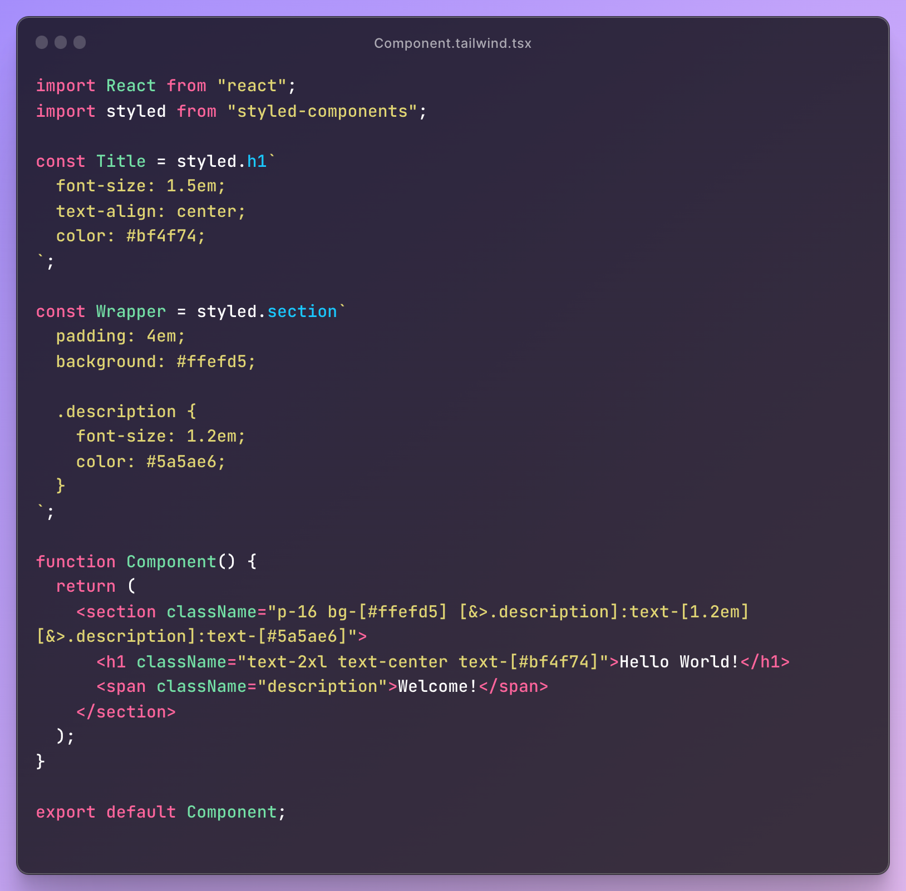

[tailwind-converter](https://www.npmjs.com/package/@youthfulhps/tailwind-converter) 라이브러리를 릴리즈하게 되었다.
[styled-components](https://www.npmjs.com/package/styled-components)를 통해 정의된 코드레벨의 컴포넌트 스타일을 추출하여 
[tailwindCSS](https://tailwindcss.com/)에서 제공하는 유틸리티 클래스로 변환하고, 해당 컴포넌트의 사용처를 찾아 변환된 스타일 클래스들을 할당, 
최종적으로 코드를 반환하는 도구이다.

- **before**

- **after**


간단한 예제에서는 그럴싸하게 동작하지만, 아직 실무에서 사용되는 복잡한 정의의 컴포넌트를 완벽하게 변환하기까지, 혹은 완벽하게 변환이 가능한 것인지도 모를 단계이자, 
아직 많은 이슈와 챌린지들을 직면하고 있다.

그래도 1차적으로 목표했던 기능이 완성되었고, 라이브러리를 제작하면서 배우고 고민했던 것들을 기록하기 위해 회고를 남겨보려 한다.

## 동기

사내 내부적으로 프론트엔드 파트 통합을 준비하면서 각 파트의 기술 스택 통일에 대한 필요성을 느꼈다. 결과적으로 스타일링을 위해 사용되는 도구로는 tailwindCSS가 
채택되고, styled-components를 사용하고 있는 레거시 스타일 정의에 대해 리팩토링과 마이그레이션이 필요한 상황이었다.

다만 해당 작업이 지엽적이고 반복적인 작업에 피로가 꽤나 쌓일 만한 작업이었으며, 수반되는 QA도 무시할 수 없었다. 별수 있나 받아들이고 시간 날 때마다 마이그레이션
작업을 했다. 당연한 이야기지만, 다음과 같은 과정을 반복했다.

1. 정의된 컴포넌트의 스타일을 확인한다.
2. 스타일 속성과 값에 대응하는 tailwind 유틸리티 클래스를 찾는다.
3. 해당 컴포넌트의 사용처에서 열린 태그를 찾아 className 속성에 해당 유틸리티 클래스를 할당한다.

그러다 문뜩 코드 수정을 발생시키는 위 과정들을 수행하는 프로그램을 작성해 볼 수 있겠다는 생각이 들었다. 한정된 스타일 속성들과 이에 대응되는 유틸리티 클래스가
명확했고, styled 함수를 사용하는 코드 구조나 컴포넌트 사용처의 열린 태그가 가진 className 속성에 할당하는 과정 또한 문법적으로 제약이 있었기 때문이다.

다만 코드란 게 다양한 스타일을 가지고 있기 때문에 모든 스타일을 대응할 수 있을 것이라고는 장담할 수는 없었지만, 우선 이러한 컨셉을 증명해 보기 위해 단순하게 정의된
기본적인 스타일 속성들에 대해 위 과정을 대신 수행해 주는 스크립트를 작성해 보자는 것을 첫 번째 목표로 삼았다.

## 추상 구문 트리를 조작할 수 있구나


처음엔 코드 파일을 스크랩해서 정규식을 통해 정의된 컴포넌트의 스타일을 추출해 보려 했으나 절대 안전한 방법이 아니라는 걸 금방 깨달았다.
컨벤션이 정해져 있다고 한들 다양한 코드 스타일을 감당할 만한 정규식을 기대하기는 어려웠고, 더 엄격한 정규식을 사용하면 예외적인 문자열이 포함되거나, 원하는 문자열이
제외되는 경우가 많았다. 

결론부터 말하자면 추상 구문 트리를 조작하는 것으로 접근 방식을 사용했다. 사실 추상 구문 트리를 조작해야겠다는 생각이 쉽게 떠오른 것은 아니었는데, 한창 어떻게 풀어낼 수
있을 까 고민하던 중 우연히 익숙하게 사용한 [prettier](https://prettier.io/)로 코드 포매팅을 했는데, 자바스크립트 문법을 읽기 쉽게 코드를 포매팅해준다면,
prettier는 문자열 덩어리에서 자바스크립트를 어떻게 해석할 수 있는 것인가에 대한 의문이 생겼다.

> 추상 구문 트리는 프로그래밍 언어로 작성된 소스 코드의 추상 구문 구조의 트리이다. 이 트리의 각 노드는 소스 코드에서 발생되는 구조를 나타낸다.
> [위키 백과/추상 구문 트리] 중

결국 코드 텍스트에서 트리 구조의 데이터 구조를 만들어내고, 코드에 있는 각각의 아이템을 통해 노드를 구성한 구조가 추상 구문 트리이다. [babel](https://babeljs.io/)에서 
자바스크립트를 컴파일링할때나, prettier, eslint와 같이 포매팅 혹은 컨벤션 이슈를 체크하는 도구들 또한 추상 구문 트리를 기반으로 코드를 해석하고 조작한다.

간단하게 예시를 살펴보자. 다음과 같은 코드로 추상 구문 트리를 생성한 결과이다.

```js
const Title = styled.h1`
  font-size: 1.5em;
  text-align: center;
  color: #BF4F74;
`;
```

```json
{
  "type": "File",
  "start": 0,
  "end": 87,
  "loc": {
    "start": {...},
    "end": {...},
  },
  "range": [0, 87],
  "errors": [],
  "program": {
    "type": "Program",
    "start": 0,
    "end": 87,
    "loc": {
      "start": {...},
      "end": {...},
    },
    "range": [0, 87],
    "sourceType": "module",
    "interpreter": null,
    "body": [
      {
        "type": "VariableDeclaration",
        "start": 0,
        "end": 87,
        "loc": {
          "loc": {
            "start": {...},
            "end": {...},
          },
        },
        "range": [0, 87],
        "declarations": [
          {
            "type": "VariableDeclarator",
            "start": 6,
            "end": 86,
            "loc": {
              "start": {...},
              "end": {...},
            },
            "range": [6, 86],
            "id": {
              "type": "Identifier",
              "start": 6,
              "end": 11,
              "loc": {
                "start": {...},
                "end": {...},
              },
              "range": [6, 11],
              "name": "Title"
            },
            "init": {
              "type": "TaggedTemplateExpression",
              "start": 14,
              "end": 86,
              "loc": {
                "start": {...},
                "end": {...},
              },
              "range": [14, 86],
              "tag": {
                "type": "MemberExpression",
                "start": 14,
                "end": 23,
                "loc": {
                  "start": {...},
                  "end": {...},
                },
                "range": [14, 23],
                "object": {
                  "type": "Identifier",
                  "start": 14,
                  "end": 20,
                  "loc": {
                    "start": {...},
                    "end": {...},
                  },
                  "range": [14, 20],
                  "name": "styled"
                },
                "computed": false,
                "property": {
                  "type": "Identifier",
                  "start": 21,
                  "end": 23,
                  "loc": {
                    "start": {...},
                    "end": {...},
                  },
                  "range": [21, 23],
                  "name": "h1"
                }
              },
              "quasi": {
                "type": "TemplateLiteral",
                "start": 23,
                "end": 86,
                "loc": {
                  "start": {...},
                  "end": {...},
                },
                "range": [23, 86],
                "expressions": [],
                "quasis": [
                  {
                    "type": "TemplateElement",
                    "start": 24,
                    "end": 85,
                    "loc": {
                      "start": {...},
                      "end": {...},
                    },
                    "range": [24, 85],
                    "value": {
                      "raw": "\n  font-size: 1.5em;\n  text-align: center;\n  color: #BF4F74;\n",
                      "cooked": "\n  font-size: 1.5em;\n  text-align: center;\n  color: #BF4F74;\n"
                    },
                    "tail": true
                  }
                ]
              }
            }
          }
        ],
        "kind": "const"
      }
    ],
    "directives": []
  },
  "comments": [],
  "tokens": [...]
}
```

즉 코드를 통해 생성된 추상 구문 트리를 조작하면 코드가 재생성될 때 유효하게 조작된 결과를 얻을 수 있을 것이다. 사실 매우 복잡한 추상 구문 트리를 직접 조작하기란 
절대 쉽지 않다. 다만 가장 안전한 방법이다. **추상 구문 트리의 조작이 유효하지 않다면 에러가 발생하게 되는데, 인위적인 조작이 유효한지 프로그래밍적으로 
판단할 수 있다는 것은 정말 큰 장점이라고 생각했다.**

_이하 구현 과정과 예시에서 자바스크립트 코드를 파싱하고 조작하기 위한 도구로 prettier를 사용합니다. 일반적으로 babel에서 제공하는 parser, generator를
사용하지만, prettier에서도 내부적으로 동일한 parser를 사용하고 있다는 점과, 코드 조작을 위한 [API](https://prettier.io/docs/en/api)를 제공하고
있다는 점을 감안하여 선택하였습니다._

## 1. 선언된 컴포넌트 정보 추출하기

우선 추상 구문 트리에서 스타일된 컴포넌트에 대한 정보가 담긴 노드를 조건에 맞게 찾아내야 했다. 여기서 주의해야 하는 것은 변수 선언은 함수 선언문 혹은 
if-else, switch와 같은 상태문 내부에서도 선언될 수 있다는 것이다. 개인적으로 스타일된 컴포넌트를 정의 할땐 디폴트 격의 함수와 같은 레벨에 작성했지만, 
다른 스코프 내부에서 스타일된 컴포넌트를 정의해도 전혀 문제 될 것이 없다.

```js
// component variable declaration
const Title = styled.h1`
  font-size: 1.5em;
  text-align: center;
  color: #BF4F74;
`;

function Component() {
  return <Title>...</Title>
}
```

```js
function Component() {
  // component variable declaration
  const Title = styled.h1`
  font-size: 1.5em;
  text-align: center;
  color: #BF4F74;
`;
  
  if (isOpen) {
    // component variable declaration
    const SubTitle = styled.h1`
      font-size: 0.5em;
      text-align: center;
      color: #BF4F74;
    `;
    
    return <SubTitle>...</SubTitle>
  }
  
  return <Title>...</Title>
}
```

즉 추상 구문 트리에서 스타일된 컴포넌트 코드 정보가 담긴 노드를 찾으려면, 트리에 존재하는 모든 노드를 레벨에 상관없이 재귀적으로 순회해 주어야 했다. 또한 노드의 
타입별로 구조가 달랐기 때문에 재귀 함수를 어떻게 짜야 될지 정말 감이 오질 않았다. 머리를 쥐어뜯다 결국 사수님께 조언을 구해 노드 객체의 프로퍼티의 값이 배열 혹은
객체인 경우 모두 재귀 호출을 하는 방식으로 순회를 구현할 수 있었다.

```js
function recursion(node: unknown) {
  if (!isObject(node) || !('type' in node)) {
    return;
  }

  // 객체를 이루는 모든 키와 값을 재귀 순회
  Object.entries(node).forEach(([key, value]) => {
    if (key === 'type') {
      return;
    }

    if (Array.isArray(value)) {
      value.forEach((childNode: unknown) => {
        recursion(childNode);
      });
      return;
    }

    recursion(value);
  });
}
```

이제 모든 노드를 순회하면서 styled 라는 이름을 가진 TaggedTemplateExpression 타입의 표현문이 초기 할당된 변수 선언 타입을 가진 노드라는 주요 조건을 걸어
조건을 충족하는 노드에서 스타일된 컴포넌트의 이름과 태그 그리고 스타일 정의를 추출했다. 


```js
if (
  node.type === 'VariableDeclarator' &&
  'id' in node &&
  isObject(node.id) &&
  'type' in node.id &&
  'name' in node.id &&
  node.id.type === 'Identifier' &&
  typeof node.id.name === 'string' && // 요게 컴포넌트 이름
  'init' in node &&
  isObject(node.init) &&
  'type' in node.init &&
  node.init.type === 'TaggedTemplateExpression' &&
  'tag' in node.init &&
  isObject(node.init.tag) &&
  'object' in node.init.tag &&
  isObject(node.init.tag.object) &&
  'type' in node.init.tag.object &&
  'name' in node.init.tag.object &&
  node.init.tag.object.type === 'Identifier' &&
  node.init.tag.object.name === 'styled' &&  // styled 함수를 사용했는가
  'property' in node.init.tag &&
  isObject(node.init.tag.property) &&
  'name' in node.init.tag.property &&
  typeof node.init.tag.property.name === 'string' && // 요게 태그 이름
  'quasi' in node.init &&
  isObject(node.init.quasi) &&
  'type' in node.init.quasi &&
  node.init.quasi.type === 'TemplateLiteral' &&
  'quasis' in node.init.quasi &&
  Array.isArray(node.init.quasi.quasis) &&
  'type' in node.init.quasi.quasis[0] &&
  node.init.quasi.quasis[0].type === 'TemplateElement' &&
  'value' in node.init.quasi.quasis[0] &&
  isObject(node.init.quasi.quasis[0].value)
) {
  const componentDeclaration: ComponentDeclaration = {
    name: node.id.name,
    tag: node.init.tag.property.name,
    styles: extractStylePropertyAndValue(
      node.init.quasi.quasis[0].value.raw
        .split(/[\n;]+/)
        .filter((style: string) => !!style)
        .map((style: string) => style.trim()),
    ),
  };

  componentDeclarations.push(componentDeclaration);
}
```

이로서 추상 구문 트리의 모든 레벨을 순회하여 styled를 통해 정의된 컴포넌트의 정보를 추출할 수 있었다.

## 2. 추출된 스타일 정의를 유틸리티 클래스로 변환하기

이제 컴포넌트별로 추출된 스타일을 tailwindCSS의 정의되어 있는 유틸리티 클래스로 변환해 주어야 한다. 스타일 속성과 할당된 값에 대응되는 유틸리티 클래스 리스트가
필요했는데 우연히 CSS 정의를 tailwind 유틸리티 클래스로 변환해 주는 [웹 서비스](https://tailwind-converter.netlify.app/)의 소스 코드에서 constants
파일을 구할 수 있었다.

```js
const TAILWINDCLASS: { [key: string]: any } = {
  ...
  'font-size': {
      arbitrary: 'text',
      '0.75rem': '.text-xs',
      '0.875rem': '.text-sm',
      '1rem': '.text-base',
      '1.125rem': '.text-lg',
      '1.25rem': '.text-xl',
      '1.5rem': '.text-2xl',
      '1.875rem': '.text-3xl',
      '2.25rem': '.text-4xl',
      '3rem': '.text-5xl',
      '4rem': '.text-6xl',
  },
  ...
}
```

가령 font-size 라는 스타일 속성에 할당된 값이 해당 키 배열에 포함되어 있다면, tailwindCSS에서 제공하는 기본 클래스에 포함되어 있다고 간주하고 해당 값을
반환해 주었고, 그 외의 값에 대해서는 임의로 할당된 클래스를 생성하여 반환하도록 구현했다.

```js
export function convertCss({ property, value }: CSSStyleEntity) {
  property = preprocessProperty({ property, value });
  const processedValue = preprocessValue({ property, value });

  if (!TAILWINDCLASS[property]) {
    // 스타일 속성이 유효하지 않다면,
    // 빈 문자열을 반환한다.
    return '';
  }

  if (!TAILWINDCLASS[property][processedValue]) {
    // 스타일 속성에 할당된 값과 대응되는 키가 없다면,
    // 즉 유효한 속성에 할당된 값과 대응되는 유틸리티 클래스가 없다면,
    // 임의의 값을 전달하는 형태로 클래스를 생성하여 반환한다. 
    // ex) text-[7px]
    return `${TAILWINDCLASS[property]['arbitrary']}-[${value}]`;
  }
  
  // 스타일 속성에 할당된 값과 대응되는 키가 있다면,
  // 해당 키의 값을 반환한다.
  // ex) text-base
  return TAILWINDCLASS[property][processedValue].slice(1);
}
```

위 코드에서 속성과 값이 전처리되고 있는 것을 볼 수 있다. 이는 가령 background 속성에 색상 값이 할당되어 있는 경우 background-color로 변경한다거나,

```js
export function preprocessProperty({ property, value }: CSSStyleEntity) {
  if (property === 'background') {
    if (isColor(value)) {
      return 'background-color';
    }
    return property;
  }

  return property;
}
```

px, rem, em으로 표현되는 치수를 통일시켜주거나,

```js
export function preprocessDimension(value: string) {
  if (value === '0' || value === '0px') {
    return '0';
  }

  return convertUnit(value, 'rem');
}

export function preprocessSpacing(value: string) {
  return convertUnit(value, 'rem');
}
```

축약된 값을 할당할 수 있는 padding, margin, border과 같은 속성을 쪼개는 과정이 포함된다. 
(background 또한 축약 속성이나, 아직 값을 적절하게 쪼개내지 못했다..)

```js
export function preprocessSpacingShorthand(
  property: 'padding' | 'margin',
  value: string,
): StyleEntity[] {
  const values = value.split(' ');

  const propertyX = `${property}-x`;
  const propertyY = `${property}-y`;
  const propertyTop = `${property}-top`;
  const propertyRight = `${property}-right`;
  const propertyBottom = `${property}-bottom`;
  const propertyLeft = `${property}-left`;

  switch (values.length) {
    case 2:
      return [
        {
          property: propertyY,
          value: values[0],
        },
        {
          property: propertyX,
          value: values[1],
        },
      ];
  ...
  }
}

function preprocessBorderShorthand(value: string): StyleEntity[] {
  const values = value.split(' ');

  const borderStyle = findBorderStyle(values);
  const borderWidth = findBorderWidth(values);
  const borderColor = findBorderColor(values);

  if (!borderStyle) {
    return [];
  }

  const border: StyleEntity[] = [
    {
      property: 'border-style',
      value: borderStyle,
    },
  ];
  
  if (borderWidth) {
    ...
  }
  
  ...
}
```

결과적으로 다음과 같은 스타일 정의에 대한 유틸리티 클래스를 묶어 얻어낼 수 있었다.

```text
const before = [
  "font-size:1.5em", 
  "text-align:center", 
  "color:#bf4f74"
]

=> "text-2xl text-center text-[#bf4f74]"
```

## 3. 컴포넌트 사용처 조작하기

이제 컴포넌트 정의와 변환된 유틸리티 클래스를 얻었으니 컴포넌트의 열린 태그를 포함하고 있는 노드를 찾아 해당 노드의 className 속성에 변환된 유틸리티 클래스를
할당해 주어야 한다.

마찬가지로 JSXElement 반환문에 사용되는 컴포넌트의 열린 태그는 여러 레벨의 상태문 안에서 사용될 수 있기 때문에 추상 구문 트리의 모든 레벨과 노드를 순회해야 한다.

```js
function Component() {
  if (isOpen) {
    return <Title>...</Title>
  }
  
  switch(type) {
    case 'primary':
      return <PrimaryTitle>...</PrimaryTitle>
    ...
  }
  
  return <SubTitle>...</SubTitle>
}
```

스타일된 컴포넌트의 사용처에서 열린 태그를 찾는 조건은 다음과 같은 조건을 걸었다. 그리고 조건에 충족한 노드를 만나면 className 속성에 변환된 유틸리티 클래스
문자열을 덮어쓰는 방식으로 속성 조작을 구현했다.

```js
if (
  node.type === 'JSXOpeningElement' &&
  parentNode?.type === 'JSXElement' &&
  'name' in node &&
  isObject(node.name) &&
  'type' in node.name &&
  node.name.type === 'JSXIdentifier' &&
  'name' in node.name &&
  typeof node.name.name === 'string' &&
  'attributes' in node &&
  Array.isArray(node.attributes) &&
  'selfClosing' in node
) {
  const elementName = node.name.name;
  
  // 추출된 컴포넌트 정보들에서 본 노드의 이름과 동일한 정보가 있는지 찾는다.
  const targetComponentDeclarations = componentDeclarations.filter(
    (componentDeclaration) => componentDeclaration.name === elementName,
  );

  if (targetComponentDeclarations.length) {
    // 만약 있다면, 
    // 해당 노드의 속성 배열에 className 존재 여부를 판단한다.
    // 판단 여부에 따라 className의 값을 이어붙이거나, 새롭게 생성한다.
    const { tag, styles } = targetComponentDeclarations[0];
    const newAttributes = generateJSXOpeningElementClassNameAttribute(
      node.attributes,
      convertStyles(styles),
    );
    
    // 열린 태그의 컴포넌트 이름을 태그명으로 덮어쓴다.
    node.name.name = tag;
    // 열린 태그의 속성 배열을 새롭게 생성된 속성 배열로 덮어쓴다.
    node.attributes = newAttributes;

    // 만약 닫힌 태그가 있다면,
    // 닫힌 태그의 컴포넌트 이름을 태그명으로 덮어쓴다.
    if (!node.selfClosing) {
      if (
        'closingElement' in parentNode &&
        isObject(parentNode.closingElement) &&
        'name' in parentNode.closingElement &&
        isObject(parentNode.closingElement.name) &&
        'name' in parentNode.closingElement.name
      ) {
        parentNode.closingElement.name = tag;
      }
    }
  }
}
```

결과적으로 다음과 같이 변환된다.

```js
function Component() {
  return (
    <Wrapper>
      <Title>Hello World!</Title>
    </Wrapper>
  )
}
```

```js
function Component() {
  return (
    <section className='p-16 bg-#ffefd5'>
      <h1 className='text-2xl text-center text-[#bf4f74]'>Hello World!</h1>
    </section>
  )
}
```

## 남은 과제

단번에 모든 스타일된 컴포넌트 코드 스타일을 커버할 수 있는 변환기를 만들겠노라 목표하진 않았지만, 아직 조건부 스타일을 위한 보간(interpolation)이나 내부적으로
사용될 클래스 정의를 어떻게 처리해야 할지 고민이 크다.

```ts
const Card = styled.div<{isSelected: boolean}>`
  ...
  border-width: ${({isSelected}) => isSelected ? '4px' : '2px'};  // ?
  
  .title {  // ?
    ...
  }
  
  .description {  // ?
    ...
`;
```

보간의 경우 그대로 열린 태그의 style 속성에 옮겨주면 괜찮지 않을까 싶지만, 열린 태그를 반환하는 스코프 내에서 아래와 같이 참조 가능한 변수 선언인지 판단이
필요하다. 우선 옮겨주고 에러 픽스는 작업자에게 맡겨도 되지 않을까 싶지만 에러가 담긴 코드를 뱉어 일을 두번 만들고 싶지는 않다.

```js
// card
<div style={{
  borderWidth: isSelected ? '4px' : '2px'
              // 'isSelected' is not defined
}}>
```

클래스의 경우 다음과 같이 임의의 클래스 선언으로 유틸리티 클래스를 할당해줄 수 있지만, styled의 인자로 전달된 리터럴은 추상 구문 트리에서 단순한 문자열로
해석된다. 즉, 중첩된 클래스를 안전하게 해석하는 데 한계가 있을 수 있다. 클래스 정의의 시작점과 끝점을 찾아 문자열을 잘라내고 css 파서로 조작을 시도해 보고 있다.

```js
<div className="[&>.title]:... [&>.description]:...">
```

## 마치면서

실무에서 사용하려 제작한 스크립트를 라이브러리로 제작하면서 배운 점이 많다. 추상 구문 트리를 조작하여 코드를 전처리한다는 접근법은 이후에도 유사한 작업을 처리할 때
유용하게 사용될 것 같다. 위에서 언급한 과제들이 남아있지만 유사한 작업을 진행 중이신 분들에게 개선된 개발자 경험에 있어 작게나마 도움이 될 수 있으면 좋겠다.


