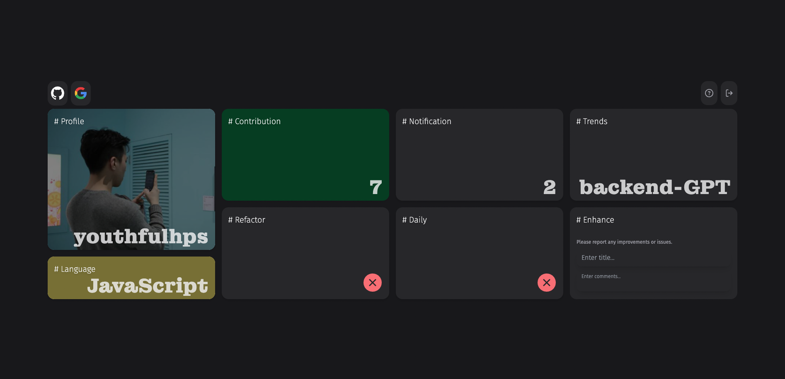
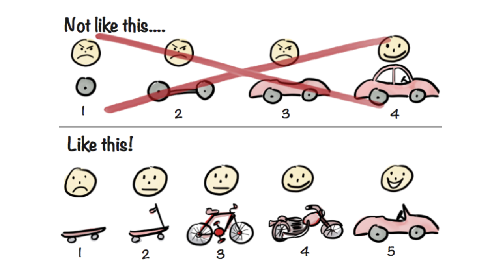
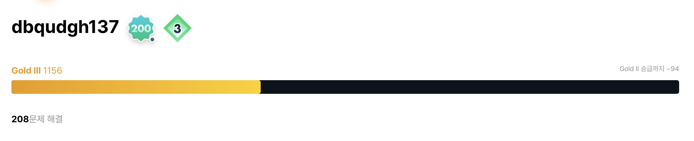
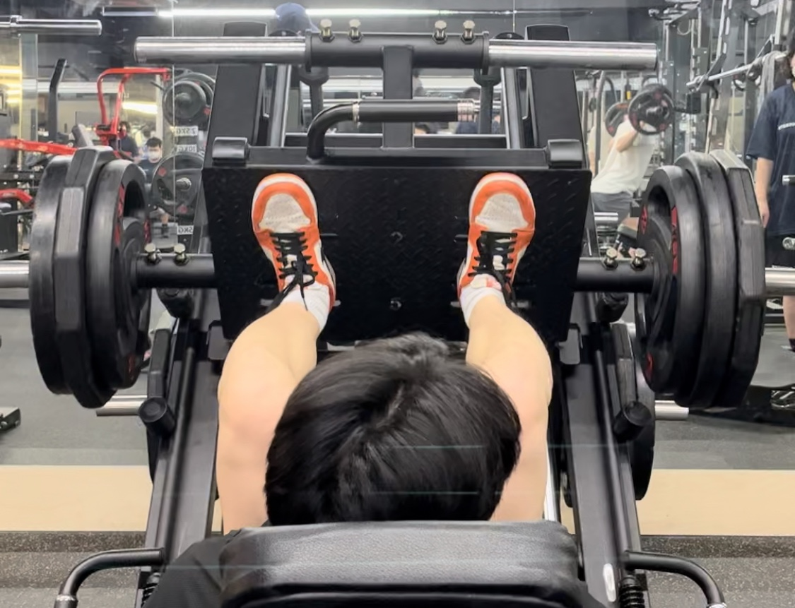
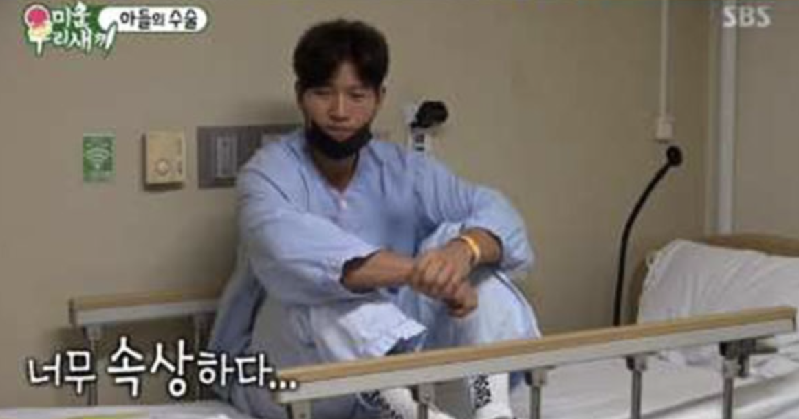
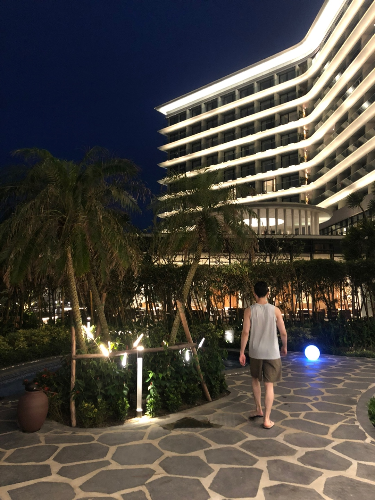
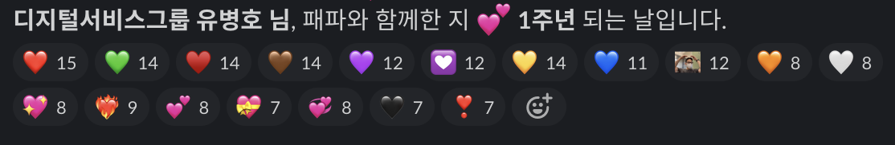
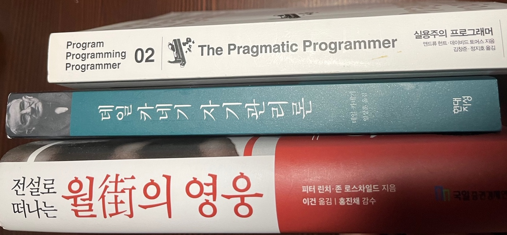

벌써 2023년 상반기가 지나갔다. 정말 정신없이 시간이 빠르게 흐르는 것 같아, 지나간 시간에 대한
회고와 함께 남은 하반기에 대한 목표 정리와 계획을 정리해 보려 한다.

사실 회고록을 적겠노라 시도한 적이 여러 번 있었지만 투박한 글 솜씨와 밋밋한 인생사에 접었던 적이 많았는데,
이번 상반기는 더 바쁘고 엄격하게, 그럼에도 더 행복한 하반기를 시작하기 위한 세이브 기점으로 나쁘지 않은
단락이었던 것 같아 기쁜 마음으로 첫 회고록을 남긴다.

## 개인 프로젝트; GitGlances

22년 10월 말, '오늘의 깃헙 로그를 한눈에 볼 수는 없을까?' 라는 개인적인 니즈로 시작된 프로젝트로
올해 3월 말 v2.1.1 릴리즈 버전으로 목표했던 크롬 익스텐션을 배포했다.

아침에 출근하면 습관적으로 깃헙을 살펴보면서 읽지 않은 알림이나, 오늘 핫한 저장소는 어떤 것이 있고,
작업이 끝나거나 공부를 마무리하고서는 오늘의 기여도나, 매일 커밋을 목표로 하고 있는 TIL 저장소의 커밋을
확인하며 스스로 자극을 구하곤 했는데, 생각보다 깃헙을 서핑하는 데 오래 걸린다는 단순한 이유가 동기부여이다.

훌륭한 접근성을 가진 크롬 익스텐션으로 한 번이라도 더 로그를 흘겨 보면서 고군분투하고자 했던 결과물이자,
스스로 기술 스택에 대한 궁금증을 풀기 위한 제품이다. 아직 남은 이슈 티켓도 많고, 개선할 여지가 충분한 만큼,
하반기에는 더 나은 제품으로 강화해보고 싶다.

개인 프로젝트에 대해 첨언한다면, 완벽보다는 완성을 목표로 했던 것이 유효했다. '아, 좀 못생겼는데 스타일
수정해 볼까' 하면 하루가 가고 목표했던 기능 개발은 시작도 못한 채 지친다. 항상 한 단락이 마무리된 동작하는
제품으로 오늘 개발을 끝맺어놔야 다음 개발할 때도 새롭게 시작하는 마음으로 힘이 생겼다.

[이미지 출처](https://blog.crisp.se/2016/01/25/henrikkniberg/making-sense-of-mvp)

MVP 프로젝트를 기획하는 방식에 대해 잘 표현한 그림을 다시금 꺼내보며, 스케이트보드 단계의 제품을 다운로드
해주신 8분께 감사드린다 (그렌절)

## 앓고리즘

정말이지 알고리즘 공부는 꺼내들기 쉽지 않았는데, 성장 그래프의 가파른 경사는 도대체 어디 있는지 성취감을 느끼기
쉽지 않은 카테고리가 아닌가 싶다.

사실 코딩 테스트를 준비하기 위해 알고리즘 공부를 하는 건 구직 과정에서 가성비가 너무 떨어지더라는 이야기를 자주
듣곤 했는데, 이상하게 이 조언이 알고리즘을 공부하고 싶게 만든 동기부여가 됐다. 정말 이상하게도 가성비가 떨어진다는
조언을 해준 사람들 목소리에 후련한 뿌듯함(?)이 묻어있다고 느꼈다.

[이미지 출처](https://www.youtube.com/watch?v=Qd1MBEhkWU8)

그래서 다시 시작했다. 나도 언젠가 이제 막 코딩 테스트를 준비하는 분을 만나게 된다면, 뿌듯하게 뱉어보고 싶다.
그때까지는 반클러치 딱 잡고 가파른 경사를 이 악물고 기다리는 게 맞다.

이렇게까지 넋두리 적었는데 플레5까지 집중 못하면 김계란님 헤어스타일 따라가는 건 더 맞다.

## 헬스와 탈장

헬스를 꾸준히 해오긴 했는데, 올해 초부터 다시 열심히 했다. 3월에 계획해둔 배트남 여행에서 나시를 입겠다는
목표, 그리고 등으로 대화하며, 잘 커팅된 팔뚝을 탑재한 채 멸치 탈출을 선언하고 싶었다. 꽤나 개운한 땀을 흘리며
술자리 대신 헬스장을 택했다.

퇴근 후 꾸준히 헬스장을 다니던 6개월 정도가 되던 시기에 하체 운동 빈도를 늘렸다. 친구 벨트를 빌려 기세 좋게
무게를 치고선, 다음날 하체에 배긴 알에 뿌듯함을 느꼈다. 다만, 알 배긴 것이 아닌 것이 있었는데 바로 탈장이었다.

회고록을 작성하고 있는 시점 2주 전 정도에 처음 탈장이라고 의심이 들었고, 어제 수술을 마치고 아무래도 개발하긴
힘들어, 회고록을 끄적이고 있다.

'스쿼트 한 200 쳤어? 김종국도 탈장 수술 했다더라.' 라는 이야기에 정말 스스로 어이없고 웃겼다.
탈장이 터지는 임계치라는 것이 달라도 너무 달라서 정말 민망하고 웃긴 해프닝이다. 그래도 꾸준히 해왔던 운동을
몇 주 쉬어야 한다는 말에 갓종국님이 슬퍼하셨는데, 파렴치하게도 공감한다.

## 다낭

마스크를 쓰는 것이 어색해질 줄은 몰랐다. 그리고 해외여행은 정말 행복했다. 회사 슬랙은 항상 시끌시끌하고 리액션이
좋아 카톡만큼이나 습관적으로 들어가 이슈는 없는지, 재밌는 일은 있는지 연차인 날에도 들여다보곤 했는데, 다낭에서
만큼은 보지 않기로 마음먹었다.

> 과거와 미래를 철문으로 닫아버리고, 오늘이라는 공간에서 살아가라., '데일 카네기 자기 관리론' 중

다낭에서는 나름 잘 지켜냈다. (배포하는 날, 한번 봤다.)

## 입사 1주년

4월 25일부로 입사 1주년이 되었다. 입사 동기 만큼이나 포부있는 경험을 쌓았는가.

충분한 비즈니스에 대한 이해가 선행되어야 할 것, 이를 토대로 우리가 제공하는 비즈니스를 사용자 관점에서
바라보고 개발할 것, 그러기 위해 사용자와 더 가까워질 것.

사용자 관점이라는 키워드와 친해지고 싶었지만, 막상 개발자로서 실제 제품을 개발하다 보니 개발 관점에 갇혀 오히려
시야가 좁아지고 있다는 느낌을 받을 때가 많았다. 그럴 때마다 한창 개발 공부를 하던 시절 친구들에게 개인 프로젝트를
보여주면서 여러 유명 앱들과 어떻게 다른지 팩트 폭행 당하며 개발하던 동기 충만한 시기가 떠올랐다.

그래서, 무식하지만 물리적으로 사용자 옆에 있을 수 있는 공간 플랫폼 비즈니스 모델을 가진 회사에 개발자로 입사했다.
잘 사용하고 계신지, 혹은 실제로 어떤 불편함이 있는지 직접 여쭤볼 수 있었다. 추상적이고 정답이 없게 느껴지는 사용자
관점을 나름대로 경험하고 알아가고 있는 중이다.

[이미지 출처](https://christierney.com/2015/12/04/technical-debt-in-an-image/)

덩달아 함께 개발하는 팀원들의 개발 경험에 대해 여전히 고민한다. 입사 후 내가 쳐낼 수 있는 부채들을 덜어보려 노력했고,
개선 POC를 정리해 디스커션을 열기도 했다. 머지된 것도 있지만, 반려된 것들도 많았다. 내가 개선하고 제안한 개발 환경과
구성의 사용자는 팀원이다. 팀원이 곧 사용자라는 걸 항상 상기하려 한다.

## 독서

자기 전 잡히는 대로 골라 쌓아두고 읽고 있다. 하반기까지 완독이 목표인데, 사실 핸드폰이 가장 잘 잡히고 그립감이 좋다.

## 하반기 목표

더 다치지 않고 꾸준히 운동할 수 있고, 상반기 때 벌려놓은 일들을 잘 마감할 수 있는 지속력을 구하고 싶다.
더 욕심 내보면, 한동안 리엑트 동시성이 궁금해 관련 레퍼런스를 찾아보고 소스 코드를 들여다보면서 나름대로
톺아봤는데, 결론은 바닐라 자바스크립트와 영어에 더 친숙한 사람이 되고 싶다는 생각이 들었다.

리엑트팀이 동시성 기능을 구현하기 위해 로우한 레벨에서부터 패키지를 업데이트했는데, 관련 PR들에서 구현체에
대한 구체적인 개념들을 설명해 주고 있고, 이슈 티켓들이 직면한 문제들과 고민거리들을 공짜로 보여주고 있는데
까막눈으로 살기엔 너무 아까운 내용들이다. 더 열심히 사는 연습을 할 수 있다면, 자바스크립트와 영어를 꾸준히
공부할 수 있는 시작점이 될 수 있으면 좋겠다.
