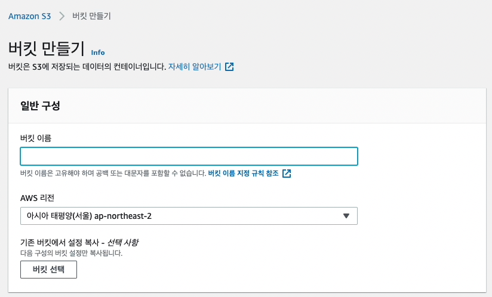
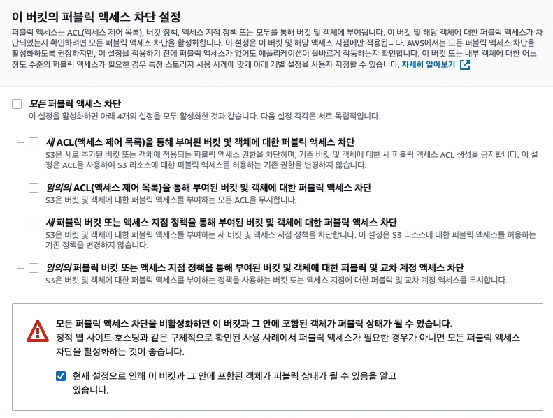
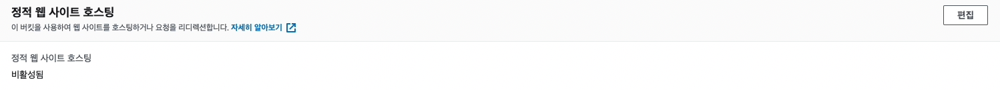
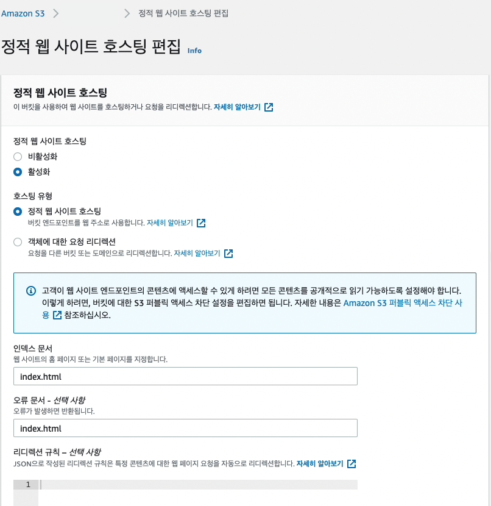
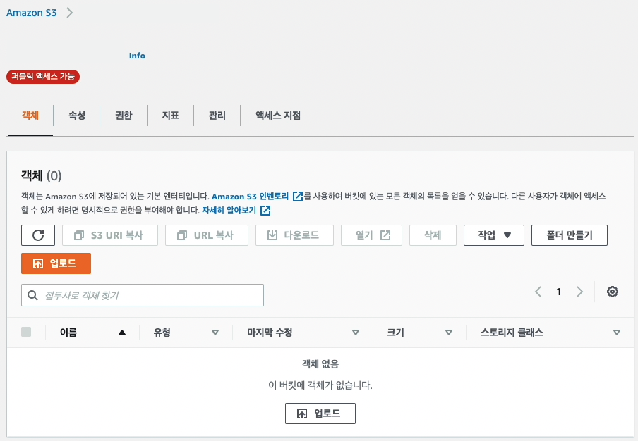
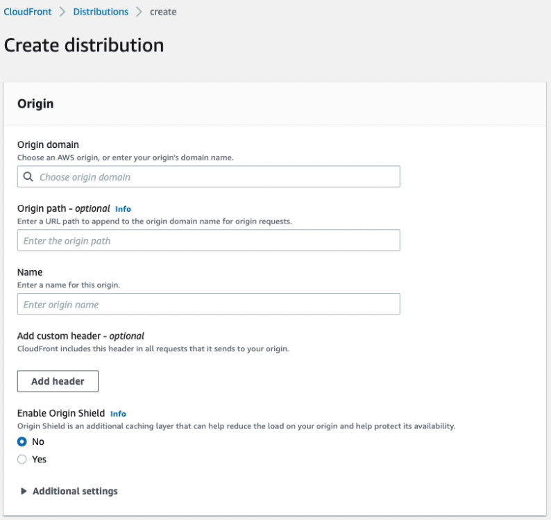
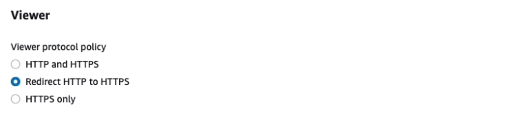
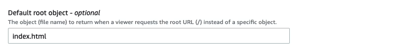
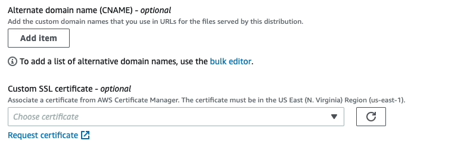
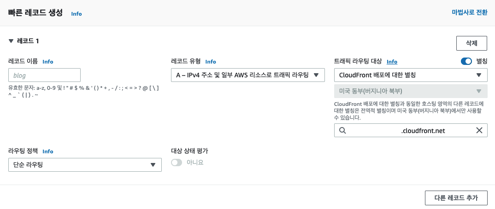

사내에서 사용되는 클라이언트 인프라는 이미 구축되어 있는 경우가 많아
직접 호스팅해볼 기회가 없었는데, 마침 웹 채팅 기능이 담긴 새로운 도메인을
호스팅할 기회가 생겨 그 과정을 정리해볼까 합니다.

## S3, 빌드된 정적파일 업로드하기

[S3](https://docs.aws.amazon.com/ko_kr/AmazonS3/latest/userguide/Welcome.html)는 클라우드 스토리지 서비스입니다.
우선, S3의 컨테이너인 버킷을 생성하고 프로젝트의 빌드된 파일을 업로드합니다.



하단으로 이동하면, `이 버킷의 퍼블릭 엑세스 차단 설정` 에서 `모든 퍼블릭 엑세스 차단` 을 해제해줍니다. 프로젝트의 빌드된 정적파일이기 때문에 접근을 열어두어야 합니다.



다른 설정을 변경하지 않고, 이제 버킷 생성을 눌러주면 버킷 생성이 완료되고, 속성을 변경시켜주러 갑니다.
방금 생성한 버킷을 클릭하고, `속성 탭 / 정적 웹 사이트 호스팅` 을 편집해줍니다.



`정적 웹 사이트 호스팅` 을 활성화 시켜주고, 기본 페이지와 에러 발생 시 반환되는 페이지 또한 설정해주어야 합니다.



`변경 사항 저장` 이 완료되었다면, 이제 객체를 업로드만 해주면 됩니다. 프로젝트를 빌드하면 생성되는 모든 파일을
그대로 드래그 & 드랍 해줍니다.



업로드가 모두 완료되었다면, 이전에 편집했던 `속성 탭 / 정적 웹 사이트 호스팅` 에서 버킷이 호스팅된 URL로 접속해보세요.
index.html 문서의 내용이 랜더링된다면 버킷 생성 과정은 마무리됩니다.

## CloudFront, 전세계에 S3 컨텐츠 제공하기

[CloudFront](https://aws.amazon.com/ko/cloudfront/?nc=sn&loc=1)는 컨텐츠 전송 네트워크로서
S3에 담겨있는 컨텐츠들을 미리 각각에 분산시키고 컨텐츠에 접근하고자 하는 클라이언트에게 빠르게 제공합니다.
또한, 캐싱과 HTTPS 프로토콜을 적용할 수 있습니다.

우선, CloudFront에서 새로운 [Distributions](https://docs.aws.amazon.com/AmazonCloudFront/latest/DeveloperGuide/GettingStarted.SimpleDistribution.html)을 생성합니다.



`Origin Domain` 은 어떤 S3 객체를 분산시킬 것인지 선택합니다. 직전에 생성한 S3 버킷 이름 검색 후 선택해주세요.
버킷을 선택하면 자동으로 버킷 엔드포인트가 Name 에 적용되는데, Region 이 빠져있다면, Region을 추가해주어야 합니다.

```txt
example.com.s3.amazonaws.com (x)
example.com.s3-website.us-east-1.amazonaws.com (O)
```

하단으로 내려가면 여러 세팅을 설정할 수 있습니다. 일반적으로 우선 `Viewer Protocol Policy` 설정을 변경합니다.
컨텐츠를 요청한 클라이언트가 HTTP 접속을 시도한다면 보안상의 이유로 강제로 HTTPS로 리다이렉션될 수 있도록 합니다.



다음은 Default root object을 index.html로 설정합니다.



여기까지만 진행한다면, CloudFront에서 제공하는 기본 URL을 사용해 배포되게 됩니다.
만약, `Alternative Domain Names (CName)` 을 사용하고자 한다면,
`SSL Certicifate / Custom SSL Certicifate` 를 선택해 인증서를 넣어주세요.
미리 생성해둔 인증서가 없다면 새롭게 생성해야 합니다.



이후, 컨텐츠를 Edge Location으로 전파시키는 데 시간이 소요됩니다.
Enabled 상태가 되면 CloudFront distributions 생성도 완료가 됩니다

## Route53, 도메인 입히기

[Route53](https://aws.amazon.com/ko/route53/)는 AWS에서 제공하는 [DNS](https://aws.amazon.com/ko/route53/what-is-dns/) 서비스 입니다.

우선, 레코드를 생성합니다. 레코드 이름은 사용하고 있는 호스팅 영역이 있다면 도메인 앞에 붙을 값만 설정해주면 됩니다.
레코드 유형은 `A` 로, 트래픽 라우팅 대상은 `별칭 선택 / CloudFront 배포에 대한 별칭` 으로 직전 생성한 CloudFront를 선택합니다.



최종적으로, 레코드 이름으로 설정한 값을 도메인으로 CloudFront와 연결되어 호스팅된 것을 확인할 수 있습니다.

## 마치면서

간단하게라도 필수적인 과정을 까먹지 않게 정리해봤습니다. 사실, '인프라 공부해야지', '직접 구축해봐야지' 하면서 막상 손데기 힘든 게 사실인데 클라이언트를 개발에서 그치지 않고 직접 배포해보면 조금 더 시아가 넓어지는 듯한 경험을 해본 작업이었습니다.
