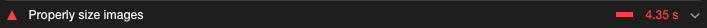

많은 이미지를 다루는 페이지의 경우, 이미지 최적화에 신경쓰지 않으면 사용자 경험 지표에서 많은 감점을 받기 쉽다.
LightHouse 기준, **적절한 이미지 사이즈 사용과 next-gen 포멧 이미지 사용**에 대한 개선 방향을 제시받게 된다.




사용자 경험 지표를 위한 플랫폼 친화적인 이미지를 응답받기 위한 인프라 구성을 기록해두려 한다.

### TL;DR

1. S3 버킷 생성, 샘플 이미지 업로드
2. CloudFront로 S3버킷 가리키기
3. 람다 함수에 부여할 IAM 역할 생성
4. 온디멘드 이미지, WebP 파일 형식 변환을 위한 Lambda 함수 생성 (w/ sharp.js)
5. Lambda@edge 트리거로 CloudFront Origin response 설정

### S3 버킷 생성, 샘플 이미지 업로드

버킷 생성 단계는 별 다른 주의사항 없이 **모든 퍼블릭 액세스 차단이 비활성화**된 S3 버킷을 생성하고,
생성한 버킷에 샘플 이미지를 업로드한다.


### CloudFront로 S3버킷 가리키기

CloudFront 배포를 생성한다. CloudFront에서 쿼리 문자열 파라미터 기반의 콘텐츠 캐싱이 가능하도록
**캐시 키 및 원본 요청**에서 Legacy cache settings 선택, 콘텐츠 캐싱에 사용할 **쿼리 문자열을 설정**한다.


### 람다 함수에 부여할 IAM 역할 생성

람다 함수에 권한을 부여해야 한다. **IAM 콘솔에서 역할을 생성**한다. AWS 서비스 / Lambda를 선택하고 다음 단계로 넘어간다.


다음 단계에서, **정책 생성**을 클릭하고, JSON 편집을 통해 아래와 같은 정책을 부여한다.

```json
{
  "Version": "2012-10-17",
  "Statement": [
    {
      "Sid": "VisualEditor0",
      "Effect": "Allow",
      "Action": [
        "iam:CreateServiceLinkedRole",
        "lambda:GetFunction",
        "lambda:EnableReplication",
        "cloudfront:UpdateDistribution",
        "s3:GetObject",
        "logs:CreateLogGroup",
        "logs:CreateLogStream",
        "logs:PutLogEvents",
        "logs:DescribeLogStreams"
      ],
      "Resource": "*"
    }
  ]
}
```

정책 이름을 설정하고, 정책 생성을 완료한다. 완료 후 다시 IAM 역할 생성으로로 돌아가, **생성한 정책을 연결**한다.


역할에 신뢰관계를 추가한다. **역할 / 신뢰 관계/ 신뢰 관계 편집**을 선택하고, JSON을 편집한다.

```json
{
  "Version": "2012-10-17",
  "Statement": [
    {
      "Effect": "Allow",
      "Principal": {
        "Service": ["edgelambda.amazonaws.com", "lambda.amazonaws.com"]
      },
      "Action": "sts:AssumeRole"
    }
  ]
}
```

### 온디멘드 이미지, WebP 파일 형식 변환을 위한 Lambda 함수 생성 (w/ sharp.js)

람다 함수를 생성할 때, 람다 트리거를 CloudFront로 설정하기 위해 지역은 **버지니아 북부**로 설정하여 생성한다.


권한 설정에서 기존에 생성한 역할을 설정한다.


이후 생성된 람다에 코드 업로드한다. 코드는 [AWS Lambda@Edge에서 실시간 이미지 리사이즈 & WebP 형식으로 변환](https://medium.com/daangn/lambda-edge%EB%A1%9C-%EA%B5%AC%ED%98%84%ED%95%98%EB%8A%94-on-the-fly-%EC%9D%B4%EB%AF%B8%EC%A7%80-%EB%A6%AC%EC%82%AC%EC%9D%B4%EC%A7%95-f4e5052d49f3)
를 참고하여 구현하고 zip파일로 압축 후 업로드한다.


람다 함수 상단 메뉴 작업 / Lambda@edge 배포를 선택한다. 오리진 응답으로 설정하는 이유는
클라이언트에서 들어온 요청이 CloudFront로 전달되고, 이 때 요청된 쿼리에 대한 콘텐츠가 캐싱되어 있지 않으면,
S3로 Origin Request가 전달되고, S3에서 응답받은 이미지를 통해 전처리가 필요하기 때문에 Origin response로 설정한다.


### 테스트 클라이언트 구성

[image-ondemand-resizing](https://github.com/youthfulhps/image-ondemand-resizing)


