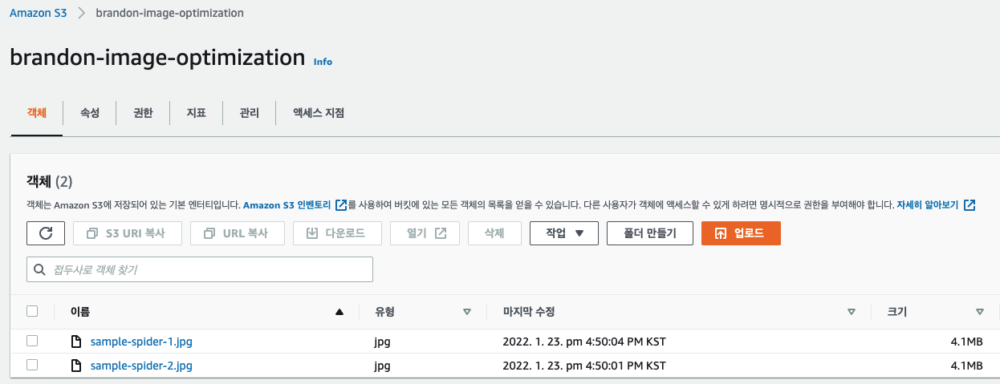
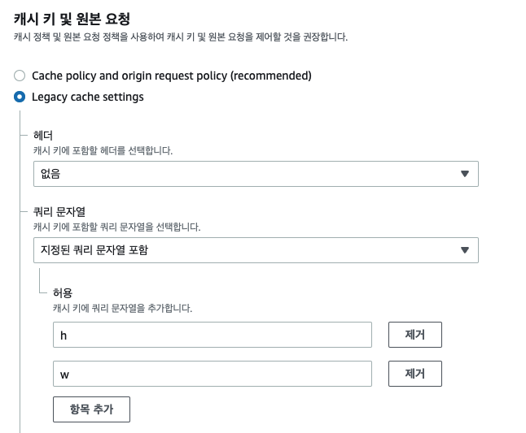
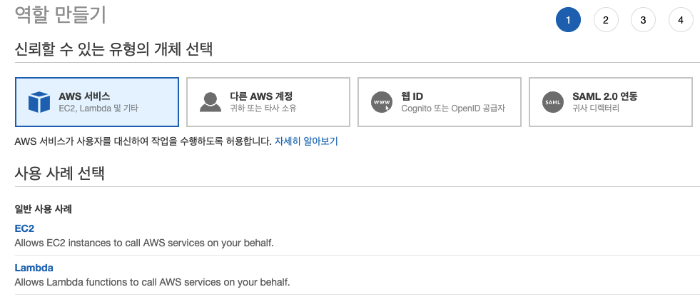
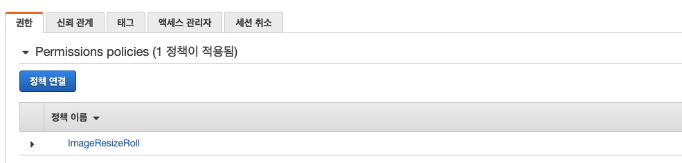
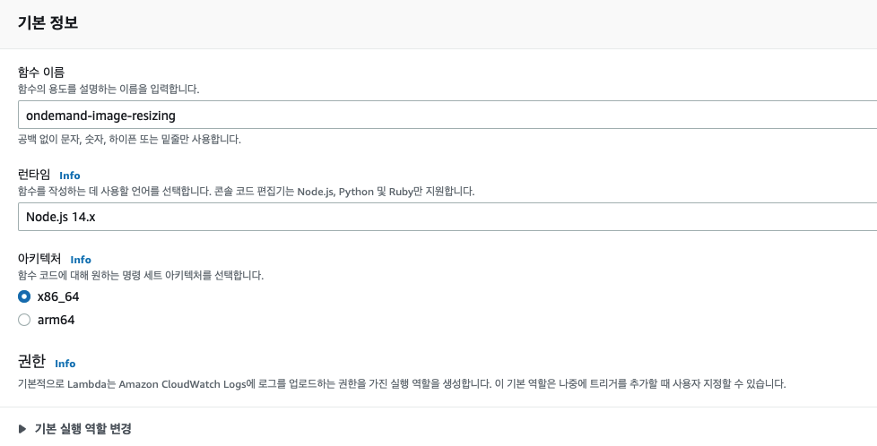
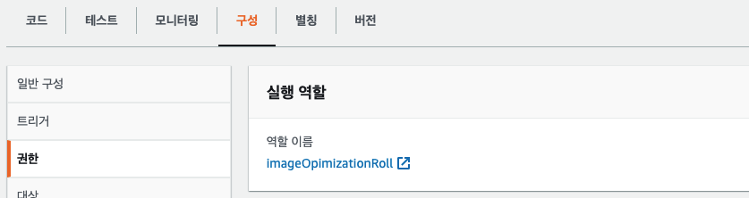
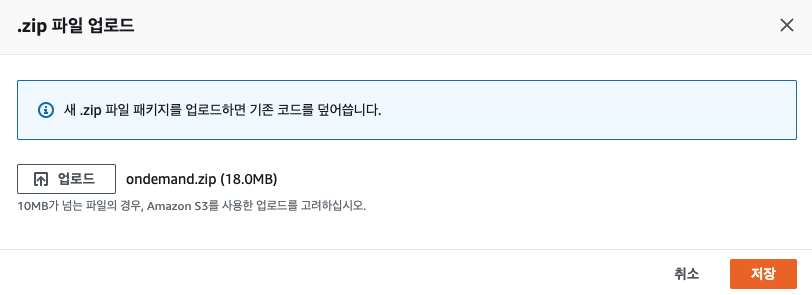
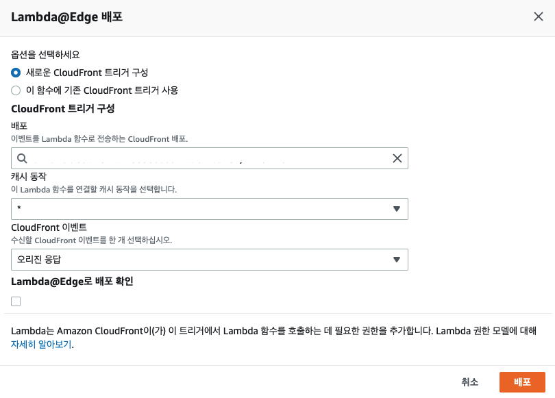

<blockquote class="warning">작성한 지 2년이 지난 글이에요. 지금과는 맞지 않을 수도 있지만, 당시의 고민과 노력이 담겨있습니다.</blockquote>

[사용자 경험 품질 향상을 위한 이미지 최적화](https://youthfulhps.dev/web/image-optimization/)에 이어
이번 글에서는 온디멘드 이미지 리사이징을 위한 인프라 구현 과정을 정리해보려 한다.

## TL;DR

1. `S3` 버킷을 생성하고 이미지를 업로드한다.
2. `CloudFront`를 통해 `S3` 컨텐츠를 배포한다.
3. 라시아징, `webp` 파일 형식 변환을 위한 노드 환경 람다 함수를 구현한다.
4. 버킷 접근 권한 및 역할을 담은 `IAM`을 정의하고 람다 함수에 부여한다.
5. `CloudFront`의 오리진 응답 엣지에 람다 함수를 연동한다.

### S3, 샘플 이미지 업로드

`모든 퍼블릭 엑세스 차단이 비활성화`되어 있는 `S3` 버킷을 생성하고 샘플 이미지 객체를 업로드한다.



### CloudFront, S3 컨텐츠 배포

`CloudFront` 배포를 생성한다. 기본적으로 `CloudFront`는 쿼리 문자열을 무시하게 되는데,
쿼리 문자열 파라미터 기반의 컨텐츠 캐싱이 가능하도록 `캐시 키 및 원본 요청`에서
`Lagacy cache settings`를 선택하여 컨텐츠 캐싱에 사용할 `쿼리 문자열을 설정`을 진행한다.

쿼리 문자열은 이미지 변환에 대한 설정을 전달하기 위한 역할로서
`너비, 높이, 이미지 핏, webp 변환` 에 대한 설정값을 담을 수 있다.
또한, `쿼리 문자열 파라미터 기반의 컨텐츠 캐싱` 이라는 특징에 따라, 동일한 쿼리 조합의 요청에 대한
리사이징된 컨텐츠가 `CloudFront`에 캐싱되어 있다면, 원본 버킷까지 오리진 요청이 전달되지 않고,
`CloudFront`에서 뷰어 응답으로 빠르게 컨텐츠를 반환할 수 있다.

```
https://...cloudfront/sample-image.jpg?w=500&h=300
```



### 람다 함수에 부여할 IAM 역할 생성

람다 함수에서 `S3` 객체에 접근할 수 있도록 `s3:GetObject`와 같은 권한을 부여해준다.
IAM 콘솔에서 역할을 생성, `AWS 서비스 / Lambda`를 선택하고 넘어간다.



다음 단계에서는 `정책 생성` 을 통해 JSON 편집을 통해 권한을 편집한다.
(예시 프로젝트를 위한 퍼블릭한 권한입니다.)

```json
{
  "Version": "2012-10-17",
  "Statement": [
    {
      "Sid": "VisualEditor0",
      "Effect": "Allow",
      "Action": [
        "iam:CreateServiceLinkedRole",
        "lambda:GetFunction",
        "lambda:EnableReplication",
        "cloudfront:UpdateDistribution",
        "s3:GetObject",
        "logs:CreateLogGroup",
        "logs:CreateLogStream",
        "logs:PutLogEvents",
        "logs:DescribeLogStreams"
      ],
      "Resource": "*"
    }
  ]
}
```

`정책 이름` 을 설정하고, `정책 생성` 을 완료했다면, `IAM` 탭으로 돌아가
람다 함수에게 실행 역할 즉, AWS 서비스 및 리소스에 접근할 수 있는 엑세스 권한을 `정책 연결`을 통해 제공합니다.



`역할 / 신뢰 관계 / 신례 관계 편집` 을 선택하여 마찬가지로 JSON 편집을 통해 역할에 신뢰 관계를 추가합니다.

```json
{
  "Version": "2012-10-17",
  "Statement": [
    {
      "Effect": "Allow",
      "Principal": {
        "Service": ["edgelambda.amazonaws.com", "lambda.amazonaws.com"]
      },
      "Action": "sts:AssumeRole"
    }
  ]
}
```

### 온디멘드 이미지, WebP 파일 형식 변환을 위한 Lambda 함수 생성 (w/ sharp.js)

람다 함수를 생성한다. 이때 람다 트리거를 `CloudFront`로 설정할 수 있는 지역은
`버지니아 북부`만 가능하기 때문에 지역을 변경하고 람다 함수를 생성한다.



`권한 / 구성` 탭에서 생성한 IAM 역할을 설정한다.



이제, 람다 함수 대시보드로 이동하여 이미지 리사이징, webp 포맷팅 적용을 위한 코드를 업로드한다.
코드는 [AWS Lambda@Edge에서 실시간 이미지 리사이즈 & WebP 형식으로 변환](https://medium.com/daangn/lambda-edge%EB%A1%9C-%EA%B5%AC%ED%98%84%ED%95%98%EB%8A%94-on-the-fly-%EC%9D%B4%EB%AF%B8%EC%A7%80-%EB%A6%AC%EC%82%AC%EC%9D%B4%EC%A7%95-f4e5052d49f3)를 참고하고 약간의 수정을 더하여 작성하였는데, 위 글에서도 잘 정리되어 있지만, 구현하면서 짚고 넘어가야 될 부분들이 몇 가지 있다.

**노드 환경에서 동작하는 람다 머신이 별도로 가지고 있지 않은 모듈은 직접 `node_modules` 폴더를 함께 압축하여 제공해주어야 한다.**
`querystring`, `aws-sdk`를 포함한 몇 가지 의존성을 제외하고는 의존성 해결을 위한 별도의 설치 과정이 포함되어 있지 않다.

```js
// Dependencies resolved

const querystring = require('querystring');
const AWS = require('aws-sdk');
```

**람다 함수에서 바디를 조작했다면, 그 결과가 1MB 이하여야 한다.** 만약 1MB 보다 크다면, 이미지의 퀄리티를 단계적으로 낮추는 방법으로 접근했다.

```js
const MEGABYTE = 1046528;
const byteLength = Buffer.byteLength(resizedImage, 'base64');

if (byteLength > MEGABYTE) {
  resizedImage.toFormat(requiredFormat, { quality: 90 });
}
```

**퀄리티 저하의 한계점을 넘어가거나, 타임 아웃이 되면 원본을 반환한다.**
1MB 제약을 지키기 위해서 변환 과정이 너무 오래 걸리거나, 이미지 퀄리티가
너무 저하되는 경우 원본을 반환하도록 했다.

이제 비즈니스에 맞게 코드를 수정하고, `node_modules` 와 함께 압축된 코드 업로드를 마치셨다면,
람다 함수 상단 메뉴 `작업 / Lambda@edge 배포`를 선택한다.



`CloudFront` 이벤트는 `오리진 응답`에 설정한다. 이후 람다 함수를 배포한다.



## 마치면서

단순히 코드 레벨과 물리적인 대응 방안을 고민하는 단계에서 더 넓은 접근 방식을 배울 수 있었던 좋은 경험이었다. 이미지 리사이징, webp 포맷팅이 잘 적용되는 지 확인해보실 수 있는 간단한 [프로젝트](https://github.com/youthfulhps/image-ondemand-resizing)를 구성해두었으니 경험해보실 수 있다.

## Reference

https://medium.com/daangn/lambda-edge로-구현하는-on-the-fly-이미지-리사이징-f4e5052d49f3
