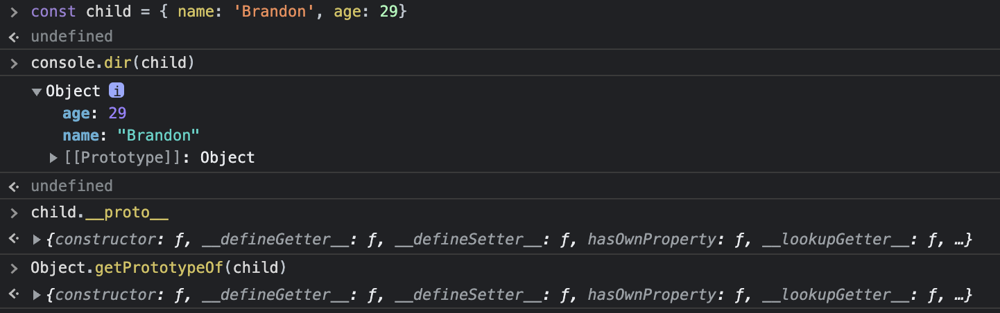
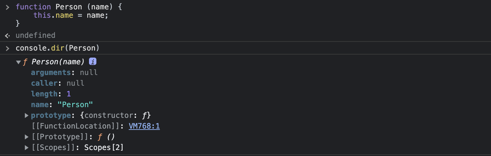
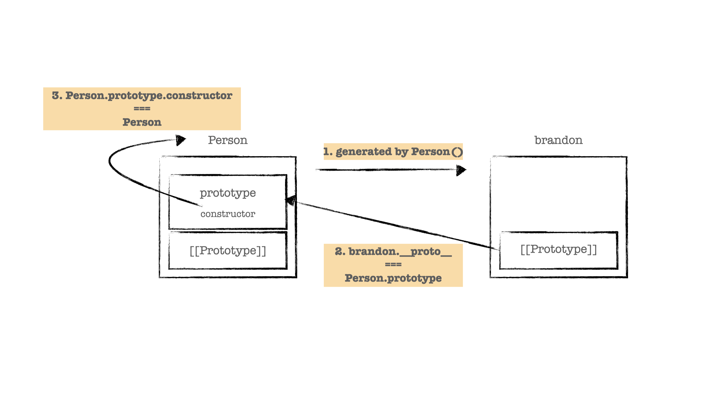
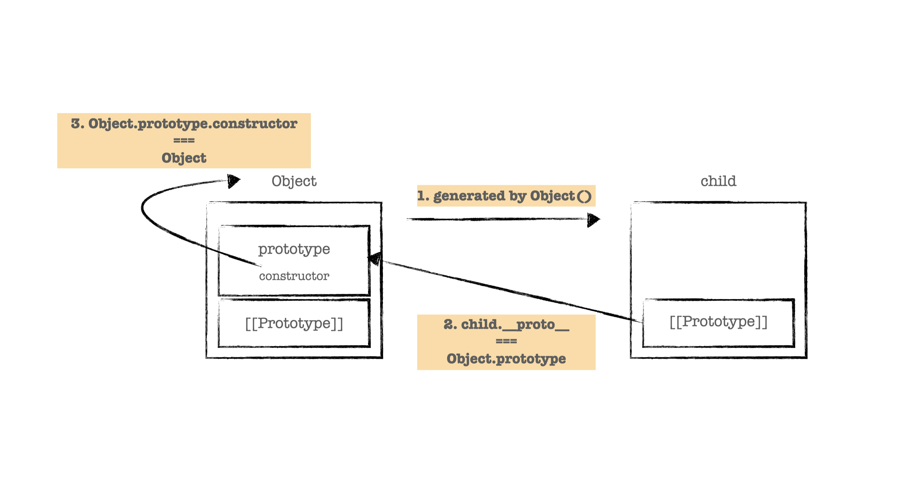
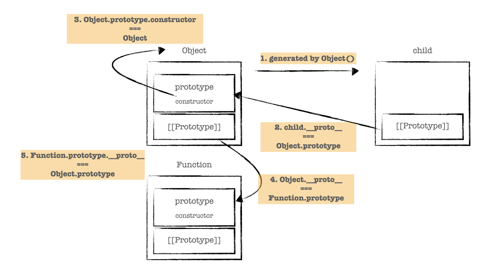
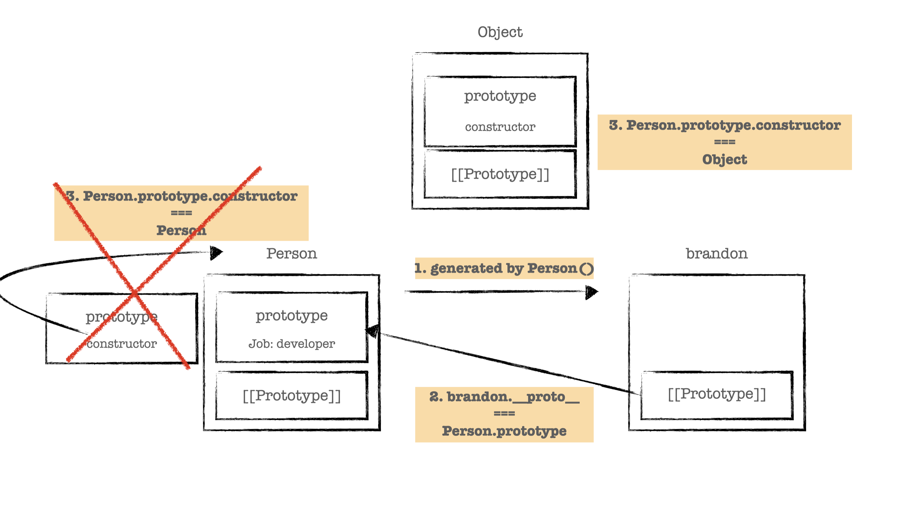

자바스크립트는 프로토타입 기반의 객체 지향 프로그래밍 언어입니다. 개인적으로 프로토타입에 대한 큰 그림을 이해하고 있다고 생각했는데,
이직을 준비하면서 프로토타입만 마주하면 작아지는 제 모습을 보게 됩니다.

자연스레 프로토타입 객체로부터 상속받은 메서드를 사용하면서도, 직접 프로토타입 객체를 다룰 기회는 적었는데요.
어쩌면 가장 익숙하지만 낯선 프로토타입 기반을 다시금 공부해보려 합니다.


## 객체, 그리고 프로토타입 객체

자바스크립트의 모든 객체는 자신의 부모격이 되는 객체와 연결되어 있습니다. 그리고, 자식 객체는 부모격이 되는 객체의 프로퍼티와 메서드를
마치 자신의 프로퍼티와 메서드처럼 사용할 수 있습니다. 객체 지향의 상속과 같은 패턴이죠!
자식 객체는 `hasOwnProperty` 메서드가 없음에도 호출할 수 있는 것처럼요. **여기서, 부모격이 되는 객체를 프로토타입 객체라 부릅니다.**

```js
const child = {
  name: 'Brandon',
  age: 29,
}

console.log(child.hasOwnProperty('name')) // true
```

## [[Prototype]]

자식 객체는 어떻게 부모 객체의 프로퍼티와 메서드에 문제없이 접근하고 상속받을 수 있을까요? 자바스크립트의 모든 객체는 `[[Prototype]]` 이라는 인터널 슬롯을 가지고 있고, 이를 통해 부모 객체를 참조하고 있어서 `[[Prototype]]` 객체의 데이터 프로퍼티를 상속받을 수 있게 됩니다.

`[[Prototype]]` 은 `__proto__` 접근자 프로퍼티로 접근할 수 있는데, 이는 `Object.getPrototypeOf()` 가 내부적으로 호출되어 프로토타입 객체를 반환해준다고 합니다.



## prototype 프로퍼티

**함수 객체는 일단 객체와는 달리, `prototype` 프로퍼티를 소유하고 있습니다.** 물론 `[[Prototype]]` 도 가지고 있죠.

여기서, **`prototype` 프로퍼티는 함수가 생성자 함수로서 호출되어 새롭게 객체를 생성할 때 생성된 객체의 프로토타입 객체를 가리키고 있습니다.**
쉽게 설명하자면, 새롭게 생성된 객체에게 프로토타입 객체를 참조할 수 있도록 전달해주는 역할을 합니다.



```js
function Person(name) {
  this.name = name
}

const brandon = new Person('brandon')

console.log(brandon.hasOwnProperty('prototype')) // false
console.log(Person.hasOwnProperty('prototype')) // true

console.log(Person.prototype === brandon.__proto__) // true
```

## constructor 프로퍼티

프로토타입 객체는 `constructor` 라는 프로퍼티를 가지고 있습니다. **`constructor` 프로퍼티는 객체의 입장에서 자신을 생성한 객체를 가리키게 됩니다.**
가령, brandon 객체의 프로토타입 객체의 `constructor` 프로퍼티는 `Person` 생성자 함수를 가리키게 되는데요. 아래와 같은 전개를 통해 참조됩니다.

- `Person` 생성자 함수를 통해 `brandon` 객체가 생성된다.
- `brandon` 객체의 프로토타입 객체는 `Person.prototype` 이다.
- `brandon` 객체의 프로토타입 객체 `Person.prototype` 의 `constructor` 프로퍼티는 자신을 생성한 객체 즉, `Person`을 가리킨다.



```js
function Person(name) {
  this.name = name
}

//Person 생성자 함수를 통해 brandon객체가 생성된다.
const brandon = new Person('Brandon')

//brandon 객체의 프로토타입 객체는 Person.prototype이다.
console.log(brandon.__proto__ === Person.prototype)

//brandon 객체의 프로토타입 객체 Person.prototype의 constructor 프로퍼티는 자신을 생성한 객체
//즉, Person을 가리킨다.
console.log(Person.prototype.constructor === Person)

// brandon 객체를 생성한 객체는 Person() 생성자 함수이다.
console.log(brandon.constructor === Person)

// Person() 생성자 함수를 생성한 객체는 Function() 생성자 함수이다.
console.log(Person.constructor === Function)
```

## 프로토타입 체인

자바스크립트는 특정 객체의 프로퍼티나 메서드에 접근하려고 할 떄 해당 객체에 접근하려는 프로퍼티 또는 메서드가 없다면,
`[[Prototype]]` 이 가리키는 링크를 따라 자신의 부모 객체, 즉 프로토타입 객체의 프로퍼티 또는 메서드를 검색하게 됩니다.
**이러한 상속 개념의 패턴을 구현하기 위한 매커니즘이 프로토타입 체인이라 합니다.** 변수를 검색하는 메커니즘인
실행컨텍스트의 스코프체인과 유사한 역할과 동작을 띄고 있네요.

상단의 예시에서 `child` 라는 객체는 `hasOwnProperty` 메서드를 가지고 있지 않지만, 호출이 가능했던 것은 `[[Prototype]]` 이 링크를 따라
`Object.prototype` 를 참조하여 `hasOwnProperty` 메서드를 호출한 동작에 대한 근거가 됩니다.

```js
const child = {
  name: 'Brandon',
  age: 29,
}

//child 객체는 hasOwnProperty 메서드를 가지고 있지 않지만, 호출이 가능하다.
console.log(child.hasOwnProperty('name')) // true

//child 객체의 프로토타입 객체는 Object.prototype이다.
console.log(child.__proto__ === Object.prototype) // true

//Object.prototype은 hasOwnProperty 메서드를 소유하고 있다.
console.log(Object.prototype.hasOwnProperty('hasOwnProperty')) // true
```

## 프로토타입 체인의 종점

그렇다면, **프로토타입 체인의 마지막 링크는 어떤 객체를 가리키고 있을까요?**
사실, 이 질문은 프로토타입을 깊게 이해하기 전 면접에서 받았던 질문인데요. 제가 프로토타입을 깊게 공부하도록 만든 질문이기도 합니다.

우선, 객체를 어떻게 생성하는 지부터 이야기해볼까요? 쉽게 객체를 정의할 수 있는 객체 리터럴 방식, 생성자 함수 그리고 `Object()` 생성자 함수로
객체를 정의합니다. 여기서 **객체 리터럴 방식은 결국 `Object()` 생성자 함수로 생성하는 것을 단순화한 축약 표현**이니, 내부적으로는 생성자 함수 그리고 `Object()` 생성자 함수를
통해 객체를 정의한다고 볼 수 있겠네요.

`Object()` 생성자 함수도 함수이니, `prototype` 프로퍼티를 소유하고 있습니다. 즉, 아래와 같이 참조가 전개됩니다.



프로토타입 체인을 따라서 더 올라가볼까요? `Object()` 생성자 함수 또한 `[[Prototype]]` 를 가지고 있고 다음과 같이 참조가 전개됩니다.

- `Object` 생성자 함수를 통해 `child` 객체가 생성된다.
- `child` 객체의 프로토타입 객체는 `Object.prototype` 이다.
- `child` 객체의 프로토타입 객체 `Object.prototype` 의 `constructor` 프로퍼티는 자신을 생성한 객체 즉, `Object` 생성자 함수를 가리킨다.
- `Object.__proto__` 는 `Function.prototype` 이다.
- `Function.prototype.__proto__` 는 `Object.prototype` 이다.



```js
// Object 생성자 함수를 통해 child 객체가 생성된다.
const child = {
  name: 'Brandon',
}

// child 객체의 프로토타입 객체는 Object.prototype이다.
console.log(child.__proto__ === Object.prototype)

// child 객체의 프로토타입 객체 Object.prototype의 constructor 프로퍼티는 자신을 생성한 객체
//즉, Object 생성자 함수를 가리킨다.
console.log(Object.prototype.constructor === Object)

// Object.__proto__ 는 Function.prototype이다.
console.log(Object.__proto__ === Function.prototype)

// Function.prototype.__proto__ 는 Object.prototype이다.
console.log(Function.prototype.__proto__ === Object.prototype)
```

이번엔 객체를 생성하는 또 다른 방법으로 **생성자 함수를 통해 생성된 객체의 프로토타입 체인에 대한 전개를 확인해 보겠습니다.**

우선, 생성자 함수를 선언하는 단계부터 간단하게 알아보자면, 함수 선언식, 표현식 그리고 `Function()` 생성자 함수를 통해 함수를 선언할 수 있습니다.
함수 표현식은 가시적으로도 함수 리터럴 방식을 사용하고 있습니다. **함수 선언식의 경우 자바스크립트 엔진이 내부적으로 함수 기명 표현식으로 변환되어 사용됩니다.
즉, 함수 선언식, 표현식 모두 함수 리터럴 방식을 사용하고 있다고 할 수 있습니다.**

여기서 함수 리터럴 방식은 `Function()` 생성자 함수를 통해 함수를 선언하는 것을 단순화한 표현이니, 결국 함수 선언 방법 세 가지는 모두 `Function()` 생성자 함수를
통해 선언되는 것과 같습니다. 그럼, `Function()` 생성자 함수의 프로토타입 체인이 어떻게 전개되는 지 보겠습니다.

- `Person` 생성자 함수를 통해 `brandon` 객체가 생성된다.
- `brandon` 객체의 프로토타입 객체는 `Person.prototype` 이다.
- `Person` 생성자 함수의 프로토타입 객체는 `Function.prototype` 이다.
- `Function.prototype` 의 프로토타입 객체는 `Object.prototype` 이다.

```js
function Person(name) {
  this.name = name
}

// Person 생성자 함수를 통해 brandon 객체가 생성된다.
const brandon = new Person('Brandon')

// brandon 객체의 프로토타입 객체는 Person.prototype이다.
console.log(brandon.__proto__ === Person.prototype)

// Person 생성자 함수의 프로토타입 객체는 Function.prototype이다.
console.log(Person.__proto__ === Function.prototype)

// Function.prototype의 프로토타입 객체는 Object.prototype이다.
console.log(Function.prototype.__proto__ === Object.prototype)
```

객체 선언 방식에 대한 프로토타입 체인을 거슬러 올라가 봤는데요. 객체 리터럴, 생성자 함수 방식이나 결국은 **모든 객체의 부모 객체인 `Object.prototype` 객체에서
프로토타입 체인이 끝나는 것을 확인할 수 있습니다. 그래서, 모든 객체의 프로토타입 체인의 종점은 `Object.prototype` 객체가 됩니다.**

## 프로토타입 체인의 동작

프로토타입 체인은 객체의 프로퍼티를 참조할 때 해당 객체에 프로퍼티가 없는 경우 프로토타입 체인이 동작합니다.
만약, 객체의 프로퍼티에 값을 할당하는 경우는 프로퍼티가 있다면 재할당을, 프로퍼티가 없다면 동적으로 할당되어 참조가 가능하기 때문에
이런 경우에는 프로토타입 체인이 동작하지 않습니다.

```js
function Person(name) {
  this.name = name
}

Person.prototype.job = 'junior developer'

const brandon = new Person('Brandon')
const max = new Person('Max')

max.job = 'senior developer'

console.log(brandon.job)
console.log(max.job)
```

## 프로토타입 객체의 확장

위의 예제를 보면, `Person.prototype` 에 'job'이라는 새로운 프로퍼티를 추가한 것을 확인할 수 있습니다.
프로토타입 객체는 객체이기 때문에 프로토타입 체인에 즉시 반영되는 프로퍼티를 추가/삭제할 수 있습니다.

```js
function Person(name) {
  this.name = name
}

const brandon = new Person('Brandon')

Person.prototype.sayName = function() {
  console.log(this.name)
}

brandon.sayName()
```

추가적으로, 자바스크립트에는 객체 이외에도 기본형 값들에 대한 원시 타입이 존재합니다. 기본형들은 불면이며 메서드를 가지지 않는다는 점에서
객체와 구분되는데, 기본형인 `string` 의 경우 메서드를 가지고 있는 것처럼 동작합니다.

```js
'primitive'.charAt(3) // "m"
```

charAt은 분명 기본형 `string` 의 메서드가 아니지만, 자바스크립트는 기본형과 객체 타입을 서로 자유롭게 변환합니다.
만약, 기본형에서 `charAt` 에 접근하게 되면 자바스크립트는 기본형을 `String` 객체로 래핑하고, 메서드를 호출하고 마지막에 래핑할 때 사용했던 객체를
버립니다. **즉, 원시 타입으로 프로퍼티나 메서드를 참조하면 관련된 객체를 래핑하여 프로토타입 객체를 공유하게 됩니다.**

결론적으로, 원시 타입을 확장하고자 한다면 객체가 아닌 원시 타입에 프로퍼티나 메서드를 추가할 수는 없지만, 원시 타입과 관련된 객체의 프로토타입에 프로퍼티나 메서드를 추가하면 원시 타입에서도 공유받아 사용할 수 있게 됩니다.

```js
const str = 'string'

str.sayValue = function() {
  console.log('string')
}

str.sayValue() // TypeError: str.sayValue is not a function
```

```js
const str = 'string'

String.prototype.sayValue = function() {
  console.log('string')
}

str.sayValue() // "string"
```

## 프로토타입 객체의 변경

프로토타입 객체는 결정된 프로토타입 객체를 임의로 다른 객체로 변경할 수 있는데요. 프로토타입 객체의 변경 시점을 기준으로
이전에 생성된 객체는 기존 프로토타입 객체에, 이후에 생성된 객체는 변경된 프로토타입 객체에 바인딩되는 것을 주의해야 합니다.

프로토타입 객체가 변경이 되면, `Person` 생성자 함수의 프로토타입 객체가 일반 객체로 변경되면서, `Person.prototype.constructor` 가
제거되고, 프로토타입 체이닝에 의해 `Object.prototype.constructor` 인 `Object` 생성자 함수로 변경이 됩니다.



프로토타입 객체를 임의로 변경해야 하는 일이 있을 지는 의문이지만, 사이드 이펙트는 없을 지 걱정부터 됩니다.

## 마치면서

가장 익숙한 것이 낯설게 느껴지는 프로토타입에 대한 공부가 아니었나 싶습니다. 전개를 쉽게 이해하고자 그림을 그려가면서 표현을 해봤는데요.
정확하게 표현을 한 것인지 잘못된 부분은 없는 지 다시 한번 확인해보면서 자주 꺼내볼 수 있는 글을 적게되어 매우 뿌듯합니다 :)
글에서 잘못된 이해로 인해 표현이 적절하지 않은 부분이 있다면 언제든 지적해주시면 감사하겠습니다.

## Reference

- [https://poiemaweb.com/js-prototype](https://poiemaweb.com/js-prototype)
