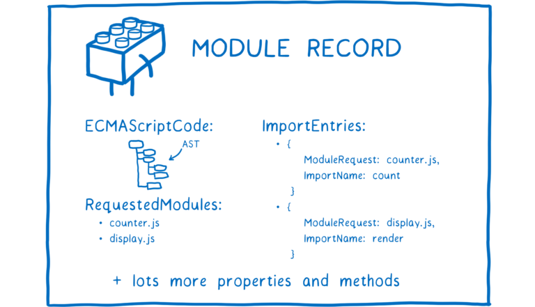
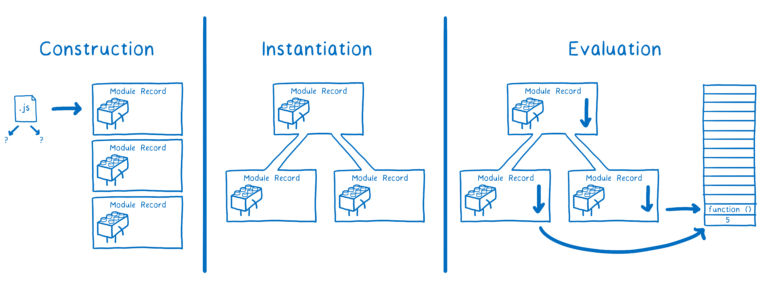

최근 라이브러리를 제작하면서 CommonJS와 ECMAScript 모듈 시스템(이하 ESM)에 대한 모듈 시스템 포맷이 혼란스러웠던 기억이 있다. 패키지를 빌드할 떄 각각의
모듈 시스템을 사용하는 포맷으로 빌드 결과물을 만들어 주어야 했는데, 사실 `import`, `require` 등 구문 정도의 차이를 이해했을 뿐 모듈 시스템의 구조적인
차이나 `node.js`에서 ESM을 지원하기 시작했다는 것이 라이브러리 제작자에게 주는 파장에 대해 크게 고민해본 적이 없었기 때문일 것이다.

특히나 최신 프론트엔드 개발 환경에 익숙한 개발자라면 ESM을 일상적으로 사용하고 있어 가령 `require`이 번들링에 어떤 영향을 끼치는 지 궁금해 하기란 사실 쉽지 않다고 생각한다.
그러나, CommonJS는 자바스크립트의 구동 환경 확장을 위한 거대한 제안의 결과물이자 `node.js`가 처음으로 선택한 모듈 시스템이기 때문에 한번쯤 들여다볼 가치가 충분하다.

아직도 많은 갑을논박이 이루어지고 있는 자바스크립트 모듈 시스템에 대해 하나씩 살펴보자.

## 자바스크립트, 구동 환경 확장을 위한 행보

웹 브라우저의 동적인 조작을 구사하기 위해 탄생한 자바스크립트는 브라우저와 함께 성장과 인기를 얻게 되었다.
이에 따라 브라우저 뿐만 아니라 더 다양한 환경에서 자바스크립트를 사용하고자 원하는 니즈도 함께 커지게 된다.

Kevin Dangoor는 자신의 블로그를 통해 자바스크립트를 다른 환경에서 사용하기 위해선 먼저 자바스크립트의 다양한 부분에 있어
표준화가 필요하다는 것을 지적한다.

[What Server Side JavaScript needs](https://www.blueskyonmars.com/2009/01/29/what-server-side-javascript-needs/) 에는
자바스크립트의 표준 라이브러리, 인터페이스, 패키지 매니저, 그리고 오늘의 주제인 모듈 시스템의 부재를 언급하면서
끝으로 오늘날 `CommonJS`라 불리는 모듈 시스템을 제작하기 위한 그룹을 결성하게 되었다.

## CommonJS

> javascript, not just for browsers any more!

CommonJS는 자바스크립트를 브라우저 뿐만 아니라, 서버사이드를 포함한 다양한 환경에서 범용적으로 사용할 수 있도록
Modules, Binary strings and buffers, File system interface 등 [다양한 기능](https://arstechnica.com/information-technology/2009/12/commonjs-effort-sets-javascript-on-path-for-world-domination/)
들을 표준화했고, 이때 제작된 모듈 시스템은 `node.js` 에서 자바스크립트에서 패키지를 불러올 때 사용되는 근본적인
모듈 시스템이 된다.

### 모듈 불러오기

CommonJS에서 제공하는 `require` 함수를 통해 모듈을 불러올 수 있다. `require`은 함수이기 때문에 동적으로
조건문 안에서 불러올 수 있다.

```js
// import
const math = require('math.js');

if (condition) {
  const square = require('square.js');
  square.area(3);
}

math.add(1, 2);
```

### 모듈 내보내기

CommonJS는 모듈 각각의 독립적인 실행 영역과 스코프를 유지한채 `module.exports`나 축약된 숏컷인 `exports`를 통해
모듈을 내보낼 수 있다.

```js
const { PI } = Math;

function add(a, b) {
  return a + b;
}

function subtract(a, b) {
  return a - b;
}

function circumference(r) {
  return 2 * PI * r;
}

module.exports.add = add;
module.exports.subtract = subtract;
exports.circumference = circumference;

console.log(module.exports === exports); // true
```

### module.exports와 exports

모듈을 내보내는 코드에서 `module.exports`와 `exports`가 예시를 위해 함께 사용된 것을 볼 수 있다. 이 둘의 차이가 있을 까 싶지만,
[node.js#exports](https://nodejs.org/api/modules.html#exports) 문서에서 알 수 있듯 `exports`는 `module.exports`의 축약된 숏컷이다.

즉 `exports`는 초기에 `module.exports`가 참조하고 있는 동일한 객체를 바라보고 있어 위와 같이 객체에 새로운 키를 추가하여 함수나 객체를 할당하는 것은 어느 쪽을
사용해도 동일한 결과를 얻는다.

여기서 주의해야할 점은 `exports`나 `module.exports`에 새로운 함수나 객체를 할당하여 내보내는 경우이다. 다음과 같이 `Square` 클래스를 `module.exports`
에 할당하여 내보낸다면, `module.exports`는 할당된 대상의 참조값을 가리키게 되어 `exports`와 다른 참조값을 가리키게 된다.

```js
module.exports = class Square {
  constructor(width) {
    this.width = width;
  }

  area() {
    return this.width ** 2;
  }
};

console.log(module.exports === exports); // false
```

그러나 이러한 내보내기 방식은 구현상 문제가 없다. 모듈을 불러오는 `require` 함수는 `module.exports`를 반환하기 때문이다.

```js
function require() {
  // ...
  return module.exports;
}

const Square = require('./Square.js');
console.log(Square); // [class Square]
```

문제는 아래와 같이 `exports`에 새로운 대상을 할당해서 내보내는 경우이다.

```js
const { PI } = Math;

exports = class Circle {
  constructor(r) {
    this.radius = r;
  }

  circumference() {
    return 2 * PI * this.radius;
  }
};

console.log(module.exports === exports); // false
```

`export`에 새로운 값을 할당한다면, 초기에 `module.exports`를 가리키고 있었던 `exports`의 참조가 변경될 뿐 `require`이 반환하는 `module.exports`과는
무관한 변경이기 때문에 의도한 대로 모듈을 불러올 수 없다.

```js
const Square = require('./Square.js');
console.log(Square); // [class Square]

const Circle = require('./Circle.js');
console.log(Circle); // {}
```

결론적으로 `exports`를 통한 내보내기가 정상적으로 동작한다 하더라도, `module.exports`를 사용하는 것이 안전하다.

### module wrapper

node.js에서 모듈을 구성할 때 module wrapper 함수를 통해 모듈 내의 코드를 래핑한다. 이는 Math의 `PI`와 같이
모듈에서 내보내지 않은 값들을 지역 변수로 은닉하여 글로벌 객체에 등록되는 것을 막음과 동시에
module wrapper 함수의 매개변수들을 통해 글로벌 객체의 값들을 참조할 수 있게 된다.

```js
(function(exports, require, module, __filename, _dirname) {
  // ... (모듈 코드)
});
```

### 동기적인 모듈 실행

commonjs는 모듈을 동기적으로 불러온다. 즉, 모듈을 하나씩 순서대로 불러오고 실행한다.

```js
// module1.js
console.log('모듈1 로딩!');

setTimeout(() => {
  console.log('모듈1 로드 완료 및 실행!');
}, 1000);

console.log('모듈1 실행 완료');
```

```js
// index.js
console.log('index 실행!');
const module1 = require('./module1');
console.log('index:...');
const module2 = require('./module2');

// index 실행!
// 모듈1 로딩!
// 모듈1 실행 완료
// index:...
// 모듈2 로딩!
// 모듈2 실행 완료
// index 종료!
// 모듈1 로드 완료 및 실행!
// 모듈2 로드 완료 및 실행!
```

### 로드가 완료된 모듈은 캐싱된다

한번 로드가 완료된 모듈에 대해서 캐싱되고, 이후 같은 모듈 요청에 대해 캐싱된 값을 반환한다.

```js
// module1.js
console.log('모듈1 실행!');

module.exports = '모듈1';
```

```js
const module1 = require('./module1');
const module2 = require('./module1');
const module3 = require('./module1');

console.log(module1, module2, module3);

// 모듈1 실행!
// 모듈1 모듈1 모듈1
```

만약 캐싱을 지우고 싶다면, `require.cache`에 접근해 제거할 수 있다.

```js
const module1 = require('./module1');

delete require.cache[require.resolve('./module1')];

const module2 = require('./module1');
const module3 = require('./module1');

console.log(module1, module2, module3);

// 모듈1 실행!
// 모듈1 실행!
// 모듈1 모듈1 모듈1
```

### 트리쉐이킹의 한계

자바스크립트를 서버사이드에서 사용하기 위한 목적을 가지고 만들어진 CommonJS는 모듈 크기를 줄여야 한다는 접근이 크게 중요하지 않았지만,
브라우저에서도 이를 사용하기 시작하면서 모듈 크기가 성능에 많은 영향을 끼치게 된다.

하지만, `module.exports`의 객체라는 특성 때문에 런타임에 들어서야 모듈 평가가 이루어지는 CommonJS 시스템 구조상 참조되지 않은
참조 대상을 제거해도 되는지에 대한 가늠을 하기 어렵다.

번들러 차원에서 CommonJS 모듈 또한 트리쉐이킹 가능하도록 기능이나 플러그인들을 제공하는 경우도 있다. 웹팩의 경우
[webpack-common-shake](https://github.com/indutny/webpack-common-shake)와 같은 플러그인을 통해 어느 정도 제거할 수 있지만,
다음과 같은 제한 사항들이 포함되지 않아야 한다.

```js
// Dynamic exports
exports[Math.random()] = ...
// Overriding imported vars
var a = require('./a');
a.lib;
a = require('./b')
// Using require in unknown way
console.log(require('./lib'))
// Destructuring require dynamically
{ [prop]: name } = require('./a')
// Dynamic import
var fn = require('./lib')[Math.random()]
```

## node.js의 ESModule 지원

CommonJS를 채택한 node.js는 `--experimental-module` 플래그를 통해 실험적으로 ESModule을 지원하다가 [버전 13.2.0부터 안정적으로 지원](https://nodejs.org/api/esm.html#modules-ecmascript-modules)하기 시작했다.
CommonJS는 ECMA 표준의 지원없이 독립적으로 개발되었고, 태생적으로 브라우저 중심의 생태계에 적합하지 않을 수 있다는 이야기들이 반영된 것이다.
다만 ESModule이 CommonJS를 완전히 대신하지는 않았고 함께 지원한다.

흐름상 잠시 ESModule에 대해서 살펴보고 넘어가자.

## ESM (ECMAScript Modules)

ESM은 자바스크립트 표준을 다루는 ECMAScript 발표한 표준 모듈 시스템이다. 이는 자바스크립트 자체적으로 모듈에 대한 문법을 지원하게 된 것을 의미한다.
모던 브라우저 상에서 동작하는 어플리케이션을 개발을 하고 있다면 가장 익숙한 모듈 시스템이기 때문에 기본적인 모듈 사용 방식은 건너뛰고 동작 방식과 특징들을
살펴보자.

### 동작 방식

ESM은 구성, 인스턴스화, 평가 세 단계로 동작한다. 가장 먼저 불어와야 하는 모듈을 파악하기 위해 종속성 트리를 구성한다. 번들러의 진입점과 같이
그래프의 시작점이 되는 파일을 명시하고 시작점에서 `import` 구문을 따라가며 종속성 트리를 생성한다.

여기서 `import`가 가리키고 있는 파일 자체를 브라우저가 사용할 수 없기 떄문에 이를 [모듈 레코드(Module Record)](https://262.ecma-international.org/6.0/#sec-source-text-module-records)
로 변환한다. 이때 모듈 간 관계를 구조화해야 하기 때문에 모든 파일을 구문 분석한다.



[이미지 출처](https://hacks.mozilla.org/2018/03/es-modules-a-cartoon-deep-dive/)

다음으로 모듈 레코드를 코드와 상태를 담은 모듈 인스턴스로 변환한다. `import`된 모든 값을 할당할 메모리 공간을 찾고,
`export`, `import`가 가리키는 모듈의 실제 메모리를 가리키게 한다.
이와 같이 인스턴스화 단계를 마치면, 진입점으로 부터 시작되는 모든 모듈에 대한 인스턴스 그래프를 얻게 된다.

마지막으로 코드를 평가한다. 위에서 언급한 상태는 특정 시점의 변수의 실제 값들을 의미하는데, 코드를 실행함으로서 평가 시점에 얻어낼 수 있는 실제 값들을 메모리에
채운다.



[이미지 출처](https://hacks.mozilla.org/2018/03/es-modules-a-cartoon-deep-dive/)

위와 같은 세 과정은 각각 개별적으로, 비동기적으로 수행될 수 있될 수 있다.

### Read-only Live Binding

CommonJS는 정적 바인딩이 특징이다. 정적 바인딩이란 require을 통해 가져온 값의 복사본을 사용한다는 것으로 이는 불러온 모듈 내에서
내보내진 값의 변경이 발생해도 사용처에서는 변경된 값을 사용할 수 없다.

```js
// lib.js
var counter = 3;
function incCounter() {
  counter++;
}
module.exports = {
  counter: counter, // (A)
  incCounter: incCounter,
};
```

```js
// main.js
var counter = require('./lib').counter; // (B)
var incCounter = require('./lib').incCounter;

// The imported value is a (disconnected) copy of a copy
console.log(counter); // 3
incCounter();
console.log(counter); // 3

// The imported value can be changed
counter++;
console.log(counter); // 4
```

반면, ESM에서는 내보내진 모듈에서의 변경 사항이 불러와 사용된 곳에서도 반영된다. 이는 구동 방식의 인스턴스화 단계에서 `export`와 `import`가
모두 해당 메모리를 가리키도록 하는 작업이 수행되기 때문에 복사본이 아닌 메모리에 작성된 값을 읽어 사용한다.

```js
// lib.js
export let counter = 3;
export function incCounter() {
  counter++;
}
```

```js
// main.js
import { counter, incCounter } from './lib';

// The imported value `counter` is live
console.log(counter); // 3
incCounter();
console.log(counter); // 4

// The imported value can’t be changed
counter++; // TypeError
```

단, 위에서 `counter` 값을 수정할 때 `TypeError`가 발생하는 것처럼, 내보내는 모듈은 언제든지 해당 값을 변경할 수 있지만, 모듈을
가져오는 곳에서는 마치 `const`로 선언된 값처럼 변경할 수 없다.


[이미지 출처](https://hacks.mozilla.org/2018/03/es-modules-a-cartoon-deep-dive/)

### 정적 모듈 구조

ESM은 동기, 비동기적으로 모듈을 불러오는 것을 모두 지원하지만, 일반적으로 정적 모듈 구조를 가진다.
동적인 모듈 시스템 구조를 가지고 있는 CommonJS는 어떤 모듈을 불러왔고 내보냈는 지를 런타임에 파악할 수 있다. 반면 ESM은 정적인 구조를 가지고 있어 컴파일
어떤 모듈을 불러왔고 내보냈는 지에 대해 컴파일 단계에서 파악할 수 있다.

이러한 정적 구조는 ES6 구문에도 적용되어 있다. ESM 모듈에서의 `import`와 `export`는 최상위에서만 사용할 수 있으며 동적으로 모듈을 불러오고 내보낼 수 있는
CommonJS와의 큰 차이점이다.

```js
import foo from './foo';

if (condition) {
  import bar from './bar'; // SyntaxError
}

function exportModule() {
  export default 'baz'; // SyntaxError;
}

exportModule();
```

### 죽은 코드를 제거하고, 트리쉐이킹할 수 있다.

정적 모듈 구조가 다소 유연성이 떨어지는 것처럼 보이지만 동적 구조 대비 [다양한 이점](https://exploringjs.com/es6/ch_modules.html#static-module-structure)
을 취할 수 있다.

ESM은 정적으로 모듈을 평가하여 번들링 과정에서 죽은 코드를 제거할 수 있다. 브라우저에서는 서버사이드와는 달리 웹을 구성하는 모든 모듈을 불러와
사용해야 하기 때문에 모듈 크기의 최적화가 큰 영향을 끼치기 때문에 정의되었지만 참조되지 않은 함수나 주석/공백 제거와 같은 작업을 수행하여
최소한의 크기로 번들링하는 것이 중요하다.

CommonJS에서 트리쉐이킹을 위해 웹팩 플러그인을 예시로 들은 것처럼 모듈을 로드할 지에 대한 결정을 런타임에 하는 모듈 시스템에서 아예 불가능하다는 것은 아니다.
번들러마다 각자의 방법으로 대응하고 있지만, **일반적으로 정적 분석이 가능한 구조에 대해 더 잘 지원할 수 있다는 것**은 명확하다.

webpack의 경우 [optimization.minimize](https://webpack.js.org/configuration/optimization/#optimizationminimize)를 `true`로
설정하여 트리쉐이킹을 진행할 수 있다.

```js
module.exports = {
  optimization: {
    minimize: true,
  },
};
```

다른 예시로 webpack이 ESM 빌드 결과물을 지원하지 않았던 때 ESM 결과물을 생성할 수 있는 번들러로 손꼽히는 rollup은 조건부로 로드된 모듈을 고려할 필요없는
특징과 import 대상과 export 대상이 하나의 메모리를 참조하고 있다는 ESM의 특징을 통해 모든 모듈들을 동일한 수준으로 끌어올려 트리쉐이킹 판단을 용이하게
진행할 수 있게 된다.

가령 다음과 같이 ESM를 따르는 두 모듈이 있다면, rollup은 단일의 ESM 모듈로 묶어버린다. 이러한 동작은 불필요한 번들을 제거하는 접근이 아닌, 최종 번들파일에
포함이 되어야 한다고 판단된 모듈만을 포함시키려는 접근이다.

```js
// lib.js
export function foo() {}
export function bar() {}

// main.js
import { foo } from './lib.js';
console.log(foo());
```

```js
function foo() {}

console.log(foo());
```

### 불러오기 검색 속도 향상

동적으로 불러온 모듈의 속성을 참조한다면, 해당 속성에 대한 조회가 선행되어야 한다. 반면 ESM의 경우 `import`된 모듈에 대한 평가가 완료되어 정적으로
참조 가능해 최적화된 참조가 가능하다.

```js
var lib = require('lib');
lib.someFunc(); // property lookup
```

```js
import * as lib from 'lib';
lib.someFunc(); // statically resolved
```

### node.js에서 모듈 시스템을 선정하는 방식

ESModule과 CommonJS가 함께 지원되는 환경에서 node.js는 어떻게 모듈 시스템을 선정할 수 있을 까.
이는 파일 확장자와 `package.json`의 `type` 필드로 모듈 시스템을 명시할 수 있다.

파일 확장자가 `.cjs` 경우 CommonJS 모듈 시스템을, `.mjs`의 경우 ESM 모듈 시스템을 사용한다.
그러나 단순히 `.js`의 확장자를 가지는 경우 가장 가까운 부모의 `package.json`에 명시되어 있는 `type` 필드를 기준으로 모듈 시스템을 선정한다.

만약 `type: "module"`로 명시되어 있는 경우 ESM 모듈 시스템을 사용하고, `type: "commonjs"`가 명시되어 있거나 필드가 명시되어 있지 않은 경우
CommonJS 모듈 시스템을 사용하는데, 이미 많은 패키지들이 먼저 사용된 CommonJS 모듈 시스템을 따르고 있기 때문이다.

```json
// package.json
{
  "type": "module"
}
```

타입스크립트 4.7 버전부터 `tsconfig.json`의 `moduleResolution: "nodenext" or "node16"`일 경우 위 규칙이 동일하게 적용된다.

### conditional exports

`node.js`는 CommonJS와 ESModule을 함께 지원하기 위해 `exports` 기능을 추가했다. 패키지를 사용하는 쪽에서 해당 패키지를 불러올 때 CommonJS의
`require` 혹은 ESModule의 `import` 중 어느 구문을 통해 모듈을 불러왔는지에 따라 해당 패키지의 번들을 조건적으로 제공할 수 있게 된다.

```json
// package.json
{
  "name": "my-package",
  "exports": {
    ".": {
      "import": "./dist/lib.mjs",
      "require": "./dist/lib.cjs"
    }
  }
}
```

```js
// commonjs, ./dist/lib.cjs 를 불러온다.
const myPackage = require('my-package');

// esm, ./dist/lib.mjs
import myPackage from 'my-package';
```

## 두 모듈 시스템 지원하기

라이브러리를 제작하는 입장이라면 해당 라이브러리를 사용하는 환경에 따라 적절한 모듈 시스템이 적용된 빌드 파일을 제공해줄 수 있어야 한다.
이는 결국 각각의 모듈 시스템을 사용한 빌드된 결과물을 제공해주어야 하는 것이다.

[webpack5](https://webpack.kr/guides/ecma-script-modules/#flagging-modules-as-esm)에서는
`package.json`에 `type: "module"`가 명시되어 있거나, 모듈 파일의 확장자를 `.mjs`로 설정하여 ESM 모듈 시스템을 사용하는 번들을
생성해낼 수 있다. 또 다른 예시로 `vite`는 [build.lib.formats](https://vitejs.dev/config/build-options.html#build-lib)
설정을 통해 명시한 각각의 모듈 시스템에 대한 번들을 생성해낸다.

```js{1, 7}
// vite.config.js
build: {
  lib: {
    entry: path.resolve(__dirname, 'src/main.ts'),
    name: pascalCase(pkg.name.split('/').pop() ?? ''),
    fileName: 'lib',
    formats: ['cjs', 'es', 'umd']
  }
}
```

위에서 언급한 [conditional exports](#conditional-exports)는 동일한 불러오기 경로에 대해 특정 조건에 따라 다른 모듈을 제공할 수 있었다면,
라이브러리가 사용되는 환경에 따라 이를 제공할 수도 있다.

```json
// package.json
{
  // 패키지를 사용할 때 진입되는 경로
  "main": "./dist/lib.js",
  // ES6가 호환되는 환경에서의 진입 경로
  "module": "./dist/lib.mjs",
  // 클라이언트 사이드 (브라우저) 환경에서 사용할 때 진입 경로
  "browser": "./dist/lib.js"
}
```

여기서 `main`은 node 10 버전 이하에서 사용되는 필드이며, 11 이상에서는 `main`과 `exports`가 함께 명시되어 있는 경우 `exports`가 먼저 적용된다.

## 과도기

[Pure ESM package](https://gist.github.com/sindresorhus/a39789f98801d908bbc7ff3ecc99d99c)를 통해 확인할 수 있듯 CommonJS 기반
라이브러리 패키지들을 ESM 모듈 시스템으로 전환하고자 하는 추세를 보이고 있다. 번들러들 또한 webpack4를 제외하곤 다양한 모듈 시스템 기반의 번들링 결과물을
지원하고 있을 뿐더러 타입스크립트 4.7와 next12의 ESM 공식 지원과, jest의 실험적인 기능 지원을 통해 서둘러 ESM을 맞이하고 있다.

하지만 아직 많은 라이브러리들에서 공식적으로 지원하지 않고 있는 것이 사실이다.

## Reference

- [Tree Shaking과 Module System](https://so-so.dev/web/tree-shaking-module-system/)
- [1부) commonjs란 무엇인가?](https://yceffort.kr/2023/05/what-is-commonjs)
- [3부) 왜 esmodule 이어야 하는가?](https://yceffort.kr/2023/05/why-esmodule)
- [ES modules: A cartoon deep-dive](https://hacks.mozilla.org/2018/03/es-modules-a-cartoon-deep-dive/)
- [exploringjs#static-module-structure](https://exploringjs.com/es6/ch_modules.html#static-module-structure)
