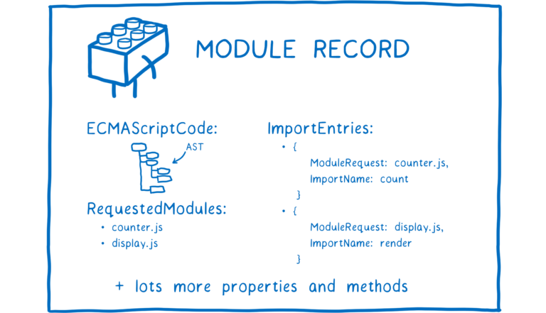
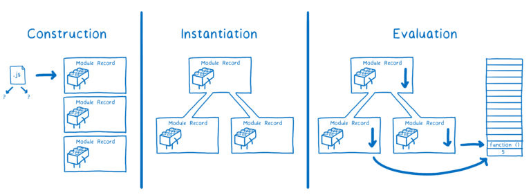
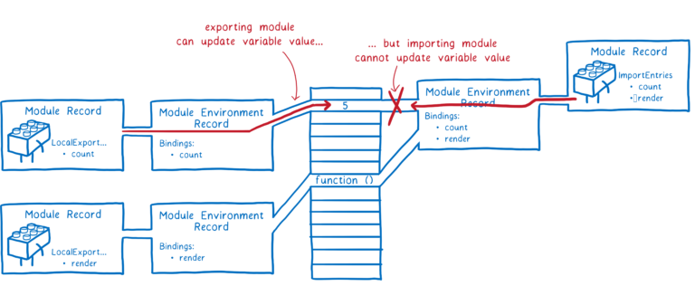

최근 라이브러리를 제작하면서 `CommonJS`와 `ECMAScript` 모듈 시스템(이하 `ESM`)에 대한 모듈 시스템 포맷이 혼란스러웠던 기억이 있다. 패키지를 빌드할 때 각각의
모듈 시스템을 사용하는 포맷으로 빌드 결과물을 만들어 주어야 했는데, 사실 `import`, `require` 등 구문 정도의 차이를 이해했을 뿐 모듈 시스템의 구조적인
라이브러리 제작자로서 대응해 주어야 하는 작업에 대해 크게 고민해 본 적이 없었기 때문일 것이다.

특히나 최신 프론트엔드 개발 환경에 익숙한 개발자라면 `ESM`을 일상적으로 사용하고 있어 가령 `require`이 번들링에 어떤 영향을 끼치는지 궁금해 하기란 사실 쉽지 않은 일이고,
`node.js`에서 `ESM`도 공식적으로 지원하기 시작하면서 독립적으로 개발된 `CommonJS` 모듈 시스템을 청산해야 한다는 이야기도 많은 탓에 자연스럽게 멀리하게 된다.

그러나 `node.js`에서 `CommonJS` 모듈 시스템 기반으로 제작되어 있는 라이브러리 생태계가 건재하고, 여전히 두 모듈 시스템이 공존하고 있기 때문에 각각의 모듈 시스템의
이해와 현 상황을 이해할 필요가 있다. 언젠가 `node.js` 생태계에서 하나의 모듈 시스템을 사용하는 날이 오길 기대하며 현재 `node.js`가 지원하고 있는 대표적인
모듈 시스템들을 살펴보자.


## 자바스크립트 구동 환경을 확장하기 위한 행보

웹 브라우저의 동적인 조작을 구사하기 위해 탄생한 자바스크립트는 브라우저와 함께 성장과 인기를 얻게 되었다. 이에 따라 브라우저뿐만 아니라 더 다양한 환경에서
자바스크립트를 사용하고자 원하는 목소리들도 커지게 된다.

그 중 단순히 니즈만 내세우는 것이 아니라 구체적인 액션 플랜을 제안한 Kevin Dangoor는 [What Server Side JavaScript needs](https://www.blueskyonmars.com/2009/01/29/what-server-side-javascript-needs/)
라는 제목의 글을 통해 자바스크립트가 다른 환경에서 사용되기 위해 선행되어야 하는 작업들을 나열했다.

더불어 오늘날 `CommonJS`라 불리는 모듈 시스템을 제작하기 위한 그룹을 결성하고 라이브러리, 인터페이스, 패키지 매니저, 그리고 오늘의 주제인 모듈 시스템에
대한 표준화 작업을 진행하게 된다.

## CommonJS

> javascript, not just for browsers any more!

`CommonJS`는 자바스크립트를 브라우저 뿐만 아니라, 서버사이드를 포함한 다양한 환경에서 범용적으로 사용할 수 있도록 [다양한 기능](https://arstechnica.com/information-technology/2009/12/commonjs-effort-sets-javascript-on-path-for-world-domination/)
들을 표준화했고, 이때 제작된 모듈 시스템은 `node.js`에서 사용되는 모듈 시스템의 근본이 된다.

### 모듈 불러오기

모듈 시스템의 기본적인 동작인 모듈을 불러오고, 내보내는 기능들을 코드에서 살펴보자. `CommonJS`는 `require` 함수를 통해 모듈을 불러와 사용한다.
여기서 `require`은 동적으로 모듈을 불러와 사용하기 때문에 최상단에서만 모듈을 불러오는 제약을 가지는 `ESM`과 차이가 있다.

```js
// import
const math = require('math.js');

if (condition) {
  const square = require('square.js');
  square.area(3);
}

math.add(1, 2);
```

### 정적 바인딩

`CommonJS`는 모듈이 정적으로 바인딩되는 것이 특징이다. 정적 바인딩이란, `require`을 통해 불러온 값의 복사본을 사용한다는 것과 같다. 이는 불러온 모듈 내에서
내보내진 값의 변경이 발생해도 사용처에서는 변경된 값을 알 수 없다.

```js
// lib.js
var counter = 3;
function incCounter() {
  counter++;
}
module.exports = {
  counter,
  incCounter,
};
```

```js
// main.js
var counter = require('./lib').counter;
var incCounter = require('./lib').incCounter;

// The imported value is a (disconnected) copy of a copy
console.log(counter); // 3
incCounter();
console.log(counter); // 3

// The imported value can be changed
counter++;
console.log(counter); // 4
```

### 동기적인 모듈 실행

`CommonJS`는 모듈을 동기적으로 불러와 하나씩 순서대로 실행한다. 동적으로 모듈을 불러오는 탓에 런타임에 모듈 요청 여부를 판단할 수 있어 모듈 요청이 이루어진
후에야 모듈 내에서 발생하는 여러 동작들을 동기적으로 완료한 후 내보내진 값을 취할 수 있게 된다.

```js
// module1.js ~ module2.js
console.log('Module1 loading...');

setTimeout(() => {
  console.log('Module1 load complete and run!');
}, 1000);

console.log('Module1 run completed!');
```

```js
// index.js
console.log('Run index!');
const module1 = require('./module1');
console.log('index:...');
const module2 = require('./module2');
console.log('index run completed!');

// Run index!
// Module1 loading...
// Module1 run completed!
// index:...
// Module2 loading...
// Module2 run completed!
// index 종료!
// Module1 load complete and run!
// Module2 load complete and run!
// index run completed!
```

### 로드가 완료된 모듈은 캐싱된다

한번 로드가 완료된 모듈에 대해서 캐싱되고, 이후 같은 모듈 요청에 대해 캐싱된 값을 반환한다.

```js
// module1.js
console.log('Run Module1!');

module.exports = 'Module1';
```

```js
const module1 = require('./module1');
const module2 = require('./module1');
const module3 = require('./module1');

console.log(module1, module2, module3);

// Run Module1!
// Module1 Module1 Module1
```

만약 캐싱을 지우고 싶다면, `require.cache`에 접근해 제거할 수 있다.

```js
const module1 = require('./module1');

delete require.cache[require.resolve('./module1')];

const module2 = require('./module1');
const module3 = require('./module1');

console.log(module1, module2, module3);

// Run Module1!
// Run Module1!
// Module1 Module1 Module1
```

### 모듈 내보내기

`CommonJS`는 모듈 각각의 독립적인 실행 영역과 스코프를 유지한 채 `module.exports`나 축약된 숏컷인 `exports`를 통해
모듈을 내보낼 수 있다.

```js
const { PI } = Math;

function add(a, b) {
  return a + b;
}

function subtract(a, b) {
  return a - b;
}

function circumference(r) {
  return 2 * PI * r;
}

module.exports.add = add;
module.exports.subtract = subtract;
exports.circumference = circumference;

console.log(module.exports === exports); // true
```

`node.js`에서 내보내진 모듈을 구성할 때 `module wrapper` 함수를 통해 모듈 내의 코드를 래핑한다. 이는 위 예시 코드의 `Math`의 `PI`와 같이
모듈에서 내보내지 않은 값들을 지역 변수로 은닉하여 글로벌 객체에 등록되는 것을 막는다. 또한 `module wrapper` 함수의 매개 변수들을
통해 글로벌 객체의 값들을 참조할 수 있게 된다.

```js
(function(exports, require, module, __filename, _dirname) {
  // ... (모듈 코드)
});
```

### module.exports와 exports

모듈 내보내기의 예시 코드에서 `module.exports`와 `exports`가 함께 사용된 것을 확인할 수 있다. 이 둘의 차이가 있을 까 싶지만
[공식 문서](https://nodejs.org/api/modules.html#exports)에서 알 수 있듯 `exports`는 단지 `module.exports`의 축약된 `shortcut`인 것이다.

즉 `exports`는 `module.exports`가 기본적으로 내보낼 객체를 동일하게 가리키고 있어 위와 같이 객체에 새로운 키를 추가하여 내보낼 객체에 새로운 프로퍼티를
할당하는 것은 어느 것을 사용해도 동일한 결과를 얻는다.

그러나 주의해야 할 점은 `exports`나 `module.exports`에 새로운 함수나 객체를 할당해 내보내는 경우이다. 다음과 같이 다음과 같이 `Square` 클래스를 `module.exports`
에 할당하여 내보낸다면, `module.exports`는 새로운 객체를 참조하게 되어 `exports`와 참조 대상이 상이해진다.

```js
module.exports = class Square {
  constructor(width) {
    this.width = width;
  }

  area() {
    return this.width ** 2;
  }
};

console.log(module.exports === exports); // false
```

하지만 `module.exports`가 `shortcut`인 `exports`와 다른 객체를 가리키게 되는 것은 크게 문제가 되지 않는다. 모듈을 불러오는 `require`함수는
내부적으로 `module.exports`가 가리키는 값을 반환하기 때문이다.

```js
function require() {
  // ...
  return module.exports;
}

const Square = require('./Square.js');
console.log(Square); // [class Square]
```

문제는 다음과 같이 `exports`를 통해 새로운 값을 할당해 내보내는 경우이다.

```js
const { PI } = Math;

exports = class Circle {
  constructor(r) {
    this.radius = r;
  }

  circumference() {
    return 2 * PI * this.radius;
  }
};

console.log(module.exports === exports); // false
```

`export`에 새로운 값을 할당한다면, `module.exports`가 가리키고 있는 대상과 다른 참조를 가지게 된다. 이것 또한 구현상의 문제는 없어보이지만,
위에서 언급한 것 처럼 `require`이 반환하는 `module.exports`과는 무관한 변경이기 때문에 의도한대로 모듈을 불러올 수 없게 된다.

```js
const Square = require('./Square.js');
console.log(Square); // [class Square]

const Circle = require('./Circle.js');
console.log(Circle); // {}
```

결론적으로 `exports`를 통한 내보내기가 정상적으로 동작한다 하더라도, `module.exports`를 사용하는 것이 안전하다.

### 트리 쉬이킹의 한계

표준을 만들고자 독립적으로 설계되었던 `CommonJS`의 모듈 시스템은 자바스크립트의 근간을 다루는 혁명(?)처럼 느껴져 단점을 논하자니
괜히 겸허해진다. 사실 단점이라고 하기보단 이후에 등장한 자바스크립트의 공식적인 모듈 시스템과 비교에 가깝다.

대표적인 비교점은 아무래도 모듈을 동적, 그리고 동기적으로 불러올 수 있는 동작이 불러오는 결과일 것이다. `ESM`에 익숙한 개발자라면
비교적 유연해 보일 수 있지만 브라우저를 중심으로 하는 자바스크립트 생태계에서 기준이 되기란 쉽지 않았는데, 대표적인 이유로 트리쉐이킹 문제를 꼽는다.

서버사이드에서 모듈의 크기를 최소화해야 한다는 접근이 크게 중요하지 않았지만, 브라우저에서도 `CommonJS`를 사용하기 시작하면서
모듈 크기와 성능의 상관관계가 깊어지기 시작했다.

`CommonJS`는 동적으로 모듈을 불러올 수 있는 동작 때문에 런타임에 들어서야 모듈 평가가 이루어지는 `CommonJS` 모듈 시스템 구조상 참조되지 않은
대상을 제거해도 되는지에 대한 가늠하기 어렵다.

그러나 일체 불가능한 것은 아니다. 번들러 차원에서 `CommonJS`에서 트리쉐이킹이 가능하도록 플러그인들이나 기능을 제공하는 경우도 있다. 가령 `webpack`의 경우
[webpack-common-shake](https://github.com/indutny/webpack-common-shake)를 통해 일정 부분 제거가 가능하다.

하지만 이후 살펴볼 `ESM` 처럼 정적 분석이 가능한 모듈 시스템 구조보다는 트리쉐이킹 수행에 어려움이 있으며,
다음과 같은 제약 사항들을 포함하고 있어 `CommonJS` 모듈 시스템의 특징적인 구현에 제동이 걸리게 된다.

```js
// Dynamic exports
exports[Math.random()] = ...
// Overriding imported vars
var a = require('./a');
a.lib;
a = require('./b')
// Using require in unknown way
console.log(require('./lib'))
// Destructuring require dynamically
{ [prop]: name } = require('./a')
// Dynamic import
var fn = require('./lib')[Math.random()]
```

## node.js의 ESM 지원

`CommonJS`를 채택한 `node.js`는 `--experimental-module` 플래그를 통해 실험적으로 `ESM`을 지원하다가 [버전 13.2.0부터 안정적으로 지원](https://nodejs.org/api/esm.html#modules-ecmascript-modules)
하기 시작했다. 위에서 다뤘던 것처럼 `CommonJS`는 ECMA 표준의 지원 없이 독립적으로 개발되었고, 태생적으로 브라우저 중심의 생태계에 적합하지 않을 수 있다는 이야기들이 반영된 것이다.

그렇다면 다소 아쉬운 점을 들어내는 `CommonJS`에서 `ESM`으로 급진적인 전환이 가능했을까. 사실 아직까지도 과도기이며, 최근 많은 라이브러리들이 [순수 `ESM`만을
지원하려는 움직임](https://gist.github.com/sindresorhus/a39789f98801d908bbc7ff3ecc99d99c)도 보이고 있지만,
이미 `CommonJS` 기반의 라이브러리들을 사용하고 있는 많은 사용자를 감안한다면 쉽게 선택할 수 있는 일이 아닌 것은 분명하다.
그렇다면 현재 라이브러리들은 어떻게 대처하고 있을까. 이 내용은 우리가 익숙하게 사용하고 있는 `ESM`를 먼저 살펴보고 알아보자.

## ESM (ECMAScript Modules)

`ESM`은 자바스크립트 표준을 다루는 ECMAScript 발표한 표준 모듈 시스템이다. 이는 자바스크립트 자체적으로 모듈에 대한 문법을 지원하게 된 것을 의미한다.
모던 브라우저 상에서 동작하는 어플리케이션을 개발하고 있다면, 가장 익숙한 모듈 시스템일 것이다. 기본적인 모듈 사용 방식은 건너뛰고 동작 방식과 특징들을
살펴보자.

### 동작 방식

`ESM`은 구성, 인스턴스화, 평가 세 단계로 동작한다. 가장 먼저 **구성 단계**에서는 번들러의 진입점과 같이 모듈 그래프의 시작점이 되는 파일에서부터 시작해 `import`
구문을 통해 의존적으로 불러오고 있는 모듈들의 종속성 트리를 생성한다.

여기서 `import`가 가리키고 있는 파일 자체를 브라우저가 사용할 수 없기 때문에 이를 [모듈 레코드(Module Record)](https://262.ecma-international.org/6.0/#sec-source-text-module-records)
로 변환한다. 이때 모듈 간 관계를 구조화해야 하기 때문에 모든 파일을 구문 분석한다.



[이미지 출처](https://hacks.mozilla.org/2018/03/es-modules-a-cartoon-deep-dive/)

다음으로 모듈 레코드를 코드와 상태를 담은 **모듈 인스턴스로 변환**한다. `import`된 모든 값을 할당할 메모리 공간을 찾고, 해당 모듈을 불러온 사용처의 `import`
와 해당 모듈을 내보낸 `export`가 모듈의 실제 메모리를 동일하게 가리키도록 한다. 이 과정을 마치면 진입점으로부터 시작되는 모든 모듈들에 대한 인스턴스 그래프를 얻게 된다.

마지막으로 **코드를 평가**한다. 위에서 언급한 상태는 특정 시점의 변수의 실제 값들을 의미하는데, 코드를 평가함으로써 해당 시점에 얻어낼 수 있는 실제 값들을
메모리에 채워 넣는다.



[이미지 출처](https://hacks.mozilla.org/2018/03/es-modules-a-cartoon-deep-dive/)

위와 같은 세 과정은 각각 개별적으로, 비동기적으로 수행될 수 있다. 더불어 위 과정을 선재적으로 진행함에 따라 얻을 수 있는 이점들이 많다.

### 읽기 전용 실시간 바인딩

`ESM`는 `CommonJS`의 정적 바인딩과는 달리 실시간으로 바인딩된다. 이는 모듈을 내보낸 곳에서 변경 사항이 모듈을 불러온 사용처에서도 반영된다는 것이다.

이는 `ESM`의 구동 방식의 인스턴스화 단계에서 모듈을 내보낸 `export`와 모듈을 불러온 `import`가 모두 모듈의 실제 메모리를 가리키도록 하는 작업이
수행되기 때문에 가능한 일이다. 즉 복사본이 아니라 불러온 모듈의 실제 메모리를 참조하여 값을 읽어 사용하는 것이다.

```js
// lib.js
export let counter = 3;
export function incCounter() {
  counter++;
}
```

```js
// main.js
import { counter, incCounter } from './lib';

// The imported value `counter` is live
console.log(counter); // 3
incCounter();
console.log(counter); // 4

// The imported value can’t be changed
counter++; // TypeError
```

단, 위에서 `counter` 값을 수정할 때 `TypeError`가 발생하는 것처럼, 내보내는 모듈은 언제든지 해당 값을 변경할 수 있지만, 모듈을
가져오는 곳에서는 마치 `const`로 선언된 값처럼 변경할 수 없다.



[이미지 출처](https://hacks.mozilla.org/2018/03/es-modules-a-cartoon-deep-dive/)

### 정적 모듈 구조

`ESM`은 정적 모듈 구조를 가진다. 동적인 모듈 시스템 구조를 가지고 있는 CommonJS는 어떤 모듈을 불러왔고 내보냈는지를 런타임에 파악할 수 있는 반면 ESM은
정적인 모듈 구조를 가지고 있어 어떤 모듈을 불러왔고 내보냈는지에 대해 컴파일 단계에서 파악할 수 있다. `import`와 `export`를 최상위에서만 사용해야 하는
이유이기도 하다.

```js
import foo from './foo';

if (condition) {
  import bar from './bar'; // SyntaxError
}

function exportModule() {
  export default 'baz'; // SyntaxError;
}

exportModule();
```

정적 모듈 구조가 다소 유연성이 떨어지는 것처럼 보이지만 동적 구조 대비 [다양한 이점](https://exploringjs.com/es6/ch_modules.html#static-module-structure)
을 취할 수 있다.

### 죽은 코드를 제거하고, 트리 쉐이킹 가능하다

ESM은 정적으로 모듈을 평가하여 번들링 과정에서 죽은 코드를 제거할 수 있다. 브라우저에서는 서버사이드와는 달리 웹을 구성하는 모든 모듈을 불러와
사용해야 하기 때문에 모듈 크기의 최적화가 큰 영향을 끼친다. 만약 정의되었지만 참조되지 않은 함수나 주석/공백 제거와 같은 작업을 수행하여
번들링을 최소한의 크기로 유지하는 것은 중요한 브라우저 생태계에서 중요하다.

`webpack`의 경우 [optimization.minimize](https://webpack.js.org/configuration/optimization/#optimizationminimize)를 `true`로
설정하여 트리쉐이킹을 진행할 수 있다.

```js
module.exports = {
  optimization: {
    minimize: true,
  },
};
```

현재는 `webpack5`에서 `ESM`을 지원하지만, `ESM` 빌드 결과물을 생성할 수 있었던 `rollup`은 조건부로 로드된 모듈을 고려할 필요 없는
특징과 `import` 대상과 `export` 대상이 하나의 메모리를 참조하고 있다는 `ESM`의 특징을 살려 모든 모듈들을 동일한 수준으로 끌어올려 트리쉐이킹 판단을 용이하게
진행할 수 있게 된다.

이때 `rollup`은 불필요한 대상들을 제거하는 접근이 아닌 최종 번들 파일에 포함되어야 한다고 판단된 모듈만을 포함시키려는 접근을 제시하고 적용하고 있다.
아래 `rollup`에서 번들링했을 때의 예시처럼 말이다.

```js
// lib.js
export function foo() {}
export function bar() {}

// main.js
import { foo } from './lib.js';
console.log(foo());
```

```js
function foo() {}

console.log(foo());
```

### 불러오기 검색 속도 향상

동적으로 불러온 모듈의 속성을 참조한다면, 해당 속성에 대한 조회가 선행되어야 한다. 반면 `ESM`의 경우 `import`된 모듈에 대한 평가가 완료되어 정적으로
참조 가능해 런타임에서 모듈에 대한 속성 조회가 완료된 상태로 최적화된 참조가 가능하다.

```js
var lib = require('lib');
lib.someFunc(); // property lookup
```

```js
import * as lib from 'lib';
lib.someFunc(); // statically resolved
```

## node.js에서 모듈 시스템을 선정하는 방식

`ESM`과 `CommonJS` 모듈 시스템이 함께 지원되는 환경에서 `node.js`는 어떻게 모듈 시스템을 선정할 수 있을까.
이는 파일 확장자와 `package.json`의 `type` 필드로 모듈 시스템을 명시할 수 있다.

파일 확장자가 `.cjs` 경우 `CommonJS` 모듈 시스템을, `.mjs`의 경우 `ESM` 모듈 시스템을 사용한다.
그러나 단순히 `.js`의 확장자를 가지는 경우 가장 가까운 부모의 `package.json`에 명시되어 있는 `type` 필드를 기준으로 모듈 시스템을 선정한다.

만약 `type: "module"`로 명시되어 있는 경우 ESM 모듈 시스템을 사용하고, `type: "commonjs"`가 명시되어 있거나 필드가 명시되어 있지 않은 경우
`CommonJS` 모듈 시스템을 사용하는데, 이미 많은 패키지들이 먼저 사용된 `CommonJS` 모듈 시스템을 따르고 있기 때문이다.

```json
// package.json
{
  "type": "module"
}
```

타입스크립트 4.7 버전부터 `tsconfig.json`의 `moduleResolution: "nodenext" or "node16"`일 경우 위 규칙이 동일하게 적용된다.

## 두 모듈 시스템 지원하기

라이브러리를 제작하는 입장이라면 해당 라이브러리를 사용하는 환경에 따라 적절한 모듈 시스템이 적용된 빌드 파일을 제공해 줄 수 있어야 한다.
이는 결국 각각의 모듈 시스템을 사용한 빌드된 결과물을 제공해 주어야 하는 것이다.

### conditional exports

`node.js`는 `CommonJS`와 `ESM`을 함께 지원하기 위해 `exports` 기능을 추가했다. 패키지를 사용하는 쪽에서 해당 패키지를 불러올 때 `CommonJS`의
`require` 혹은 `ESM`의 `import` 중 어느 구문을 통해 모듈을 불러왔는지에 따라 해당 패키지의 번들을 조건적으로 제공할 수 있게 된다.

```json
// package.json
{
  "name": "my-package",
  "exports": {
    ".": {
      "import": "./dist/lib.mjs",
      "require": "./dist/lib.cjs"
    }
  }
}
```

```js
// commonjs, ./dist/lib.cjs 를 불러온다.
const myPackage = require('my-package');

// esm, ./dist/lib.mjs
import myPackage from 'my-package';
```

[webpack5](https://webpack.kr/guides/ecma-script-modules/#flagging-modules-as-esm)에서는
`package.json`에 `type: "module"`가 명시되어 있거나, 모듈 파일의 확장자를 `.mjs`로 설정하여 `ESM` 모듈 시스템을 사용하는 번들을
생성해낼 수 있다. 또 다른 예시로 `vite`는 [build.lib.formats](https://vitejs.dev/config/build-options.html#build-lib)
설정을 통해 명시한 각각의 모듈 시스템에 대한 번들을 생성해낸다.

```js{1, 7}
// vite.config.js
build: {
  lib: {
    entry: path.resolve(__dirname, 'src/main.ts'),
    name: pascalCase(pkg.name.split('/').pop() ?? ''),
    fileName: 'lib',
    formats: ['cjs', 'es', 'umd']
  }
}
```

위에서 언급한 [conditional exports](#conditional-exports)는 동일한 불러오기 경로에 대해 특정 조건에 따라 다른 모듈을 제공할 수 있었다면,
라이브러리가 사용되는 환경에 따라 이를 제공할 수도 있다.

```json
// package.json
{
  // 패키지를 사용할 때 진입되는 경로
  "main": "./dist/lib.js",
  // ES6가 호환되는 환경에서의 진입 경로
  "module": "./dist/lib.mjs",
  // 클라이언트 사이드 (브라우저) 환경에서 사용할 때 진입 경로
  "browser": "./dist/lib.js"
}
```

여기서 `main`은 `node.js` 10 버전 이하에서 사용되는 필드이며, 11 이상에서는 `main`과 `exports`가 함께 명시되어 있는 경우 `exports`가 먼저 적용된다.

## 마치면서

익숙하게 사용 중인 `typescript` 4.7 버전과 `next12`의 `ESM` 공식 지원과, `jest`의 실험적인 기능을 통해 서둘러 `ESM`을 지원하기 시작했다는 레퍼런스들을 보면서
그 시점에 해당 체인지 로그를 본 나는 업데이트하게 된 배경을 이해하고 있지 못하고 그러려니 했을거다. 지금이라도 두서없이 정리해 본 게 정말 다행이라 생각한다.

사실 `CommonJS`를 청산할 수 있을까에 대한 의문은 남는다. 라이브러리 메인테이너들이 여전히 건재한 `CommonJS` 생태계를 제쳐두고 기꺼이 `ESM` 도입을 위해
적극적으로 참여해줄 지, 아니면 크게 문제 없어보이는 두 모듈 시스템이 공존하는 현 상황에 만족할 것인지 나중 일들이 궁금해진다. 지금은 여전히 시끌시끌한 자바스크립트
생태계 이슈들에 조금씩 공감할 수 있게 된 것 같아 기쁘다.

## Reference

- [Tree Shaking과 Module System](https://so-so.dev/web/tree-shaking-module-system/)
- [1부) commonjs란 무엇인가?](https://yceffort.kr/2023/05/what-is-commonjs)
- [3부) 왜 esmodule 이어야 하는가?](https://yceffort.kr/2023/05/why-esmodule)
- [ES modules: A cartoon deep-dive](https://hacks.mozilla.org/2018/03/es-modules-a-cartoon-deep-dive/)
- [exploringjs#static-module-structure](https://exploringjs.com/es6/ch_modules.html#static-module-structure)
- [CommonJS와 ESM에 모두 대응하는 라이브러리 개발하기:exports field](https://toss.tech/article/commonjs-esm-exports-field)
- [모듈 시스템의 역사, 그리고 ESM](https://velog.io/@yesbb/%EB%AA%A8%EB%93%88-%EC%8B%9C%EC%8A%A4%ED%85%9C%EC%9D%98-%EC%97%AD%EC%82%AC-%EA%B7%B8%EB%A6%AC%EA%B3%A0-ESM)
