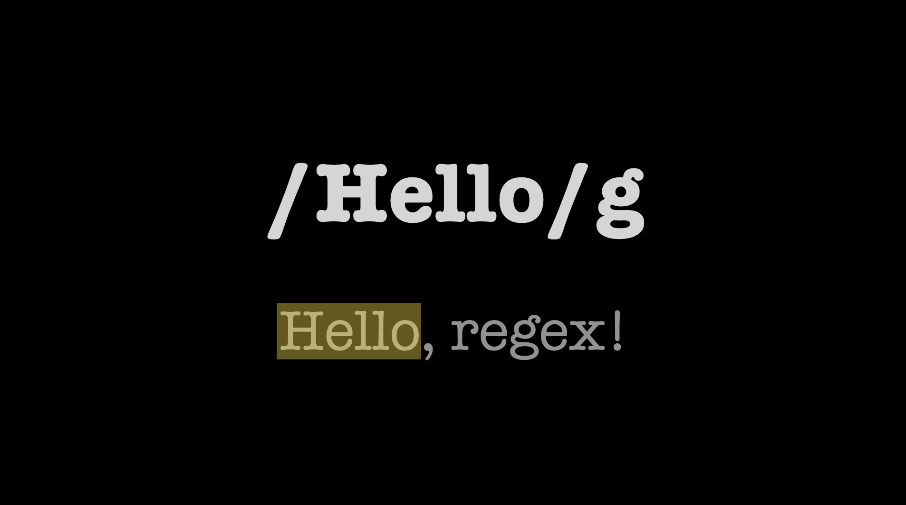
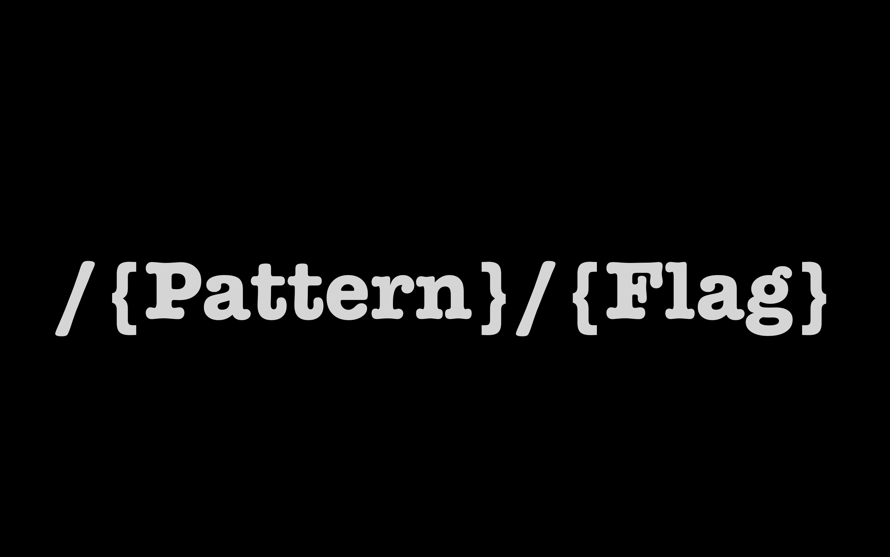

최근 정규 표현식을 마주하는 일이 잦아진 것 같습니다. 주로 문자열의 유효성 검사를
위해 작성되었던 정규 표현식들과, 에디터에서 특정 문자열 검색을 위해 정규식 검색을
사용하곤 했는데요.

사실 정규 표현식을 사용할 때면, 이미 작성되어 있는 표현식들을 꿰맞추어 사용하거나,
구글링해야 하는 경우가 부지기수였습니다. 해서 거창한 이유보다는, 잘 사용해 보고 싶은
생각이 들어 공부하게 된 내용을 정리해 보려 합니다.

## 정규 표현식

정규 표현식(Regular Expression)은 특정 규칙을 가진 문자열의 집합을 표현하고자
고안된 형식 언어입니다. 정규 표현식은 자바스크립트에서 한정적으로 제공하는 기능이 아니라,
대부분의 텍스트 에디터, 프로그래밍 언어에서 문자열의 검색과 치환을 위해 정규 표현식을
문법으로 내장하고 있거나, 표준 라이브러리를 제공하고 있습니다.

간단한 예제부터 살펴봅시다. 다음은 특정 문자열에서 'Hello'라는 단어를 찾고자
작성된 정규 표현식으로, 문자열의 'Hello'가 검색된 것을 확인할 수 있습니다.



## 자바스크립트의 정규 표현식

자바스크립트는 RegExp 객체를 제공하여 정규 표현식의 문법과 프로그래밍 기능을 담은
메서드들을 사용할 수 있도록 하며, 리터럴 방식 혹은 생성자 함수로 호출하여 RegExp
객체를 생성할 수 있습니다.

```javascript
// 정규식 리터럴
/ab+c/i;

// 생성자
new RegExp(/ab+c/, 'i');
new RegExp('ab+c', 'i');

// ES6 생성자
new RegExp(/ab+c/i);
```

RegExp 생성자의 인스턴스들은 대표적으로 다음과 같은 메서드를 가지고 있습니다.
아래 예제들에서 사용되는 메서드들이니, 간단하게 그 역할만 알아보고 넘어가겠습니다.

```javascript
// 문자열 매개변수에 대해 검색을 실행합니다.
RegExp.prototype.exec();

// 문자열 매개변수에 대해 판별을 실행합니다.
RegExp.prototype.test();

// 주어진 문자열 내의 일치를 새로운 문자열로 대치합니다.
RegExp.prototype.replace();

// 주어진 문자열에 대해 일치하는 결과를 반환합니다.
RegExp.prototype.match();
```

## 정규 표현식의 구성

정규 표현식은 크게 패턴(Pattern)과 플래그(Flag)로 구성되어 있는데요. 패턴의 시작과
끝을 `/`로 묶고, 그 뒤로 플래그를 옵션으로 붙여 완성합니다.



패턴은 말 그대로 검색하고자 하는 텍스트가 준수해야 하는 패턴을 표현하기 위해 사용하고,
**우리가 흔히 사용하는 정규 문자들과, 그 문자가 가진 뜻이 아닌 특별한 용도로 사용하는
메타 문자들로 구성**할 수 있습니다.

```javascript
. ^ $ * + ? { } [ ] \ | ( ) // 메타 문자
```

다음으로 플래그는 검색 조건을 표현하기 위한 역할로 사용되며 옵션입니다. 즉, 사용하지
않아도 되며, 사용하지 않는다면 문자열 내 매칭 대상의 첫 번째 대상을 찾게 되면
검색을 종료하고 이를 반환하게 됩니다.

## 플래그

정규 표현식 소개 글에서 언급했던 예제가 이제 눈에 들어오시나요? 또 다른 예제들을 보면서
다양하게 조합해 봅시다. 다음과 같이 플래그를 사용하지 않는다면, 문자열에서의 매칭 대상의
첫 번째 대상이 반환됩니다.

```javascript
const target = '가장 큰 약점은 약점을 보일 것에 대한 두려움이다.';

const regexr = /약점/;
console.log(target.match(regexr)); // ['약점', index: 5, input: '가장 큰 약점은...'];
```

만약 문자열 내 패턴에 일치하는 대상을 모두 반환하고 싶다면, `g` 플래그를 사용할 수
있습니다.

```javascript
const target = '가장 큰 약점은 약점을 보일 것에 대한 두려움이다.';
const regexr = /약점/g;

console.log(target.match(regexr)); // ['약점', '약점'];
```

참고로 자바스크립트의 `String.prototype.match()` 메서드는 정규 표현식에
`g`가 포함되어 있지 않다면, 첫 번째 매칭 대상과 함께 인덱스와 입력값이 포함된
RegExpExecArray 인터페이스 형태로 반환되며, 반대로 `g`가 포함되어 있다면
일치하는 모든 대상을 포함하는 배열을 반환합니다.

또한 플래그는 다중으로 사용할 수 있는데요. 영문을 패턴으로 검색할 때 대소문자 구분 없이
모든 대상을 반환받고 싶다면, 대소문자 구분을 무시하라는 의미의 `i`와 모든 대상 검색을
의미하는 `g` 플래그를 함께 사용하여 표현할 수 있습니다.

```javascript
const target = 'The biggest weakness is the fear of showing weakness.';
const regexr = /The/g;
const regexrWithIgnoreCase = /The/gi;

console.log(target.match(regexr)); // ['The']
console.log(target.match(regexrWithIgnoreCase)); // ["The", "the"]
```

개인적으로 가장 많이 사용하는 `g`, `i` 플래그들과 함께 자바스크립트가 지원하는
플래그 6개들은 다음과 같습니다.

| 플래그 | 역할                                                                  |
| ------ | --------------------------------------------------------------------- |
| i      | 대소문자 구분을 무시하고 검색합니다.                                  |
| g      | 패턴과 일치하는 모든 대상을 검색합니다.                               |
| m      | 다중 행 모드로 검색합니다.                                            |
| s      | 메타문자 `.`이 개행 문자 `\n`도 포함하는 'dot all' 모드로 검색합니다. |
| u      | 유티코드 전체를 지원하여 검색합니다.                                  |
| y      | 문자 내 특정 위치에서 검색을 진행하는 'sticky' 모드로 검색합니다.     |

## 패턴

패턴은 우리가 흔히 사용하는 정규 문자와 메타 문자로 이루어져 있다고 언급했었는데요.
메타 문자를 함께 사용한 매칭 패턴을 구성하여 보다 더 유연한 검색 정규식을 만들어
봅시다.

### 문자 클래스

문자 클래스는 문자 그대로의 가진 뜻이 아닌 특별한 용도로 사용하기 위해 역할을 부여한
정규 표현식의 가장 기본적인 개념으로 사용되고 있습니다. 그중 먼저 `[]`를 살펴봅시다.

`[]` 안의 문자들은 모두 '또는'으로 검색됩니다. 가령, 검색 문자의 범위를 나타내는
`-`와 함께 사용되어 문자열 범위에 해당하는 모든 값을 검색할 수 있습니다.

```javascript
const target = '가장 큰 약점 is the fear of showing weakness.';
const regexrForEnglish = /[a-zA-z]/g;
const regexrForKorean = /[ㄱ-ㅎ가-힣]/g;

console.log(target.match(regexrForEnglish)); // ['i', 's', 't', 'h', 'e', ...]
console.log(target.match(regexrForKorean)); // ['가', '장', '큰', '약', '점']
```

숫자만 검색하고 싶을 때는 어떻게 할 수 있을까요? 숫자 검색은 정규 표현식은 `[0-9]`
혹은 문자 클래스로 지정되어 있는 `\d`를 사용할 수 있습니다.

```javascript
const target = '하나2삼4오여섯7팔90';
const regexr = /[0-9]/g;
const regexrUsingCharClass = /\d/g;

console.log(target.match(regexr)); // ['2', '4', '7', '9', '0']
console.log(target.match(regexrUsingCharClass)); // ['2', '4', '7', '9', '0']
```

여기서 `\d`와 같은 표현은 숫자 검색을 위한 `[0-9]` 정규 표현식처럼 자주 사용되는
표현에 대해 간단하게 작성할 수 있도록 별도로 정의된 문자 클래스입니다. 이와 같은 문자
클래스들은 대표적으로 다음과 같은 클래스들이 정의되어 있습니다.

| 문자 클래스 | 역할                                                  |
| ----------- | ----------------------------------------------------- |
| \d          | 숫자를 검색합니다.                                    |
| \D          | 숫자가 아닌 것을 검색합니다.                          |
| \s          | 공백 (Whitespace) 를 검색합니다.                      |
| \S          | 공백이 아닌 것을 검색합니다.                          |
| \w          | 알파벳, 숫자, 언더스코어 (\_)를 검색합니다.           |
| \W          | 알파벳, 숫자, 언더스코어 (\_)가 아닌 것을 검색합니다. |

### Dot (.)

그 외 자주 사용되는 메타 문자들도 예제를 통해 알아봅시다. 먼저, `.` 은 줄바꿈(`\n`)을
제외한 모든 문자와 매칭됩니다.

```javascript
const target = '가장 큰 약점 is \n the fear of showing weakness.';
const regexr = /./g;

console.log(target.match(regexr)); // ["가", "장", " ", "큰", " ", "약", "점", ...]
```

### 반복 (\*, +, {})

반복 패턴을 의미하는 `*`은 바로 앞 문자가 없거나 무한대로 반복될 수 있음을 표현하며,
이에 매칭되는 대상을 검색합니다.

```javascript
const target = 'B AB AAB AAAB AAAAB AAAAC';
const regexr = /A*B/g;

console.log(target.match(regexr)); // ["B", "AB", "AAB", "AAAB", "AAAAB"]
```

`+`는 바로 앞 문자가 하나 이상이거나 무한대로 반복될 수 있음을 표현하며 이에
매칭되는 대상을 검색합니다.

```javascript
const target = 'B AB AAB AAAB AAAAB AAAAC';
const regexr = /A+B/g;

console.log(target.match(regexr)); // ["AB", "AAB", "AAAB", "AAAAB"]
```

반복을 표현할 때, 반복 횟수를 제한할 수도 있습니다. `{시작 횟수, 끝 횟수}`로 표현하여
이에 매칭되는 대상을 검색합니다.

```javascript
const target = 'B AB AAB AAAB AAAAB AAAAC';
const regexr = /A{1,3}B/g;

console.log(target.match(regexr)); // ["AB", "AAB", "AAAB", "AAAB"]
```

## 자주 사용되는 정규 표현식

위에서 언급하지 못한 패턴들은 자주 사용되는 정규 표현식들을 살펴보면서 하나씩
이해해 보면 좋을 것 같아요. 개인적으로는 사용자 입력에 대한 검증이나, 에디터에서
넓은 범위의 표현을 담은 문자열을 검색하기 위해 사용하곤 하는데, 다양한 사용처들이
있을 것 같습니다.

### URL

해당 문자열이 URL 인지 판별하기 위해 정규 표현식을 이용할 수 있습니다.
여기서 `?`는 바로 앞 문자가 최대 한 개(0 혹은 1) 존재하는지 테스트합니다.

```javascript
const target = 'http://youthfulhps.dev';
const regexr = /^https?/;

console.log(regexr.test(target)); // true
```

### 사용자 이름

입력창으로부터 사용자 이름을 전달받게 됩니다. 이때 한글만 허용된다는 가정과,
한국에서 가장 긴 이름인 17자까지 허용한다는 정규식으로 입력받은 이를 검증할
수 있습니다.

```javascript
const target = '유병호';
const regexr = /^[ㄱ-ㅎ|가-힣]{3,17}$/;

console.log(regexr.test(target)); // true
```

여기서, `^`는 바로 다음으로 오는 문자 혹은 패턴으로 문자열이 시작되는지, `$`는
바로 직전의 문자 혹은 패턴으로 문자열이 끝나는지를 검색하는 문자 클래스입니다.

이때, 천지인 키보드에서 사용되는 중간점 특수문자 또한 허용해 주어야 한다면,
다음과 같이 작성해 줄 수 있습니다.

```javascript
const target = '가브링·'; // 천지인 키보드에서 가브리엘 입력 시
const regexr = /^[ㄱ-ㅎ|가-힣|\u318D\u119E\u11A2\u2022\u2025\u00B7\uFE55]{3,17}$/;

console.log(regexr.test(target)); // true
```

### 핸드폰 번호

위에 등장했던 `\d` 문자 클래스와 `{}`를 통해 핸드폰 번호 검증을 위한
정규식을 표현할 수 있습니다.

```javascript
const target = '010-1234-5678';
const regexr = /^\d{3}-\d{3,4}-\d{4}$/;

console.log(regexr.test(target)); // true
```

### 메일 주소

```javascript
const email = 'ybh942002@gmail.com';
const regexr = /^[0-9a-zA-Z]([-_\.]?[0-9a-zA-Z])*@[0-9a-zA-Z]([-_\.]?[0-9a-zA-Z])*\.[a-zA-Z]{2,3}$/;

console.log(regexr.test(email)); // true
```

### 숫자

```javascript
const regexrForWholeNumber = /^\d+$/gm; // 정수
// 45 true
// 45.5
// .5
// 0 true

const regexrForDecimalNumber = /^\d*\.\d+$/gm; // 소수
// 45
// 45.5 true
// .5 true
// 0
```

## 마치면서

이번 글에서는 정규 표현식을 알아보았습니다. 글에서 언급하지 못한 패턴들도 충분히 사용
가치가 있기 때문에 참고 자료에서 한 번씩 사용해 보면서 익혀두면 좋을 것 같아요.

본 글은 자바스크립트에서 제공하는 정규 표현식 문법에 대해서 언급했지만, 여러 언어에서
정규 표현식을 사용하는 방식이 상이할 수 있으니 주의하시길 바랍니다. 긴 글 읽어주셔서
감사합니다.

## Reference

- https://developer.mozilla.org/ko/docs/Web/JavaScript/Reference/Global_Objects/String/match
- https://ko.wikipedia.org/wiki/%EC%A0%95%EA%B7%9C_%ED%91%9C%ED%98%84%EC%8B%9D
- https://curryyou.tistory.com/234
- https://wikidocs.net/4308
