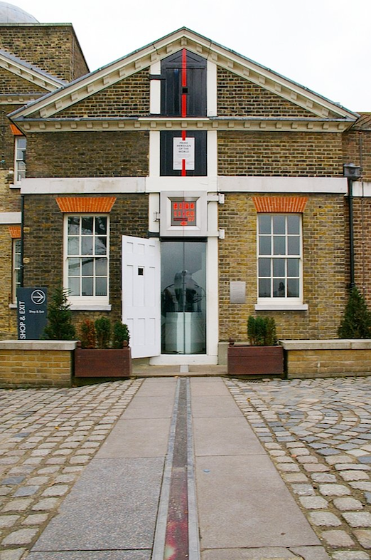
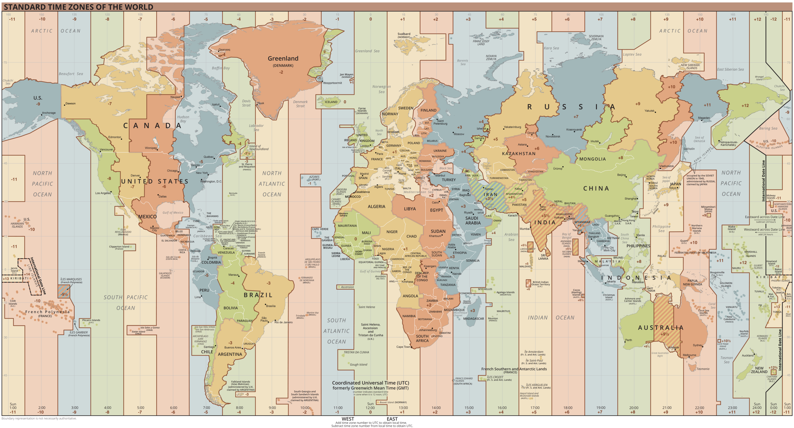

타임존(TimeZone)은 로컬 시간이 동일한 지역을 일컫는 말이다. 국가별로 각자의 타임존을 가지고 있고, 면적이 넓은 국가의 경우
지역별로 여러 타임존을 가지고 있는 경우도 있다.

그나저나 타임존도 기준점이 필요하다. 지구가 계속 자전하고 있어 지역별로 낮과 밤이 다른데, 0시라고 결정할 수 있는 기준이 있어야
시간차를 통해 타임존도 결정할 수 있다.

지구 표면상 북극점과 남극점의 최단 거리로 이었을 때 그려지는 세로 선을 자오선(子午線)이라 하는데, 18세기 영국, 프랑스, 독일, 덴마크 등
각 국에서는 자국의 수도를 지나는 자오선을 모든 자오선들의 기준으로 삼았다. 하지만 여기서도 원형 큐의 시작점을 약속하듯이 원형 지구의 경도 0도라 칭하는 자오선 즉,
본초 자오선을 결정해야 했고, 1884년 워싱턴 D.C에서 열린 국제 자오선 회의에서 영국 그리니치 천문대를 지나는 자오선이 본초 자오선으로 채택되었다.

[이미지 출처](https://m.post.naver.com/viewer/postView.naver?volumeNo=32031087&memberNo=39920442)

이를 토대로 **그리니치 평균시 (Greenwich Mean Time, GMT)**가 표준시로 사용되어 오다, 지구 자전이 조금씩 늦어지는 영향으로 인해
차이가 발생했고, 1972년부터 전 세계 50개 국가 실험실에서 보유한 400개 이상의 세슘 시계를 기반으로 하는
**협정 세계시 (Coordinated Universal Time, UTC)**가 국제 협정시로 사용되기 시작했다.
GMT과 UTC는 소숫점 단위의 미세한 시간차밖에 없어 혼용되곤 하지만, 소프트웨어상에서는 UTC를 사용한다는 표현이 적절하다.

시간의 시작점으로부터 각각의 타임존의 차이는 오프셋(Offset)으로 표현한다. 가령 한국 표준 시간(Korea Standard Time, KST)의 경우 UTC+09:00로
표현하는데, 이는 표준시보다 9시간이 빠르다는 의미이다. UTC 기준 오전 12시라면 한국은 오전 9시가 된다.

아래 세계 시간대의 이미지처럼 영국의 런던에 위치하는 그리니치 천문대를 기준으로 각 지역에서의 타임존을 가지고 있다.

[이미지 출처](https://ko.wikipedia.org/wiki/%EC%8B%9C%EA%B0%84%EB%8C%80)
