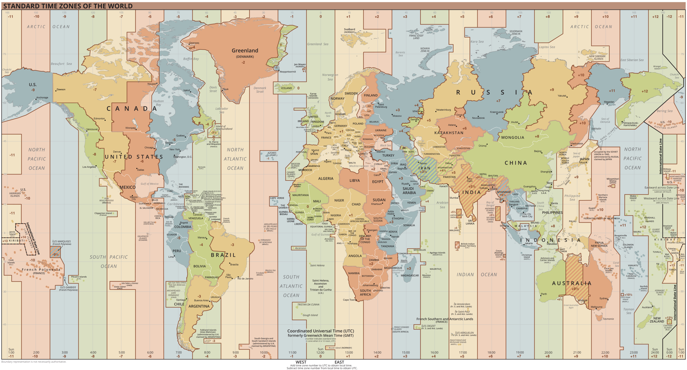
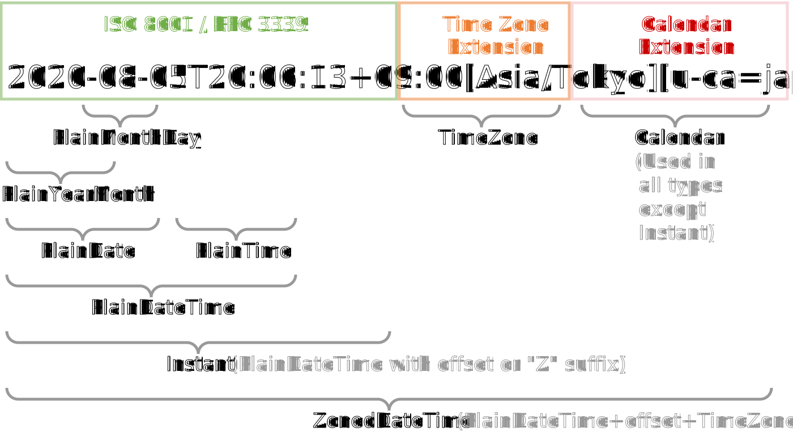

## 기준시와 타임존

타임존 (TimeZone)은 로컬 시간이 동일한 지역을 일컫는 말이다. 국가별로 타임존을 가지고 있고, 면적이 넓은 국가의 경우 지역별로 여러 타임존을 가지고 있는 경우도 있다.
그나저나 타임존도 기준이 필요하다. 지구의 자전에 의해 지역별로 낮과 밤이 생겨나는데, 거리가 먼 지역 간 시간에 대한 이야기를 나눌 수 있도록 0시라 칭할 수 있는
기준이 필요하고, 기준을 통해 얻어낸 시간차를 통해 각각의 타임존을 결정할 수 있다.

이를 위해 본초 자오선 (Prime Meridian)을 결정해야 했다. 지구 표면상 북극점과 남극점의 최단 거리로 이었을 때 그려지는 세로 선을 자오선이라 하는데,
모든 자오선의 기준이 되는 경도 0도의 자오선을 말한다.

18세기 영국, 프랑스, 독일, 덴마크 등 각국에서는 자국의 수도를 지나는 자오선을 모든 자오선들의 기준으로 정해 사용해 오다가, 1884년 워싱턴 D.C에서 열린 국제
자오선 회의에서 영국 그리니치 천문대를 지나는 자오선이 본초 자오선으로 채택되었다.


[이미지 출처](https://m.post.naver.com/viewer/postView.naver?volumeNo=32031087&memberNo=39920442)

이로써 세계 시간의 기준이 되는 0시는 그리니치 천문대를 지나는 자오선이 기준이 되었고, 이 시간을 **그리니치 평균시 (Greenwich Mean Time, GMT)**로 칭했다.
GMT는 지구의 자전으로 인해 지역 사이에 생기는 낮과 밤의 차이를 인위적으로 조정하기 위해 고안된 시간의 구분선인 타임존의 기준시가 된다.

그런데 GMT에 문제가 하나 있었으니, 지구 자전이 조금씩 늦어지는 영향으로 인해 시간에 미세한 차이가 생겨났다. 이는 보다 정확한 시간 기준이 필요하다는 목소리와 함께
1972년부터 전 세계 50개 국가 실험실에서 보유한 400개 이상의 세슘 시계를 기반으로 하는 **협정 세계시 (Coordinated Universal Time, UTC)**가 생겨났고,
UTC를 국제 협정시로 사용되기 시작했다. 사실 GMT와 UTC는 소숫점 단위의 미세한 시간차밖에 없어 혼용될 때도 많다. 하지만, 소프트웨어상에서는 UTC를 사용한다는 표현이
적절하다.

## 오프셋

시간의 표준이 되는 표준시로부터 각각의 타임존의 시간차는 오프셋 (Offset)으로 표현한다. 가령 한국 표준 시간(Korea Standard Time, KST)의 경우 UTC+09:00로
표기되는데, 이는 표준시보다 9시간이 빠르다는 의미이며 UTC 기준 오전 12시라면 한국은 오전 9시가 된다.

전 세계 타임존은 다음과 같이 영국의 런던에 위치하는 그리니치 천문대를 중심으로 그려낼 수 있다.



[이미지 출처](https://ko.wikipedia.org/wiki/%EC%8B%9C%EA%B0%84%EB%8C%80)

## 오프셋의 변동

기준시와의 시간차를 통해 각각의 타임존 오프셋을 지정한다. 이는 각국에서 법적으로 결정되는데, 오프셋이 영구적으로 고정되는 것은 아니다. 오프셋은 국가의 정치적
혹은 경제적인 이유로 변할 수 있다. 여러 이유 중에서 타임존의 오프셋이 변하는 가장 일반적인 원인은 일광 시간 절약제 (Daylight Saving Time, DST)의
시행과 해제이다.

흔히 서머 타임 (Summer Time)이라 불리는 DST는 표준시를 원래 시간보다 한 시간 앞당긴 시간을 사용하는 것을 말하는데, 여름에는 일조 시간이 길어 활동을 보다
일찍 시작할 수 있고 외부 활동하기에 더 밝은 상태의 시간을 활용하여 경제적인 이점을 얻고자 제안된 정책이다.

가령 0시에 DST를 시행한다면 시행된 시간이 1시로 조정되는 것인데, 미국 주식 시장이 일반적으로 3월부터 11월까지 오후 10시 30분에 개장하는 것도 해당 기간에
DST가 시행된 사례이다. 한국에서도 88 서울 올림픽 중계를 위해 30분 앞당긴 서머 타임을 적용한 전례가 있는데, 생활 리듬을 깨고 혼란스럽다는 비난 여론으로 인해
올림픽이 끝난 이후로는 시행되지 않았다.


[이미지 출처](https://www.youtube.com/watch?v=8jOQGVmTNw4)

이처럼 영구적일 것만 같던 타임존의 오프셋은 여러 이유로 변경될 수 있는데, 이를 시스템상에서 적용하려면 분명 현재 표준시와 DST 시행 내역, 그리고 역사적인
변경 오프셋 변경 내역 또한 기록되고 공유되어야 한다.

오늘날 소프트웨어상에서 해당 정보들을 다루고 관리하기 위해 데이터베이스 기반으로 시스템화되어 있는데, 그중 [IANA 타임존 데이터베이스](https://www.iana.org/time-zones)가
리눅스, 유닉스, 자바 등에서 내부적으로 사용하고 있는 데이터베이스로, 타임존에 대한 기록 중 가장 신뢰받고 있다. 유닉스 시간 이후의 데이터를 정확하게
보장되는 타임존 정보를 대륙 혹은 대양명과 (국가명이 아닌) 도시명으로 조합한 규칙으로 명명하여 관리한다. 예로 서울의 타임존은 Asia/Seoul이다.

## 시간의 표현

시간의 기준이 생겼고, 타임존을 지정했다. 더불어 이를 데이터베이스로 관리하여 시스템상에서 관리할 수 있게 되었다. 그렇다면 API 상에서 시간 데이터는 어떻게 표현하여
주고받을 수 있을까. 가령 각각의 타임존에 속하는 클라이언트들에서 서버로 시간을 전달하거나, 시간 데이터를 생성한 클라이언트 타임존이 변경되면 이에 따라 보이는
시간 또한 타임존의 오프셋에 맞게 계산되어 보여야 한다. 영국에서 생성된 오전 0시 온라인 미팅이 한국에서는 오전 9시로 보여야 하는 것처럼 말이다.

결론적으로 타임존에 의존하여 서버로 전달하는 시간의 표현을 담은 데이터는 사용자 타임존의 오프셋을 담고 있거나, 타임존 정보까지 포함되어 있어야 한다.
일반적으로 이러한 시간의 표현은 UTC를 기준으로 하는 유닉스 시간이나 오프셋 정보가 포함된 ISO-8601과 같은 표준 포맷에 맞춰 교환한다.

### 유닉스 시간

[유닉스 시간](https://ko.wikipedia.org/wiki/%EC%9C%A0%EB%8B%89%EC%8A%A4_%EC%8B%9C%EA%B0%84)은 1970년 1월 1일 00:00:00 UTC를 기준으로
경과한 시간을 초로 환산하여 정수로 나타내 시간을 표현한다. 자바스크립트에서도 쉽게 구할 수 있다.

```js
const current = new Date();
console.log(current.getTime()); // 1704210993948
```

여담으로, 유닉스 시간은 [2038년 문제](https://ko.wikipedia.org/wiki/2038%EB%85%84_%EB%AC%B8%EC%A0%9C)라고 불리는 문제와 점점 가까워지고 있다.
32비트 시스템에서 초 시간을 저장하기 위해 32비트 정수형 자료 형식을 사용하는데, 이 형식이 표현할 수 있는 최후의 시각은 2038년 1월 19일 화요일 03:14:07 UTC이다.
1970년 1월 1일 자정을 기준으로 2147483647초가 흐른 시각인데, 이 시각 이후의 시각은 범위를 초과하여 내부적으로 음수로 표현되어 문제를 야기한다.

부호 없는 32비트나 64비트, 혹은 태양의 수명보다 훨씬 긴 시간을 표현할 수 있는 128비트로 대체하면 해결할 수 있다고 예상하지만, 아직 이 문제의 간단한 해결책은 아직 없다고 한다.

### ISO-8601

[ISO-8601](https://ko.wikipedia.org/wiki/ISO_8601)은 날짜와 시간과 관련된 데이터 교환을 다루는 국제 표준으로 1988년에 처음으로 공개되었다.
시간 작성에 있어 다른 관례를 가진 나라들 간의 데이터가 오 갈때 발생하는 잡음을 없애고자 만들어진 표준으로 시간 단위의 가장 큰 것부터 작은 것으로 정렬하여 표기한다.
ISO-8601은 여러 포맷을 사용하고 있는데 그중 소프트웨어상에서 자주 접하는 포맷의 표현은 다음과 같다.

| 조합             | 표기                                            |
| ---------------- | ----------------------------------------------- |
| 날짜             | 2023-01-02                                      |
| UTC 날짜 및 시간 | 2023-01-02T17:13:40+00:00, 2023-01-02T17:13:40Z |

위처럼 UTC 시간인 경우, 시간 뒤에 빈칸 없이 Z를 추가해 주어야 한다. 여기서 Z는 오프셋이 0인 UTC를 위한 지역 지정자로 '+00:00'를 표현한다.
만약 타임존의 시간이 UTC보다 한 시간 앞선다면, 빈칸 없이 '+01:00'을 표기해야 한다.

## 자바스크립트와 타임존

자바스크립트에서는 일반적으로 클라이언트가 동작하는 OS의 설정된 타임존을 따르게 되어 있고, 명시적으로 타임존을 변경할 수 없다. 또한 타임존 데이터베이스에 대한
명세도 명확하게 기술되어 있지 않고 IANA 타임존 데이터베이스를 권장하는 정도의 명세만 서술되어 있다.

자바스크립트에서 날짜와 시간을 처리하기 위해 `Date` 객체를 사용하는데, 네이티브 객체라는 점에서 브라우저마다 다르게 동작하는 경우들이 발생하곤 하며, `Date`
자체적으로 제공하는 기능들이 복잡한 연산을 하기엔 아쉬운 부분들이 많아 자연스럽게 [moment.js](https://momentjs.com/)와 같은 라이브러리를 찾게 된다.

그도 그럴 것이 자바스크립트의 창시자인 [Brendan Eich](https://ko.wikipedia.org/wiki/%EB%B8%8C%EB%A0%8C%EB%8D%98_%EC%95%84%EC%9D%B4%ED%81%AC)는
자바스크립트 언어를 작성하고 이를 Netscape에 적용하는 데 단 10일밖에 부여받지 못해서 프로그래밍 언어의 필수적인 요소라고 할 수 있는 날짜 처리와 관련된 구현체를
구조적으로 설계하기엔 짧은 기간이었다. 해서 그 당시 많은 인기를 얻고 있었던 Java처럼 만들라는 요구에 `java.Util.Date`를 모방하여 자바스크립트에 구현체를 완성했다고 한다.

그러나 모방에 대상이었던 `java.Util.Date`의 메서드들은 1997년 Java 1.1 릴리즈에서 더 이상 사용되지 않고 대체되었지만, 자바스크립트에서는 여전히 모방된 Date API를 사용하고 있다.

자바스크립트에서의 날짜와 시간 처리에 대한 문제를 조금 더 살펴보기 위해 `moment.js`의 메인테이너 중 한명이자 TC39에서 [Temporal](https://tc39.es/proposal-temporal/docs/)을
제안한 [Maggie Pint](https://twitter.com/maggiepint)가 개인 블로그에 언급한 문제점들을 살펴보자.

- No support for time zones other than the user’s local time and UTC
- Parser behavior so unreliable it is unusable
- Date object is mutable
- DST behavior is unpredictable
- Computation APIs are unwieldy
- No support for non-Gregorian calendars

물론 타임존 지원 부족과 그레고리력 (Gregorian calendar, 양력)만 지원하는 문제는 새로운 기능을 추가하여 완화할 수 있다.

```js
// Mitigate support for time zone
var zonedDate = Date.inZone(zoneIdentifier, dateString);

// support non-Gregorian calendars
var calendarDate = Date.withCalendar('Hijri', dateString);
```

또한 `Date`의 API를 추가하여 날짜 계산을 더 용이할 수 있도록 제공할 수 있다.

```js
var myDate = new Date();
myDate.setDate(myDate.getDate() + 7);
myDate.addDays(7);
```

예측할 수 없는 DST 동작에 대한 완화 또한 TC39 [#778](https://github.com/tc39/ecma262/pull/778)에 의해 언급되고 병합되었다.

하지만 현재 `Date`를 개선한다고 해서 해결할 수 없는 문제가 있다. 이는 자바스크립트를 지속적으로 개선하기 위한 TC39 구성원들이 지속적으로 염두에 두고 지켜야 하는
두 가지 성질 때문이다.

> Web Compatibility – No change made to ECMAScript can be incompatible with the existing behavior of ECMAScript

> Web Reality – If code currently behaves a certain way, future versions of the spec should continue to have it behave that way – even if the behavior present is not described in the spec.

이는 자바스크립트에서 현실적으로 기존 동작과 호환성을 유지하도록 하여 현재 동작하고 있는 웹에 문제가 생기지 않도록 하는 것을 목적으로 두고 있는데, 위에서 언급한
문제들 중 현재 웹을 손상시키지 않고는 고칠 수 없는 문제들이 존재한다. Maggie Pint가 Temporal이라는 새로운 API를 제안한 이유일 것이다.

현재 `Date` 객체는 가변적이라는 근본적인 문제를 안고 있다. 가령 오늘 날짜를 표현하는 `Date`의 인스턴스를 받아 일주일을 더한 `Date` 객체를 반환하는 함수가
있다고 생각해 보자.

```js
function addOneWeek(myDate) {
  myDate.setDate(myDate.getDate() + 7);
  return myDate;
}

const today = new Date();
const oneWeekFromNow = addOneWeek(today);

console.log(
  `today is ${today.toLocaleString()}, and one week from today will be ${oneWeekFromNow.toLocaleString()}`
);
//today is 4/16/2017, 10:58:10 AM, and one week from today will be 4/16/2017, 10:58:10 AM
```

직관적으로 `today`와 `oneWeekFromNow`는 다른 날짜이지만, 가변적인 인스턴스로 인해 예상치 못한 결과를 만나게 된다. 안정성을 높이기 위해 `Date` 객체의
`setter`가 반환하는 값이 변경된 날짜 정보를 가지는 새로운 인스턴스가 되어야 한다.

하지만 `Date` 객체에 불변성을 주입해 개선한다면 현재 동작하고 있는 웹들이 많은 손상을 입게 되고, 가변적인 `Date` 인스턴스의 특성에 따라 구현되어 있는
많은 코드 베이스나 라이브러리의 수정이 필요하기 때문에 호환성을 무시한 업데이트가 될 것이다.

다른 문제로는 ECMA262 표준에서 날짜 문자열 구문 분석에 대한 규칙을 거의 설명하고 있지 않는다는 점이다.

> ECMAScript defines a string interchange format for date-times based upon a simplification of the ISO 8601 Extended Format. The format is as follows: YYYY-MM-DDTHH:mm:ss.sssZ

자바스크립트는 날짜 교환 형식으로 ISO8601 형식을 따르겠다고 명시되어 있다. 이후 다음과 같은 인용문이 포함되어 있다.

> When the time zone offset is absent, date-only forms are interpreted as a UTC time and date-time forms are interpreted as a local time.

즉 시간을 지정하지 않으면 오프셋이 0인 UTC 값으로 해석되고, 시간을 지정하면 로컬 시간으로 해석하겠다는 의미를 담고 있다.
이러한 동작은 시간이 지정되어 있지 않은 날짜 데이터 형식을 교환할 때 데이터를 소비하는 시스템상의 타임존에 의존하여 시간을 해석한다는 의미가 되는데,
모두 로컬 시간으로 해석되는 안정적인 해석의 규칙이 필요하다.

```js
const date = new Date('2024-01-07');
console.log(date); // 2024-01-07T00:00:00.000Z

const dateTime = new Date('2024-01-07T08:30');
console.log(dateTime); // 2024-01-06T23:30:00.000Z
```

그 외에도 `Date` 객체의 월이 0부터 시작하는 직관적이지 못한 문제들도 있다.

```js
const date = new Date(2024, 1, 7);
console.log(date); // 2024-02-06T15:00:00.000Z
```

## Temporal

TC39에서 새롭게 제안된 [Temporal API](https://tc39.es/proposal-temporal/docs/)는 웹 호환성과 현실성을 고려하여 `Date` 객체를 개선하는 대신
새로운 전역 객체를 추가하는 방향으로 새로운 API를 도입하고자 제안되었고, `Date`에 대한 mdn 공식 문서에서도 `Temporal`이 개발되고 있음을 알리고 있다.


[이미지 출처](https://developer.mozilla.org/en-US/docs/Web/JavaScript/Reference/Global_Objects/Date)

Temporal API는 날짜 및 시간 계산을 위해 사용하기 쉬운 API를 제공하고, DST을 포함한 모든 타임존을 안정적으로 지원하며,
불변한 객체를 제공하고 엄격하게 지정된 문자열 형식 구문 분석과 날짜 전용(date-only), 시간 전용(time-only) 및 기타 용도에 대한 별도 클래스를 제공함으로써
개발자로 하여금 더 직관적이고 친화적인 날짜와 시간 처리가 가능하도록 돕는다. 또한 `Temporal`은 IANA 타임존 데이터베이스를 기반으로 타임존과 DST를 다루고 있다.

아직 실험 단계인 만큼 [polyfill](https://github.com/tc39/proposal-temporal#polyfills)을 통해 사용해 볼 수 있다.
다양한 API는 [Temporal Cookbook](https://tc39.es/proposal-temporal/docs/cookbook.html)에서 확인할 수 있는데 앞서 몇 가지 간단하게 살펴보자.

UTC 시간을 특정 타임존의 시간으로 쉽게 변환할 수 있게 되었다.

```js
import { Temporal } from '@js-temporal/polyfill';

const now = Temporal.Now.instant();
const hourInSeoul = now.toZonedDateTimeISO('Asia/Seoul').hour;
```

날짜에 일수를 직관적으로 추가할 수 있다.

```js
const { calendar, timeZone } = new Intl.DateTimeFormat('en-US', {
  timeZone: 'Asia/Seoul',
}).resolvedOptions();

const today = Temporal.Now.plainDate(calendar, timeZone);
const oneWeekFromNow = today.add({ days: 7 });

console.log(oneWeekFromNow.day);
```

두 날짜는 다음과 같이 비교할 수 있다.

```js
const date1 = Temporal.PlainDate.from({ year: 2024, month: 1, day: 1 });
const date2 = Temporal.PlainDate.from({ year: 2024, month: 1, day: 11 });

const isAfter = Temporal.PlainDate.compare(date2, date1) > 0;
```

### 정확한 시간과 벽시계 시간의 구분

`Temporal`은 크게 두 가지 시간으로 구분 짓는 주요한 컨셉을 가지고 있다. 시간의 기준이 되는 UTC 시간을 가지는 정확한 시간 (Exact Time)과, 국가별로 통제되는 타임존과 DST 시행에
의존적으로 언제든 변동될 수 있는 벽시계 시간 (Wall-Clock Time, 혹은 로컬 시간)인데, 이는 타임존을 가지는 시간을 처리하는 데 있어 모호한 기준을 해소하고자 설계되었다.

정확한 시간을 구하고자 한다면 `Instant`를 사용할 수 있다. ISO-8601 포맷 형식의 문자열을 메서드에 제공하거나, 현재를 다루는 `Now`의 `instant()`를 사용한다.
`instant`는 나노 초 단위의 정밀도를 갖는 단일 시점의 유닉스 시간을 반환한다.

```js
const instant = Temporal.Instant.from('2024-01-11T12:37+09:00');
const now = Temporal.Now.instant();

console.log(now.epochNanoseconds);
console.log(instant.epochNanoseconds); // 1704903634968634962n
```

만약 ISO-8601 포맷의 UTC 정보가 포함된 시간 문자열을 구하고 싶다면 `toString()`을 사용할 수 있다. `from`의 파라미터로 오프셋 정보가 포함된 시간 문자열을
전달했지만, `Instant`는 UTC 시간으로 반환하는 것을 확인할 수 있다.

```js
const instant = Temporal.Instant.from('2024-01-11T12:37+09:00');
console.log(instant.toString()); // 2024-01-11T03:37:00Z
```

반면 타임존과 달력에 의존된 벽시계 시간 정보를 구하고자 한다면, `ZonedDateTime`을 사용할 수 있다. `ZonedDateTime`은 타임존과 달력에 대한 정보를
가지고 있으며, 지구의 특정 지역 관점에서 특정 시간을 표현하는 데 사용한다.

```js
const zonedDateTime = Temporal.ZonedDateTime.from(
  '2024-01-21T03:24:30+09:00[Asia/Seoul]'
);
console.log(zonedDateTime.toString()); // 2024-01-21T03:24:30+09:00[Asia/Seoul]

const { calendar, timeZone } = new Intl.DateTimeFormat('en-US', {
  timeZone: 'Asia/Seoul',
}).resolvedOptions();

const zonedNow = Temporal.Now.zonedDateTime(calendar, timeZone);
console.log(zonedNow.toString()); // 2024-01-12T01:51:01.54286152+09:00[Asia/Seoul][u-ca=gregory]

const zonedDateTime2 = Temporal.ZonedDateTime.from({
  timeZone: 'America/Los_Angeles',
  year: 1995,
  month: 12,
  day: 7,
  hour: 3,
  minute: 24,
  second: 30,
  millisecond: 0,
  microsecond: 3,
  nanosecond: 500,
});

console.log(zonedDateTime2.toString()); // 1995-12-07T03:24:30.0000035-08:00[America/Los_Angeles]
```

```js
const { year, month, monthCode, day, hour, minute, second, ...rest } = zonedNow;
```

여기서 `ZonedDateTime`이 반환하는 문자열이 타임존과 달력 정보까지 포함되어 있어 낯설 수 있는데, 잠시 `Temporal` 내부적으로 사용되는 문자열 표현에 대해
살펴보자.

## 지속성과 상호 운용성을 위한 문자열 표현

`Temporal`는 지속성과 상호 운용성을 위한 문자열 표현을 공통적으로 사용하고 있다. ISO-8601 포맷의 문자열과 타임존 정보, 그리고 달력 정보를 가지고 있다.



[이미지 출처](https://tc39.es/proposal-temporal/docs/index.html#string-persistence-parsing-and-formatting)

`Temporal`은 기계가 읽을 수 있는, 사람이 읽을 수 있는 두 가지 유형의 문자열 표현을 가지고 있다. 기계로 읽을 수 있는 형식의 문자열은 프로그래밍적으로 모호하지 않도록
설계되어 있어 최종적으로 사용자에게 노출되기엔 적합하지 않지만, 효율적인 구문 분석을 위해 최적화되어 있는 구조이다.

```js
'2022-02-28';
'2022-02-28T11:06:00.092121729+08:00[Asia/Shanghai][u-ca=chinese]';
'2022-02-28T03:06:00.092121729Z';
```

반면 사람이 읽을 수 있는 형식은 로컬화되어 있으며 언어의 규칙과 사용자에게 보여지는 응용 프로그램에서 최종적으로 사용자에게 보여주기 적합한 구조로 이루어져 있다.

```js
'2/28/2022, 11:06:00 AM PST';
'Monday, February 28, 2022';
'正月28日 GMT+8 11:06:00';
'2024. 1. 21. 오전 3시 24분 30초 GMT+9';
```

## 타임존과 관련없는 시간을 다루기 위한 Plain

타임존과 달력 정보가 포함되지 않은 순수 날짜와 시간에 대한 처리를 하고자 한다면 `Plain` 접두사가 붙은 클래스나 메서드들을 사용할 수 있다.

```js
const dateTime = Temporal.PlainDateTime.from({
  year: 2024,
  month: 1,
  day: 12,
  hour: 15,
});
console.log(dateTime.toString()); // 2024-01-12T15:00:00
```

```js
const date = Temporal.PlainDate.from({ year: 2024, month: 1, day: 12 });
console.log(date.toString()); // 2024-01-12
```

```js
const time = Temporal.PlainTime.from({
  hour: 19,
  minute: 39,
  second: 9,
  millisecond: 68,
  microsecond: 346,
  nanosecond: 205,
});
console.log(time.toString()); // 19:39:09.068346205
```

## Reference

- [자바스크립트에서 타임존 다루기 (1)](https://meetup.nhncloud.com/posts/125)
- [자바스크립트에서 타임존 다루기 (2)](https://meetup.nhncloud.com/posts/130)
- [tc39.es/proposal-temporal](https://tc39.es/proposal-temporal/docs/index.html)
- [Temporal: getting started with JavaScript’s new date time API](https://2ality.com/2021/06/temporal-api.html)
