<blockquote class="warning">작성한 지 2년이 지난 글이에요. 지금과는 맞지 않을 수도 있지만, 당시의 고민과 노력이 담겨있습니다.</blockquote>

최근 클라이언트 사이드 랜더링 방식을 취하고 있는 프로젝트를 `next.js`로 이관하는 작업이 한창이다. `next.js`는 서버 사이드
랜더링과 동시에 클라이언트 사이드 랜더링을 동시에 지원하기 때문에, 마이너한 빌드 이슈를 제외하면 점진적 이관이 가능했다.

이후 페이지별로 적절한 랜더링 전략을 취해야 했다. 가령, 상품 정보와 같은 정적인 정보를 제공하는 페이지의 경우 `getStaticProps`를 통해
빌드 타임에 패칭된 데이터들을 통해 빠르게 페이지를 제공하고, 동적이고 데이터 정합성을 요구하는 페이지의 경우 `getServerSideProps`를
통해 제공하는 방식 등을 고려하여 선정해야 했다.

그러나 동적이지만, 그렇다고 실시간으로 데이터 정합성을 요구하는 정도가 아닌 그 중간 어딘가의 데이터를 사용하는 페이지의 경우,
최대한 정적 사이트 생성 전략을 통해 해결하려 했다.

## SSR vs SSG

`next.js`는 서버사이드 랜더링 전략을 쉽게 구현할 수 있도록 두 가지 API를 제공한다. 두 함수의 가장 큰 차이점은 단연
데이터 패칭의 시점이다. `getServerSideProps`는 클라이언트에서 요청이 들어올 때 외부 데이터를 패칭하여 마크업을 생성하여
담아낸다.

반면, `getStaticProps`는 빌드 타임에 마크업 파일을 생성하고, 외부 데이터를 패칭하여 `json` 파일로 작성한다.
이후 클라이언트의 페이지 요청에 대해 이미 작성되어 있는 마크업 파일과 데이터가 담겨 있는 `json` 파일을 제공한다.

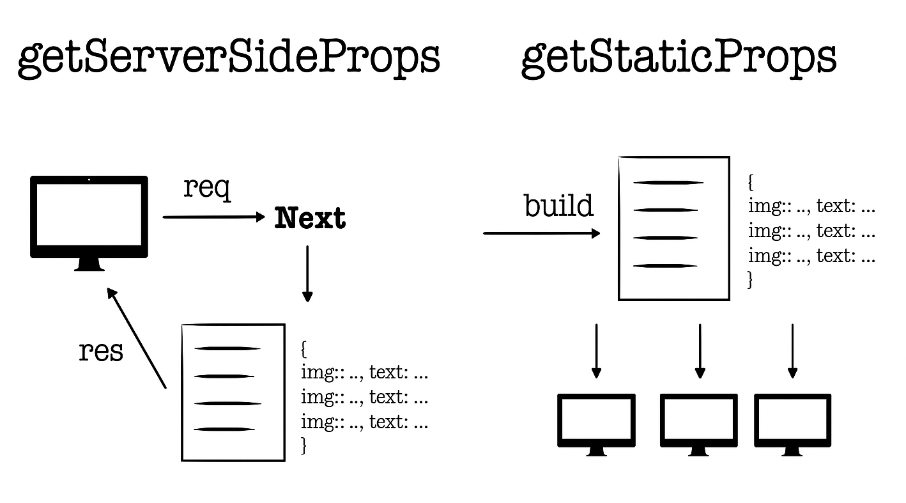

### 정적 생성 전략을 지향했던 이유

정적 생성된 페이지는 이미 생성된 마크업 파일과 데이터를 소유하고 있기 때문에, 클라이언트의 요청에 서버사이드 랜더링 전략으로
제공되는 페이지보다 비교적 빠르게 제공된다.
이는 서버사이드 랜더링 전략 대비 `Time to First Byte (TTFB)`, `First Input Delay (FID)` 등 다양한 웹 성능 메트릭을 개선하는데 큰 이점을 제공한다.

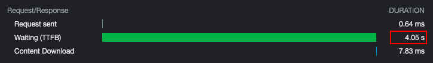

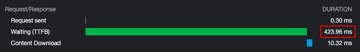

더불어 클라이언트의 요청 횟수에 상관없이 빌드 타임에 한 번만 데이터 요청이 이루어지기 때문에 서버 자원 또한 극적으로 절약할 수 있다.

## 증분 정적 재생성

정적 생성 전략을 통해 웹 성능 메트릭 개선과 서버 자원을 절약을 달성할 수 있다. 그러나 한 가지 염두해야 할 것이 있다면,
빌드 타임에 캐싱된 외부 데이터가 데이터 정합성 측면에서 유효한가를 확인해 봐야 한다.
개요에서 언급했던 바와 같이, 상품 정보 데이터의 경우 비교적 무거운 정적인 데이터로 간주하여 빌드 타임에
캐싱하여 정적으로 제공하는 것이 가능하다.

하지만 구매한 상품 개수, 총 주문 금액을 유저에게 노출시켜 전환율을 높이는 이벤트를 진행한다고 생각해 보자. 상품 개수나, 총 주문 금액과 같은
데이터는 빌드 타임에 가지고 있을 수 없는 동적인 데이터이다. 하지만 실시간으로 데이터 정합성을 유효하게 제공할 것인가, 혹은 서버 자원 절약하고
개선된 웹 성능 메트릭을 취할 것인가에 대한 저울질이 가능하다.

이렇게 비즈니스적인 측면에서 바라보았을때 정적 혹은 동적인 데이터 그 중간 어딘가에 속하는 데이터들은 어떻게 처리할 수 있을까. 바로 `next.js`가 제공하는
[증분 정적 재생성](https://vercel.com/docs/concepts/next.js/incremental-static-regeneration) 전략을 고려해 볼 수 있다.

증분 정적 재생성은 빌드 타임에 외부 데이터를 패칭해 캐싱하는 정적 생성 전략에서, 일정한 트리거에 의해 데이터 유효성을 검증하고
이를 최신화하여 정적 생성 전략에서도 데이터 정합성을 일부 챙길 수 있는 전략이다.

이를 구현하는 방식은 간단하다. `getStaticProps`의 반환 프로퍼티로 초 단위의 `revalidate` 값을 제공하면 된다.
하지만 단순히 `revalidate`에 설정된 초 단위마다 외부 데이터를 최신화하는 것은 아니기 때문에 트리거에 의해 최신화되는 과정을
살펴보자.

### 증분 정적 재생성의 타임라인

`revalidate`를 20초로 설정했다고 가정해 보자. 이는 첫 요청이 들어온 이후 20초마다 한번씩 유효성 검사를 진행하고
데이터 정합성을 확인하여 최신화된 데이터가 담긴 페이지를 반환한다는 것으로 오해할 수 있다.

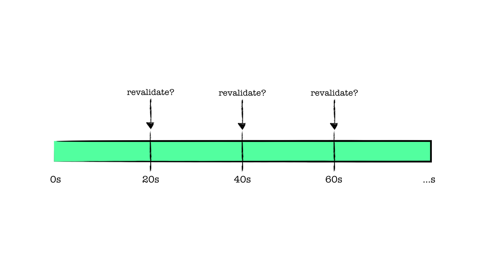

하지만, 정확한 유효성 검사의 흐름은 공식 문서에서 다음과 같이 설명하고 있다.

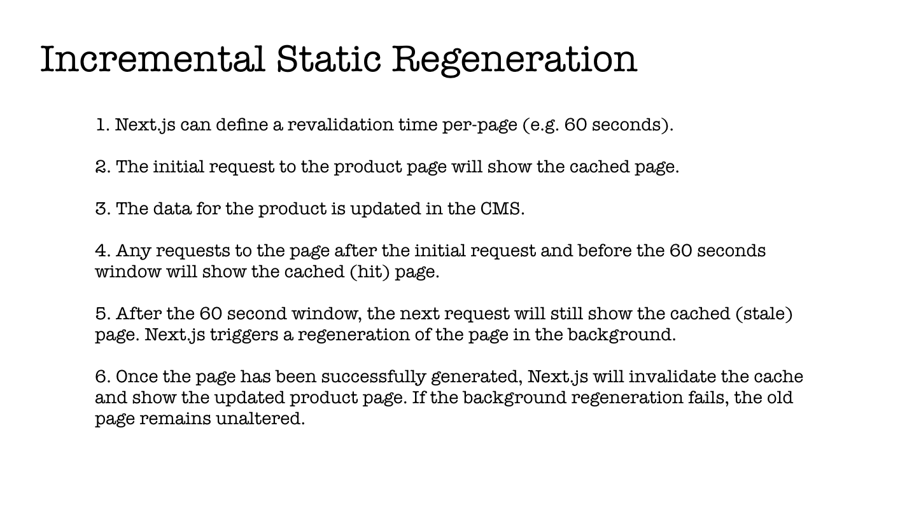

`revalidate`가 20초로 설정된 페이지는 빌드 타임에 정적 생성되었다. 해당 페이지 요청(1)이 이루어졌다면,
0초를 기준으로 빌드 시점에 캐싱되어 있는 페이지가 반환된다.

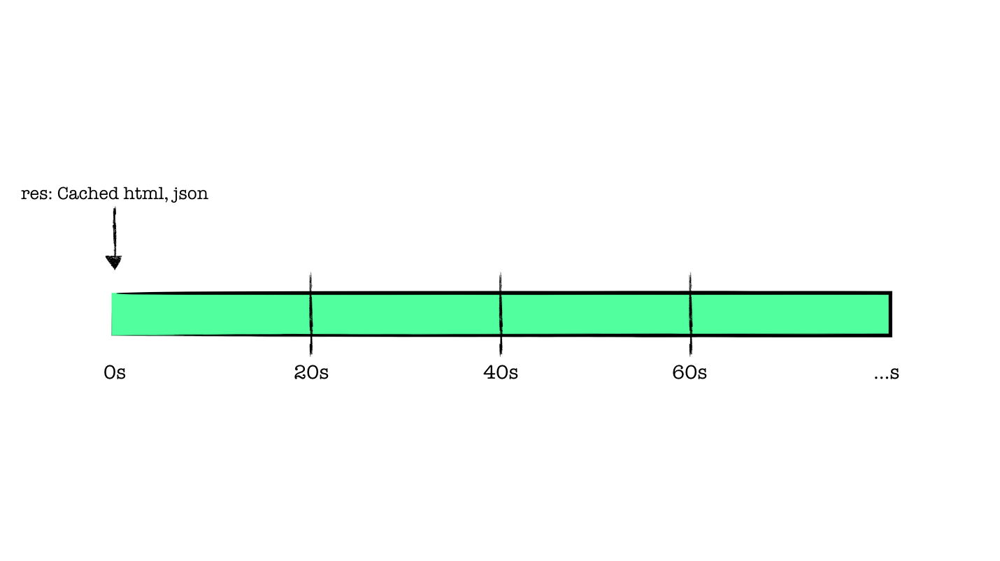

가령 이후 다른 유저가 20초 이내 같은 페이지를 요청(2)했다면, 이것 또한 기존 캐싱되어 있는 페이지가 반환된다.

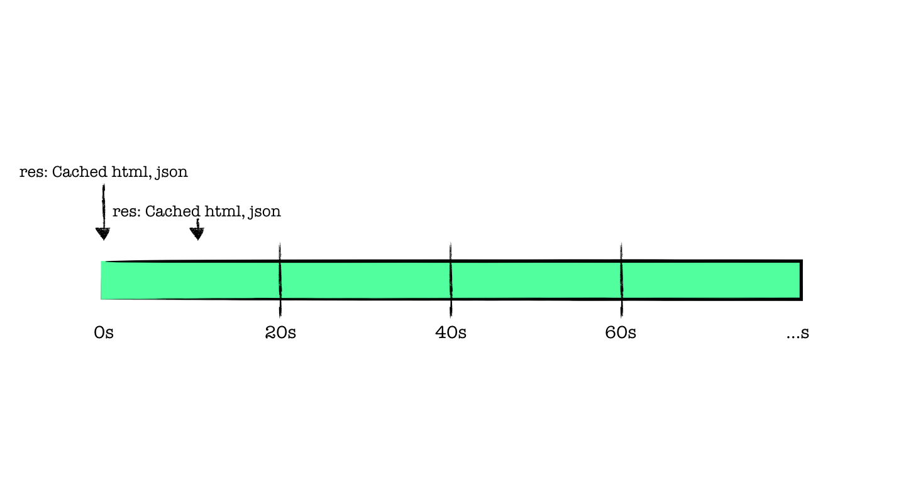

드디어 우리가 설정한 20초가 지난 시점에 새로운 페이지 요청(3)이 들어왔다. 해당 페이지에 `revalidate`로 설정한
20초가 지났기 때문에 캐싱되어 있는 페이지에 대한 유효성 검사를 진행하고, 최신화된 페이지를 반환할 것이라
기대하지만 그렇지 않다. 마찬가지로 신선하지 않은 캐싱된 페이지를 반환받는다.

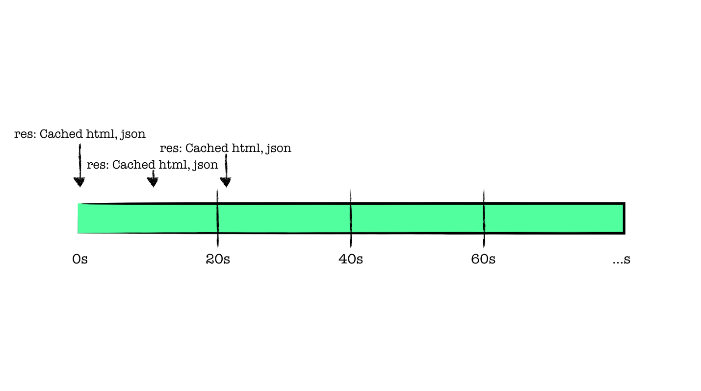

개인적으로 이 단계에서 예상과 달라 혼란이 있다. 그렇다면, 어느 시점에 새롭게 유효성 검사가 진행될까.
바로 20초가 지나서 전달된 새로운 요청(3)이 유효성을 재검사의 트리거가 된다.

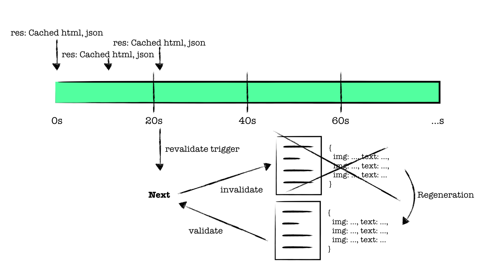

20초가 지난 시점에서 새로운 요청(3)이 들어오면, 기존에 캐싱되어 있던 페이지를 다시 최신화한다.
이때 재생성이 성공한다면, 기존의 캐싱된 페이지는 무효화되고 재생성된 페이지가 새롭게 캐싱된다.
그러나 모종의 이유로 재생성에 실패한다면, 기존에 캐싱된 페이지가 유지된다.

_이 시점을 왜 재생성의 트리거로 설정했을까라는 생각을 오해했는데, 20초마다 조건없이 재생성 하기보다는,
20초 이후 들어온 새로운 요청에 대해 빠르게 페이지를 반환해 주고, 최신화된 데이터에 대한 수요를 확인하여
재생성이 이루어지도록 하는 것이 훨씬 경제적이지 않을까 판단됩니다._

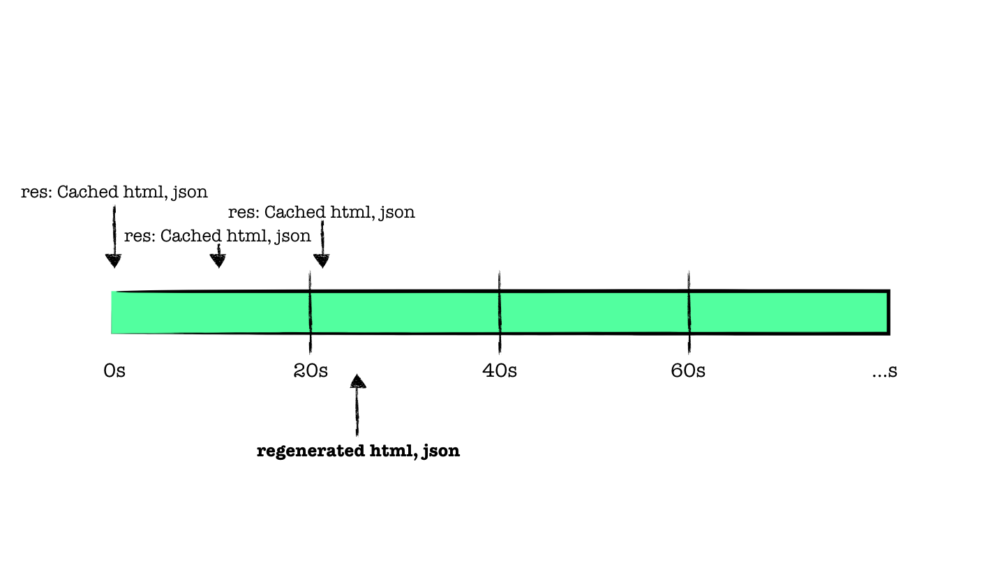

재생성이 완료된 이후 시점에 새로운 요청(4)이 들어온다면, 최신화된 페이지를 반환받게 된다.

### 제품에 적용하기 앞서

사실 여러 성질을 가진 데이터들을 요구하는 제품 상세 페이지에 증분 정적 재생성 전략을 취하는 것은 생각보다 불안해
재검증되는 타임라인을 그려보기도 하고, 생각보다 비슷한 우려에 대해 [논의한 이야기](https://github.com/vercel/next.js/discussions?discussions_q=ecommerce)들도 읽어보며 참고했다.

웹 성능 메트릭을 조금 양보하더라도 서버사이드 랜더링 전략을 취해 모든 요청에 대해 데이터가 패칭되도록 해야 할까라는 생각도 했지만,
정적 생성 전략의 응답 속도를 경험해 본다면 포기하기 힘들다.

결과적으로 정적인 상품 정보와 같이 무겁고 메타데이터에 활용도가 높은 데이터들은 증분 정적 재생성되도록 캐싱하여
사용하고, 메타데이터와 무관하며 실시간으로 데이터 정합성 판단이 필요한 남은 수량, 가격 변동과 같은 데이터들은 클라이언트에서
요청을 분리하여 페이지를 완성하는 전략으로 작업을 진행했다.

## 마치면서

`stale-while-revalidate` 전략을 통해 클라이언트에서 서버 데이터를 캐싱하고 관리해 주는 `react-query`나,
`swr`과 같은 도구들이 자주 등장한다. 여기서 사용되는 전략 또한 동일한 타임 라인을 가지고 있기 때문에 한번 사용해 보면
좋을 것 같다.

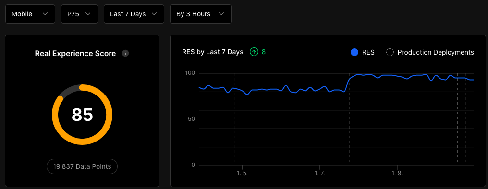
