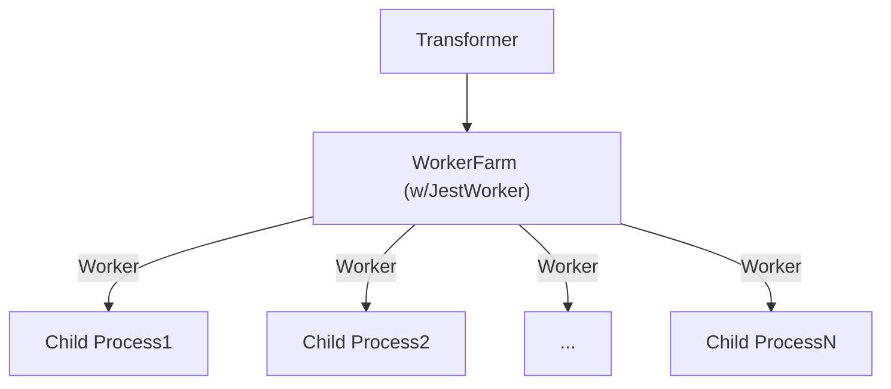
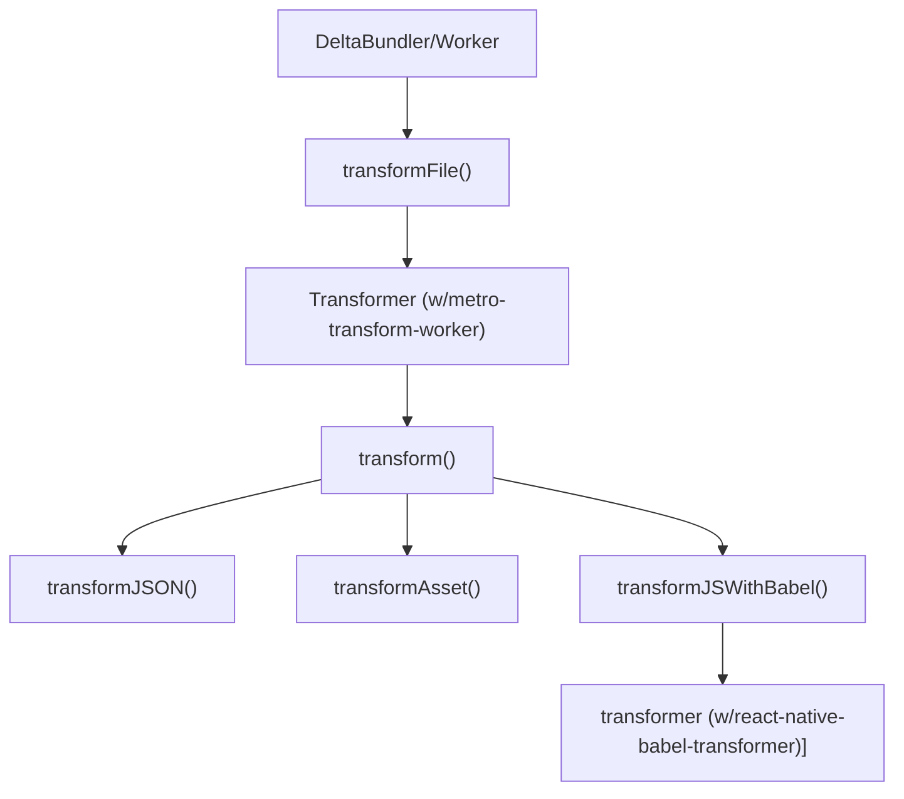

최근 리엑트 네이티브를 통해 사내 신사업 앱 개발을 담당하게 되었다. 사실 네이티브 플랫폼은 익숙지 않았고, 과거 세 달 정도 개발했던 경험이 분명 좋지는 못했던 기억에
고민이 많았다.

그럼에도 프로젝트를 완수하고 싶었다. 회사에 돈을 벌어다 줄 채널을 늘려야 했고, 에자일 TF팀으로서 본보기를 보여야 했으며, 플랫폼에 한정되지 않은 리엑트 개발자가
되고 싶은 것도 동기부여 삼을 수 있었고, 프로젝트를 맡게 되면 스스로 쉽게 사명감 같은 뜨거운 것들을 만들어내는 것에 익숙한 것도 한몫했다.

프로젝트 베타 버전의 앱이 나오고 QA를 진행하는 시점에서 뿌듯함보다는 작업을 하면서 느낀 부족함이 더 크게 다가온다. 개인적으로 개발에 있어 한계를 타파시켜 주는
도구들을 사용할 때면 해당 도구의 기저에 있는 구현체들이 궁금해진다. 리엑트 네이티브도 마찬가지다. 리엑트 네이티브를 통해 크로스 플랫폼 앱 개발을 쉽게 할 수 있다는
훅보다는, 어떻게 가능하게 만들었는지가 더 관심을 끈다. 그리고 이런 궁금증들이 해소가 되고 나서야 비로소 사용할 명분을 찾은 기분이 든다.

짧은 회고는 이쯤 하고, 급하게 담당한 프로젝트 출시를 앞두고 지금이라도 리엑트 네이티브에 대해 조금 더 깊이 살펴보려 한다. [React Native Under The Hood](https://geundung.dev/126)는
어떻게 시작해야 할까 고민하던 중 찾은 걸출한 레퍼런스로 공부 방향을 잡는데 큰 도움이 되었다. 본 글은 해당 시리즈의 번들러 포스트를 따라가 보며 구현체들을 살펴본 글이다.

## 번들러

자바스크립트 생태계에서 번들링 작업은 필연적이다. 리엑트 네이티브 기반으로 작성된 자바스크립트 모듈들과 앱을 구성하는 에셋들도 마찬가지로 번들링 과정을 걸쳐
네이티브로 제공된다. 리엑트 네이티브는 기본적으로 메타에서 제작한 [Metro](https://github.com/facebook/metro)를 번들러로 사용하는데,
크게 `Resolution`, `Transformation`, `Serialization`라는 세 가지 컨셉을 가지고 있다. 여기서 모듈 해석과 변환 과정을 살펴볼 것이다.

## 모듈 해석

`Metro`의 모듈 해석 과정은 기본적으로 [Node's module resolution algorithm](https://nodejs.org/api/modules.html#loading-from-node_modules-folders)를
따르며, `haste` 모듈 시스템이나 네이티브 플랫폼별 확장을 고려한 기능들이 보강되어 있다. 관련해서 공식 문서의 [Module Resolution](https://metrobundler.dev/docs/resolution/)에도
잘 설명이 되어 있는데, 해당 문서에 나열되어 있는 순서대로 구현체를 살펴보자.

### metro-resolver

프로젝트를 구성하는 모든 모듈들은 [metro-resolver](https://github.com/facebook/metro/blob/v0.80.9/packages/metro-resolver/src/resolve.js)의 `resolve()`를 통해
해석 과정을 거치게 된다.

```js
// metro-resolver/src/resolve.js#L34
function resolve(context, moduleName, platform) {
  ...
}
```

`resolve()`에 전달되는 파라미터들을 먼저 살펴보자. 가장 먼저 `context`는 [Resolution context](https://metrobundler.dev/docs/resolution/#resolution-context)에
선언된 속성 값들을 전달받으며, `metro.config.js` 파일 혹은 `react-native bundle` 명령어에 옵션으로 주어지는 값들이 기본 설정값에 덮어쓰기 되어 인자로 사용된다.

`resolve()` 전개를 살펴보다 보면 등장하는 설정들이라 모든 속성을 설명하진 않겠지만, 가령 개발 모드를 위한 번들인지 여부를 나타내기 위한 `dev`, 폴더 모듈을
해석할 때 `package.json`의 어떤 필드를 진입점으로 사용할 것인지 설정하기 위한 `mainFields`, 모듈 경로의 확장자가 표기되어 있지 않은 경우 임의로
대입해 모듈 해석을 시도하는 확장자 목록을 담고 있는 `sourceExts`과 같은 값들이 그 예시이다.

```js
// context
{
  redirectModulePath: (moduleName) => {...},
  dev: true,
  allowHaste: true,
  sourceExts: [ 'js', 'jsx', 'json', 'ts', 'tsx' ],
  mainFields: [ 'react-native', 'browser', 'main' ],
  allowHaste: true,
  ...
}
```

다음으로 `moduleName`은 실제 코드상에서 모듈 불러오기 구문에 제공된 경로를 가지고 있다.

```js
// moduleName
'@babel/runtime/helpers/interopRequireDefault'
'react-native'
'./App'
'./app.json'
'./Libraries/Core/registerCallableModule'
'./Libraries/Components/AccessibilityInfo/AccessibilityInfo'
'./Libraries/Components/ActivityIndicator/ActivityIndicator'
...
```

마지막으로 `platform`이다. 번들을 생성할 때 다음과 같이 어떤 플랫폼에서 사용할 번들인지 명시할 수 있는 옵션이 있는데, 해당 옵션에 따라 `android` 혹은
`ios`가 전달된다. 그 외 `windows`, `web`도 가능하다.

```shell
~$ react-native bundle --platform android
```

### 제공된 CustomResolver가 있다면, 해석 요청을 위임한다

`resolve()`에서는 가장 먼저 `CustomResolver`를 제공하고 있는지 확인하고, 만약 있다면 모듈 해석 요청을 해당 `CustomResolver`에게 위임한다.

```js
// metro-resolver/src/resolve.js#L34
function resolve(context, moduleName, platform) {
  const resolveRequest = context.resolveRequest;
  if (resolveRequest && resolveRequest !== resolve) {
    return resolveRequest(
      Object.freeze({
        ...context,
        resolveRequest: resolve,
      }),
      moduleName,
      platform
    );
  }
  ...
}
```

이는 `resolver.resolveRequest` 속성으로 제공할 수 있는데, 가령 모듈에 대해 분기적으로 해석이 필요한 경우 별칭을 붙여 해당 모듈 해석 요청을 커스텀된
리졸버가 위임받을 수 있도록 제공할 수 있다.

```js
// metro.config.js
module.exports = {
  resolver: {
    resolveRequest: (context, moduleName, platform) => {
      if (moduleName.startsWith('my-custom-resolver:')) {
        return {
          filePath: 'path/to/file',
          type: 'sourceFile',
        };
      }

      return context.resolveRequest(context, moduleName, platform);
    };
  }
}
```

### 불러오기 구문에 제공된 대상을 파일 혹은 폴더 경로로서 해석을 시도한다

제공된 커스텀 리졸버가 없다면, `Metro`는 기본적인 모듈 해석 과정에 돌입한다. 가장 먼저 불러오기 구문에 제공된 대상 즉, `moduleName`을 모듈의 경로로서
해석을 시도한다. 이를 위해 `moduleName`이 상대 경로 혹은 절대 경로의 형태를 갖추고 있는지 판단한다.

```js
// metro-resolver/src/resolve.js#L34
function resolve(context, moduleName, platform) {
  ...
  // 'moduleName'이 상대 경로 혹은 절대 경로의 형태를 갖추고 있는지 판단하여 해당 모듈 해석을 시도한다.
  if (isRelativeImport(moduleName) || _path.default.isAbsolute(moduleName)) {
    const result = resolveModulePath(context, moduleName, platform);
    if (result.type === "failed") {
      throw new _FailedToResolvePathError.default(result.candidates);
    }
    return result.resolution;
  }
  ...
}
```

해당 분기는 `node.js`에서 [File Modules](https://nodejs.org/api/modules.html#file-modules), [Folders as modules](https://nodejs.org/api/modules.html#folders-as-modules)을
해석하기 위한 단계와 동일하다. 간단하게 정리하자면, 모듈 불러오기 구문에 제공된 대상이 `'./'`, `'/'`, `'../'`로 시작할 경우 이를 파일 혹은 폴더 모듈의 경로로
간주하고 `resolveModulePath()`를 통해 해당 모듈 경로 해석을 시도하게 된다.

```js
// metro-resolver/src/resolve.js#L157
function resolveModulePath(context, toModuleName, platform) {
  ...
  const dirPath = _path.default.dirname(redirectedPath);
  const fileName = _path.default.basename(redirectedPath);
  // 대상을 파일로 가정하고 해석을 시도한다.
  const fileResult = resolveFile(context, dirPath, fileName, platform);
  if (fileResult.type === "resolved") {
    return fileResult;
  }
  // 대상을 폴더로 가정하고 해석을 시도한다.
  const dirResult = resolvePackageEntryPoint(context, redirectedPath, platform);
  if (dirResult.type === "resolved") {
    return dirResult;
  }
  return failedFor({
    file: fileResult.candidates,
    dir: dirResult.candidates,
  });
}
```

먼저 `resolveFile()`를 통해 해당 경로를 파일 경로로 간주하고 해석을 시도하는데, 해당 파일이 에셋인 경우 혹은 소스 파일인 경우에 대한 반환점을 가지고 있다.

```js
// metro-resolver/src/resolve.js#L375
function resolveFile(context, dirPath, fileName, platform) {
  if ((0, _isAssetFile.default)(fileName, context.assetExts)) {
    ...
    // 에셋 파일 경로로서 해석된 결과를 반환한다.
    return resolvedAs(assetResolutions);
  }

  const sourceFileResolution = resolveSourceFile(sfContext, platform);
  if (sourceFileResolution != null) {
    if (typeof sourceFileResolution === "string") {
      // 소스 파일 경로로서 해석된 결과를 반환한다.
      return resolvedAs({
        type: "sourceFile",
        filePath: sourceFileResolution,
      });
    }
    return resolvedAs(sourceFileResolution);
  }
  return failedFor({
    type: "sourceFile",
    filePathPrefix,
    candidateExts,
  });
}
```

소스 파일 경로로 해석되는 `resolveSourceFile()`에서는 `resolver.sourceExts` 설정을 통해 제공된 소스 파일 확장자 혹은 기본값인 `['js', 'jsx', 'json', 'ts', 'tsx']`
를 순회하여 확장자가 제공되지 않은 파일 경로에 대입하여 해당 경로 해석을 시도한다.

위에서 줄곧 '파일 모듈 경로로 간주하고' 라는 표현을 사용했다. 이는 아직 해당 경로가 파일 경로인지 폴더 경로인지 모르는 단계에서 파일 확장자를 대입해 해당 경로를
해석하려는 시도가 포함되어 있기 때문이기도 하다.

```js
// metro-resolver/src/resolve.js#L426
function resolveSourceFile(context, platform) {
  // 파일 경로가 파일 확장자를 포함하고 있다면, 그대로 파일 경로 해석을 시도한다.
  let filePath = resolveSourceFileForAllExts(context, '');
  if (filePath) {
    return filePath;
  }

  // 파일 경로에 파일 확장자를 대입하고 파일 경로 해석을 시도한다.
  const { sourceExts } = context;
  for (let i = 0; i < sourceExts.length; i++) {
    const ext = `.${sourceExts[i]}`;
    filePath = resolveSourceFileForAllExts(context, ext, platform);
    if (filePath != null) {
      return filePath;
    }
  }
  return null;
}
```

여기서 짚고 넘어갈 점은 `resolveSourceFileForAllExts()`에서 플랫폼 별 코드를 제공하는 `.android.{ext}`, `.ios.{ext}`, `.native.{ext}`
확장자를 처리하기 위한 단계도 포함되어 있다. 리엑트 네이티브에서는 특정 플랫폼별 코드를 구분할 수 있는 방법을 제공하는데, 그중 하나가 플랫폼을 확장자에 포함시키는 방법이다.
관련해서 [Platform-Specific Code](https://reactnative.dev/docs/platform-specific-code)를 참고하자.

```js
// metro-resolver/src/resolve.js#L451
function resolveSourceFileForAllExts(context, sourceExt, platform) {
  // 지정된 플랫폼을 확장자에 포함시켜 파일 경로 해석을 시도한다.
  if (platform != null) {
    const ext = `.${platform}${sourceExt}`;
    const filePath = resolveSourceFileForExt(context, ext);
    if (filePath) {
      return filePath;
    }
  }

  // 'preferNativePlatform' 속성이 'true'로 설정되어 있다면,
  // 'native'를 확장자에 포함시켜 파일 경로 해석을 시도한다.
  if (context.preferNativePlatform && sourceExt !== '') {
    const filePath = resolveSourceFileForExt(context, `.native${sourceExt}`);
    if (filePath) {
      return filePath;
    }
  }
  const filePath = resolveSourceFileForExt(context, sourceExt);
  return filePath;
}
```

주어진 경로가 파일 경로로서 해석되지 못한 경우, 해당 경로를 폴더 경로로 간주하고 `resolveModulePath()`의 `resolvePackageEntryPoint()`로 진입하게 된다.
이는 위에 언급한 `node.js` 모듈 해석 단계의 [Folders as modules](https://nodejs.org/api/modules.html#folders-as-modules)과 유사하다.

대상 경로를 폴더 경로로서 해석하기 위해 가장 먼저 해당 폴더 하위에 위치한 `package.json` 파일을 찾고, `package.json` 파일에 제공된 진입점으로 제안된 필드에
제공된 경로를 가져와 파일 모듈 경로로서 해석을 시도한다. 이때 진입점으로 사용될 필드는 기본적으로 `['react-native', 'browser', 'main']` 순으로 적용되지만,
`resolvers.resolverMainFields` 설정값을 통해 덮어쓸 수 있다.

하지만 `package.json` 파일이 없거나, `package.json`에 진입점으로 설정된 필드가 없거나, `package.json`의 진입점으로 참조할 필드의 경로를 파일 경로로서
해석해내지 못한 경우가 발생한다. 이런 경우, 폴더 경로 하위의 `index.js` 파일을 찾아 파일 경로로서 해석을 시도하고 그 결과를 반환한다.

```js
// metro-resolver/src/resolve.js#L319
function resolvePackageEntryPoint(context, packagePath, platform) {
  // 폴더에서 'package.json' 파일을 찾는다.
  const packageJsonPath = _path.default.join(packagePath, 'package.json');

  // 만약 'package.json' 파일이 없다면, 해당 폴더의 'index' 파일을 찾는다.
  if (!context.doesFileExist(packageJsonPath)) {
    return resolveFile(context, packagePath, 'index', platform);
  }
  const packageInfo = {
    rootPath: _path.default.dirname(packageJsonPath),
    packageJson: context.getPackage(packageJsonPath) ?? {},
  };

  // 'package.json'의 진입점으로 제안된 필드에 제공된 경로를 참조하여 파일 모듈 경로로서 해석을 시도한다.
  const mainModulePath = _path.default.join(
    packageInfo.rootPath,
    (0, _PackageResolve.getPackageEntryPoint)(context, packageInfo, platform)
  );
  const fileResult = resolveFile(
    context,
    _path.default.dirname(mainModulePath),
    _path.default.basename(mainModulePath),
    platform
  );
  if (fileResult.type === 'resolved') {
    return fileResult;
  }

  // 'package.json'의 진입점으로 제공된 필드를 참조하여 경로를 해석하지 못했다면,
  // 해당 경로 폴더의 'index' 파일을 찾는다.
  const indexResult = resolveFile(context, mainModulePath, 'index', platform);
  if (indexResult.type !== 'resolved') {
    throw new _InvalidPackageError.default({
      packageJsonPath,
      mainModulePath,
      fileCandidates: fileResult.candidates,
      indexCandidates: indexResult.candidates,
    });
  }
  return indexResult;
}
```

### 리다이렉션된 경로의 실제 경로를 구해 해석을 시도한다

파일 혹은 폴더 경로로서 해석을 시도했지만 실패했다면, 해당 경로를 리다이렉션된 경로로 간주하고 실제 경로를 구해 해석을 시도한다.
`Metro`에서는 가령 특정 모듈 경로를 다른 경로로 리다이렉션해야 하는 경우를 위해 이에 대한 규칙을 정의할 수 있는 `resolver.redirectModulePath` 속성을
제공한다.

```js
// metro.config.js
const path = require('path');

module.exports = {
  resolver: {
    redirectModulePath: modulePath => {
      // 'src/utils/math' 모듈 경로를 'src/utils/calculator'로 리다이렉션한다.
      if (modulePath === path.resolve(__dirname, 'src/utils/math')) {
        return path.resolve(__dirname, 'src/utils/calculator');
      }
      return modulePath;
    },
  },
};
```

즉 전 단계에서 해석해내지 못한 모듈 경로가 리다이렉션된 경로일 수 있다는 가정하에 실제 경로를 구하는 작업을 진행하고 대응되는 실제 모듈 경로가 제공되어 있다면,
실제 경로를 통해 다시 전 과정을 진행한다.

여기서 특이한 점은 `resolver.redirectModulePath`에서 특정 모듈 경로에 대해 `false`를 반환할 수 있다는 점이고, 실제 경로가 `false`로 반환된 경로는 `empty` 타입의
결과를 반환한다.

```js
// metro-resolver/src/resolve.js#L34
function resolve(context, moduleName, platform) {
  // ... 파일 혹은 폴더로서 모듈 대상을 해석하기 위한 과정

  // 'moduleName'을 리다이렉션된 경로로 간주하고 이에 대한 실제 경로를 구한다.
  const realModuleName = context.redirectModulePath(moduleName);
  if (realModuleName === false) {
    return {
      type: 'empty',
    };
  }
  ...
}
```

사실 `empty` 타입의 모듈이 왜 필요한지 아직 명확히 파악하지 못했지만, 특정 모듈을 번들링 과정에서 포함시키지 않고 싶거나, 특정 모듈 해석에 실패해도 모든 모듈들을
해석하는 과정에 있어 문제없이 넘어갈 수 있도록 하기 위해 속성으로 열어둔 것이 아닌가 하는 생각이다.

### HasteModule로서 해석을 시도한다

자바스크립트 모듈 시스템의 일환으로 정적 리소스에 대한 종속성 관리를 위해 고안된 `Haste`를 통해 대상 모듈 해석을 시도한다. 사실 `Haste`라는
키워드 자체를 `Metro`를 공부하며 처음 접했다. 며칠 동안 찾아봐도 그럴싸한 레퍼런스를 찾기 어려워 과연 본 섹션을 잘 정리해 낼 수 있을까도 의문이었는데,
구 페이스북에서 `Haste` 모듈 시스템을 사용해 온 흔적들과 `Metro` 패키지의 구현체들을 토대로 정리해보려 한다. (옳고 그름이 명확하지 않을 수 있으니 넘어가셔도 좋습니다.)

현재 `Metro`에서 사용되는 `Haste` 구현체는 [metro-file-map](https://github.com/facebook/metro/tree/v0.80.9/packages/metro-file-map) 패키지로 관리되고 있으며,
아직 실험적인 단계로 본 해석 과정을 `resolver.allowHaste` 속성을 통해 제한할 수 있다.

아직 실험적인 단계의 패키지인터라 어쩌면 모듈 시스템의 뜨거운 감자일 수 있겠다는 생각이 들 수 있겠지만, 2015년 이전에 제안되어 구 페이스북 패키지 생태계에서
널리 사용되어 온 모듈 시스템으로 보인다. `react v.15`의 코드를 살펴보면, `@providesModule {MODULE_ID}` 구문이 눈에 띄는데, 이는 `Haste` 모듈
시스템에서 유효한 모듈 식별자를 정의하기 위한 구문이며 모든 모듈들에 동일하게 정의되어 있다.

```js
// https://github.com/facebook/react/blob/v15.4.0/src/renderers/dom/ReactDOM.js#L8-L10

/**
 * ...
 *
 * @providesModule ReactDOM
 */
```

```js
// Haste 모듈 시스템에서 유효한 모듈 식별자를 통해 'ReactDOM' 모듈을 불러온다.
var ReactDOM = require('ReactDOM');
```

하지만 `react v.16`에서 [Haste 모듈 시스템이 제거](https://legacy.reactjs.org/blog/2017/12/15/improving-the-repository-infrastructure.html#removing-the-custom-module-system)되었다.
더불어 2015년도 리엑트 네이티브 블로그의 [포스트](https://reactnative.dev/blog/2019/06/12/react-native-open-source-update#meaningful-community-contributions)를 통해
`Haste` 모듈 시스템을 제거하기 위한 움직임이 제안된 것을 확인할 수 있으며, 비슷한 시기에 [facebookarchive/node-haste](https://github.com/facebookarchive/node-haste/tree/archived) 저장소 또한 아카이빙 되었다.

아무래도 자바스크립트의 정식 모듈 시스템인 `ES Module`이 등장하면서 정식 모듈 시스템을 도입하자는 구 페이스북 패키지 생태계의 움직임에 `Haste` 모듈 시스템이
레거시가 되어버린 것으로 짐작할 수 있다.

하지만 본 모듈 해석 단계와 같이 아직 완벽하게 제거된 것은 아니기 때문에 다시 본론으로 돌아와서 `HasteModule`로서 어떻게 모듈 해석을 시도하는지 알아보자.

예시와 같이 `@providesModule {MODULE_ID}` 구문을 통해 `Haste` 모듈 시스템에서 유효한 모듈 식별자를 정의하여, 상대적인 경로의 깊이와 상관없이
마치 절대 경로를 통해 모듈을 불러오는 것처럼 모듈 불러오기가 가능하다.

```js
// /src/utils/Math.js

/**
 * @providesModule Math
 */

export default class Math {
  static add(a, b) {
    return a + b;
  }
}
```

```js
// App.js

const Math = require('Math');
console.log(Math.add(1, 2)); // 3
```

그렇다면 `Haste` 모듈 시스템에서 어떻게 `Math` 모듈 경로를 해석할 수 있을까? 이에 대한 답은, 모듈 해석 단계 전에 `HasteMap`이 생성되는 과정에서 찾아볼 수 있다.
`Haste` 모듈 시스템에서는 모든 모듈들을 순회하여 파입맵을 생성하고, 파일맵을 기준으로 `HasteModule`로서 유효한 모듈 정보를 `HasteMap`에 `set`한다.

```js
// metro-file-map/src/index.js#L413
async _constructHasteMap(fileSystem) {
  ...
  // 'HasteMap'을 생성한다.
  const hasteMap = new _MutableHasteMap.default({
    console: this._console,
    platforms: new Set(this._options.platforms),
    rootDir: this._options.rootDir,
    throwOnModuleCollision: this._options.throwOnModuleCollision,
  });

  let hasteFiles = 0;
  // 모든 모듈들의 파일맵을 순회한다.
  for (const {
    baseName,
    canonicalPath,
    metadata,
  } of fileSystem.metadataIterator({
    includeNodeModules: false,
    includeSymlinks: false,
  })) {
    // 'metadata' 배열에 모듈 식별자 인덱스에 해당하는 0번 째 요소가 빈 문자열이 아니라면,
    // 해당 모듈 정보를 'HasteMap'에 등록한다.
    if (metadata[_constants.default.ID]) {
      hasteMap.setModule(metadata[_constants.default.ID], [
        canonicalPath,
        baseName === "package.json"
          ? _constants.default.PACKAGE
          : _constants.default.MODULE,
      ]);
      if (++hasteFiles % YIELD_EVERY_NUM_HASTE_FILES === 0) {
        await new Promise(setImmediate);
      }
    }
  }
}
```

가령 위에서 예시로 든 `Math.js`에 대한 메타데이터 정보는 다음과 같은데, `metadata` 배열에 담기는 요소들이 가지는 정보는 `[ID, MTIME, SIZE, VISITED, DEPENDENCIES, SHA1, SYMLINK]`와
대응된다.

```ts
export type FileMetaData = [
  /* id */ string,
  /* mtime */ number,
  /* size */ number,
  /* visited */ 0 | 1,
  /* dependencies */ string,
  /* sha1 */ string | null,
  /* symlink */ 0 | 1 | string // string specifies target, if known
];
```

```js
console.log(baseName);
// Math.js
console.log(canonicalPath);
// src/utils/Math.js
console.log(metadata);
// ['Math', 1716187520142, 106, 1, '', '32e0890a27cae526e33f56ed9b3a88cb75b21fc2', 0]
```

여기서 `ID`, 즉 모듈 식별자를 가지고 있는 0번째 요소의 값이 있다는 것은 해당 모듈 파일에서 `@providesModule {MODULE_ID}` 구문을 통해 모듈 식별자가
정의되었다는 것이고 만약 모듈 식별자가 정의되어 있지 않다면, 빈 문자열이 담겨 `HasteMap`에 등록되는 분기 영역에서 제외되는 것이다. 결과적으로 `Math.js`에 정의된
모듈 정보는 `Math` 라는 모듈 식별자로 `HasteMap`에 등록된다.

```js
console.log(hasteMap.getRawHasteMap().map);
// Map(1) {
//   'Math' => [Object: null prototype] { g: [ 'src/utils/Math.js', 0 ] }
// }
```

이제 다시 돌아가 `resolve()`에서 `HasteModule`로서 해당 모듈 경로 해석을 시도하는 `resolveHasteName()` 과정을 살펴보자.

```js
// metro-resolver/src/resolve.js#L34
function resolve(context, moduleName, platform) {
  ...
  if (context.allowHaste && !isDirectImport) {
    const normalizedName = normalizePath(realModuleName);
    // 'HasteModule'로서 모듈 경로 해석을 시도한다.
    const result = resolveHasteName(context, normalizedName, platform);
    if (result.type === "resolved") {
      return result.resolution;
    }
  }
  ...
}
```

`resolveHasteName()`를 들여다보면 `context.resolveHasteModule()`, `context.resolveHastePackage()`를 통해 `HasteModule`로서
경로 해석을 시도하는데, `context.resolveHasteModule()`은 `metro-file-map`에 정의된 [getModule](https://github.com/facebook/metro/blob/v0.80.9/packages/metro-file-map/src/lib/MutableHasteMap.js#L95)을,
`context.resolveHastePackage()`은 [getPackage](https://github.com/facebook/metro/blob/v0.80.9/packages/metro-file-map/src/lib/MutableHasteMap.js#L113)을 기본 구현체로 한다.

```js
// metro-resolver/src/resolve.js#L188
function resolveHasteName(context, moduleName, platform) {
  const modulePath = context.resolveHasteModule(moduleName);
  if (modulePath != null) {
    return resolvedAs({
      type: "sourceFile",
      filePath: modulePath,
    });
  }
  let packageName = moduleName;
  let packageJsonPath = context.resolveHastePackage(packageName);
  ...
  if (result.type === "resolved") {
    return result;
  }
```

`getModule()`과 `getPackage()`는 주요하게 `_getModuleMetadata()` 메서드를 사용하고 있다. 이는 모듈 해석 단계 전에 호출되어 생성되고, `HasteModule`로서
유효한 모듈 정보들이 `set` 되어 있는 `HasteMap`에서 대상 모듈들의 실제 경로를 찾아 모듈 경로로서 해석을 시도하는 것을 확인할 수 있다.

```js
// metro-file-map/src/lib/MutableHasteMap.js#L42
export default class MutableHasteMap implements HasteMap {
  ...
  getModule(...): ?Path {
    const module = this._getModuleMetadata(
      name,
      platform,
      !!supportsNativePlatform,
    );
    if (module && module[H.TYPE] === (type ?? H.MODULE)) {
      const modulePath = module[H.PATH];
      return modulePath && this.#pathUtils.normalToAbsolute(modulePath);
    }
    return null;
  }

  getPackage(...): ?Path {
    return this.getModule(name, platform, null, H.PACKAGE);
  }

  _getModuleMetadata(name, platform, supportsNativePlatform) {
    // 'HasteMap'에서 모듈 식별자를 통해 대상 모듈 정보를 찾는다.
    const map = this.#map.get(name) || EMPTY_OBJ;
    const dupMap = this.#duplicates.get(name) || EMPTY_MAP;
    if (platform != null) {
      this._assertNoDuplicates(
        name,
        platform,
        supportsNativePlatform,
        dupMap.get(platform)
      );
      if (map[platform] != null) {
        return map[platform];
      }
    }
  ...
  }
  ...
}
```

### node_modules 경로를 붙여 모듈 경로 해석을 시도한다

이제 위 단계에서 해석되지 못한 모듈들은 `realModuleName`에 담긴 실제 경로를 통해 `node_modules`에서 찾기 시작한다. 가장 먼저 현재 디렉토리에서부터
루트 디렉토리까지를 `node_modules`이 위치할 수 있는 후보군으로 두고 모두 `nodeModulesPaths` 배열에 담는다.

```js
// metro-resolver/src/resolve.js#L34
function resolve(context, moduleName, platform) {
  ...
  // 'disableHierarchicalLookup', 'node_modules' 폴더에서 모듈 조회를 비활성화하는 속성.
  const {disableHierarchicalLookup} = context;
  const nodeModulesPaths = [];
  let next = _path.default.dirname(originModulePath);
  if (!disableHierarchicalLookup) {
    let candidate;
    // 'node_modules' 폴더가 위치할 수 있는 현재 디렉토리부터 루트 디렉토리까지를 모두 후보군으로 둔다.
    do {
      candidate = next;
      nodeModulesPaths.push(_path.default.join(candidate, 'node_modules'));
      next = _path.default.dirname(candidate);
    } while (candidate !== next);
  }
  nodeModulesPaths.push(...context.nodeModulesPaths);
  ...
}
```

또한, `resolver.extraNodeModules`로 제공된 그 외 `node_modules`의 경로 또한 후보군으로 추가한다.

```js
// metro-resolver/src/resolve.js#L34
function resolve(context, moduleName, platform) {
  ...
  const extraPaths = [];
  const { extraNodeModules } = context;
  // 'moduleName' 패키지가 존재할 수 있는 추가적인 경로를 제공했다면, 해당 경로 또한 후보군으로 둔다.
  if (extraNodeModules) {
    let bits = _path.default.normalize(moduleName).split(_path.default.sep);
    let packageName;
    ...
    if (extraNodeModules[packageName]) {
      bits[0] = extraNodeModules[packageName];
      extraPaths.push(_path.default.join.apply(_path.default, bits));
    }
  }
  ...
}
```

마지막으로 모듈 경로의 후보군들을 순회하며 위에서 진행된 방식으로 모듈 해석을 시도하며 해석 결과를 반환한다.

```js
// metro-resolver/src/resolve.js#L34
function resolve(context, moduleName, platform) {
  ...
  // 취합된 후보군의 패키지 경로를 통해 모듈 해석을 시도한다.
  const allDirPaths = nodeModulesPaths
    .map(nodeModulePath => _path.default.join(nodeModulePath, realModuleName))
    .concat(extraPaths);
  for (let i = 0; i < allDirPaths.length; ++i) {
    // 'resolver.resolverMainFields'에 제공된 'package.json'의 진입점 필드를 통해
    // 후보 경로들을 패키지 모듈로서 해석을 시도한다.
    const candidate = context.redirectModulePath(allDirPaths[i]);
    if (candidate === false) {
      return {
        type: 'empty',
      };
    }
    const result = resolvePackage(context, candidate, platform);
    if (result.type === 'resolved') {
      return result.resolution;
    }
  }
  ...
}
```

`node_modules`에서 모듈을 해석하는 과정은 마지막 단계에 해당하기 때문에 본 과정에서도 해석되지 않은 모듈 경로에 대해 에러를 반환한다.

```js
// metro-resolver/src/resolve.js#L34
function resolve(context, moduleName, platform) {
  ...
  throw new _FailedToResolveNameError.default(nodeModulesPaths, extraPaths);
}
```

## 변환

개발환경에서 작성되어 해석된 모든 모듈들은 대상 플랫폼에서 구동할 수 있는 형식으로 코드를 변환한다. 대부분의 코드 변환은 `babel`이 담당하고 있으며, `swc`와
같은 대체제를 사용할 수 있도록 개선하고 있지만, 아직 생태계가 한정적이다.

모든 모듈들이 변환 과정을 거쳐야 하기 때문에 변환 과정은 매우 높은 비용을 차지한다. 일반적인 번들러를 생각해 보면, 변환 과정을 주체적으로 담당하는 메인 프로세스에서
순차적으로 모듈을 변환하는 직렬적인 방식으로 진행하게 된다. 이는 코드 베이스 크기에 따라 의존적으로 변환 수행 시간이 늘어난다.

`Metro`는 이를 개선하기 위해 메인 프로세스에서 `Worker`라 칭하는 하위 변환 작업들을 생성하고, 포크된 여러 개의 하위 프로세스에서 생성된 변환 작업들을 병렬적으로 처리할 수 있도록
한다. 여기서 포크된 하위 프로세스의 개수는 하드웨어의 코어 개수에 의존적이며, 이렇게 생성된 `Worker`들은 `JestWorker`를 기반으로 한 `WorkerFarm`을 통해 내부적으로 관리된다.



변환 작업을 생성하고 포크된 하위 프로세스로 작업을 제공하는 전개 과정을 담은 구현체의 시작점은 [Transformer](https://github.com/facebook/metro/blob/v0.80.9/packages/metro/src/DeltaBundler/Transformer.js#L27)이다.
가장 먼저 `Transformer` 클래스를 보면 인스턴스를 초기화하는 과정에서 `WorkerFarm` 인스턴스를 생성하여 내부적으로 참조할 수 있도록 구성한다.

```js
// metro/src/DeltaBundler/Transformer.js#L27
const WorkerFarm = require('./WorkerFarm');

class Transformer {
  ...
  _workerFarm: WorkerFarm;
  constructor(config: ConfigT, getSha1Fn: string => string) {
    ...
    // 'WorkFarm' 인스턴스를 생성한다.
    this._workerFarm = new WorkerFarm(config, transformerOptions);
    ...
  }
  ...
}
```

그럼 `WorkerFarm`의 인스턴스는 어떻게 초기화되고 있을까. `WorkFarm`은 `_makeFarm()`를 통해 내부적으로 참조 가능한 `Worker`를 구성하고 있는데,
`_makeFarm()`의 반환 결과를 통해 `WorkerFarm`이 `JestWorker`를 기반으로 하고 있음을 확인할 수 있다.

```js
// metro/src/DeltaBundler/WorkerFarm.js#L34
const { Worker: JestWorker } = require("jest-worker");

class WorkerFarm {
  constructor(config, transformerConfig) {
    ...
    const worker = this._makeFarm(
      absoluteWorkerPath,
      ["transform"],
      this._config.maxWorkers
    );
    ...
    this._worker = worker;
  }
  ...
  _makeFarm(
    absoluteWorkerPath: string,
    exposedMethods: $ReadOnlyArray<string>,
    numWorkers: number,
  ): any {
    const env = {
      ...process.env,
      FORCE_COLOR: 1,
    };

    return new JestWorker(absoluteWorkerPath, {
      computeWorkerKey: this._config.stickyWorkers
        ? this._computeWorkerKey
        : undefined,
      exposedMethods,
      enableWorkerThreads: this._config.transformer.unstable_workerThreads,
      forkOptions: {env},
      numWorkers,
    });
  }
  ...
}
```

흔히 테스트 도구로 잘 알려진 `jest` 패키지 중 하나인 [jest-worker](https://github.com/jestjs/jest/tree/v30.0.0-alpha.5/packages/jest-worker)는
`Metro`에서 무거운 변환 작업을 포크된 여러 개의 하위 프로세스에서 병렬적으로 처리하기 위한 메커니즘의 실제 솔루션이며, 이를 `WorkerFarm`에 담아낸 것이다.
참고로 `jest-worker`는 `node.js`의 [worker_threads](https://nodejs.org/api/worker_threads.html)를 사용하고 있다.

_외람된 이야기지만, 위에서 본 [metro-file-map](https://github.com/facebook/metro/tree/v0.80.9/packages/metro-file-map)도
[jest-haste-map](https://github.com/jestjs/jest/tree/v30.0.0-alpha.5/packages/jest-haste-map)을 포크하여 구성한 패키지라고 한다._

`WorkerFarm`에서 `JestWorker` 인스턴스를 생성하고 사용하기 위해 전달하는 파라미터들을 살펴보자. `jest-worker`에서 제공하는
[사용 예시](https://github.com/jestjs/jest/tree/v30.0.0-alpha.5/packages/jest-worker#file-parentjs-1)와 비교해서 살펴보면 쉽게
이해할 수 있다.

```js
// metro/src/DeltaBundler/WorkerFarm.js#L110
return new JestWorker(absoluteWorkerPath, {
  computeWorkerKey: this._config.stickyWorkers
    ? this._computeWorkerKey
    : undefined,
  exposedMethods, // ["transform"]
  enableWorkerThreads: this._config.transformer.unstable_workerThreads,
  forkOptions: { env },
  numWorkers,
});
```

가장 먼저 `absoluteWorkerPath`를 통해 `Worker`의 절대 경로를 제공한다. 여기서 `Worker`는 포크된 하위 프로세스에서 진행할 작업에 대한 구조체 정의가
담겨 있으며 이를 `JestWorker`에게 제공하여 병렬적으로 작업을 수행할 수 있도록 한다.

```js
// https://github.com/jestjs/jest/tree/v30.0.0-alpha.5/packages/jest-worker#file-parentjs
import { Worker as JestWorker } from 'jest-worker';

async function main() {
  const worker = new JestWorker(require.resolve('./worker'));
  const result = await worker.hello('Alice'); // "Hello, Alice"
}

main();
```

```js
// https://github.com/jestjs/jest/tree/v30.0.0-alpha.5/packages/jest-worker#file-workerjs
export function hello(param) {
  return `Hello, ${param}`;
}
```

실제 `WorkerFarm`에서 제공하는 `absoluteWorkerPath`는 다음과 같으며, [Worker.flow.js](https://github.com/facebook/metro/blob/v0.80.9/packages/metro/src/DeltaBundler/Worker.flow.js)에서
`JestWorker`에게 전달할 변환 작업에 대한 구조체를 정의하고 있다.

```js
console.log(absoluteWorkerPath);
// `{root}/{project}/node_modules/metro/src/DeltaBundler/Worker.js`
```

다음은 `exposedMethods`이다. 이는 `Worker`의 특정 메서드들을 노출시켜 `JestWorker`의 하위 프로세스들이 작업을 진행할 때 호출하여 사용할 수 있도록
명시적으로 제공하는 파라미터이다. `WorkerFarm`에서는 `transform` 메서드를 노출시키고 있다.

```js
// metro/src/DeltaBundler/WorkerFarm.js#L45
const worker = this._makeFarm(
  absoluteWorkerPath,
  ['transform'], // exposedMethods
  this._config.maxWorkers
);
```

마지막으로 살펴볼 파라미터는 `computeWorkerKey`이다. `Worker`라 일컫는 각각의 하위 프로세스들은 진행했던 작업 결과를 캐싱하게 되는데,
가령 첫 번째 `Worker`가 `/tmp/foo.js` 파일에 대한 변환 작업을 완료하고 해당 결과를 캐싱하고 있다고 가정해 보자. 이후 동일한 `/tmp/foo.js` 파일의
변환 작업이 트리거 된다면, 첫 번째 `Worker`에게 할당되어 즉시 캐시를 반환받는 것이 가장 유리하다. 이처럼 동일한 작업은 동일한 `Worker`에게 할당될 수 있도록
보장하기 위해 사용되는 키이다.

```js
// https://github.com/jestjs/jest/tree/v30.0.0-alpha.5/packages/jest-worker#file-parentjs-2
import { Worker as JestWorker } from 'jest-worker';

async function main() {
  const myWorker = new JestWorker(require.resolve('./worker'), {
    // 파일명을 'computeWorkerKey'로 사용한다.
    computeWorkerKey: (method, filename) => filename,
  });

  // '/tmp/foo.js' 변환 작업 진행을 요청한다.
  console.log(await myWorker.transform('/tmp/foo.js'));

  // Wait a bit.
  await sleep(10_000);

  // '/tmp/foo.js' 변환 작업 진행을 다시 요청한다.
  // 'computeWorkerKey'를 통해 해당 작업에 대한 캐시를 가진 'Worker'에게
  // 해당 작업이 할당되며, `Worker`는 즉시 캐시를 반환한다.
  console.log(await myWorker.transform('/tmp/foo.js'));

  const { forceExited } = await myWorker.end();
  if (forceExited) {
    console.error('Workers failed to exit gracefully');
  }
}

main();
```

`jest`에서 제공하는 위 예시에서 파일명을 `computeWorkerKey`로 사용하고 있다. 마찬가지로 `WorkerFarm`에서도 `computeWorkerKey`를 파일명으로
설정하고 있다.

```js
// metro/src/DeltaBundler/WorkerFarm.js#L134
class WorkerFarm {
  ...
  _computeWorkerKey(method, filename) {
    if (method === "transform") {
      return filename;
    }
    return null;
  }
  ...
}
```

여기까지 `WorkerFarm`에서 변환 작업을 처리하는 메커니즘에 대해 알아보았다. 이제 `JestWorker`에게 제공되는 `Worker`의 `transform()`을 살펴보자.
변환 과정에서 코드상의 패키지 스위칭이 있어 혼란스러울 수 있을 것 같아 흐름 도면을 잠시 살펴보고 실제 변환이 어떻게 이루어지는지 따라가 보자.



`DeltaBundler/Worker`의 `transform()`은 `transformFile()`을 반환하고 있다.

```ts
// metro/src/DeltaBundler/Worker.flow.js#L72
async function transform(
  filename: string,
  transformOptions: JsTransformOptions,
  projectRoot: string,
  transformerConfig: TransformerConfig,
  fileBuffer?: Buffer,
): Promise<Data> {
  ...
  return transformFile(
    filename,
    data,
    transformOptions,
    projectRoot,
    transformerConfig,
  );
}
```

`transformFile()`에서는 `Transformer`을 정의하고 있는데, 실제 변환기는 `transformerConfig.transformerPath`에 제공된
경로에 구현되어 있다.

```js
// metro/src/DeltaBundler/Worker.flow.js#L96
async function transformFile(
  filename: string,
  data: Buffer,
  transformOptions: JsTransformOptions,
  projectRoot: string,
  transformerConfig: TransformerConfig,
): Promise<Data> {
  const Transformer: TransformerInterface = require.call(
    null,
    transformerConfig.transformerPath,
  );
  ...
  const result = await Transformer.transform(
    transformerConfig.transformerConfig,
    projectRoot,
    filename,
    data,
    transformOptions,
  );

  ...
}
```

`transformerConfig.transformerPath`는 기본적으로 `metro-transform-worker`로 제공되는데, 이는 [metro-config](https://github.com/facebook/metro/blob/v0.80.9/packages/metro-config/src/defaults/index.js#L166)에서
확인할 수 있다. 즉, `metro-transform-worker`에서 제공하는 [transform](https://github.com/facebook/metro/blob/v0.80.9/packages/metro-transform-worker/src/index.js#L601)을 통해 변환 작업을 진행하는 것이다.

```js
// metro-transform-worker/src/index.js#L601
module.exports = {
  transform: async (
    config: JsTransformerConfig,
    projectRoot: string,
    filename: string,
    data: Buffer,
    options: JsTransformOptions,
  ): Promise<TransformResponse> => {
    ...
    // JSON 파일 변환
    if (filename.endsWith('.json')) {
      const jsonFile: JSONFile = {
        filename,
        inputFileSize: data.length,
        code: sourceCode,
        type: options.type,
      };

      return await transformJSON(jsonFile, context);
    }

    // ASSET 파일 변환
    if (options.type === 'asset') {
      const file: AssetFile = {
        filename,
        inputFileSize: data.length,
        code: sourceCode,
        type: options.type,
      };

      return await transformAsset(file, context);
    }

    // 자바스크립트 파일 변환
    const file: JSFile = {
      filename,
      inputFileSize: data.length,
      code: sourceCode,
      type: options.type === 'script' ? 'js/script' : 'js/module',
      functionMap: null,
    };

    return await transformJSWithBabel(file, context);
  }
  ...
```

### JSON 파일 변환

변환의 대상 파일명이 `.json`로 끝나는 경우, `transformJSON()`을 통해 파일 코드를 변환하게 된다.

```js
// metro-transform-worker/src/index.js#L526
async function transformJSON(file, { options, config, projectRoot }) {
  // 'JSON' 파일 코드를 변환한다.
  let code =
    config.unstable_disableModuleWrapping === true
      ? JsFileWrapping.jsonToCommonJS(file.code)
      : JsFileWrapping.wrapJson(file.code, config.globalPrefix);

  // 변환 결과물 최소화 옵션이 켜져 있다면 코드를 최소화한다.
  if (minify) {
    ({ map, code } = await minifyCode(...);
  }

  ...
  const output = [
    {
      data: {
        code,
        lineCount,
        map,
        functionMap: null,
      },
      type: jsType,
    },
  ];
  return {
    dependencies: [],
    output,
  };
}
```

`JSON` 파일의 변환 과정은 비교적 간단하다. 파일에 작성되어 있는 코드를 `jsonToCommonJS()`를 통해 모듈 내보내기 구문으로 래핑하고, 이를 `wrapJson()`을
통해 `__d`라는 함수로 래핑한다. 여기서 `__d`는 `Metro` 번들에서 사용되는 모듈을 정의하고 서로 참조할 수 있도록 구성하는 함수이다. 이는 Metro 모듈 정의 함수로서
[metro-runtime](https://github.com/facebook/metro/blob/v0.80.9/packages/metro-runtime/src/polyfills/require.js#L88)의 `require.js` 폴리필을 통해 제공된다.

```js
// metro/src/ModuleGraph/worker/JsFileWrapping.js#L63
function jsonToCommonJS(source: string): string {
  return `module.exports = ${source};`;
}

function wrapJson(source: string, globalPrefix: string): string {
  const moduleFactoryParameters = buildParameters(
    '_importDefaultUnused',
    '_importAllUnused',
    '_dependencyMapUnused'
  );

  return [
    `${globalPrefix}__d(function(${moduleFactoryParameters.join(', ')}) {`,
    `  ${jsonToCommonJS(source)}`,
    '});',
  ].join('\n');
}
```

예시로 `profile.json`은 다음과 같은 코드 변환 결과를 얻게 된다.

```json
// profile.json
{
  "name": "Yoo",
  "age": 29
}
```

```js
__d(function(global, require, _importDefaultUnused, _importAllUnused, module, exports, _dependencyMapUnused) {
  module.exports = {
    "name": 'Yoo',
    "age": 29
  }
}
```

### ASSET 파일 변환

다음은 `ASSET` 파일의 변환이다. 이는 `transformAsset()`이 담당하며 `options.type`이 `asset`인 경우에 해당한다.

```js
// metro-transform-worker/src/index.js#L473
async function transformAsset(file, context) {
  const assetTransformer = require('./utils/assetTransformer');
  const { assetRegistryPath, assetPlugins } = context.config;
  const result = await assetTransformer.transform(
    getBabelTransformArgs(file, context),
    assetRegistryPath,
    assetPlugins
  );
  const jsFile = {
    ...file,
    type: 'js/module/asset',
    ast: result.ast,
    functionMap: null,
  };
  return transformJS(jsFile, context);
}
```

여기서 `assetTransformer`의 `transform()`은 `getAssetData()`를 통해 에셋의 해시값, 높이, 너비, 크기 등 메타데이터들을 읽어온다.

```js
// metro-transform-worker/src/utils/assetTransformer.js
async function transform(
  {filename, options, src}: BabelTransformerArgs,
  assetRegistryPath: string,
  assetDataPlugins: $ReadOnlyArray<string>,
): Promise<{ast: File, ...}> {
  ...
  const absolutePath = path.resolve(options.projectRoot, filename);

  const data = await getAssetData(
    absolutePath,
    filename,
    assetDataPlugins,
    options.platform,
    options.publicPath,
  );

  return {
    ast: generateAssetCodeFileAst(assetRegistryPath, data),
  };
}
```

```js
// metro/src/Assets.js#L220
async function getAssetData(
  assetPath,
  localPath,
  assetDataPlugins,
  platform = null,
  publicPath
) {
  ...
  const assetData = {
    __packager_asset: true,
    fileSystemLocation: path.dirname(assetPath),
    httpServerLocation: assetUrlPath,
    width: dimensions ? dimensions.width / scale : undefined,
    height: dimensions ? dimensions.height / scale : undefined,
    scales: assetInfo.scales,
    files: assetInfo.files,
    hash: assetInfo.hash,
    name: assetInfo.name,
    type: assetInfo.type,
  };
  return await applyAssetDataPlugins(assetDataPlugins, assetData);
}
```

`getAssetData()`에서는 에셋의 메타데이터를 구하기 위해 `applyAssetDataPlugins()`에 에셋 데이터를 전달해 호출하는데 이는 [assetPlugins](https://metrobundler.dev/docs/configuration/#assetplugins)
설정에 적용한 에셋을 위한 플러그인들을 통해 메타데이터를 구해내기 위한 과정이다. 실제로 `applyAssetDataPlugins()`에서는 에셋을 처리하기 위해
플러그인들을 재귀적으로 순회하면서 메타데이터를 구한다.

```js
// metro/src/Assets.js#L263
async function applyAssetDataPlugins(assetDataPlugins, assetData) {
  if (!assetDataPlugins.length) {
    return assetData;
  }
  const [currentAssetPlugin, ...remainingAssetPlugins] = assetDataPlugins;
  const assetPluginFunction = require(currentAssetPlugin);
  const resultAssetData = await assetPluginFunction(assetData);
  return await applyAssetDataPlugins(remainingAssetPlugins, resultAssetData);
}
```

최종적으로 구해진 메타데이터는 추상 구문 트리로 패키징 되는데, `AssetRegistry`에 해당 에셋을 등록하는 구문이 상단에 추가된다.

```js
// metro/src/Bundler/util.js#L29
function generateAssetCodeFileAst(
  assetRegistryPath: string,
  assetDescriptor: AssetDataWithoutFiles
): File {
  const properDescriptor = filterObject(
    assetDescriptor,
    assetPropertyBlockList
  );

  const descriptorAst = babylon.parseExpression(
    JSON.stringify(properDescriptor)
  );
  const t = babelTypes;

  // ast로 패키징된 에셋을 저장하는 구문을 이어붙인다.
  // require('AssetRegistry').registerAsset({...})
  const buildRequire = template.statement(`
    module.exports = require(ASSET_REGISTRY_PATH).registerAsset(DESCRIPTOR_AST)
  `);

  // 구해진 에셋의 메타데이터를 통해 'AssetRegistry'에 에셋을 등록하는 구문을 포함하여 추상 구문 트리를 반환한다.
  return t.file(
    t.program([
      buildRequire({
        ASSET_REGISTRY_PATH: t.stringLiteral(assetRegistryPath),
        DESCRIPTOR_AST: descriptorAst,
      }),
    ])
  );
}
```

`AssetRegistry`에 등록된 에셋은 내부 `assets` 배열에 추가되고, 해당 인덱스를 반환받게 되는데, 비즈니스 로직에서 이미지를 요청하는 경우 에셋이 등록된
인덱스를 통해 해당 에셋의 메타데이터와 실제 주소를 가져와 랜더링하게 된다.

```js
// https://github.com/facebook/react-native/blob/v0.74.2/packages/assets/registry.js#L28
function registerAsset(asset: PackagerAsset): number {
  return assets.push(asset);
}

function getAssetByID(assetId: number): PackagerAsset {
  return assets[assetId - 1];
}

module.exports = { registerAsset, getAssetByID };
```

마지막으로 에셋 정보를 담은 추상 구문 트리를 `transformJS()`를 통해 변환한다. 에셋이 변환된 결과도 마찬가지로 모듈을 정의하는 `__d` 함수로
래핑된 것을 볼 수 있다.

```js
// metro-transform-worker/src/index.js#L473
async function transformAsset(file, context) {
  ...
  return transformJS(jsFile, context);
}
```

```js
__d(function (global, _$$_REQUIRE, _$$_IMPORT_DEFAULT, _$$_IMPORT_ALL, module, exports, _dependencyMap) {
  module.exports = _$$_REQUIRE(_dependencyMap[0], "react-native/Libraries/Image/AssetRegistry").registerAsset({
    "__packager_asset": true,
    "httpServerLocation": "/assets/node_modules/react-native/Libraries/LogBox/UI/LogBoxImages",
    "width": 44,
    "height": 44,
    "scales": [1],
    "hash": "817aca47ff3cea63020753d336e628a4",
    "name": "loader",
    "type": "png"
  })
}
```

### 자바스크립트 파일 변환

드디어 자바스크립트 소스 파일의 변환이다. 자바스크립트 변환은 `transformJSWithBabel()`이 담당한다. 이때 자바스크립트 소스 파일을 변환을 담당하는 `transformer`는
기본적으로 [metro-babel-transformer](https://github.com/facebook/metro/tree/v0.80.9/packages/metro-babel-transformer)에 정의되어 있으며,
리엑트 네이티브의 경우 [react-native-babel-tranformer](https://github.com/facebook/react-native/tree/v0.74.2/packages/react-native-babel-transformer)에서
담당한다.

```js
// metro-transform-worker/src/index.js#L500
async function transformJSWithBabel(file, context) {
  const { babelTransformerPath } = context.config;
  const transformer = require(babelTransformerPath);
  const transformResult = await transformer.transform(
    getBabelTransformArgs(file, context, [functionMapBabelPlugin])
  );
  const jsFile = {
    ...file,
    ast: transformResult.ast,
    functionMap:
      transformResult.metadata?.metro?.functionMap ??
      transformResult.functionMap ??
      null,
  };
  return await transformJS(jsFile, context);
}
```

`react-native-babel-transformer`의 `transform()`은 가장 먼저 적절한 `babelConfig`를 구성하여 `@babel/core`의 `parseSync()`를 통해
추상 구문 트리를 구한다.

```js
// https://github.com/facebook/react-native/blob/v0.74.2/packages/react-native-babel-transformer/src/index.js#L180
const {parseSync, transformFromAstSync} = require('@babel/core');

const transform = ({
  filename,
  options,
  src,
  plugins,
}) => {
  ...
  try {
    const babelConfig = {
      sourceType: 'unambiguous',
      // 'buildBabelConfig()' 호출을 통해 반환된 속성
      ...buildBabelConfig(filename, options, plugins),
      caller: {name: 'metro', bundler: 'metro', platform: options.platform},
      ast: true,
      cloneInputAst: false,
    };

    const sourceAst =
      isTypeScriptSource(filename) ||
      isTSXSource(filename) ||
      !options.hermesParser
        ? parseSync(src, babelConfig)
        : require('hermes-parser').parse(src, {
          babel: true,
          sourceType: babelConfig.sourceType,
        });
    ...
  }
};
```

여기서 [buildBabelConfig()](https://github.com/facebook/react-native/blob/v0.74.2/packages/react-native-babel-transformer/src/index.js#L128)에서 반환되어 `babelConfig`로 설정되는 과정에 주목해보자.
잠시 살펴볼 두 가지 과정이 있다. 그 중 첫 번째는, `.babelrc`, `.babelrc.js`, `babel.config.js`을 찾아 프로젝트에서 작성된 `babel` 속성 정보를 찾는 단계이다.

`getBabelRC()` 코드를 따로 첨부하진 않았지만, 만약 `babel` 속성 정의를 위한 세 가지 케이스의 파일이 프로젝트 상단에 작성되어 있지 않다면,
리엑트 네이티브에서 `babel`을 사용하기 위한 필수적인 프리셋인 `@react-native/babel-preset`이 명시된 속성이 대신 반환되는 코드가 포함되어 있다.
이는 `babel` 속성이 작성되어 있지 않아도 리엑트 네이티브로 작성된 프로젝트가 문제없이 번들링을 생성할 수 있도록 하는 조치로 보인다.

```js
// react-native-babel-transformer/src/index.js#L128
function buildBabelConfig(filename, options, plugins = []) {
  // '.babelrc', '.babelrc.js', 'babel.config.js' 파일을 찾는다.
  // 만약 찾지 못했다면, 기본적인 프리셋인 '@react-native/babel-preset'이 적용된 속성이 대신 반환된다.
  const babelRC = getBabelRC(options);
  ...
}
```

참고로, [react-native-babel-preset](https://github.com/facebook/react-native/blob/v0.74.0/packages/react-native-babel-preset/src/configs/main.js)에서 관리되는 프리셋은 리엑트 네이티브 패키지 생태계에서 사용되는 [flow](https://flow.org/) 구문을 제거하거나, Hermes 엔진에서 블록 스코프를 완전하게 지원하지 못하는 점을
보완하기 위한 플러그인 등 다양한 플러그인들의 모음이다.

```js
// react-native-babel-preset/src/configs/main.js#L27
const defaultPlugins = [
  [require('@babel/plugin-syntax-flow')],
  [require('babel-plugin-transform-flow-enums')],
  [require('@babel/plugin-transform-block-scoping')],
  [require('@babel/plugin-proposal-class-properties'), { loose }],
  [require('@babel/plugin-transform-private-methods'), { loose }],
  [require('@babel/plugin-transform-private-property-in-object'), { loose }],
  [require('@babel/plugin-syntax-dynamic-import')],
  [require('@babel/plugin-syntax-export-default-from')],
  ...passthroughSyntaxPlugins,
  [require('@babel/plugin-transform-unicode-regex')],
];
```

두 번째는 개발 환경일 때 `Hot Module Replacement`를 위해 [ReactFreshBabelPlugin](https://github.com/facebook/react/blob/v18.2.0/packages/react-refresh/src/ReactFreshBabelPlugin.js)이 주입하여 개발 생산성을 보장하고 있다.

```js
// react-native-babel-transformer/src/index.js#L128
function buildBabelConfig(
  filename,
  options,
  plugins = [],
) {
  ...
  if (options.dev && options.hot) {
    const mayContainEditableReactComponents =
      filename.indexOf('node_modules') === -1;

    if (mayContainEditableReactComponents) {
      const hmrConfig = makeHMRConfig();
      hmrConfig.plugins = withExtraPlugins.concat(hmrConfig.plugins);
      config = {...config, ...hmrConfig};
    }
  }

  return {
    ...babelRC,
    ...config,
  };
}
```

최종적으로 `react-native-babel-transformer`의 `transform`에서는 `@babel/core`의 `transformFromAstSync()`를 통해 얻어진 변환된 결과물을
반환한다.

```js
// react-native-babel-transformer/src/index.js#L180
const transform = ({
  filename,
  options,
  src,
  plugins,
}) => {
  ...
  try {
    const result = transformFromAstSync(sourceAst, src, babelConfig);

    if (!result) {
      return {ast: null};
    }

    return {ast: nullthrows(result.ast), metadata: result.metadata};
  }
};
```

다시 `transformJSWithBabel()`로 돌아가서 살펴보자. 위 과정을 통해 구해진 `transformResult`를 통해 파일 데이터를 구성하고, `transformJS()`에
전달한다.

```js
// metro-transform-worker/src/index.js#L500
async function transformJSWithBabel(file, context) {
  const { babelTransformerPath } = context.config;
  const transformer = require(babelTransformerPath);
  const transformResult = await transformer.transform(
    getBabelTransformArgs(file, context, [functionMapBabelPlugin])
  );
  const jsFile = {
    ...file,
    ast: transformResult.ast,
    functionMap:
      transformResult.metadata?.metro?.functionMap ??
      transformResult.functionMap ??
      null,
  };
  return await transformJS(jsFile, context);
}
```

이제 `transformJS()`를 살펴보자. 각각의 자바스크립트 코드 파일에서 `babel`을 통해 추상 구문 트리를 얻어내는 것이 첫 단계였다면, 두 번째 단계는
각각의 추상 구문 트리에서 `import / import() / require / require.context`에 의해 요청되는 의존성을 수집하는 단계이다.

다만 의존성을 수집하는 단계는 `module` 타입일 때만 진행한다. `js/script` 타입의 자바스크립트 파일일 경우 필요한 의존성이 없기 때문에 해당 단계를
진행하지 않는다. 또한 최종적으로 변환되는 코드의 형태도 `module` 파일과는 다르다. `js/script` 파일의 대표적인 예시는 폴리필 파일인 경우이다.
번들 내부의 전역에서 필요한 코드를 주입하기 위해 사용되는 스크립트인 만큼, 이는 즉시 실행 함수로 폴리필 코드를 래핑하는 변환 과정을 거친다.

```js
// metro-transform-worker/src/index.js#L258
async function transformJS(file, { config, options, projectRoot }) {
  // Transformers can output null ASTs (if they ignore the file). In that case
  // we need to parse the module source code to get their AST.
  let ast =
    file.ast ??
    babylon.parse(file.code, {
      sourceType: "unambiguous",
    });
  ...
  if (file.type === "js/script") {
    dependencies = [];
    wrappedAst = JsFileWrapping.wrapPolyfill(ast);
  }
  ...
}
```

```js
// metro/src/ModuleGraph/worker/JsFileWrapping.js#L56
function wrapPolyfill(fileAst) {
  const factory = functionFromProgram(fileAst.program, ['global']);
  const iife = t.callExpression(factory, [IIFE_PARAM()]);
  return t.file(t.program([t.expressionStatement(iife)]));
}
```

그 예시로 리엑트 네이티브에서 주입되는 폴리필 중 [console.js](https://github.com/facebook/react-native/blob/v0.74.2/packages/polyfills/console.js)는
다음과 같이 즉시 실행 함수로 캡슐화된다.

```js
(function (global) {
  /**
   * Copyright (c) Meta Platforms, Inc. and affiliates.
   *
   * This source code is licensed under the MIT license found in the
   * LICENSE file in the root directory of this source tree.
   *
   * @polyfill
   * @nolint
   * @format
   */

  ...

  if (global.nativeLoggingHook) {
    var originalConsole = global.console;
    // Preserve the original `console` as `originalConsole`
    if (__DEV__ && originalConsole) {
      var descriptor = Object.getOwnPropertyDescriptor(global, 'console');
      if (descriptor) {
        Object.defineProperty(global, 'originalConsole', descriptor);
      }
    }
    global.console = {
      error: getNativeLogFunction(LOG_LEVELS.error),
      info: getNativeLogFunction(LOG_LEVELS.info),
      log: getNativeLogFunction(LOG_LEVELS.info),
      warn: getNativeLogFunction(LOG_LEVELS.warn),
      trace: getNativeLogFunction(LOG_LEVELS.trace),
      debug: getNativeLogFunction(LOG_LEVELS.trace),
      table: consoleTablePolyfill,
      group: consoleGroupPolyfill,
      groupEnd: consoleGroupEndPolyfill,
      groupCollapsed: consoleGroupCollapsedPolyfill,
      assert: consoleAssertPolyfill
    };
    Object.defineProperty(console, '_isPolyfilled', {
      value: true,
      enumerable: false
    });

    ...
})(
  typeof globalThis !== 'undefined'
    ? globalThis
    : typeof global !== 'undefined'
      ? global
      : typeof window !== 'undefined'
        ? window
        : this
  );
```

`module` 타입의 파일의 경우 코드가 변환되는 과정을 예시로 살펴보기 위해 다음과 같이 `Button.js` 컴포넌트를 작성했다.

```js
// Button.js
import React from 'react';
import { TouchableOpacity, Text } from 'react-native';

export default function Button({ title, onPress }) {
  return (
    <TouchableOpacity onPress={onPress}>
      <Text>{title}</Text>
    </TouchableOpacity>
  );
}
```

`module` 타입의 자바스크립트 코드는 변환된 추상 구문 트리로부터 의존성 수집이 이루어진다.

```js
// metro-transform-worker/src/index.js#L258
async function transformJS(file, { config, options, projectRoot }) {
  let ast =
    file.ast ??
    babylon.parse(file.code, {
      sourceType: "unambiguous",
    });
  ...
  let dependencyMapName = "";
  let dependencies;
  let wrappedAst;
  if (file.type === "js/script") {
    dependencies = [];
    wrappedAst = JsFileWrapping.wrapPolyfill(ast);
  } else {
    ...
    // 의존성을 수집한다.
    ({ ast, dependencies, dependencyMapName } = collectDependencies(
      ast,
      opts
    ));
  }
...
}
```

여기서 잠시 의존성을 수집하는 이유를 짚고 넘어가면 좋을 것 같아 최종적으로 `Button.js`의 변환된 결과를 다음 코드에 첨부한다.

```js
// Button.js 변환 결과
__d(
  function(
    global,
    _$$_REQUIRE,
    _$$_IMPORT_DEFAULT,
    _$$_IMPORT_ALL,
    module,
    exports,
    _dependencyMap
  ) {
    var _interopRequireDefault = _$$_REQUIRE(
      _dependencyMap[0],
      '@babel/runtime/helpers/interopRequireDefault'
    );
    Object.defineProperty(exports, '__esModule', {
      value: true,
    });
    exports.default = Button;
    var _react = _interopRequireDefault(
      _$$_REQUIRE(_dependencyMap[1], 'react')
    );
    var _reactNative = _$$_REQUIRE(_dependencyMap[2], 'react-native');
    var _jsxRuntime = _$$_REQUIRE(_dependencyMap[3], 'react/jsx-runtime');
    var _jsxFileName =
      '/Users/bhyoo436-fastfive/github-repos/ReactNativeUnderTheHood/src/components/Button.js';
    function Button(_ref) {
      ...
    }
  },
  577, // Module ID
  [1, 63, 2, 106], // _dependencyMap
  'src/components/Button.js'
);
```

`module` 타입의 자바스크립트 소스 파일은 위에서 언급한 `__d`를 통해 래핑된다. 여기서 `__d`의 두 번째 인자로 전달되는 값은 본 모듈의 ID이며, 세 번째 인자로
전달된 배열은 `_dependencyMap`로 해당 모듈에서 필요로 하는 의존성들의 ID를 배열로 가지고 있다.

즉, 변환된 모듈 내부에서 의존성을 해결하기 위해 `_dependencyMap`를 구성해야 하며, 내부 코드를 `_dependencyMap`를 통해 의존성을 해결하는 방식의 코드로
변환해야 하기 때문에 의존성을 수집하는 것이다.

실제 코드상에서 의존성 수집은 `collectDependencies()`에서 담당한다. 추상 구문 트리 내의 모든 노드를 `@babel/traverse`를 통해 순회하면서 `import / import() / require / require.context`를
표현하는 노드들을 수집하고, 수집된 실제 의존성 정보들을 `dependencies` 배열에 담아 추상 구문 트리와 함께 반환한다.

```js
// metro/src/ModuleGraph/worker/collectDependencies.js#L134
function collectDependencies(ast, options) {
  const visited = new WeakSet();
  ...
  const visitor = {
    CallExpression(path, state) {
      if (visited.has(path.node)) {
        return;
      }
      const callee = path.node.callee;
      const name = callee.type === "Identifier" ? callee.name : null;
      if (isImport(callee)) {
        processImportCall(path, state, {
          asyncType: "async",
        });
        return;
      }
      if (name === "__prefetchImport" && !path.scope.getBinding(name)) {
        processImportCall(path, state, {
          asyncType: "prefetch",
        });
        return;
      }
      // require.context
      if (
        state.unstable_allowRequireContext &&
        callee.type === "MemberExpression" &&
        callee.object.type === "Identifier" &&
        callee.object.name === "require" &&
        callee.property.type === "Identifier" &&
        callee.property.name === "context" &&
        !callee.computed &&
        !path.scope.getBinding("require")
      ) {
        processRequireContextCall(path, state);
        visited.add(path.node);
        return;
      }
      // require.resolveWeak
      if (
        callee.type === "MemberExpression" &&
        callee.object.type === "Identifier" &&
        callee.object.name === "require" &&
        callee.property.type === "Identifier" &&
        callee.property.name === "resolveWeak" &&
        !callee.computed &&
        !path.scope.getBinding("require")
      ) {
        processResolveWeakCall(path, state);
        visited.add(path.node);
        return;
      }
      if (
        name != null &&
        state.dependencyCalls.has(name) &&
        !path.scope.getBinding(name)
      ) {
        processRequireCall(path, state);
        visited.add(path.node);
      }
    },
    ...
    traverse(ast, visitor, null, state);
    ...

    // 최종적으로 수집된 의존성 모듈들에 대한 정보를 'index'에 맞게 'dependencies'에 담는다.
    const collectedDependencies = state.dependencyRegistry.getDependencies();
    const dependencies = new Array(collectedDependencies.length);
    for (const { index, name, ...dependencyData } of collectedDependencies) {
    dependencies[index] = {
      name,
      data: dependencyData,
    };
  }
  return {
    ast,
    dependencies,
    dependencyMapName: nullthrows(state.dependencyMapIdentifier).name, // _dependencyMap
  };
}
```

여기서 불러오기 구문이 담겨있는지 확인하는 분기문에 부합한 대상 노드들에 대해 `processImportCall()` 혹은 `processRequireCall()`과 같은 함수들을
통해 추상 구문 트리를 조작하고 있다. 여기서 [registerDependency](https://github.com/facebook/metro/blob/v0.80.9/packages/metro/src/ModuleGraph/worker/collectDependencies.js#L778)를 통해 해당 의존성이
의존성 배열에 등록되며, [transformer.transformImportCall](https://github.com/facebook/metro/blob/v0.80.9/packages/metro/src/ModuleGraph/worker/collectDependencies.js#L665)을 통해
변환된 모듈 내부 코드에서 의존성 모듈을 불러오기 위한 코드를 만들기 위해 노드를 조작한다.

```js
// metro/src/ModuleGraph/worker/collectDependencies.js#L436
function processImportCall(
  path: NodePath<CallExpression>,
  state: State,
  options: ImportDependencyOptions,
): void {
  const name = getModuleNameFromCallArgs(path);
  ...

  // 의존성 배열에 모듈을 등록한다.
  const dep = registerDependency(
    state,
    {
      name,
      asyncType: options.asyncType,
      optional: isOptionalDependency(name, path, state),
    },
    path,
  );

  const transformer = state.dependencyTransformer;

  // 모듈 불러오기 구문을 변환하기 위해 노드를 조작한다.
  if (options.asyncType === 'async') {
    transformer.transformImportCall(path, dep, state);
  } else {
    transformer.transformPrefetch(path, dep, state);
  }
}
```

마지막으로 `transform()`에서는 위 과정을 거친 조작된 추상 구문 트리를 통해 `__d` 함수를 통해 래핑하여 결과를 얻어낸다.

```js
// metro-transform-worker/src/index.js#L258
async function transformJS(file, { config, options, projectRoot }) {
  ...
  ({ast: wrappedAst} = JsFileWrapping.wrapModule(
    ast,
    importDefault,
    importAll,
    dependencyMapName,
    config.globalPrefix,
    config.unstable_renameRequire === false
  ));
  ...
}
```

```js
// metro/src/ModuleGraph/worker/JsFileWrapping.js#L29
function wrapModule(
  fileAst: BabelNodeFile,
  importDefaultName: string,
  importAllName: string,
  dependencyMapName: string,
  globalPrefix: string,
  skipRequireRename: boolean
): {
  ast: BabelNodeFile,
  requireName: string,
} {
  const params = buildParameters(
    importDefaultName,
    importAllName,
    dependencyMapName
  );
  // 익명 함수를 생성한다.
  const factory = functionFromProgram(fileAst.program, params);
  // 생성된 익명 함수를 매개변수로 사용하여 '__d' 함수 호출을 생성한다.
  const def = t.callExpression(t.identifier(`${globalPrefix}__d`), [factory]);
  const ast = t.file(t.program([t.expressionStatement(def)]));

  // 'require'을 '$$_REQUIRE'로 대체한다.
  const requireName = skipRequireRename ? 'require' : renameRequires(ast);

  return { ast, requireName };
}
```

## 마치면서

`Metro`에 관련된 레퍼런스를 살펴보면서 연신 `node_modules` 폴더를 휘젓고, 로그를 찍어보며 취합된 내용을 한 달 만에 완성하게 되어 후련합니다.
이전에도 리엑트를 톺아보며 동시성 기능에 대해 살펴본 경험이 있지만, 여전히 구현체들의 코드를 따라가 보며 이해하기란 쉽지 않은 일이란 걸 다시금 느낍니다.

최대한 실제 코드를 바탕으로 작성했지만, 미숙하거나 잘못된 단락이 있을 수 있으니 편하게 코멘트로 지적해 주시면 감사한 마음으로 다시 살펴보겠습니다:).
누군가 `Metro`에 대해 공부할 때 조금이나마 도움이 되는 레퍼런스가 되었으면 좋겠습니다. 긴 글 읽어주셔서 감사합니다.

## Reference

- [React Native Under The Hood - 번들러(Bundler)](https://geundung.dev/127)
- [Module Resolution](https://metrobundler.dev/docs/resolution)
- [Dive into Metro: Transformer](https://www.overcch.com/posts/dive-into-metro-metro-transformer)
- [Faster JavaScript Builds with Metro](https://medium.com/airbnb-engineering/faster-javascript-builds-with-metro-cfc46d617a1f)
- [Node.js v22.3.0 documentation](https://nodejs.org/api/modules.html#file-modules)
- [github/metro](https://github.com/facebook/metro)
- [github/react-native](https://github.com/facebook/react-native)
- [github/jest](https://github.com/jestjs/jest)
