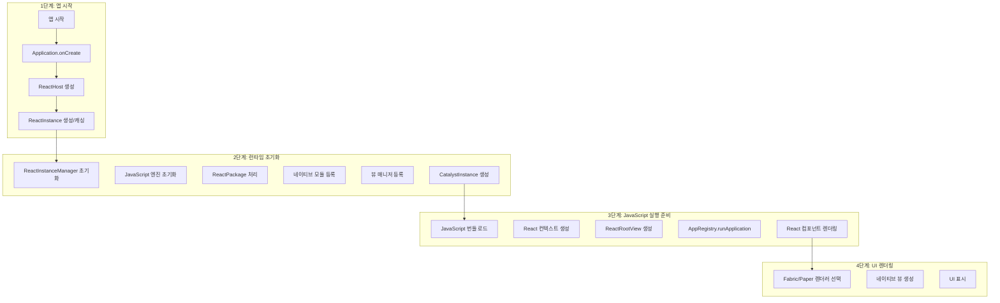

'쉽게 얻은 정보를 연결한다'. 정보는 급속도로 얻기 쉬워졌다. 한동안 블로그 글에 대한 동기 부여를 얻기 쉽지 않았는데, 엄청나게 똑똑하고 파괴적인 녀석이 근처에 도사리고 있는 바람에 여전히 블로그 글이 유효한 정보 전달 채널인가에 대한 고민이 많았다.

블로그를 통해 정보를 얻고자 하는 분들의 참여 시간 또한 현저히 줄어들었다.

AI를 통해 정보는 쉽게 얻어진다. 한동안 블로그 글에 대한 동기부여를 얻기 쉽지 않았다. 엄청나게 똑똑하고 파괴적인 녀석이 근처에 도사림. → 블로그 글이 여전히 유효한가. 쉽게 얻은 수도 없는 정보를 연결하는 역할로 사용해보고자 한다.

리엑트 네이티브의 런타임은 안드로이드, iOS 영역의 실행과 자바스크립트 레벨의 생명 주기가 시작되는 과정까지 모두 파악해야 하기 때문에 참 쉽지 않은 일이어서 초고만 적다 포기한게 여러번이다. 핵심 체인이라고 하면, 앱 부팅 -> JS 엔진 초기화 -> JS 번들
실행 -> 네이티브 호출인데, 나름대로 나눈 런타임 체인을 시각화해보니 노드가 너무 작게 표현될 정도로 방대하다.



_런타임 체인을 살펴보는 과정은 안드로이드와 iOS 두 과정으로 분리해 진행되며, 새로운 아키텍처가 기본값이 된 0.79 버전을 기준으로 작성합니다._

## 리엑트 네이티브의 새로운 아키텍처 런타임 초기화 과정

새로운 아키텍처의 런타임 초기화는 크게 네 단계로 나뉜다. 각 단계별로 실제 구현체를 살펴보면서 어떻게 자바스크립트 엔진이 올라오는지 파악해보자.


### 앱 시작: 안드로이드 앱의 첫 진입점

안드로이드 앱이 시작되면 가장 먼저 `Application` 클래스가 인스턴스화된다. 리엑트 네이티브 앱의 경우 `MainApplication`이 이 역할을 담당하며,
여기서 리엑트 네이티브 런타임의 전체 생명주기가 시작된다.

```kt
// private/helloworld/android/app/src/main/java/com/helloworld/MainApplication.kt
class MainApplication : Application(), ReactApplication {
  // ReactApplication 인터페이스 구현으로 두 가지 Host 제공
  override val reactNativeHost: ReactNativeHost = // Legacy Architecture
  override val reactHost: ReactHost = // New Architecture

  override fun onCreate() {
    super.onCreate()
    loadReactNative(this) // 아키텍처 선택
  }
}
```

현재 리엑트 네이티브는 점진적인 마이그레이션이 가능하도록 두 가지 `Host`를 모두 제공한다.
`ReactApplication` 인터페이스는 레거시와 새로운 아키텍처를 모두 지원하도록 설계되어 있다.

### Application.onCreate: 런타임 초기화의 시작점

`Application.onCreate()`는 `loadReactNative(this)`를 통해 리엑트 네이티브 런타임을 초기화 한다.
이 함수는 빌드 설정에 따라 어떤 아키텍처를 사용할지 결정한다.

```java
// android/app/build/generated/source/react-native/com/facebook/react/ReactNativeApplicationEntryPoint.java
public class ReactNativeApplicationEntryPoint {
  public static void loadReactNative(Context context) {
    try {
       SoLoader.init(context, OpenSourceMergedSoMapping.INSTANCE);
    } catch (IOException error) {
      throw new RuntimeException(error);
    }

    if (BuildConfig.IS_NEW_ARCHITECTURE_ENABLED) {
      DefaultNewArchitectureEntryPoint.load(); // 새로운 아키텍처 초기화
    }
  }
}
```

이렇게 선정된 아키텍처 분기는 이후 `ReactActivity`, `ReactFragment`에서 `ReactApplication.getReactHost()` 또는 `ReactApplication.getReactNativeHost()` 중 어느 것을 사용할지 결정하게 된다.

```kt
// packages/react-native/ReactAndroid/src/main/java/com/facebook/react/ReactFragment.kt
public override fun onCreate(savedInstanceState: Bundle?) {
    super.onCreate(savedInstanceState)
    // ... 기타 설정 ...

    reactDelegate =
        if (ReactNativeNewArchitectureFeatureFlags.enableBridgelessArchitecture()) {
          ReactDelegate(requireActivity(), reactHost, mainComponentName, launchOptions)
        } else {
          @Suppress("DEPRECATION")
          ReactDelegate(
              requireActivity(), reactNativeHost, mainComponentName, launchOptions, fabricEnabled)
        }
}
```

```java
// packages/react-native/ReactAndroid/src/main/java/com/facebook/react/ReactDelegate.java

// 앱 로드 시
public void loadApp(String appKey) {
    // New Architecture (Bridgeless)
    if (ReactNativeNewArchitectureFeatureFlags.enableBridgelessArchitecture()) {
      if (mReactSurface == null && mReactHost != null) {
        mReactSurface = mReactHost.createSurface(mActivity, appKey, mLaunchOptions);
      }
      Objects.requireNonNull(mReactSurface).start(); // ReactHost.start() 호출
    } else {
      // Legacy Architecture
      if (mReactRootView != null) {
        throw new IllegalStateException("Cannot loadApp while app is already running.");
      }
      mReactRootView = createRootView();
      if (getReactNativeHost() != null) {
        mReactRootView.startReactApplication(
            getReactNativeHost().getReactInstanceManager(), appKey, mLaunchOptions); // ReactInstanceManager 사용
      }
    }
}

// 현재 ReactContext 가져올 때
public @Nullable ReactContext getCurrentReactContext() {
    if (ReactNativeNewArchitectureFeatureFlags.enableBridgelessArchitecture()) {
      if (mReactHost != null) {
        return mReactHost.getCurrentReactContext(); // ReactHost 사용
      } else {
        return null;
      }
    } else {
      return getReactInstanceManager().getCurrentReactContext(); // ReactInstanceManager 사용
    }
}

// 리로드 시
public void reload() {
    // ... DevSupportManager 확인 ...

    if (ReactNativeNewArchitectureFeatureFlags.enableBridgelessArchitecture()) {
      if (mReactHost != null) {
        mReactHost.reload("ReactDelegate.reload()"); // ReactHost.reload()
      }
    } else {
      UiThreadUtil.runOnUiThread(() -> {
        if (mReactNativeHost != null && mReactNativeHost.hasInstance()) {
          mReactNativeHost.getReactInstanceManager().recreateReactContextInBackground(); // ReactInstanceManager 재생성
        }
      });
    }
}
```

### ReactHost 생성: Bridgeless Mode의 핵심

새로운 아키텍처에서는 `ReactHost` 인터페이스가 런타임 관리의 중심이 된다. 기존의 `ReactNativeHost`와 달리, `ReactHost`는 `Bridgeless Mode`를 위해 설계되었다.

```kt
// private/helloworld/android/app/src/main/java/com/helloworld/MainApplication.kt
// MainApplication.kt에서 ReactHost 생성
override val reactHost: ReactHost
  get() = getDefaultReactHost(applicationContext, reactNativeHost)
  ...
```

여기서 `getDefaultReactHost()`는 복잡한 설정을 단순화하는 팩토리 메서드다. 내부를 살펴보면 다음과 같은 과정이 포함되어 있다.

- `JSRuntimeFactory`: 기본값으로 `HermesInstance()`를 사용하여 `Hermes` 엔진을 선택
- `ComponentFactory`: `Fabric` 렌더러를 위한 컴포넌트 팩토리 등록
- `ReactHostImpl`: 실제 구현체로, 모든 설정을 받아 런타임을 관리

```kt
// packages/react-native/ReactAndroid/src/main/java/com/facebook/react/defaults/DefaultReactHost.kt
@JvmStatic
public fun getDefaultReactHost(
    context: Context,
    packageList: List<ReactPackage>,
    jsMainModulePath: String = "index",
    jsBundleAssetPath: String = "index",
    jsRuntimeFactory: JSRuntimeFactory? = null, // 기본값: Hermes
    useDevSupport: Boolean = ReactBuildConfig.DEBUG,
): ReactHost {
  if (reactHost == null) {
    // JSBundleLoader 설정
    val bundleLoader = JSBundleLoader.createAssetLoader(context, "assets://$jsBundleAssetPath", true)

    // TurboModule 델리게이트 설정
    val defaultTmmDelegateBuilder = DefaultTurboModuleManagerDelegate.Builder()

    // ReactHostDelegate 생성
    val defaultReactHostDelegate = DefaultReactHostDelegate(
        jsMainModulePath = jsMainModulePath,
        jsBundleLoader = bundleLoader,
        reactPackages = packageList,
        jsRuntimeFactory = jsRuntimeFactory ?: HermesInstance(), // 기본값: Hermes
    )

    // ComponentFactory 설정 (Fabric용)
    val componentFactory = ComponentFactory()
    DefaultComponentsRegistry.register(componentFactory)

    // 최종 ReactHostImpl 생성
    reactHost = ReactHostImpl(
        context,
        defaultReactHostDelegate,
        componentFactory,
        true, /* allowPackagerServerAccess */
        useDevSupport,
    )
  }
  return reactHost as ReactHost
}
```

### ReactInstance 생성/관리: 실제 자바스크립트 런타임

`ReactHost`가 생성되면, 이제 실제 자바스크립트 런타임인 `ReactInstance`를 생성하고 관리한다. 이는 `ReactHost.start()` 메서드를 통해 이루어진다.

```kt
// packages/react-native/ReactAndroid/src/main/java/com/facebook/react/ReactHost.kt
public interface ReactHost {
  /**
   * This function can be used to initialize the ReactInstance in a background thread
   * before a surface needs to be rendered.
   */
  public fun start(): TaskInterface<Void>

  /** The current ReactContext associated with ReactInstance */
  public val currentReactContext: ReactContext?

  /** Entrypoint to reload the ReactInstance */
  public fun reload(reason: String): TaskInterface<Void>

  /** Entrypoint to destroy the ReactInstance */
  public fun destroy(reason: String, ex: Exception?): TaskInterface<Void>
}
```

`ReactHost.start()`가 호출되면, 다음과 같은 과정이 진행된다.

- JSI Runtime 초기화: Hermes 엔진이 C++ 레벨에서 초기화
- TurboModule 등록: 네이티브 모듈들이 JSI를 통해 직접 바인딩
- Fabric 활성화: 새로운 렌더러가 초기화되어 UI 컴포넌트 관리
- JavaScript 번들 로드: Metro에서 번들링된 JS 코드 실행

Legacy vs New Architecture 비교
이 시점에서 Legacy Architecture와 New Architecture의 차이가 명확해진다:

| 구분          | Legacy Architecture       | New Architecture |
| ------------- | ------------------------- | ---------------- |
| 런타임 관리   | ReactInstanceManager      | ReactHost        |
| JS 엔진 연결  | Bridge (비동기 메시지)    | JSI (직접 호출)  |
| 네이티브 모듈 | Native Modules            | TurboModules     |
| 렌더러        | Paper (Legacy)            | Fabric           |
| 초기화 방식   | getReactInstanceManager() | start()          |

# React Native iOS 런타임 아키텍처 완전 분석

최근 React Native로 iOS 앱 개발을 진행하면서 늘 궁금했던 것이 있었다. "JavaScript 코드가 어떻게 iOS 네이티브 앱으로 동작하는 걸까?" 안드로이드 런타임에 대해서는 어느 정도 정리했지만, iOS는 또 다른 세계였다. Objective-C와 Swift가 혼재하고, UIKit과 연동되는 방식이 Android와는 완전히 달랐기 때문이다.

특히 React Native 1000.0.0 버전부터는 New Architecture가 기본이 되면서 기존의 브릿지 기반 아키텍처에서 브릿지리스(Bridgeless) 아키텍처로 완전히 전환되었다. 이번 기회에 iOS 런타임의 내부 구조를 코드 레벨에서 깊이 파헤쳐보려 한다.

## 목차

1. [iOS 런타임 개요](#ios-런타임-개요)
2. [아키텍처 변화: Bridge에서 Bridgeless로](#아키텍처-변화-bridge에서-bridgeless로)
3. [앱 시작과 ReactHost 초기화](#앱-시작과-reacthost-초기화)
4. [JavaScript 엔진과 JSI](#javascript-엔진과-jsi)
5. [TurboModules 시스템](#turbomodules-시스템)
6. [Fabric UI 렌더링](#fabric-ui-렌더링)
7. [런타임 통신 메커니즘](#런타임-통신-메커니즘)
8. [마치면서](#마치면서)

## iOS 런타임 개요

React Native iOS 런타임을 이해하기 위해서는 먼저 현재 사용되고 있는 New Architecture의 전체적인 구조를 파악해야 한다. 기존 Legacy Architecture와는 완전히 다른 접근 방식을 사용하고 있기 때문이다.

```javascript
// packages/react-native/Libraries/ReactNative/renderApplication.js#L87-L117
const newArchitecture = !!fabric;
if (!newArchitecture) {
  warnOnce(
    '[OSS][OldArchDeprecatedWarning]',
    'The app is running using the Legacy Architecture. The Legacy Architecture is deprecated and will be removed in a future version of React Native. Please consider migrating to the New Architecture. For more information, please see https://reactnative.dev/blog/2024/10/23/the-new-architecture-is-here'
  );
}
```

이 코드에서 볼 수 있듯이, 현재 버전에서는 Fabric이 활성화되어 있으면 New Architecture로 간주한다. 그리고 Legacy Architecture를 사용하고 있다면 경고 메시지를 출력한다.

## 아키텍처 변화: Bridge에서 Bridgeless로

### Legacy Architecture의 한계

기존 아키텍처에서는 `RCTBridge`를 중심으로 모든 통신이 이루어졌다:

```objective-c
// packages/react-native/React/Base/RCTBridge.mm#L351-L400
- (instancetype)initWithDelegate:(id<RCTBridgeDelegate>)delegate
                       bundleURL:(NSURL *)bundleURL
                  moduleProvider:(RCTBridgeModuleListProvider)block
                   launchOptions:(NSDictionary *)launchOptions
{
  if (self = [super init]) {
    RCTEnforceNewArchitectureValidation(RCTNotAllowedInBridgeless, self, nil);
    _delegate = delegate;
    _bundleURL = bundleURL;
    _moduleProvider = block;
    _launchOptions = [launchOptions copy];
    _inspectorHostDelegate = std::make_unique<RCTBridgeHostTargetDelegate>(self);

    [self setUp];
  }
  return self;
}
```

여기서 주목할 점은 `RCTEnforceNewArchitectureValidation(RCTNotAllowedInBridgeless, self, nil);` 라인이다. 이는 브릿지리스 모드에서는 기존 브릿지를 사용할 수 없다는 것을 명시적으로 검증하는 코드다.

### New Architecture의 시작점

새로운 아키텍처에서는 `ReactHost`가 모든 것의 시작점이 된다:

```objective-c
// packages/react-native/Libraries/AppDelegate/RCTRootViewFactory.mm#L251-L289
- (RCTHost *)createReactHost:(NSDictionary *)launchOptions
{
  __weak __typeof(self) weakSelf = self;
  RCTBundleURLBlock bundleUrlBlock = ^{
    auto *strongSelf = weakSelf;
    return strongSelf.bundleURL;
  };

  RCTRootViewFactoryConfiguration *configuration =
      [[RCTRootViewFactoryConfiguration alloc] initWithBundleURLBlock:bundleUrlBlock
                                                       newArchEnabled:self.fabricEnabled
                                                   turboModuleEnabled:self.turboModuleEnabled
                                                    bridgelessEnabled:self.bridgelessEnabled];

  // 중요한 부분: 브릿지리스가 활성화되었는지 확인
  if (self.bridgelessEnabled) {
    return [self createReactHostWithConfiguration:configuration];
  } else {
    return [self createBridgeBasedReactHost:configuration];
  }
}
```

## 앱 시작과 ReactHost 초기화

iOS 앱이 시작되면 `AppDelegate`에서 React Native 런타임 초기화가 시작된다. 이 과정을 단계별로 살펴보자.

### 1단계: AppDelegate에서 ReactHost 생성

```objective-c
// AppDelegate.mm (실제 앱에서)
- (BOOL)application:(UIApplication *)application didFinishLaunchingWithOptions:(NSDictionary *)launchOptions
{
  self.moduleName = @"YourAppName";
  self.initialProps = @{};

  // ReactHost 생성 - 브릿지리스 아키텍처의 진입점
  return [super application:application didFinishLaunchingWithOptions:launchOptions];
}
```

### 2단계: ReactHost 내부 초기화

ReactHost 내부에서는 다음과 같은 초기화 과정을 거친다:

```cpp
// packages/react-native/ReactCxxPlatform/react/runtime/ReactHost.cpp#L335-L370
void ReactHost::start() {
  // JavaScript 엔진 설정
  auto jsEngine = std::make_shared<HermesExecutorFactory>();

  // TurboModule 제공자 설정
  TurboModuleManagerDelegate turboModuleProvider =
    [this](const std::string& name, const std::shared_ptr<CallInvoker>& jsInvoker)
    -> std::shared_ptr<TurboModule> {

    if (name == "SourceCodeModule") {
      return std::make_shared<SourceCodeModule>(jsInvoker, devServerHelper);
    } else if (name == "WebSocketModule") {
      return std::make_shared<WebSocketModule>(jsInvoker, webSocketClientFactory);
    } else if (name == "NativeExceptionsManager") {
      return std::make_shared<NativeExceptionsManager>(onJsError, jsInvoker);
    }

    return nullptr;
  };

  // TurboModule 바인딩 설치
  TurboModuleBinding::install(runtime, turboModuleProvider);
}
```

### 3단계: Surface 생성과 관리

ReactHost는 개별 React 컴포넌트 트리를 관리하기 위해 Surface를 생성한다:

```objective-c
// packages/react-native/ReactAndroid/src/main/java/com/facebook/react/ReactDelegate.kt#L303-L325
public fun loadApp(appKey: String) {
  // 브릿지리스 아키텍처 확인
  if (ReactNativeNewArchitectureFeatureFlags.enableBridgelessArchitecture()) {
    val reactHost = reactHost
    if (reactSurface == null && reactHost != null) {
      // Surface 생성 - 각 React 컴포넌트 트리를 관리
      reactSurface = reactHost.createSurface(activity, appKey, launchOptions)
    }
    reactSurface?.start()
  } else {
    // Legacy 아키텍처의 경우
    check(internalReactRootView == null) { "Cannot loadApp while app is already running." }
    internalReactRootView = createRootView()
    if (reactNativeHost != null) {
      internalReactRootView?.startReactApplication(
          reactNativeHost?.reactInstanceManager, appKey, launchOptions)
    }
  }
}
```

## JavaScript 엔진과 JSI

### Hermes 엔진 초기화

React Native iOS에서는 기본적으로 Hermes JavaScript 엔진을 사용한다:

```objective-c
// packages/react-native/ReactCommon/hermes/executor/HermesExecutorFactory.h#L16-L50
class HermesExecutorFactory : public JSExecutorFactory {
 public:
  explicit HermesExecutorFactory(
      JSIExecutor::RuntimeInstaller runtimeInstaller,
      const JSIScopedTimeoutInvoker& timeoutInvoker =
          JSIExecutor::defaultTimeoutInvoker,
      ::hermes::vm::RuntimeConfig runtimeConfig = defaultRuntimeConfig())
      : runtimeInstaller_(runtimeInstaller),
        timeoutInvoker_(timeoutInvoker),
        runtimeConfig_(std::move(runtimeConfig)) {
    assert(timeoutInvoker_ && "Should not have empty timeoutInvoker");
  }

  std::unique_ptr<JSExecutor> createJSExecutor(
      std::shared_ptr<ExecutorDelegate> delegate,
      std::shared_ptr<MessageQueueThread> jsQueue) override;

 private:
  static ::hermes::vm::RuntimeConfig defaultRuntimeConfig();

  JSIExecutor::RuntimeInstaller runtimeInstaller_;
  JSIScopedTimeoutInvoker timeoutInvoker_;
  ::hermes::vm::RuntimeConfig runtimeConfig_;
  bool enableDebugger_ = true;
  std::string debuggerName_ = "Hermes React Native";
};
```

### JSI를 통한 직접 통신

JSI(JavaScript Interface)는 JavaScript와 네이티브 코드 간의 직접적인 통신을 가능하게 한다. 기존 브릿지의 JSON 직렬화/역직렬화 오버헤드를 완전히 제거한다:

```cpp
// packages/react-native/ReactCommon/jsi/jsi/jsi.h#L275-L320
class Runtime {
 public:
  virtual ~Runtime();

  // JavaScript 코드 실행
  virtual Value evaluateJavaScript(
      const std::shared_ptr<const Buffer>& buffer,
      const std::string& sourceURL) = 0;

  // 함수 호출 - 직접 메모리 접근
  virtual Value call(
      const Function& func,
      const Value& jsThis,
      const Value* args,
      size_t count) = 0;

  // 객체 속성 접근 - 직렬화 없이 직접 접근
  virtual Value getProperty(const Object&, const PropNameID& name) = 0;
  virtual void setProperty(
      const Object&,
      const PropNameID& name,
      const Value& value) = 0;
};
```

### 호스트 함수 바인딩

네이티브 함수를 JavaScript에 직접 노출시키는 방법:

```cpp
// packages/react-native/ReactCommon/react/nativemodule/core/ReactCommon/TurboModuleBinding.cpp#L95-L145
void TurboModuleBinding::install(
    jsi::Runtime& runtime,
    TurboModuleProviderFunctionType&& moduleProvider,
    TurboModuleProviderFunctionType&& legacyModuleProvider,
    std::shared_ptr<LongLivedObjectCollection> longLivedObjectCollection) {

  // 브릿지리스 모드 감지
  auto isBridgeless = runtime.global().hasProperty(runtime, "RN$Bridgeless");

  if (!isBridgeless) {
    // Legacy 모드: __turboModuleProxy 사용
    runtime.global().setProperty(
        runtime,
        "__turboModuleProxy",
        jsi::Function::createFromHostFunction(
            runtime,
            jsi::PropNameID::forAscii(runtime, "__turboModuleProxy"),
            1,
            [binding = TurboModuleBinding(
                 runtime,
                 std::move(moduleProvider),
                 longLivedObjectCollection)](
                jsi::Runtime& rt,
                const jsi::Value& /*thisVal*/,
                const jsi::Value* args,
                size_t count) {

              std::string moduleName = args[0].getString(rt).utf8(rt);
              return binding.getModule(rt, moduleName);
            }));
    return;
  }

  // 브릿지리스 모드: nativeModuleProxy 사용
  defineReadOnlyGlobal(runtime, "RN$UnifiedNativeModuleProxy", true);
  defineReadOnlyGlobal(
      runtime,
      "nativeModuleProxy",
      jsi::Object::createFromHostObject(
          runtime,
          std::make_shared<BridgelessNativeModuleProxy>(
              runtime,
              std::move(moduleProvider),
              std::move(legacyModuleProvider),
              longLivedObjectCollection)));
}
```

## TurboModules 시스템

TurboModules는 New Architecture의 핵심 요소 중 하나로, 지연 로딩과 타입 안전성을 제공한다.

### TurboModuleManager 초기화

```kt
// packages/react-native/ReactAndroid/src/main/java/com/facebook/react/internal/turbomodule/core/TurboModuleManager.kt#L39-L85
@OptIn(FrameworkAPI::class)
public class TurboModuleManager(
    runtimeExecutor: RuntimeExecutor,
    private val delegate: TurboModuleManagerDelegate?,
    jsCallInvokerHolder: CallInvokerHolder,
    nativeMethodCallInvokerHolder: NativeMethodCallInvokerHolder
) : TurboModuleRegistry {

  init {
    mHybridData = initHybrid(
        runtimeExecutor,
        jsCallInvokerHolder as CallInvokerHolderImpl,
        nativeMethodCallInvokerHolder as NativeMethodCallInvokerHolderImpl,
        delegate)

    // JSI 바인딩 설치
    installJSIBindings(shouldEnableLegacyModuleInterop())

    // 즉시 초기화 모듈 목록
    eagerInitModuleNames = delegate?.getEagerInitModuleNames() ?: emptyList()
  }
}
```

### 모듈 지연 로딩 메커니즘

TurboModules의 핵심인 지연 로딩 구현:

```kt
// packages/react-native/ReactAndroid/src/main/java/com/facebook/react/internal/turbomodule/core/TurboModuleManager.kt#L169-L209
override fun getModule(moduleName: String): NativeModule? {
  val moduleHolder: ModuleHolder?

  synchronized(moduleCleanupLock) {
    if (moduleCleanupStarted) {
      FLog.e(
          TAG,
          "getModule(): Tried to get module \"%s\", but TurboModuleManager was tearing down",
          moduleName)
      return null
    }

    // 모듈이 처음 요청되는 경우 ModuleHolder 생성
    if (!moduleHolders.containsKey(moduleName)) {
      moduleHolders[moduleName] = ModuleHolder()
    }
    moduleHolder = moduleHolders[moduleName]
  }

  if (moduleHolder == null) {
    FLog.e(TAG, "getModule(): moduleHolder was null for \"%s\"", moduleName)
    return null
  }

  TurboModulePerfLogger.moduleCreateStart(moduleName, moduleHolder.moduleId)
  val module = getOrCreateModule(moduleName, moduleHolder, true)

  if (module != null) {
    TurboModulePerfLogger.moduleCreateEnd(moduleName, moduleHolder.moduleId)
  } else {
    TurboModulePerfLogger.moduleCreateFail(moduleName, moduleHolder.moduleId)
  }

  return module
}
```

### C++ TurboModule 예시

실제 TurboModule이 어떻게 구현되는지 살펴보자:

```cpp
// packages/react-native/ReactCommon/react/nativemodule/defaults/DefaultTurboModules.cpp#L21-L48
/* static */ std::shared_ptr<TurboModule> DefaultTurboModules::getTurboModule(
    const std::string& name,
    const std::shared_ptr<CallInvoker>& jsInvoker) {

  if (name == NativeReactNativeFeatureFlags::kModuleName) {
    return std::make_shared<NativeReactNativeFeatureFlags>(jsInvoker);
  }

  if (name == NativeMicrotasks::kModuleName) {
    return std::make_shared<NativeMicrotasks>(jsInvoker);
  }

  if (name == NativeIdleCallbacks::kModuleName) {
    return std::make_shared<NativeIdleCallbacks>(jsInvoker);
  }

  if (name == NativeDOM::kModuleName) {
    return std::make_shared<NativeDOM>(jsInvoker);
  }

#ifdef REACT_NATIVE_DEBUGGER_ENABLED_DEVONLY
  if (name == DevToolsRuntimeSettingsModule::kModuleName) {
    return std::make_shared<DevToolsRuntimeSettingsModule>(jsInvoker);
  }
#endif

  return nullptr;
}
```

## Fabric UI 렌더링

Fabric은 New Architecture의 UI 렌더링 시스템으로, 동기화된 레이아웃과 더 나은 성능을 제공한다.

### FabricUIManager 초기화

```java
// packages/react-native/ReactAndroid/src/main/java/com/facebook/react/fabric/FabricUIManager.java#L211-L242
public FabricUIManager(
    ReactApplicationContext reactContext,
    ViewManagerRegistry viewManagerRegistry,
    BatchEventDispatchedListener batchEventDispatchedListener) {

  mDispatchUIFrameCallback = new DispatchUIFrameCallback(reactContext);
  mReactApplicationContext = reactContext;
  mMountingManager = new MountingManager(viewManagerRegistry, mMountItemExecutor);
  mMountItemDispatcher = new MountItemDispatcher(mMountingManager, new MountItemDispatchListener());
  mEventDispatcher = new FabricEventDispatcher(reactContext, new FabricEventEmitter(this));
  mBatchEventDispatchedListener = batchEventDispatchedListener;
  mReactApplicationContext.addLifecycleEventListener(this);

  mViewManagerRegistry = viewManagerRegistry;
  mReactApplicationContext.registerComponentCallbacks(viewManagerRegistry);
}
```

### Surface 시작과 관리

```java
// packages/react-native/ReactAndroid/src/main/java/com/facebook/react/fabric/FabricUIManager.java#L321-L362
@Override
@AnyThread
@ThreadConfined(ANY)
public <T extends View> int startSurface(
    final T rootView,
    final String moduleName,
    final @Nullable WritableMap initialProps,
    int widthMeasureSpec,
    int heightMeasureSpec) {

  final int rootTag = ((ReactRoot) rootView).getRootViewTag();
  Context context = rootView.getContext();
  ThemedReactContext reactContext =
      new ThemedReactContext(mReactApplicationContext, context, moduleName, rootTag);

  if (ReactNativeFeatureFlags.enableFabricLogs()) {
    FLog.d(TAG, "Starting surface for module: %s and reactTag: %d", moduleName, rootTag);
  }

  mMountingManager.startSurface(rootTag, reactContext, rootView);

  // UI 스레드에서 실행되는 경우 ViewportOffset 사용
  @SuppressLint("WrongThread")
  Point viewportOffset =
      UiThreadUtil.isOnUiThread() ? RootViewUtil.getViewportOffset(rootView) : new Point(0, 0);

  Assertions.assertNotNull(mBinding, "Binding in FabricUIManager is null");
  mBinding.startSurfaceWithConstraints(
      rootTag,
      moduleName,
      (NativeMap) initialProps,
      getMinSize(widthMeasureSpec),
      getMaxSize(widthMeasureSpec),
      getMinSize(heightMeasureSpec),
      getMaxSize(heightMeasureSpec),
      viewportOffset.x,
      viewportOffset.y,
      I18nUtil.getInstance().isRTL(context),
      I18nUtil.getInstance().doLeftAndRightSwapInRTL(context));
  return rootTag;
}
```

### 렌더러 선택 로직

Fabric과 Paper(Legacy) 렌더러 중 어떤 것을 사용할지 결정하는 로직:

```javascript
// packages/react-native/Libraries/ReactNative/RendererImplementation.js#L25-L60
export function renderElement({
  element,
  rootTag,
  useFabric,
  useConcurrentRoot,
}: {
  element: React.MixedElement,
  rootTag: number,
  useFabric: boolean,
  useConcurrentRoot: boolean,
}): void {
  if (useFabric) {
    // Fabric 렌더러 사용 (New Architecture)
    require('../Renderer/shims/ReactFabric').default.render(
      element,
      rootTag,
      null,
      useConcurrentRoot,
      {
        onCaughtError,
        onUncaughtError,
        onRecoverableError,
      }
    );
  } else {
    // Paper 렌더러 사용 (Legacy Architecture)
    require('../Renderer/shims/ReactNative').default.render(
      element,
      rootTag,
      undefined,
      {
        onCaughtError,
        onUncaughtError,
        onRecoverableError,
      }
    );
  }
}
```

## 런타임 통신 메커니즘

### BridgelessReactContext

브릿지리스 환경에서의 React 컨텍스트 관리:

```kt
// packages/react-native/ReactAndroid/src/main/java/com/facebook/react/runtime/BridgelessReactContext.kt#L46-L104
internal class BridgelessReactContext(context: Context, private val reactHost: ReactHostImpl) :
    ReactApplicationContext(context), EventDispatcherProvider {

  private val sourceURLRef = AtomicReference<String>()
  private val TAG: String = this.javaClass.simpleName

  init {
    if (ReactNativeNewArchitectureFeatureFlags.useFabricInterop()) {
      initializeInteropModules()
    }
  }

  override fun getEventDispatcher(): EventDispatcher = reactHost.eventDispatcher

  @OptIn(FrameworkAPI::class)
  override fun getCatalystInstance(): CatalystInstance {
    if (ReactBuildConfig.UNSTABLE_ENABLE_MINIFY_LEGACY_ARCHITECTURE) {
      throw UnsupportedOperationException(
          "CatalystInstance is not supported when Bridgeless mode is enabled.")
    }
    Log.w(
        TAG,
        "[WARNING] Bridgeless doesn't support CatalystInstance. Accessing an API that's not part of" +
            " the new architecture is not encouraged usage.")
    return BridgelessCatalystInstance(reactHost)
  }

  @Deprecated("DO NOT USE, this method will be removed in the near future.")
  override fun isBridgeless(): Boolean = true

  override fun hasActiveReactInstance(): Boolean = reactHost.isInstanceInitialized

  override fun hasReactInstance(): Boolean = reactHost.isInstanceInitialized
}
```

### JavaScript 모듈 호출

브릿지리스 환경에서 JavaScript 모듈을 호출하는 방법:

```kt
// packages/react-native/ReactAndroid/src/main/java/com/facebook/react/runtime/BridgelessReactContext.kt#L95-L125
override fun <T : JavaScriptModule> getJSModule(jsInterface: Class<T>): T? {
  mInteropModuleRegistry?.getInteropModule(jsInterface)?.let {
    return it
  }

  // JavaScript 모듈 프록시 생성
  val interfaceProxy: JavaScriptModule =
      Proxy.newProxyInstance(
          jsInterface.classLoader,
          arrayOf<Class<*>>(jsInterface),
          BridgelessJSModuleInvocationHandler(reactHost, jsInterface)) as JavaScriptModule
  @Suppress("UNCHECKED_CAST")
  return interfaceProxy as? T
}

private class BridgelessJSModuleInvocationHandler(
    private val reactHost: ReactHostImpl,
    private val jsModuleInterface: Class<out JavaScriptModule>
) : InvocationHandler {
  override fun invoke(proxy: Any, method: Method, args: Array<Any>?): Any? {
    val jsArgs: NativeArray =
        if (args != null) Arguments.fromJavaArgs(args) else WritableNativeArray()

    // ReactHost를 통해 직접 JavaScript 함수 호출
    reactHost.callFunctionOnModule(
        JavaScriptModuleRegistry.getJSModuleName(jsModuleInterface),
        method.name,
        jsArgs)
    return null
  }
}
```

### 이벤트 디스패치

```kt
// packages/react-native/ReactAndroid/src/main/java/com/facebook/react/runtime/BridgelessReactContext.kt#L135-L143
/** RCTDeviceEventEmitter.emit의 단축키 */
override fun emitDeviceEvent(eventName: String, args: Any?) {
  reactHost.callFunctionOnModule(
      "RCTDeviceEventEmitter",
      "emit",
      Arguments.fromJavaArgs(arrayOf(eventName, args)))
}
```

## 마치면서

React Native iOS 런타임에 대해 정리하면서 새로운 아키텍처의 복잡성과 동시에 엘레간스를 느낄 수 있었다. 기존 브릿지 기반 아키텍처의 한계를 극복하기 위해 도입된 브릿지리스 아키텍처는 JSI를 통한 직접 통신, TurboModules의 지연 로딩, Fabric의 동기화된 렌더링 등으로 성능을 크게 개선했다.

특히 인상 깊었던 부분은 JSI를 통해 JavaScript와 네이티브 코드가 직접 메모리를 공유하며 통신하는 방식이었다. 기존의 JSON 직렬화/역직렬화 오버헤드를 완전히 제거하면서도 타입 안전성을 확보한 것은 정말 놀라운 발전이라고 생각한다.

코드를 따라가면서 실제 구현체들을 살펴보는 것은 여전히 쉽지 않은 일이었지만, React Native가 어떻게 JavaScript 코드를 네이티브 앱으로 변환하는지 그 내부 동작을 이해할 수 있어서 의미 있는 시간이었다.

혹시 틀린 부분이나 더 자세히 설명이 필요한 부분이 있다면 언제든 피드백 주시면 감사하겠다. 긴 글 읽어주셔서 감사하다.

## Reference

- [React Native Under The Hood](https://youthfulhps.dev/react-native/metro/)
- [React Native New Architecture](https://reactnative.dev/blog/2024/10/23/the-new-architecture-is-here)
- [JSI Documentation](https://github.com/facebook/react-native/tree/main/packages/react-native/ReactCommon/jsi)
- [Fabric Renderer](https://github.com/facebook/react-native/tree/main/packages/react-native/ReactCommon/react/renderer)
- [TurboModules](https://github.com/facebook/react-native/tree/main/packages/react-native/ReactCommon/react/nativemodule)
- [Hermes Engine](https://github.com/facebook/hermes)
