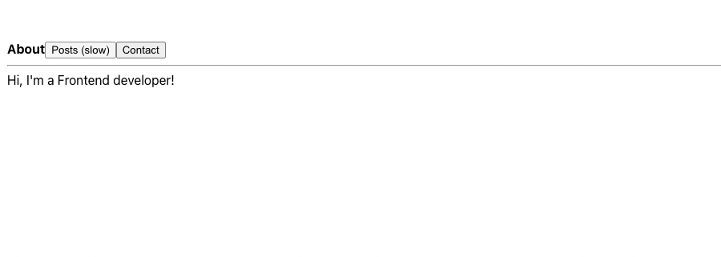

리엑트 동시성 기능을 공부하면서 어렵고 복잡한 메커니즘이지만, 결국 사용자 경험을 개선하기 위한 목표들을 추상화해서
기술적으로 풀어낸 결과물이라고 생각하면 꽤나 여운이 남습니다.

가령 현재 실행권을 가지고 있는 무거운 랜더링 연산 작업을 진행하면서도, 작업 처리 우선순위가 높은 사용자 이벤트에
대한 처리 작업이 들어와 대기 중이라면, 진행 중인 작업을 즉시 중단하고 실행권을 우선순위가 높은 작업에게 양보해서
우선적으로 처리될 수 있게 하는 동작처럼요.

간단해 보이지만 무거운 랜더링 연산 작업을 잘 개 쪼개고, 쪼개진 작업을 처리하고 우선순위가 높은 작업이 대기 중인지
확인해야 하고, 작업을 중단할 수 있어야 하며, 실행권을 양보한 후 다시 돌려받을 수 있어야 합니다.


## 우선순위

리엑트는 산발적으로 발생하는 작업들을 교통정리하고 스케쥴링, 중단, 양보할 수 있도록 모든 작업에 우선순위를
부여합니다. 마우스, 키보드 입력과 같은 이산적인 사용자 상호작용에 대한 업데이트부터, 드래그처럼 연속적인
사용자 상호작용, 네트워크 요청, setTimeout에 의해 생성된 업데이트와 같은 작업들이 모두 각각의 우선순위를
가지게 됩니다.

물론 리엑트가 지정한 작업 우선순위는 모두 사용자 경험에 대한 HCI 연구 결과가 반영되어 있습니다.
가령 화면 간 전환에서 로딩 중 상태를 너무 많이 표시하면 UX 품질이 낮아지는 문제라든지, 빠르게 처리되기를
기대하는 상호작용들과 느려도 문제없는 상호작용을 구분 짓고 이를 적용해서 우선순위를 할당하게 됩니다.

실제 리엑트에서 우선순위를 표현하는 [Lane 모델](https://github.com/facebook/react/pull/18796)
을 살펴보면 31개의 비트맵으로 표현된 우선순위들이 레인이라는 명칭으로 표현되고 있고, 더 작은 숫자로 표현된 레인부터
높은 우선순위를 가지고 표현되어 있습니다.

```js
// react-reconciler/src/ReactFiberLane.new.js

export type Lanes = number;
export type Lane = number;
export type LaneMap<T> = Array<T>;

export const TotalLanes = 31;

export const NoLanes: Lanes = /*                        */ 0b0000000000000000000000000000000;
export const NoLane: Lane = /*                          */ 0b0000000000000000000000000000000;
export const SyncLane: Lane = /*                        */ 0b0000000000000000000000000000001;
export const InputContinuousHydrationLane: Lane = /*    */ 0b0000000000000000000000000000010;
export const InputContinuousLane: Lane = /*             */ 0b0000000000000000000000000000100;
export const DefaultHydrationLane: Lane = /*            */ 0b0000000000000000000000000001000;
export const DefaultLane: Lane = /*                     */ 0b0000000000000000000000000010000;
const TransitionHydrationLane: Lane = /*                */ 0b0000000000000000000000000100000;
const TransitionLanes: Lanes = /*                       */ 0b0000000001111111111111111000000;
const TransitionLane1: Lane = /*                        */ 0b0000000000000000000000001000000;
...
const RetryLanes: Lanes = /*                            */ 0b0000111110000000000000000000000;
const RetryLane1: Lane = /*                             */ 0b0000000010000000000000000000000;
...

export const SomeRetryLane: Lane = RetryLane1;
export const SelectiveHydrationLane: Lane = /*          */ 0b0001000000000000000000000000000;
const NonIdleLanes: Lanes = /*                          */ 0b0001111111111111111111111111111;
export const IdleHydrationLane: Lane = /*               */ 0b0010000000000000000000000000000;
export const IdleLane: Lane = /*                        */ 0b0100000000000000000000000000000;
export const OffscreenLane: Lane = /*                   */ 0b1000000000000000000000000000000;
```

- _SyncLane, 이산적인(discrete) 사용자 상호 작용에 대한 업데이트_
- _InputContinuousLane, 연속적인(continuous) 사용자 상호 작용에 대한 업데이트_
- _DefaultLane, setTimeout, 네트워크 요청 등에 의해 생성된 업데이트_
- _TransitionLane, Suspense, useTransition, useDefferredValue에 의해 생성된 업데이트_

레인들 중에서 큰 비중을 차지하는 `TransitionLane`은 비교적 낮은 우선순위를 가지고 있는데요. 해당 레인들은
이 글의 주제처럼, 긴급한 작업에 인위적으로 낮은 우선순위를 부여할 때 할당받을 수 있는 레인들입니다. 그리고
이후 살펴볼 훅들은 긴급한 작업에 대한 업데이트에 인위적으로 낮은 우선순위를 부여할 때 사용할 수 있습니다.

_우선순위에 대해 더 자세히 알아보고 싶다면, [동시성 메커니즘; 우선순위](https://youthfulhps.dev/react/react-concurrent-mode-01/#%EB%8F%99%EC%8B%9C%EC%84%B1-%EB%A9%94%EC%BB%A4%EB%8B%88%EC%A6%98-%EC%9A%B0%EC%84%A0%EC%88%9C%EC%9C%84)
를 참고하시면 좋습니다._

## useDeferredValue

`useDeferredValue()`는 일부 UI 업데이트를 연기할 수 있도록 해주는 훅입니다. 훅에 초깃값으로 전달한
상태 값의 업데이트 우선순위를 Transition으로 낮춥니다.

가령 검색창 입력값이 변경됨에 따라 쿼리를 생성해서 API 요청을 보내야 하는 경우, 사용성을 고려하여 입력창에
입력된 값 변경이 긴급하게 업데이트되어야 합니다. 하지만, 입력값의 완성도를 고려하지 않고 모든 입력값 변경에
요청 이펙트를 발생시키는 것은 좋지 못하다는 걸 잘 알고 있습니다. `useDeferredValue()`는 어쩌면 디바운스
기법을 대체할 수 있는 훅일 수도 있겠습니다.

다음 예제와 같이 입력으로 받은 검색어를 통해 `AlbumList` 컴포넌트에서 API 요청을 보낸다고 생각해봅시다.
검색어가 변경될때마다 `AlbumList`에서는 새로운 요청을 보내게 됩니다.

```tsx
import { useDeferredValue, useState, Suspense } from 'react';
import AlbumList from './AlbumList';

function AlbumSearch() {
  const [query, setQuery] = useState('');

  return (
    <div>
      <label>
        Search todo:
        <input value={query} onChange={e => setQuery(e.target.value)} />
      </label>
      <AlbumList query={query} />
    </div>
  );
}

export default AlbumSearch;
```

이제 `useDeferredValue()`를 사용해서 검색어의 완성도를 고려할 수 있도록 `AlbumList`에
속성값으로 전달되는 검색어 업데이트를 지연시켜 봅시다.

```tsx
import { useDeferredValue, useState, Suspense } from 'react';
import AlbumList from './AlbumList';

function AlbumSearch() {
  const [query, setQuery] = useState('');
  const deferredQuery = useDeferredValue(query);
  const isStale = query !== deferredQuery;

  return (
    <div>
      <label>
        Search todo:
        <input value={query} onChange={e => setQuery(e.target.value)} />
      </label>
      <AlbumList query={deferredQuery} />
    </div>
  );
}

export default AlbumSearch;
```

업데이트가 지연된 검색어를 전달함으로써 해당 검색어로 인한 사이드 이펙트 발생을 미루어 조금 더 완성도 높은
검색어에 대한 요청만 기대해 볼 수 있습니다.

## useTransition

`useTransition()`은 UI를 차단하지 않고 상태를 업데이트할 수 있는 훅입니다. `useTransition()`의
`startTransition()` 함수 내부에 정의된 상태 세터 함수의 우선순위를 낮춰 상태 업데이트로 발생된 작업을
처리할 수 있습니다.

탭을 통해 컨텐츠를 전환하는 네비게이터가 있다고 생각해 봅시다. ([예제](https://react.dev/reference/react/useTransition#usage)는 리엑트 공식 문서에서 발췌했습니다.)

```tsx
import { useState } from 'react';
import TabButton from './TabButton';
import About from './About';
import Contact from './Contact';
import PostsTab from './Posts';

function Navigator() {
  const [tab, setTab] = useState('about');

  return (
    <>
      <nav>
        <TabButton isActive={tab === 'about'} onClick={() => setTab('about')}>
          About
        </TabButton>
        <TabButton isActive={tab === 'posts'} onClick={() => setTab('posts')}>
          Posts (slow)
        </TabButton>
        <TabButton
          isActive={tab === 'contact'}
          onClick={() => setTab('contact')}
        >
          Contact
        </TabButton>
        <hr />
      </nav>
      {tab === 'about' && <About />}
      {tab === 'posts' && <PostsTab />}
      {tab === 'contact' && <Contact />}
    </>
  );
}

export default Navigator;
```

여기서 유독 `Posts` 페이지는 랜더링 과정이 1초가 걸리는 매우 무거운 작업을 수행하도록 구현되어 있어
포스트탭을 클릭하면 잠시 UI 인터렉션이 블로킹되고, 랜더링에 몰두하게 됩니다. 즉 우선순위가 높은 유저
인터렉션 처리를 할 수 없게 됩니다.



여기서 클릭을 통한 선택된 탭 전환 트리거를 `useTransition()`로 감싸주고 우선순위를 낮춰봅시다.

```tsx
import { ReactNode, useTransition } from 'react';

type TabButtonProps = {
  children: ReactNode;
  isActive: boolean;
  onClick: () => void;
};

function TabButton({ children, isActive, onClick }: TabButtonProps) {
  const [isPending, startTransition] = useTransition();
  if (isActive) {
    return <b>{children}</b>;
  }
  if (isPending) {
    return <b className="pending">{children}</b>;
  }
  return (
    <button
      onClick={() => {
        startTransition(() => {
          onClick();
        });
      }}
    >
      {children}
    </button>
  );
}

export default TabButton;
```

이제 다시 포스트탭을 클릭해 보면, UI 인터렉션이 블로킹되지 않고 활성화되어 있으며 포스트 컨텐츠를
로딩하다가 발생한 탭 전환 인터렉션에 대해 즉시 처리할 수 있게 됩니다.

리엑트에서 동시성 메커니즘을 구현하기 위해 적용된 '양보'의 개념으로, 탭 전환에 의해 발생한 랜더링 작업을
잘 개 쪼개서 작업을 진행하다가 우선순위가 높은 사용자의 인터렉션(이 예제에서는 다른 탭 클릭)이 들어왔을 때,
랜더링 작업이 소유하고 있던 실행권을 우선순위가 높은 작업 처리에 양보하는 모습을 확인할 수 있습니다.
(양보에 대한 이야기는 [여기](https://youthfulhps.dev/react/react-concurrent-mode-01/#%EB%8F%99%EC%8B%9C%EC%84%B1-%EB%A9%94%EC%BB%A4%EB%8B%88%EC%A6%98-%EC%96%91%EB%B3%B4)를 참고하시면 좋습니다!)

## 마치면서

결국 두 훅은 업데이트 작업의 우선순위를 인위적으로 낮추는데 사용하는데요. 리엑트 자체적으로 정한 우선순위와
상충하는 작업 처리를 해야 하는 케이스에 대해 우선순위를 인위적으로 변경할 수 있는 기능을 제공함으로서
작업자의 자유도를 높여주는 훅들이라 생각이 듭니다. 성능 개선과 사용자 경험 향상을 위해 더 좋은 사용 케이스들을
살펴보고 적용해 보면 좋겠습니다.

## Reference

- https://react.dev/reference/react/useDeferredValue
- https://react.dev/reference/react/useTransition
- https://iyu88.github.io//react/2022/11/01/react-concurrent-mode.html
