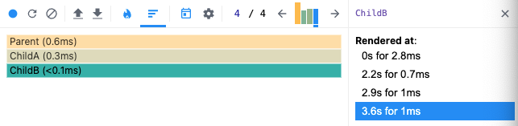
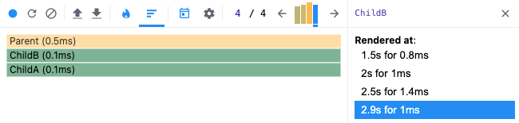
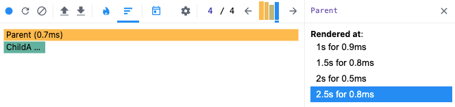

보통 어플리케이션에서 최적화를 위해 메모이제이션 기법을 통해 이전에 계산한 값을 메모리에
저장해두고, 동일하게 다시 사용할 수 있는 곳에서 재사용하여 반복적으로 발생하는 계산의
리소스를 줄이는 기법을 사용하곤 합니다.

리엑트에서도 메모이제이션을 쉽게 구현할 수 있도록 도와주는 API들이 존재하는데요.
리엑트 공식문서에서 우리가 잘 알고 있는 [useMemo](https://ko.reactjs.org/docs/hooks-reference.html#usememo)
에 대해 다음과 같이 설명하고 있습니다.

_“생성(create)” 함수와 그것의 의존성 값의 배열을 전달하세요. useMemo는 의존성이
변경되었을 때에만 메모이제이션된 값만 다시 계산 할 것입니다. 이 최적화는 모든 렌더링 시의
고비용 계산을 방지하게 해 줍니다._

사실, useMemo를 포함하여 useCallback과 React.memo에 대한 의론적인 배움을 얻고
사용해왔지만 최근 다시금 공식 문서를 읽었을 때, 문서에서 말하는 고비용의 기준은 무엇인지,
사용할 수는 있지만 보장되어 있지 않다는 문구의 의미는 무엇인지 등등, 역시 명확한 기준을 제공하지
않는 리엑트의 모습을 보면서 내가 적절하게 잘 이해하고 적재적소에 사용하며, 실질적인 성능 최적화를
이루고 있는 건가에 대한 의구심이 들었습니다.

이 글은 갑자기 낯설게 느껴지는 리엑트 메모이제이션에 대한 찝찝함을 이겨내고자 조금 더 깊게
알아보고, 가능하면 최적화에 대한 스스로의 기준도 정해보려 합니다. 비슷한 고민을 하시는 분들에게
도움이 될 수 있으면 좋겠습니다.

## useMemo, 메모이제이션된 값을 반환한다

우선 우리가 잘 알고 있는 리엑트의 메모이제이션을 위한 API를 살펴봅시다. 그 첫 번째로 useMemo는
값을 메모이제이션합니다. 같은 말로, 메모이제이션된 값을 반환합니다.

리엑트에서 사용되는 훅들은 [HookDispatcher](https://github.com/facebook/react/blob/main/packages/react-reconciler/src/ReactFiberHooks.new.js#L2599)
라는 이름으로 Disaptcher 인터페이스를 갖는 객체로 래핑되어 내부에서 공유되는데,
여기서 useMemo를 찾아볼 수 있습니다.

```ts
const HooksDispatcher...: Dispatcher = {
  ...
  useMemo: updateMemo,
}
```

_onMount, onRerender, onUpdate에 따라 사용되는 HooksDispatcher 객체가 각각 구현되어 있어
변수명에 (...)을 표기하였습니다._

여기서 useMemo는 updateMemo 라는 함수로 그 구현체가 정의되고 있는데요. 우리가 이해하고 있는
useMemo의 역할을 코드로 확인해봅시다.

```ts
function updateMemo<T>(
  nextCreate: () => T,
  deps: Array<mixed> | void | null,
): T {
  const hook = updateWorkInProgressHook();
  const nextDeps = deps === undefined ? null : deps;
  const prevState = hook.memoizedState;

  if (prevState !== null) {
    if (nextDeps !== null) {
      const prevDeps: Array<mixed> | null = prevState[1];
      if (areHookInputsEqual(nextDeps, prevDeps)) {
        return prevState[0];
      }
    }
  }

  const nextValue = nextCreate();
  hook.memoizedState = [nextValue, nextDeps];

  return nextValue;
}
```

먼저 updateMemo()의 파라미터 nextCreate, deps는 우리가 사용하는 useMemo에서
메모이제이션할 값을 연산하기 위한 콜백 함수, 그리고 특정값이 변할 때만 새롭게 메모이제이션
될 수 있도록 전달하는 deps와 대응됩니다.

```ts
function updateMemo<T>(
  nextCreate: () => T,
  deps: Array<mixed> | void | null,
): T {
  ...
}
```

함수 내부에서는 로직 전개를 위해 활용될 세 가지의 변수를 가지고 있는데, 여기서 hook
에는 어떤 값이 할당될까요?

위에서 봤던 리엑트의 Dispatcher 객체와 마찬가지로, 훅은 [Hook](https://github.com/facebook/react/blob/main/packages/react-reconciler/src/ReactFiberHooks.new.js#L159)
이라는 인터페이스를 가진 객체로 되는데, updateWorkInProgressHook()은
훅으로 관리하고자 하는 값에 대해 직전 랜더링 환경에서 대응되는 훅 객체를 반환하고,
대응되는 훅 객체가 없다면 새로운 훅 객체를 생성하여 반환합니다.

nextDeps는 파라미터로 전달받은 deps를, prevState는 직전 랜더링 환경에서 메모이제이션되어
있던 값을 참조합니다.

```ts
export type Hook = {
  memoizedState: any,
  baseState: any,
  baseQueue: Update<any, any> | null,
  queue: any,
  next: Hook | null,
};
```

```ts
  ...
  const hook = updateWorkInProgressHook();
  const nextDeps = deps === undefined ? null : deps;
  const prevState = hook.memoizedState;
  ...
```

결국, useMemo는 직전 훅 객체에 메모이제이션된 값과 전달된 deps가 null이
아니라면, deps로 전달받은 값들이 변경되지 않았음을 검증하는 단계를 거쳐
메모제이션된 값을 반환합니다.
_[areHookInputsEqual()](https://github.com/facebook/react/blob/main/packages/react-reconciler/src/ReactFiberHooks.new.js#L343)은 여기서!_

```ts
  ...
  if (prevState !== null) {
    if (nextDeps !== null) {
      // 여기서 prevState는 [value, deps]의 형태
      const prevDeps: Array<mixed> | null = prevState[1];
      if (areHookInputsEqual(nextDeps, prevDeps)) {
        return prevState[0];
      }
    }
  }
  ...
```

분기 검증에 실패했다면, 값을 얻기 위한 콜백 함수인 nextCreate()를 통해 값을 구하고,
현재 새로운 훅 객체의 memoizedState에 deps와 함께 할당합니다.

```ts
  ...
  const nextValue = nextCreate();
  hook.memoizedState = [nextValue, nextDeps];

  return nextValue;
}
```

useMemo의 구현체 코드를 보니 콜백함수와 deps를 전달하면, deps가 참조하고 있는 값이 변경되지 않는 한
메모이제이션된 값을 다시 사용하는 기능을 잘 이해하고 있음을 확인할 수 있었습니다. :)

## useCallback, 메모이제이션된 콜백을 반환한다

useCallback은 인자값으로 전달받은 콜백 함수를 메모이제이션합니다.
예상할 수 있듯, useCallback의 구현체는 useMemo 구현체와 매우 유사하기 때문에 특별히 다른 부분만 짚고 넘어가겠습니다.

useCallback는 updateCallback 이라는 함수로 그 구현체가 정의되어 있습니다.

```ts
const HooksDispatcher...: Dispatcher = {
  ...
  useCallback: updateCallback,
  ...
}
```

updateCallback은 updateMemo와 달리, 파라미터로 전달받은 callback 자체를
메모이제이션하는 것을 확인할 수 있습니다.

```ts
function updateCallback<T>(callback: T, deps: Array<mixed> | void | null): T {
  const hook = updateWorkInProgressHook();
  const nextDeps = deps === undefined ? null : deps;
  const prevState = hook.memoizedState;
  if (prevState !== null) {
    if (nextDeps !== null) {
      const prevDeps: Array<mixed> | null = prevState[1];
      if (areHookInputsEqual(nextDeps, prevDeps)) {
        return prevState[0];
      }
    }
  }

  // callback 자체를 메모이제이션한다.
  hook.memoizedState = [callback, nextDeps];
  return callback;
}
```

우리가 잘 이해하고 있는 것 처럼, useMemo는 콜백 함수의 연산 반환값을, useCallback은
콜백 자체를 메모이제이션하는 기능 차이를 확인할 수 있었습니다.

## React.memo, 마지막 랜더링된 결과를 재사용한다

React.memo는 고차 컴포넌트로서 감싼 컴포넌트 랜더링 결과를 메모이징하고, 동일한 props로
동일한 결과를 랜더링하는 경우에 대하여 다시 랜더링하지 않고, 다시 마지막으로 랜더링된 결과를
재사용합니다.

공식문서에 첨언된 내용에는, React.memo가 props 변화에만 영향을 준다고 설명합니다. 즉,
컴포넌트 리랜더링이 발생하는 케이스들 중에서 부모 컴포넌트로부터 전달받은 props의 변화로 인해
발생하는 리랜더링 최적화를 담당합니다.

[React.memo](https://github.com/facebook/react/blob/main/packages/react/src/ReactMemo.js)의 구현체를 살펴보면, 엄청난 일이 벌어질 것 같은 예상과는 달리 명확한 단일의 역할만을 담당하고
있는 고차 컴포넌트의 면모를 잘 보여줍니다.

```ts
// Symbol.for('react.memo');
import {REACT_MEMO_TYPE} from 'shared/ReactSymbols';
...

export function memo<Props>(
  type: React$ElementType,
  compare?: (oldProps: Props, newProps: Props) => boolean,
) {
  ...
  const elementType = {
    $$typeof: REACT_MEMO_TYPE,
    type,
    compare: compare === undefined ? null : compare,
  };
  ...
  return elementType;
}
```

개인적으로 생각하는 주목할 점은, React.memo로 감싼 컴포넌트가 react.memo 심볼을
요소 유형 태그로 할당받게 된다는 점입니다.

컴포넌트 재조정을 위한 작업을 생성하는 리엑트 리콘실러에서 beginWork() 라는 함수에서는
위에서 언급한 요소의 유형 태그를 통해 어떤 방식으로 업데이트를 진행할 지 결정합니다.

```ts
function beginWork(
  current: Fiber | null,
  workInProgress: Fiber,
  renderLanes: Lanes,
): Fiber | null {
  ...
  switch (workInProgress.tag) {
    ...
    case MemoComponent: {
      ...
      resolvedProps = resolveDefaultProps(type.type, resolvedProps);
      return updateMemoComponent(
        current,
        workInProgress,
        type,
        resolvedProps,
        renderLanes,
      );
    }
    ...
  ...
}
```

여기서, React.memo에서 할당된 'react.memo' 심볼 유형 태그를 가진 컴포넌트는
MemoComponent로 구분되어 업데이트 작업이 진행되는데, 우리가 흔히 사용하는 함수형
컴포넌트와 다르게 업데이트 과정이 진행될 것이라고 짐작할 수 있습니다.

_beginWork()를 간추려 첨부했지만, 엄청난 일은 여기서 일어나고 있었구나 싶을 정도로
요소 유형별 각기 다른 업데이트 방식으로 분류됩니다. 모두 살펴보기엔 일이 커지니 (사실, 무섭습니다.)
메모 컴포넌트가 어떻게 업데이트되는 지 살펴봅시다._

```ts
function updateMemoComponent(
  current: Fiber | null,
  workInProgress: Fiber,
  Component: any,
  nextProps: any,
  renderLanes: Lanes,
): null | Fiber {
  ...
  const currentChild = ((current.child: any): Fiber);
  const hasScheduledUpdateOrContext = checkScheduledUpdateOrContext(
    current,
    renderLanes,
  );
  if (!hasScheduledUpdateOrContext) {
    const prevProps = currentChild.memoizedProps;
    // Default to shallow comparison
    let compare = Component.compare;
    compare = compare !== null ? compare : shallowEqual;
    if (compare(prevProps, nextProps) && current.ref === workInProgress.ref) {
      return bailoutOnAlreadyFinishedWork(current, workInProgress, renderLanes);
    }
  }

  workInProgress.flags |= PerformedWork;
  const newChild = createWorkInProgress(currentChild, nextProps);
  newChild.ref = workInProgress.ref;
  newChild.return = workInProgress;
  workInProgress.child = newChild;
  return newChild;
}  
```

React.memo가 전달받는 컴포넌트와 props 비교 기준이 되는 compare은 이곳에서 사용되는데요.
만약 compare을 전달하지 않는다면, shallowEqual 즉, 얕은 비교를 통해 이전 props와
새로운 props를 비교하고, 이 둘이 같지 않다고 판단되면 새롭게 자식트리가 조정됩니다.

반면, 동일하다고 판단되면 bailoutOnAlreadyFinishedWork()에 의해서 이전에 사용된 자식트리가
클론되어 재사용됩니다.

```ts
function bailoutOnAlreadyFinishedWork(
  current: Fiber | null,
  workInProgress: Fiber,
  renderLanes: Lanes,
): Fiber | null {
  ...
  // This fiber doesn't have work, but its subtree does. Clone the child
  // fibers and continue.
  cloneChildFibers(current, workInProgress);
  return workInProgress.child;
}
```

복잡하고 험난했지만, 이전 props와 새로운 props가 동일하다면 마지막 랜더링된 결과를
재사용하기 위해 React.memo로 감싸주면 되겠구나 이해할 수 있었습니다.

## useCallback, 참조 동일성에 최적화된 컴포넌트에 유효하다

리엑트는 props의 변경 여부를 얕은 비교를 통해 판단합니다. 자바스크립트에서 원시 타입 값은
참조값이 다르더라도 값이 같다면 일치 연산자(strict equality operator)에 의해 참이
판단되지만, 객체, 배열, 함수와 같은 객체는 같은 참조값이 아니라면, 즉 서로 다른 메모리에
할당되어 있다면 거짓으로 판단됩니다.

가령 부모 컴포넌트의 상태가 변경되면, 내부에 선언되어 있는 함수들은 모두 새로운 메모리에
작성됩니다. 결국 자식 컴포넌트 입장에서 이전 onClick의 참조값과 새로운 onClick의 참조값이
변경되었으니, 자식 컴포넌트도 리랜더링이 발생합니다.

```js
const ChildA = ({ onClick }) => {
  return <button onClick={onClick}>ChildA</button>
}

const ChildB = ({onClick}) => {
  return <button onClick={onClick}>ChildB</button>
}

function Parent() {
  const [isGood, setIsGood] = useState(false); 
  const handleChildAClick = () => {
    setIsGood(!isGood);
  }

  const handleChildBClick = () => {
    console.log('ChildB clicked!');
  }

  return (
    <>
      <ChildA onClick={handleChildAClick} />
      <ChildB onClick={handleChildBClick} />
    </>
  )
}
```

여기서, ChildA에 전달되는 클릭 핸들러는 isGood 상태에 의존적인 핸들러로 useCallback을
사용해도 의존된 값이 항상 변경되니 무용지물입니다.
하지만, ChildB는 부모 컴포넌트의 상태에 독립적인 핸들러를 전달받음에도 ChildA의 버튼이
클릭되면 새롭게 생성되는 ChildB 클릭 핸들러로 인해 리랜더링이 발생하는 것은 억울합니다.



<!-- 결국 요점은, 객체인 함수를 자식 컴포넌트에게 props로 콜백으로 전달되는 함수가 매번 새롭게
생성되는 것을 막기 위해 useCallback으로 핸들러를 감싸준다고 해서 최적화가 이루어지는 것이 아니고,
이를 참조의 동일성에 최적화된 자식 컴포넌트, 즉 React.memo로 감싸져 있는 컴포넌트에 전달할 때
유효한 최적화가 이루어집니다. -->

그럼, ChildB에게 전달되는 핸들러를 useCallback으로 감싸주면 리랜더링을 방지할 수 있을 것 같지만,
기대와는 다르게 마찬가지로 리랜더링이 발생합니다.

```js
const handleChildBClick = useCallback(() => {
  console.log('ChildB clicked!');
},[])
```



useCallback은 참조 동일성에 최적화된 컴포넌트에 유효합니다. 즉, 부모 컴포넌트의 상태에 독립적인 콜백을
useCallback으로 감싸고, 전달받는 자식 컴포넌트 또한 React.memo로 감싸서 props를 얕은 비교하는
과정을 통해 직전 자식 트리를 재사용하는 과정이 포함할 수 있도록 해야 합니다.

```js
const ChildB = memo(({onClick}) => {
  return <button onClick={onClick}>ChildB</button>
})
```



## Reference

<https://ko.reactjs.org/docs/hooks-reference.html#usecallback>

<https://ko.reactjs.org/docs/hooks-reference.html#usememo>

<https://ko.reactjs.org/docs/react-api.html#reactmemo>
