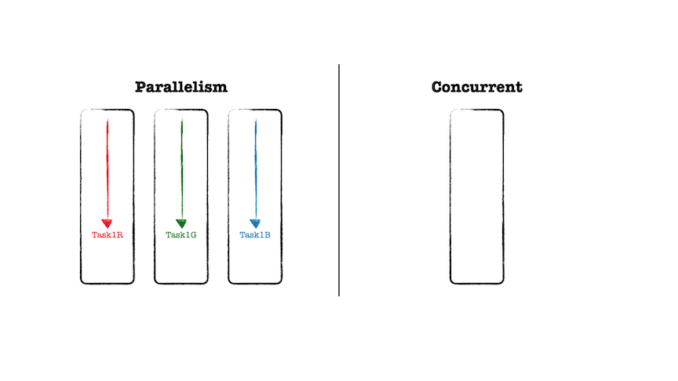
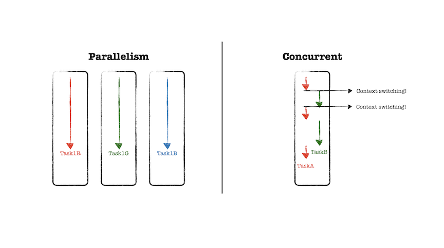
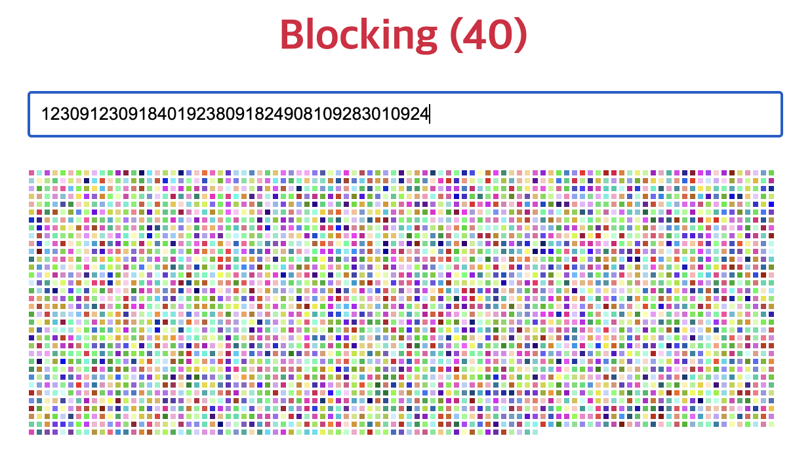
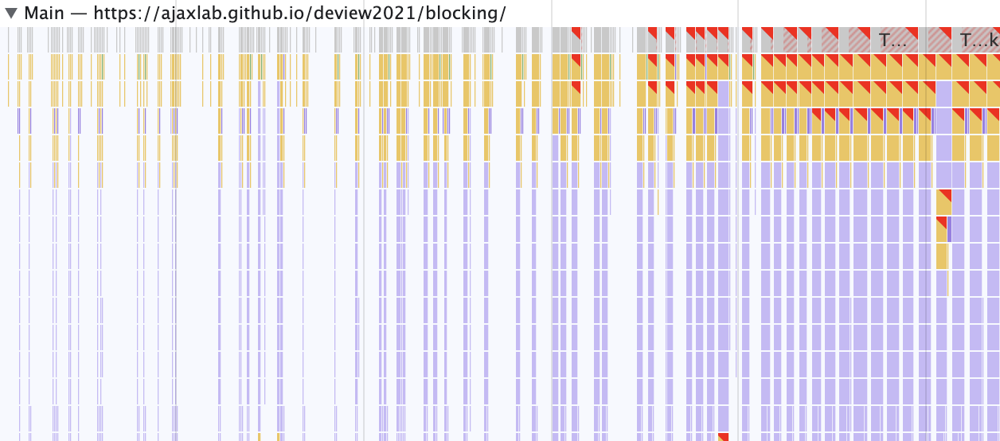
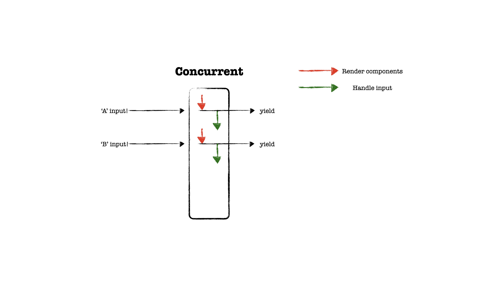

리엑트v18에서 동시성 기능을 정식으로 출시하였습니다. 대표적으로,
_Automatic batching for fewer renders_, _SSR support for
Suspense_, _Fixes for Suspense behavior quirks_와 같은 내부적인
성능 향상과, _startTransition_, _useDeferredValue_, _SuspenseList_
과 같은 기능들이 추가되었습니다.

동시성 기능을 담아내기 위해 리엑트팀은 협력적 멀티테스킹, 우선순위 기반 랜더링,
스케쥴링, 중단과 같은 메커니즘을 담아냈습니다. 기저에 있는 아키텍처를 수정해야
했던 만큼 5년이라는 시간동안 많은 시행착오를 겪었을 텐데요.

이 시리즈는 _'도대체, 동시성이 무엇이길래 리엑트팀에서 5년이라는
시간을 쏟았으며, 동시성을 위한 메커니즘들의 구현체들이 어떻게 구현되어 있을 까?
'_ 라는 호기심에 찾아본 구현체들과 레퍼런스들을 차근차근 정리해보고자 합니다.

그 첫 번째로, [Inside React (동시성을 구현하는 기술)](https://deview.kr/2021/sessions/518)에서 언급한 내용들을 정리하고, 우선순위와 양보 매커니즘이
어떻게 구현되어 있는 지 살펴보려 합니다.

## Concurrent vs Parallelism

동시성을 설명할 때, 서로 관련있는 병렬성과 함께 설명하곤 합니다.
하지만, 이 둘은 뚜렷한 차이를 가지고 있으며
Go 언어의 창시자의 [Concurrency is not parallelism](https://go.dev/blog/waza-talk)
발표 서문에는 다음과 같이 동시성과 병렬성을 비교합니다.

_'**동시성은 독립적으로 실행되는 프로세스들의 조합이다.**'
'병렬성은 연관된 복수의 연산들을 동시에 실행하는 것이다.'
'**동시성은 여러 일을 한꺼번에 다루는 문제에 관한 것이다.**'
'병렬성은 여러 일을 한꺼번에 실행하는 방법에 관한 것이다.'_

아주 멜랑꼴리한데 발표에서 언급한 문구를 빌려 정리하자면,
**동시성은 프로세서가 하나만 있는 경우, 병렬 처리를 가능케 하지만 병렬처리는 아닙니다.**
즉, 하나의 스레드로 작업을 순차적으로 처리하지만,
마치 여러 개의 스레드가 사용되고 있는 것처럼 보이게 하는 것이고,
동시성은 싱글 코어에서도 동작하지만, 병렬성은 두 개 이상의 코어가 필요합니다.

병렬성은 예를 들어 GPU를 통해 이미지를 랜더링할 때 R, G, B를 연산하는
텍스크를 각각의 코어가 작업하는 것과 같이 최소 한 가지 논리적 통제를
멀티 코어에서 병렬적으로 진행합니다.



반면 동시성은 최소 두 개의 논리적 통제 흐름을 가지고 있으며,
잘개 쪼개진 두 개 이상의 작업을 지속적으로 컨텍스트 스위칭하여
마치 동시에 이루어지는 것처럼 보이도록 합니다.
강의를 듣다가 내용 정리를 위해 일시정지하고 메모하는 것과 같은 작업 처리 방식입니다.



## 리엑트팀은 왜 동시성 기능을 구현하고자 했을 까

리엑트는 사용자 인터페이스를 구축하는 라이브러리로서 핵심 역할인 인터렉션에
대한 업데이트 과정과 사용자 경험에 대한 HCI 연구 결과를 반영하고 궁극적으로
기술적으로 결합하는 목표를 가지고 있습니다. 사람과 컴퓨터간의 인터렉션에
대한 연구 결과들을 추상화해서 리엑트 코어의 개선 목표로 삼고 이를
구현합니다.

가령, 화면 간 전환에서 로딩 중 상태를 너무 많이 표시하면 UX 품질이
낮아지는 문제라던지, 빠르게 처리되기를 기대하는 상호작용들과 느려도 문제없는
상호작용을 구분짓고 이를 적용해서 효과적으로 사용자 인터페이스에 구현할 수 있는
방법들을 제공하기 위함입니다.

조금 더 와닿을 수 있게 우리의 구현체들이 동작하는 브라우저 환경에서
생각해봅시다. 브라우저는 HTML을 파싱하고, 자바스크립트를 실행하며
랜더트리를 구축하고 그려내는 작업까지 단일 스레드로서 한번에 하나의
작업만을 수행합니다.

때문에 메인 스레드가 자바스크립트 엔진에게 실행권을 위임하여
자바스크립트 파싱을 시작했다면 그 작업을 멈출 수 없으며,
작업이 완료될 때까지 이후의 작업을 전개할 수 없습니다.
리엑트 랜더링 연산 과정도 동일한 절차를 거치게 되며,
이 때 매우 무거운 랜더링 연산 과정이 시작되면 이후의 작업들이 다소
긴 시간 동안 대기 상태가 되는 블로킹 랜더링이 발생합니다.

재조정을 위한 리엑트의 비교 알고리즘은 매우 최적화되어 있어
블로킹되는 이슈가 자주 발생하지 않아 공감하기 어려울 수 있지만,
[deview2021/blocking](https://ajaxlab.github.io/deview2021/blocking)
데모처럼 입력값에 대한 픽셀 박스를 랜더링하는 연산이 무거워짐에 따라
keypress 이벤트에 대한 처리가 지연되고 있음을 경고 플래그를 통해 확인할 수 있습니다.





경고 플래그 중 하나의 예시로 keypress 이벤트를 처리하는 데 143.41ms이 소요 되었는데
[RAIL](https://web.dev/rail/?utm_source=devtools#goals-and-guidelines)
모델을 기반으로 생각한다면, 사용자는 입력 이벤트에 대해 100ms 이상 소요되는 것을
동작과 응답 사이의 연결이 지연되고 있음을 인식하게 되며, 이는 사용자 경험의 감점으로
이어질 수 있습니다.

리엑트는 이러한 사용자 경험에 영향을 끼치는 랜더링 업데이트 과정에서
동시성을 통해 개선된 인터렉션을 쉽게 구현할 수 있도록 하는 구현체를 제공하고자
했습니다.

## 동시성 메커니즘; 우선순위

리엑트에서 동시성을 구현하는 첫번 째 메커니즘은 바로 우선순위입니다. 인터렉션에 의해
발생한 이벤트와 업데이트 작업들이 어떻게 우선순위는 어떻게 결정되고 할당되는 지
궁금했는데요. 그 과정에 대해 차근차근 살펴봅시다.

우선순위 메커니즘은 사용자 인터렉션 발생을 캐치한 리스너에서부터
작업 생성 과정과 스케쥴링 단계까지 업데이트를 위한
작업의 우선순위를 할당하기 위한 전반적인 과정에서 쉽게 찾아볼 수 있습니다.

그 이후 진행 중인 작업이 우선 순위가 높은 대기 상태의 작업에 의해 중단되거나,
같은 우선 순위를 가진 작업에 대해서 일괄 처리될 수 있도록 하는 작업 교통정리
를 하는 작업 실행 단계에서도 확인할 수 있는데요.

한편, 리엑트v17.0 이전에서는 작업의 [만료 시간을 기준으로 우선순위를 부여](https://github.com/facebook/react/blob/v16.12.0/packages/react-reconciler/src/ReactFiberExpirationTime.js)하는 메커니즘으로 구현되어 있었습니다.
반면, 리엑트v17.0 이후에서는 Lane 모델을 착안하여 비트 연산을
기반으로 우선 순위를 부여하는 방식으로 변경되었는데요.
먼저, 전반적인 우선순위 메커니즘 기저의 구현체인 Lane을 살펴봅시다.

### Lane 모델, 그리고 Lane 우선순위

Lane 모델은 도로의 차선을 모티브로 하여 리엑트에서 우선순위를
표현하기 위해 구현된 31비트 데이터로 표현된 비트맵입니다.
작업의 스케쥴링 및 조정 작업 과정의 우선순위를 가진 고유의 작업 스레드를
표현합니다.

실제 레인의 구현에서 확인할 수 있듯, 기본적으로 더 작은 숫자로 표현된
레인이 높은 우선순위를 갖습니다.

```js
// react-reconciler/src/ReactFiberLane.new.js

export type Lanes = number;
export type Lane = number;
export type LaneMap<T> = Array<T>;

export const TotalLanes = 31;

export const NoLanes: Lanes = /*                        */ 0b0000000000000000000000000000000;
export const NoLane: Lane = /*                          */ 0b0000000000000000000000000000000;
export const SyncLane: Lane = /*                        */ 0b0000000000000000000000000000001;
export const InputContinuousHydrationLane: Lane = /*    */ 0b0000000000000000000000000000010;
export const InputContinuousLane: Lane = /*             */ 0b0000000000000000000000000000100;
export const DefaultHydrationLane: Lane = /*            */ 0b0000000000000000000000000001000;
export const DefaultLane: Lane = /*                     */ 0b0000000000000000000000000010000;
const TransitionHydrationLane: Lane = /*                */ 0b0000000000000000000000000100000;
const TransitionLanes: Lanes = /*                       */ 0b0000000001111111111111111000000;
const TransitionLane1: Lane = /*                        */ 0b0000000000000000000000001000000;
...
const RetryLanes: Lanes = /*                            */ 0b0000111110000000000000000000000;
const RetryLane1: Lane = /*                             */ 0b0000000010000000000000000000000;
...

export const SomeRetryLane: Lane = RetryLane1;
export const SelectiveHydrationLane: Lane = /*          */ 0b0001000000000000000000000000000;
const NonIdleLanes: Lanes = /*                          */ 0b0001111111111111111111111111111;
export const IdleHydrationLane: Lane = /*               */ 0b0010000000000000000000000000000;
export const IdleLane: Lane = /*                        */ 0b0100000000000000000000000000000;
export const OffscreenLane: Lane = /*                   */ 0b1000000000000000000000000000000;
```

Lane 모델은 우선순위를 두 가지 중요한 컨셉으로 분리합니다.

- _Task Prioritization, A 작업이 B 작업보다 급한가?_
- _Task Batching, A 작업이 이 그룹 텍스크에 속하는 가?_

작업 우선순위 개념을 통해 작업의 우선순위를 기준으로 작업의
우선 실행권을 부여하고, 작업 배칭 개념을 착안하여
가령 CPU, I/O, CPU 순의 작업 예약에 대해,
I/O 작업을 다른 그룹으로 분리하여 일괄 처리함으로서 CPU 작업의 병목을
방지할 수 있도록 합니다.

_CPU 작업이 I/O 작업보다 우선순위가 낮아 지속적인 양보가 발생하게 되면 CPU 작업처리에
진전이 없을 여지를 방지하기 위해 I/O 작업들을 묶어 진행할 수 있도록 하는 것은
리엑트v18에서 제공하는 [Automatic Batching](https://github.com/reactwg/react-18/discussions/21)
의 기저에 있는 동작 방식인듯 합니다. 깊이 있게 살펴볼 부분들이 차고 넘치네요._

Task Prioritization이 표현되는 각각의 레인이 가지고 있는
비트 값이 우선순위를 나타내고 있으며, 레인의 이름을 통해
어떠한 업데이트가 소유할 수 있는 레인인지 파악해볼 수 있습니다.

- _**SyncLane**, 이산적인(discrete) 사용자 상호 작용에 대한 업데이트_
- _**InputContinuousLane**, 연속적인(continuous) 사용자 상호 작용에 대한 업데이트_
- _**DefaultLane**, setTimeout, 네트워크 요청 등에 의해 생성된 업데이트_
- _**TransitionLane**, Suspense, useTransition, useDefferredValue에 의해 생성된 업데이트_

레인 모델이 어떻게 구현되어 있는 지 간단하게 살펴보았다면,
어떻게 적용되어 사용되는 지 확인해볼 차례입니다.
리엑트에서 Lane 모델을 기반으로 Lane 우선순위 개념을 이벤트 우선순위와
스케쥴러 우선순위에 녹여냈는 지 살펴봅시다.

_레인에 대한 추가적인 내용은 초기 레인 모델을 구현한 [react/pull/18796](https://github.com/facebook/react/pull/18796)
PR을 참고하시면 좋습니다._

### 이벤트 우선순위

리엑트는 사용자 인터렉션에 의해 발생된 이벤트를 인위적으로 구분짓고,
구분된 이벤트를 묶어 우선순위를 결정짓습니다.
여기서, 크게 두 종류로 구분되어 루트에 바인딩될 때 어느 범주에 속한
이벤트인지에 따라 우선순위가 부여됩니다.

- _이산적인 이벤트 (e.g. click, keydown, focusin, ..)_
- _연속적인 이벤트 (e.g. drag, pointermove, scroll, ..)_

```js
// react-reconciler/src/ReactEventPriority.new.js

export const DiscreteEventPriority: EventPriority = SyncLane;
export const ContinuousEventPriority: EventPriority = InputContinuousLane;
export const DefaultEventPriority: EventPriority = DefaultLane;
export const IdleEventPriority: EventPriority = IdleLane;
```

잠시 이산적인 이벤트와 연속적인 이벤트를 구분짓는 이유를 생각해보자면,
가령 사용자가 문서를 읽다가, 문서에 참조되어 있는 링크를 클릭하는
이산적인 이벤트를 발생시켰다면 이는 즉각적으로 반응하기를 원할테지만,
반면 문서를 읽을 때 시선의 흐름에 따라 사용자가 포인터를 움직였다면,
이로 인해 발생한 연속적인 이벤트에 대해서는 사용자 입장에서 성능에 영향을
줄 것이라 생각하기 힘들고, 또한 빠르게 반응해주기를 원하는 이벤트라고
간주하기 어려울 수 있기 때문입니다.
관련해서 [연속적인 이벤트(Continuous events)](https://wicg.github.io/is-input-pending/#continuous-events)를 참고할 수 있습니다.

다시 돌아와, 앞서 살펴보았던 31비트로 구성된 Lane 값들이 이벤트 우선순위
할당되는 값으로 사용되고 있으며, 각각의 이벤트에 대해 우선순위를 반환하는 함수가
구현되어 있는 것을 확인할 수 있습니다.

```js
// react-dom/src/events/ReactDOMEventListener.js

export function getEventPriority(domEventName: DOMEventName): * {
  switch (domEventName) {
    case 'cancel':
    case 'click':
    case 'close':
    case 'contextmenu':
    ...
      return DiscreteEventPriority;
    case 'drag':
    case 'dragenter':
    case 'dragexit':
    case 'dragleave':
    ...
      return ContinuousEventPriority;
    case 'message': {
      const schedulerPriority = getCurrentSchedulerPriorityLevel();
      switch (schedulerPriority) {
        case ImmediateSchedulerPriority:
          return DiscreteEventPriority;
        case UserBlockingSchedulerPriority:
          return ContinuousEventPriority;
        ...
      }
    }
    default:
      return DefaultEventPriority;
  }
}
```

_여기서 'message' 이벤트는 따로 처리해주는 것을 확인할 수 있는데, 협력적 스케쥴링 모델을
사용하고, 정확한 스케쥴링 타임을 위해 리엑트 스케쥴러에서는 MessageChannel API를 기반으로
구현되어 있습니다. 따라서 'message' 이벤트가 스케쥴러 콜백일 수 있기 때문에
'message' 이벤트에 대해서는 네이티브 스케쥴러에 대한 현재 우선 순위를 확인하여 반환합니다._

`getEventPriority()` 를 따라 올라가다 보면, 대응되는 이벤트 우선순위를
각각의 이벤트 리스너에 래핑시키고, 우선순위가 래핑된 이벤트 리스너를 반환하는 곳에서
사용됩니다.

```js
// react-dom/src/events/ReactDOMEventListener.js

export function createEventListenerWrapperWithPriority(
  targetContainer: EventTarget,
  domEventName: DOMEventName,
  eventSystemFlags: EventSystemFlags
): Function {
  const eventPriority = getEventPriority(domEventName);
  let listenerWrapper;
  switch (eventPriority) {
    case DiscreteEventPriority:
      listenerWrapper = dispatchDiscreteEvent;
      break;
    case ContinuousEventPriority:
      listenerWrapper = dispatchContinuousEvent;
      break;
    case DefaultEventPriority:
    default:
      listenerWrapper = dispatchEvent;
      break;
  }
  return listenerWrapper.bind(
    null,
    domEventName,
    eventSystemFlags,
    targetContainer
  );
}
```

결국 `createRoot()` 에서
리엑트17 이후 버전의 [이벤트 위임 메커니즘](https://ko.reactjs.org/blog/2020/08/10/react-v17-rc.html#changes-to-event-delegation)
에 입각하여, 우선 순위가 래핑된 이벤트 리스너들이 모두 루트에 바인딩되게 됩니다.

이를 통해 사용자 상호 인터렉션에 따라 발생한 이벤트 우선순위는,
우선순위가 래핑된 이벤트 리스너를 통해 주입받을 수 있게 됩니다.

```js
// react-dom/src/client/ReactDOMRoot.js

export function createRoot(
  container: Element | Document | DocumentFragment,
  options?: CreateRootOptions,
): RootType {
  ...
  const root = createContainer(
    ...
  );
  markContainerAsRoot(root.current, container);

  const rootContainerElement: Document | Element | DocumentFragment =
    container.nodeType === COMMENT_NODE
      ? (container.parentNode: any)
      : container;
  listenToAllSupportedEvents(rootContainerElement); //**

  return new ReactDOMRoot(root);
}
```

### 스케쥴링 우선순위

스케쥴링 우선순위는 스케쥴러 기반의 리엑트 업데이트 작업이 가지는
우선순위입니다. 스케쥴러는 스케쥴링 우선순위를 통해 산발적으로
발생하는 작업들의 교통정리를 진행합니다.

가령 이벤트가 발생하여 setState를 통해 부가적인 상태 업데이트가
디스패치되면, 리콘실러는 업데이트 작업의 정보를 담은 객체를 생성하여
스케쥴러에게 전달하게 되는데, 업데이트 객체를 생성하는 단계에서
작업의 스케쥴링 우선순위를 구하기 위한 단계가 포함됩니다.

```js
// react-reconciler/src/ReactFiberHooks.new.js

function dispatchSetState<S, A>(
  fiber: Fiber,
  queue: UpdateQueue<S, A>,
  action: A,
) {
  ...

  const lane = requestUpdateLane(fiber);

  const update: Update<S, A> = {
    lane,
    action,
    hasEagerState: false,
    eagerState: null,
    next: (null: any),
  };

  ...
}
```

업데이트 객체에 전달되는 우선순위를 구하는 `requestUpdateLane()`
는 어떻게 이벤트 우선순위를 얻어오는 지 살펴봅시다.

### requestUpdateLane

리엑트는 동시성 기능을 담은 모드와 기존 레거시 모드를 함께 제공하고
있기 때문에, 먼저 동시성 기능이 제공되는 모드인지 확인하는 과정을
거칩니다. 만약 아니라면, 우선순위가 가장 높은 `SyncLane`을 반환합니다.

```js
export function requestUpdateLane(fiber: Fiber): Lane {
  const mode = fiber.mode;
  if ((mode & ConcurrentMode) === NoMode) {
    return (SyncLane: Lane);
  }
  ...
}
```

한편 동시성 기능을 제공하는 모드라면, 먼저 현재 실행 중인 작업이 있는 지
확인합니다. 만약 있다면, 현재 실행 중인 작업의 레인이 직접 반환되고,
새 작업이 기존 작업과 같은 우선순위를 부여받게 됩니다.

```js
let workInProgressRootRenderLanes: Lanes = NoLanes;

export function requestUpdateLane(fiber: Fiber): Lane {
  ...
  else if (
    !deferRenderPhaseUpdateToNextBatch &&
    (executionContext & RenderContext) !== NoContext &&
    workInProgressRootRenderLanes !== NoLanes
  ) {
    return pickArbitraryLane(workInProgressRootRenderLanes);
  }
  ...
}
```

```js
// react-reconciler/src/ReactFiberLane.new.js

export function getHighestPriorityLane(lanes: Lanes): Lane {
  return lanes & -lanes;
}

export function pickArbitraryLane(lanes: Lanes): Lane {
  return getHighestPriorityLane(lanes);
}
```

위 조건에 포함되지 않았다면, 이제 현재 이벤트가 전환 우선 순위인지에 대한
여부를 결정하고 맞다면 적절한 전환 우선순위에 할당하게 됩니다.

```js
let currentEventTransitionLane: Lanes = NoLanes;

export function requestUpdateLane(fiber: Fiber): Lane {
  ...
  const isTransition = requestCurrentTransition() !== NoTransition;
  if (isTransition) {
    if (__DEV__ && ReactCurrentBatchConfig.transition !== null) {
      const transition = ReactCurrentBatchConfig.transition;
      if (!transition._updatedFibers) {
        transition._updatedFibers = new Set();
      }

      transition._updatedFibers.add(fiber);
    }
    if (currentEventTransitionLane === NoLane) {
      currentEventTransitionLane = claimNextTransitionLane();
    }
    return currentEventTransitionLane;
  }
}
```

```js
// react-reconciler/src/ReactFiberLane.new.js

export function claimNextTransitionLane(): Lane {
  const lane = nextTransitionLane;
  nextTransitionLane <<= 1;
  if ((nextTransitionLane & TransitionLanes) === NoLanes) {
    nextTransitionLane = TransitionLane1;
  }
  return lane;
}

```

이 때, 생성된 작업에 대해 맨 오른쪽 비트를 소유하는 `TransitionLane`을
할당하고, 그 이후에 생성된 전환 작업은 비트가 왼쪽으로 한 자리 이동한
레인 즉, 우선순위가 보다 낮은 `TransitionLane`이 할당합니다.

```js
TransitionLane1 = 0b0000000000000000000000001000000;
TransitionLane2 = 0b0000000000000000000000010000000;
...

TransitionLanes = 0b0000000001111111111111111000000;
```

전환 우선순위 작업이 아닌 경우에는 어떻게 처리될까요? 이벤트 우선순위 섹션에서
우선순위가 래핑된 이벤트 리스너가 모두 루트에 바인딩되는 걸 확인했었는데요.
여기서 이벤트가 발생하면 `getCurrentUpdatePriority()`가 호출되어
현재 이벤트 우선순위가 반환되어 스케쥴링 우선순위로 사용됩니다.

만약 현재 이벤트 우선순위가 비어있다면 동일하게 `getCurrentUpdatePriority()`
에서 외부 이벤트의 우선순위를 가져옵니다. 이런 케이스는 가령, `setState`가
`setTimeout`에서 호출된 케이스입니다.

```js
export function requestUpdateLane(fiber: Fiber): Lane {
  ...
  const updateLane: Lane = (getCurrentUpdatePriority(): any);
  if (updateLane !== NoLane) {
    return updateLane;
  }

  const eventLane: Lane = (getCurrentEventPriority(): any);
  return eventLane;
}
```

결과적으로 얻어진 스케쥴링 우선순위는 업데이트 객체에 할당됩니다.

```js
export function createUpdate(eventTime: number, lane: Lane): Update<*> {
  const update: Update<*> = {
    eventTime,
    lane,

    tag: UpdateState,
    payload: null,
    callback: null,

    next: null,
  };
  return update;
}
```

다음으로 업데이트해야 하는 컨텐츠와 업데이트 콜백 함수를
담아 업데이트 객체를 완성하게 되고, 현재 컴포넌트에 해당하는
Fiber 노드의 업데이트 대기열에 업데이트 객체가 추가됩니다.

```js
update.payload = payload;
if (callback !== undefined && callback !== null) {
  update.callback = callback;
}
```

```js
enqueueUpdate(fiber, update, lane);
```

위와 같은 과정들을 통해 리엑트는 Lane 모델을 기반으로 우선순위
메커니즘을 구현하고 실제 이벤트의 발생과 작업 생성 단계에서
어떻게 적절한 우선순위를 할당하는 지 그 과정을 살펴보았습니다.

## 동시성 메커니즘; 양보

각각의 작업에 대해 우선순위가 어떻게 할당되는 지 확인했다면,
이제 우선순위를 기준으로 현재 진행 중인 작업이 점유하고 있는
메인 스레드가 대기 중인 높은 작업에 의해 중단되고 메인 스레드의 점유를
양보하는 지 알아봅시다.

브라우저는 랜더링 엔진에게 메인 스레드 점유를 위임하게 되면,
랜더링 과정 중 발생한 사용자 입력에 대해 즉시 처리할 수 없게 되기 때문에
사용자가 즉각적으로 반응하고 처리되기를 기대하는 이벤트에 대해
랜더링 작업 중에는 처리할 수 없게 되는데요.

리엑트는 이러한 근본적인 원인을 해결하고자 모든 랜더링을 인터럽트 가능하도록 하여
우선순위가 높은 작업이 텍스크 스택에 들어오면 진행중이던 작업을 중단하고 메인 스레드에게
점유를 양보할 수 있는 메커니즘을 구현하게 됩니다.



하지만 메인스레드를 양보하기 이전에, 메인 스레드를 점유하여 랜더링 연산을
전개하고 있는 과정에서 사용자의 입력에 대한 처리가 대기 중임을 확인하고
메인 스레드 점유를 양보해야 하는 지에 대해 판단하는 것이 더 우선적으로
가능해야 했습니다.

이를 위해 페이스북은 메인스레드를 점유당하고 있는 상황에서 우선순위가 높은 작업이
대기 중임을 확인하는 구현체인 [isInputPending](https://wicg.github.io/is-input-pending/)
를 브라우저 API에 처음으로 기여하게 됩니다.

실제로 리엑트의 [스케쥴러](https://github.com/facebook/react/blob/main/packages/scheduler/src/forks/Scheduler.js) 에는
`isInputPending`을 사용하기 위해 호스트 환경에 의존적인 API를 사용할 수 있는 지에
대해 판단하는 플래그들이 존재합니다.

### shouldYieldToHost

이제 랜더링 과정에서 우선순위가 높은 작업이 대기 중임을 확인할 수 있는 구현체를
사용해서 내부적으로 어떻게 양보가 이루어질 수 있도록 구현되어 있는 지 확인해봅시다.

양보가 필요한 상황인지를 판단하기 위한 첫 검증은 현재 작업을
처리하기 위해 얼마만큼의 시간을 소요했는 지를 확인합니다.
경과된 시간이 `frameInterval` 값보다 작다면, 메인 스레드는 단일 프레임만큼
아주 짧은 시간동안만 차단되어 있었기 때문에 양보를 거절합니다.

```js
// SchedulerFeatureFlags.js

export const frameYieldMs = 5;
```

```js
import { frameYieldMs } from '../SchedulerFeatureFlags';

let frameInterval = frameYieldMs;

function shouldYieldToHost() {
  const timeElapsed = getCurrentTime() - startTime;

  if (timeElapsed < frameInterval) {
    return false;
  }
  ...
}
```

이후의 스코프에서는 메인 스레드가 무시할 수 없는 시간 동안 차단되었을 때
대기 중인 페인트 혹은 사용자 입력 작업이 존재한다면,
브라우저가 높은 우선 순위 작업을 수행할 수 있도록 메인 스레드에
대한 점유를 양보합니다.

```js
let needsPaint = false;

function requestPaint() {
  if (
    enableIsInputPending &&
    navigator !== undefined &&
    navigator.scheduling !== undefined &&
    navigator.scheduling.isInputPending !== undefined
  ) {
    needsPaint = true;
  }
}

function shouldYieldToHost() {
  ...
  if (enableIsInputPending) {
    if (needsPaint) {
      return true;
    }
  }
  ...
}
```

여기서 `requestPaints()` 는 isInputPending API를 사용할 수 있는 지,
사용할 수 있다면 현재 사용자 입력에 대한 페인트 작업이 대기 중인지를 판단하여
`needsPaint` 플래그를 반환하게 역할을 하는데요.

이를 통해 리콘실러는 VDOM의 변경사항을 DOM에 모두 커밋하고
`requestPaints()`를 호출하여 페인트 작업이 필요하다는 것을 스케쥴러에게 전달할 수 있게 됩니다.

```js
// ReactFiberWorkLoop.new.js

import { requestPaint } from './Scheduler';

function commitRootImpl(...) {
  ...
  requestPaint();
}
```

다음으로는 경과된 시간이 연속적인 입력 인터벌보다 짧은 지 검증합니다.
[이벤트 우선순위](#이벤트-우선순위)에서 이산적, 연속적인 이벤트를 구분짓는 같은 맥락으로,
isInputPending은 단순히 모든 사용자 이벤트를 동일하게 처리하지 않고,
[연속적인 이벤트](https://wicg.github.io/is-input-pending/#continuous-events) (e.g. click)와 이산적인 이벤트 (e.g. mouseover)를 구분지어
**연속적인 이벤트에 대해 양보가 너무 자주 발생하게 되는 것을 방지합니다.**

즉 이 검증 단계에서는, 연속적인 이벤트에 대한 처리 작업을 즉시 시작하지 않을 간격을 두고,
그 시간 동안에는 판단을 온전히 브라우저에게 맡깁니다.

```js
// SchedulerFeatureFlags.js

export const continuousYieldMs = 50;
```

```js
import { continuousYieldMs } from '../SchedulerFeatureFlags'

const continuousInputInterval = continuousYieldMs;

const isInputPending =
  typeof navigator !== 'undefined' &&
  navigator.scheduling !== undefined &&
  navigator.scheduling.isInputPending !== undefined
    ? navigator.scheduling.isInputPending.bind(navigator.scheduling)
    : null;

function shouldYieldToHost() {
  ...
  if (timeElapsed < continuousInputInterval) {
    if (isInputPending !== null) {
      return isInputPending();
    }
  }
  ...
}
```

마지막으로 최대 간격 이내에 보류 중인 연속적이거나, 이산적인 모든 이벤트에 대해
양보합니다. 이후 모든 분기 처리가 담지 못한 케이스에 대해서는,
보류 중인 입력이 없더라도 네트워크 이벤트와 같은 외부 이벤트에 의한 작업들이
대기 중일 수 있다는 가정하에 무조건적으로 양보하게 됩니다.

```js
// SchedulerFeatureFlags.js

export const maxYieldMs = 300;
```

```js
import { maxYieldMs } from '../SchedulerFeatureFlags'

function shouldYieldToHost() {
    ...
    else if (timeElapsed < maxInterval) {
      // Yield if there's either a pending discrete or continuous input.
      if (isInputPending !== null) {
        return isInputPending(continuousOptions);
      }
    } else {
      return true;
    }
  }

  return true;
}
```

초기에 분기처리 되었던 호스트 환경에 의존적인 isInputPending API를
사용할 수 없는 경우 또한 무조건적으로 양보합니다.

```js
function shouldYieldToHost() {
  ...
  if (enableIsInputPending) {
    ...
  }

  return true;
}
```

지금까지 알아본 `shouldYieldToHost()`는 스케쥴러의 `workLoop()`에서 사용됩니다. 현재 진행 중인 작업의 만료시간이 현재 시간에 비해 여유가 있는 시점에서
우선 순위가 더 높은 작업이 보류되고 있다면, 메인 스레드에게 제어권을 양보하고, 만료 시간이
지난 작업에 대해서는 양보하지 않고 동기적으로 바쁘게 작업을 이어나갑니다.

```js
function workLoop(hasTimeRemaining, initialTime) {
  ...
  while (
    currentTask !== null &&
    !(enableSchedulerDebugging && isSchedulerPaused)
  ) {
    if (
      currentTask.expirationTime > currentTime &&
      (!hasTimeRemaining || shouldYieldToHost())
    ) {
      break;
    }
  ...
  }
}
```

추가적으로 스케쥴러가 아닌, 동시성 모드에서 컴포넌트를 재조정하는 작업이 담긴
`workLoopConcurrent()` 에서도 사용되는데요. `shouldYieldToHost()` 통해
진행되던 재조정 작업이 중지될 수 있음이 조건에 담겨있습니다.

```js
// react-reconciler/src/ReactFiberWorkLoop.new.js

import { shouldYield } from './Scheduler';
function workLoopConcurrent() {
  while (workInProgress !== null && !shouldYield()) {
    performUnitOfWork(workInProgress);
  }
}
```

이를 통해 리콘실러는 `workLoopConcurrent()`를 통해 현재 작업중이던 루트 혹은 Lane이
변경되면, 루트에 대기중인 작업들을 모두 비우고, 변경된 레인의 작업이 진행될 수 있도록 합니다.

```js
function renderRootConcurrent(root: FiberRoot, lanes: Lanes) {
  const prevExecutionContext = executionContext;
  executionContext |= RenderContext;
  const prevDispatcher = pushDispatcher();

  if (workInProgressRoot !== root || workInProgressRootRenderLanes !== lanes) {
    ...
        const memoizedUpdaters = root.memoizedUpdaters;
        if (memoizedUpdaters.size > 0) {
          restorePendingUpdaters(root, workInProgressRootRenderLanes);
          memoizedUpdaters.clear();
        }

        movePendingFibersToMemoized(root, lanes);
      }
    }
  }
  ...

  do {
    try {
      workLoopConcurrent();
      ...
    }
  }
```

### 마치면서

리엑트의 동시성 기능을 담은 구현체들을 살펴보았습니다. 이번 글에서는
전반적인 동시성 기능에 대한 서론과 우선순위가 어떻게 할당되는 지, 그리고
어떻게 메인스레드 점유가 양보되는 지에 대해 알아보았는데요.

공부를 하면 할수록 사용자 인터페이스를 구축하는 기능을 제공하는 리엑트가
사용자 경험과 사용성 개선을 위해 고민하고 쉽게 구현할 수 있는 기능들을
제공하기 위해 얼마나 노력하는 지 느낄 수 있어 큰 자극을 얻을 수 있었습니다.

한글로 정리된 글들이 많지 않아 다양한 레퍼런스들을 찾아보고, 흩어진 자료를
모아 정리하려는 목적으로 글을 정리해보았습니다. 직접 리엑트 구현체 코드들을
들여다보면서 어려움이 많았는데, 어설프게 정리하고 싶지 않아 생각보다 오랜 시간
끙끙댔던 시간이었는데요.
아직 살펴볼 내용들이 차고 넘치기 때문에 끊고 다음 글에서 이어서 정리하는
시간을 가지려 합니다.

사실, 리엑트에서 제공하는 동시성 기능 API들을 어떻게 사용하는 지 알아보고
적절하게 사용을 즐기는 공부를 하면 마음 편하겠지만, 직접 구현체들의 내막을
들여다보고 나서 그 이해가 동시성 기능 API들을 사용할 때 보다 더 깊은
사용법을 이끌어낼 수 있지 않을 까 하는 기대를 합니다.

잘못된 설명이나, 얕은 지식으로 어설프게 설명되어 있는 부분에 대해서는 언제든
지적해주시면 다시금 수정하고 정리할 수 있도록 하겠습니다. 감사합니다 :)

## Reference

[Inside React (동시성을 구현하는 기술)](https://deview.kr/2021/sessions/518)

[What is "Lane" in React?](https://dev.to/okmttdhr/what-is-lane-in-react-4np7)

[React 톺아보기 - 01. Preview](https://goidle.github.io/react/in-depth-react-preview/)

[github.com/facebook/react/pull/18796](https://github.com/facebook/react/pull/18796)

[github.com/facebook/react](https://github.com/facebook/react)

[wicg.github.io/is-input-pending](https://wicg.github.io/is-input-pending/#continuous-events)

[React 소스 코드 파싱 우선 순위 Lane 모델](https://juejin.cn/post/7008802041602506765)
