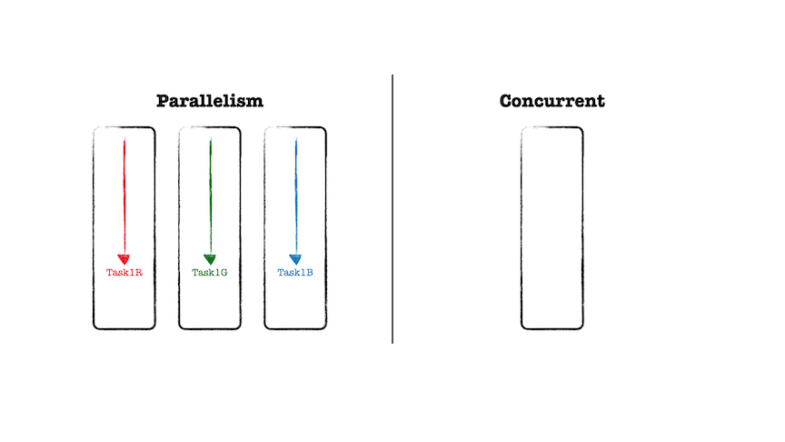
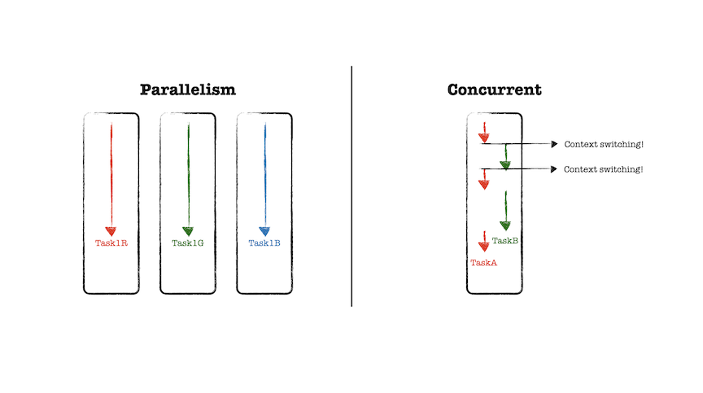
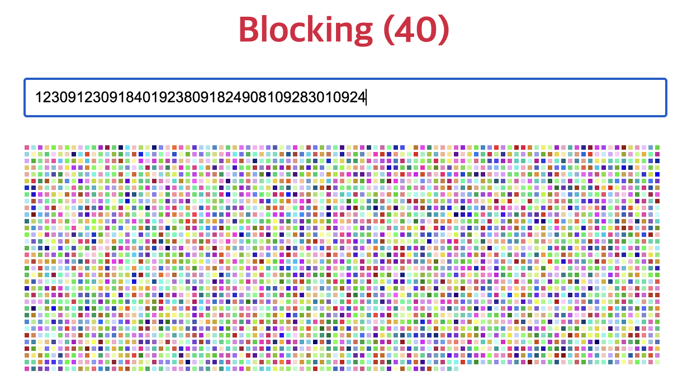
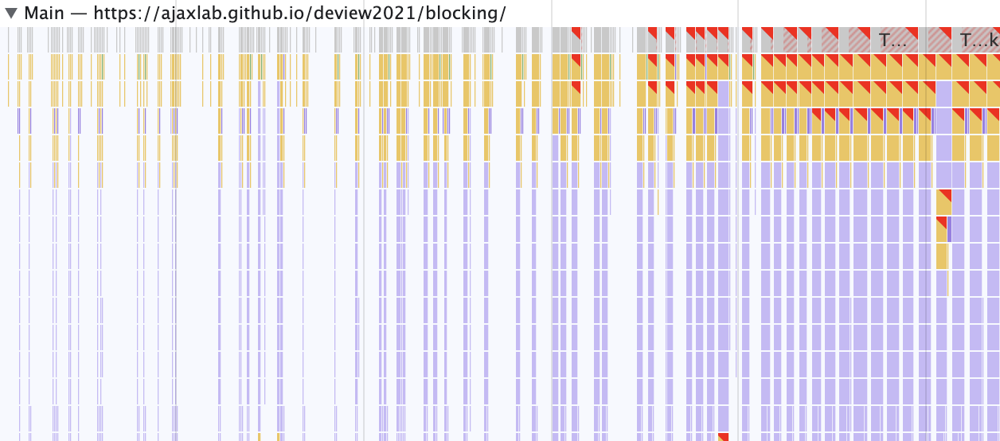
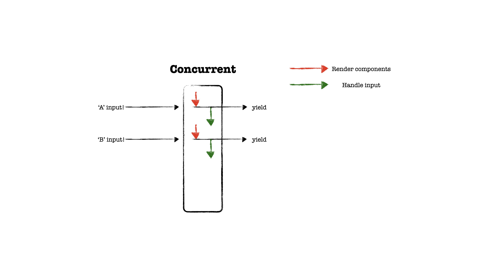

리엑트팀에서 [Async Rendering](https://ko.reactjs.org/blog/2018/03/27/update-on-async-rendering.html)
을 시작으로 5년이 지나 드디어 react18에서 동시성 기능이 정식으로 출시되었습니다.

기능적으로 많은 성능 향상을 이루었는데, 'Automatic batching for fewer renders',
'SSR support for Suspense', 'Fixes for Suspense behavior quirks'와 같이
코드 수정없이 내부적으로 성능 향상을 이루었고, 동시성을 제공하는 startTransition,
useDeferredValue, <SuspenseList>, 'Streaming SSR with selective hydration'과
같은 기능들이 추가되었습니다.

리엑트는 동시성 랜더링 메커니즘을 담아내기 위해 협력적 멀티태스킹,
우선순위 기반 랜더링, 스케쥴링, 중단 등과 같은 기능을 담아냈습니다.
무엇이길래 리엑트팀이 5년동안 붙잡았을까 라는?

## Concurrent vs Parallelism

동시성을 설명할 때, 서로 관련있는 병렬성과 함께 설명하곤 합니다.
하지만, 이 둘은 뚜렷한 차이를 가지고 있으며
Go 언어의 창시자의 [Concurrency is not parallelism](https://go.dev/blog/waza-talk)
발표 서문에는 다음과 같이 동시성과 병렬성을 비교합니다.

_'**동시성은 독립적으로 실행되는 프로세스들의 조합이다.**'
'병렬성은 연관된 복수의 연산들을 동시에 실행하는 것이다.'
'**동시성은 여러 일을 한꺼번에 다루는 문제에 관한 것이다.**'
'병렬성은 여러 일을 한꺼번에 실행하는 방법에 관한 것이다.'_

아주 멜랑꼴리한데 발표에서 언급한 문구를 빌려 정리하자면,
**동시성은 프로세서가 하나만 있는 경우, 병렬 처리를 가능케 하지만 병렬처리는 아닙니다.**
즉, 하나의 스레드로 작업을 순차적으로 처리하지만,
마치 여러 개의 스레드가 사용되고 있는 것처럼 보이게 하는 것이고,
동시성은 싱글 코어에서도 동작하지만, 병렬성은 두 개 이상의 코어가 필요합니다.

병렬성은 예를 들어 GPU를 통해 이미지를 랜더링할 때 R, G, B를 연산하는
텍스크를 각각의 코어가 작업하는 것과 같이 최소 한 가지 논리적 통제를
멀티 코어에서 병렬적으로 진행합니다.



반면 동시성은 최소 두 개의 논리적 통제 흐름을 가지고 있으며,
잘개 쪼개진 두 개 이상의 작업을 지속적으로 컨텍스트 스위칭하여
마치 동시에 이루어지는 것처럼 보이도록 합니다.
강의를 듣다가 내용 정리를 위해 일시정지하고 메모하는 것과 같은 작업 처리 방식입니다.



## 동시성을 통해 해결하려는 문제

브라우저는 HTML을 파싱하고, 자바스크립트를 실행하며 랜더트리를 구축하고
그려내는 작업까지 단일 스레드로서 한번에 하나의 작업만을
수행합니다.

때문에 가령 메인 스레드가 자바스크립트 엔진에게 실행권을 위임하여
자바스크립트 파싱을 시작했다면 그 작업을 멈출 수 없으며,
작업이 완료될 때까지 이후의 작업을 전개할 수 없습니다.
리엑트 랜더링 연산 과정도 동일한 절차를 거치게 되며,
이 때 매우 무거운 랜더링 연산 과정이 시작되면 이후의 작업들이 다소
긴 시간 동안 대기 상태가 되는 블로킹 랜더링이 발생합니다.

재조정(reconciliation)을 위한 리엑트의 비교 알고리즘은 매우 최적화되어 있어
블로킹되는 이슈가 자주 발생하지 않아 공감하기 어려울 수 있지만,
[deview2021/blocking](https://ajaxlab.github.io/deview2021/blocking)
데모처럼 입력값에 대한 픽셀 박스를 랜더링하는 연산이 무거워짐에 따라
keypress 이벤트에 대한 처리가 지연되고 있음을 경고 플래그를 통해 확인할 수 있습니다.





경고 플래그 중 하나의 예시로 keypress 이벤트를 처리하는 데 143.41ms이 소요 되었는데
[RAIL](https://web.dev/rail/?utm_source=devtools#goals-and-guidelines)
모델을 기반으로 생각한다면, 사용자는 입력 이벤트에 대해 100ms 이상 소요되는 것을
동작과 응답 사이의 연결이 지연되고 있음을 인식하게 되며, 이는 사용자 경험의 감점으로
이어질 수 있습니다.

## 동시성 구현을 위한 메커니즘; 양보

브라우저는 랜더링 엔진에게 메인 스레드 점유를 위임하게 되면,
랜더링 과정 중 발생한 사용자 입력에 대해 즉시 처리할 수 없게 됩니다.
리엑트는 이러한 근본적인 원인을 해결하고자 **모든 랜더링을 인터럽트 가능하도록 하여
우선순위가 높은 작업이 텍스크 스택에 들어오면 진행중이던 작업을 중단하고 메인 스레드에게
점유를 양보(yield)할 수 있는 메커니즘을 구현하게 됩니다.**

(텍스크를 잘개 쪼개는 것에 대한 구현체는 어디있을까?)



페이스북팀은 **메인 스레드를 점유하여 랜더링 연산을 전개하고 있는 과정에서
사용자의 입력에 대한 처리가 대기 중임을 확인하고 메인 스레드 점유를
양보해야 하는 지에 대해 판단을 할 수 있어야 했고, 이에 대한 메커니즘을
담은 구현체인 [isInputPending](https://wicg.github.io/is-input-pending/)
브라우저 API를 기여하게 됩니다.**

실제로 리엑트의 [Scheduler](https://github.com/facebook/react/blob/main/packages/scheduler/src/forks/Scheduler.js)(스케쥴러) 패키지 코드에는
호스트 환경에 의존적인 API를 사용 가능한지에 대한 플래그들이 존재하고,
어떠한 기준으로 메인 스레드에게 점유를 양보할 것인지에 대한 전개가 담겨있습니다.

### shouldYieldToHost

양보가 필요한 상황인지를 판단하기 위한 첫 검증은 현재 작업을
처리하기 위해 얼마만큼의 시간을 소요했는 지를 확인합니다.
경과된 시간이 frameInterval 값보다 작다면,
메인 스레드는 단일 프레임만큼 아주 짧은 시간동안만 차단되어 있었기 때문에
양보하지 않습니다.

```js
// SchedulerFeatureFlags.js
export const frameYieldMs = 5;
```

```js
import { frameYieldMs } from '../SchedulerFeatureFlags';

let frameInterval = frameYieldMs;

function shouldYieldToHost() {
  const timeElapsed = getCurrentTime() - startTime;
  
  if (timeElapsed < frameInterval) {
    return false;
  }
  ...
}
```

이후의 스코프에서는 메인 스레드가 무시할 수 없는 시간 동안 차단되었을 때
보류 중인 페인트 혹은 사용자 입력 작업이 존재한다면,
브라우저가 높은 우선 순위 작업을 수행할 수 있도록 메인 스레드에
대한 제안 권한을 양보합니다.

```js
// Scheduler.js
let needsPaint = false;

function requestPaint() {
  if (
    enableIsInputPending &&
    navigator !== undefined &&
    navigator.scheduling !== undefined &&
    navigator.scheduling.isInputPending !== undefined
  ) {
    needsPaint = true;
  }
}

function shouldYieldToHost() {
  ...
  if (enableIsInputPending) {
    if (needsPaint) {
      return true;
    }
  }
  ...
}
```

한편 reconciler(리콘실러)의
[commitRootImpl](https://github.com/facebook/react/blob/main/packages/react-reconciler/src/ReactFiberWorkLoop.new.js#L1997) 는 VDOM의 변경사항을
루트 DOM에 적용하는 역할을 하는데, 여기서 requestPaint가 사용됩니다.
즉 **VDOM에서 루트 DOM으로 변경 사항이 커밋되었으니 페인트 작업이 필요하다는 것을
스케쥴러에게 전달합니다.**

```js
// ReactFiberWorkLoop.new.js
import { requestPaint } from './Scheduler';

function commitRootImpl(...) {
  ...
  requestPaint();
}
```

다음으로는 경과된 시간이 연속적인 입력 간격보다 짧은 지 검증합니다.
isInputPending은 단순히 모든 사용자 이벤트를 동일하게 처리하지 않고,
[연속적인(continuous) 이벤트]([연속적인 이벤트(Continuous events)](https://wicg.github.io/is-input-pending/#continuous-events))(e.g. click)와 분리된(discrete) 이벤트(e.g. mouseover)를 구분지어 **연속적인 이벤트에 대해 너무 자주 양보하게 되는 것을 막습니다.**

가령 문서를 읽을 때, 시선의 흐름을 마우스 포인터의 이동으로 따라가는 것이
일반적으로 사용자에게 성능에 대한 영향을 주지 않을 것으로 예상하기 때문에
기본적으로 이러한 이벤트들은 isInputPending의 검증 대상에서 제외됩니다.

즉 이 검증 단계에서는, 연속적인 이벤트에 대한 처리 작업을 즉시 시작하지 않을 간격을 두고,
그 시간 동안에는 판단을 온전히 브라우저에게 맡깁니다.

```js
// SchedulerFeatureFlags.js
export const continuousYieldMs = 50;
```

```js
import { continuousYieldMs } from '../SchedulerFeatureFlags'

const continuousInputInterval = continuousYieldMs;

const isInputPending =
  typeof navigator !== 'undefined' &&
  navigator.scheduling !== undefined &&
  navigator.scheduling.isInputPending !== undefined
    ? navigator.scheduling.isInputPending.bind(navigator.scheduling)
    : null;

function shouldYieldToHost() {
  ...
  if (timeElapsed < continuousInputInterval) {
    if (isInputPending !== null) {
      return isInputPending();
    }
  }
  ...
}
```

마지막으로 최대 간격 이내에 보류 중인 연속적이거나, 분리된 모든 이벤트에 대해
양보합니다. 이후 모든 분기 처리가 담지 못한 케이스에 대해서는,
보류 중인 입력이 없더라도 네트워크 이벤트와 같은 알지 못하는 다른 작업들이
대기 중일 수 있다는 가정하에 무조건적으로 양보합니다.

```js
// SchedulerFeatureFlags.js
export const maxYieldMs = 300;
```

```js
import { maxYieldMs } from '../SchedulerFeatureFlags'

function shouldYieldToHost() {
    ...
    else if (timeElapsed < maxInterval) {
      // Yield if there's either a pending discrete or continuous input.
      if (isInputPending !== null) {
        return isInputPending(continuousOptions);
      }
    } else {
      return true;
    }
  }

  return true;
}
```

초기에 분기처리 되었던 호스트 환경에 의존적인 isInputPending API를
사용할 수 없는 경우 또한 무조건적으로 양보합니다.

```js
function shouldYieldToHost() {
  ...
  if (enableIsInputPending) {
    ...
  }

  return true;
}
```

지금까지 알아본 shouldYieldToHost는 스케쥴러의 [workLoop](https://github.com/facebook/react/blob/main/packages/scheduler/src/forks/Scheduler.js#L189)에서 사용됩니다. 현재 진행 중인 작업의 만료시간이 현재 시간에 비해 여유가 있는 시점에서
우선 순위가 더 높은 작업이 보류되고 있다면, 메인 스레드에게 제어권을 양보하고, 만료 시간이
지난 작업에 대해서는 양보하지 않고 동기적으로 바쁘게 작업을 이어나갑니다.

```js
// Scheduler.js
function workLoop(hasTimeRemaining, initialTime) {
  ...
  while (
    currentTask !== null &&
    !(enableSchedulerDebugging && isSchedulerPaused)
  ) {
    if (
      currentTask.expirationTime > currentTime &&
      (!hasTimeRemaining || shouldYieldToHost())
    ) {
      break;
    }
  ...
  }
}
```

추가적으로 스케쥴러가 아닌, 동시성 모드에서 컴포넌트를 재조정하는 작업이 담긴
[workLoopConcurrent](https://github.com/facebook/react/blob/main/packages/react-reconciler/src/ReactFiberWorkLoop.new.js#L1836)
에서도 사용되는데요. shouldYield를 통해 진행되던 재조정 작업이
중지될 수 있음이 조건에 담겨있습니다.

```js
// ReactFiberWorkLoop.new.js
import { shouldYield } from './Scheduler';
function workLoopConcurrent() {
  while (workInProgress !== null && !shouldYield()) {
    performUnitOfWork(workInProgress);
  }
}
```

이를 통해 리콘실러는 workLoopConcurrnet를 통해 현재 작업중이던 루트 혹은 레일(lane)이
변경되면, 루트에 대기중인 작업들을 모두 제거하여 변경된 레인의 작업이 진행될 수 있도록 합니다.
(여기서, 레인은 두 가지 이상의 논리적 통제를 다루는 컨텍스트를 의미하는 것 같습니다.
마치 고속도로의 차선 처럼요.)

```js
function renderRootConcurrent(root: FiberRoot, lanes: Lanes) {
  const prevExecutionContext = executionContext;
  executionContext |= RenderContext;
  const prevDispatcher = pushDispatcher();

  if (workInProgressRoot !== root || workInProgressRootRenderLanes !== lanes) {
    ...
        const memoizedUpdaters = root.memoizedUpdaters;
        if (memoizedUpdaters.size > 0) {
          restorePendingUpdaters(root, workInProgressRootRenderLanes);
          memoizedUpdaters.clear();
        }

        movePendingFibersToMemoized(root, lanes);
      }
    } 
  }
  ...

  do {
    try {
      workLoopConcurrent();
      ...
    }
  }
```

 <!-- ============== Lagacy ============== -->

<!-- 양보가 필요한 상황인지를 판단하기 위한 첫 검증은 1)현재 작업을
처리하기 위해 얼마만큼의 시간을 소요했는 지를 확인합니다.
만약, 경과된 시간이 frameInterval 값보다 작다면,
메인 스레드는 단일 프레임만큼 아주 짧은 시간동안만 차단되어 있었기 때문에
양보하지 않습니다.

하지만, 메인 스레드가 무시할 수 없는 시간 동안 차단되었다면,
브라우저가 높은 우선 순위 작업을 수행할 수 있도록 메인 스레드에
대한 제어 권한을 양보합니다.

리엑트는 동시성 랜더링 메커니즘을 담아내기 위해 협력적 멀티태스킹, 우선순위 기반 랜더링, 스케쥴링, 중단 등과 같은
기능을 구현하였는데요. 저는 동시성이라는 키워드가 궁금했습니다.

동시성 랜더링은 블로킹 랜더링을 해결하고자 합니다.
블로킹 랜더링은 입력값에 대한 픽셀 박스를 랜더링하는 연산을
시작하게 되면 중간에 중단할 수 없기 때문에, 연산을 점유당하고 있는
브라우저는 추가적인 값 입력에 대해 즉시 업데이트할 수 없게 됩니다.

리엑트는 동시성 모드에서의 모든 랜더링 과정은 인터럽트가 가능하도록
만들어 근본적으로 중단(interrupting) 가능하도록 합니다.

리엑트는 동시성 기능을 통해 블로킹 랜더링을 해결하고자
모든 랜더링 과정을 인터럽트 가능하도록 하였습니다.
그리고, 상호 작용에 있어 사용자 경험에 영향을 주는 우선 순위를 언급하고,
입력과 호버와 같은 상호작용은 빠르게 반응하길 원하지만, 반면 클릭이나
페이지 전환, 상호작용에 대한 부수적인 변화에는 약간의 기다림이 익숙한 것을
통해 작업의 우선 순위를 산정합니다.

우선 순위는 react18에서 새롭게 정의된 useTransition을 통해
정의할 수 있습니다.

react 공식문서 데모에서는 input 컴포넌트의 변화 랜더링, 목록 컴포넌트 랜더링
이 두가지 작업의 우선 순위를 구분지었다.

input 컴포넌트의 변화 랜더링은 즉각적으로 적용되어야 하는 랜더링이며,
목록 컴포넌트 랜더링은 상대적으로 급하지 않은 랜더링이다.

블로킹 랜더링은 1차선 도로이다. 컴포넌트 갱신이 많아지면 CPU의 점유율이 높아지면서
D, E의 랜더링을 해결할 수 없다.

동시성 랜더링은 2차선 도로라고 생각해보자.

동시성 랜더링에서도 마찬가지로 A, B라는 작업을 진행한다고 생각해보자.

A에 대한 작업을 진행하다가 메인 쓰레드에게 일정시간 양보한다. (yield)

동시성 랜더링은 이전에 언급한 것처럼 하나의 컴포넌트의 랜더링을 잘개 쪼개어 작업한다.
C의 작업이 마무리되기 전에 D에 대한 입력이 들어오면 C의 작업보다 우선순위가 높은 'D에 대한 입력'을 먼저 처리하게 된다.
즉, 리스트 랜더링보다는 우선순위가 높은 'D에 대한 입력 처리'를 먼저 진행하게 된다.

그리고, pending 상태에 있었던 낮은 순위 랜더링을 리베이스(git branch의 베이스 지점을 끌어올리는 듯한 동작)을 수행한다.

두 개의 차선에서 하나는 고속 하나는 저속으로 보고 리엑트에서는 이를 lane 이라고 말한다.

## 동시성 랜더링을 위한 API

동시성 모드는 기능 단위로 점진적으로 채택될 수 있도록 리엑트는
동시성 기능을 추가하였습니다. 단순히 createRoot를 사용한다고 해서
동시성 모드가 켜지는 것이 아닌, 동시성 기능을 사용했을 때
동시성 모드가 유효해집니다.

startTransition은 느린 차선의 lane을 만들어 주는 API 이다.

startTransition의 콜백 함수를 전달하면 수도 코드에서 확인할 수 있듯이
낮은 우선순위를 갖게 된다.

startTransition은 바로 실행된다????

이렇게 낮은 우선순위를 부여받으면 보다 중요한 CPU 사용처에 양보를 할 수 있다.

대규모 화면 업데이트 중 응답성을 유지할 수 있고, 상태 전환 중에 시각적 피드백을 제공할 수 있다.

[deview2021/concurrent](https://ajaxlab.github.io/deview2021/concurrent)
를 통해 블로킹 랜더링과 비교해보자.

concurrent에서는 짧은 여러개의 스택이 반복적으로 수행되고 있는 것을 확인할 수 있다.

## urgent update vs transition update

그 구분은 어떻게 지어야 할까, 사용자가 오래걸릴 것이라고 예상되는 것들
하나의 view에서 다른 view로 전환되거나, 전환되는 중간과정이 스킵되어도 문제가 없는 것 (load, refresh)

## HCI 연구 결과가 실제 Ui에 통합되도록 돕는 것

화면 간 전환에서 로딩 중 상태를 너무 많이 표시하면 UX 품질이 낮아짐
빠르게 처리되기 기대하는 상호작용과 느려도 문제없는 상호작용
동시성 모드의 목적은 HCI 연구 결과를 추상화하고 구현할 수 있는 방법을 제공하는 것이다.

HCI 연구 결과 확인해보기

## Reference

[Inside React(동시성을 구현하는 기술)](https://tv.naver.com/v/23652451) -->
