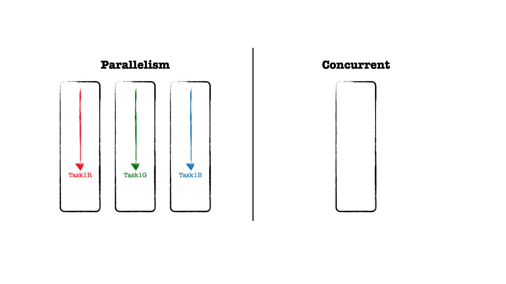

리엑트팀에서 [Async Rendering](https://ko.reactjs.org/blog/2018/03/27/update-on-async-rendering.html)
을 시작으로 5년이 지나 드디어 react18에서 동시성 기능이 정식으로 출시되었습니다.

기능적으로 많은 성능 향상을 이루었는데, 'Automatic batching for fewer renders',
'SSR support for Suspense', 'Fixes for Suspense behavior quirks'와 같이
코드 수정없이 내부적으로 성능 향상을 이루었고, 동시성을 제공하는 startTransition,
useDeferredValue, <SuspenseList>, 'Streaming SSR with selective hydration'과
같은 기능들이 추가되었습니다.

리엑트는 동시성 랜더링 메커니즘을 담아내기 위해 협력적 멀티태스킹, 우선순위 기반 랜더링, 스케쥴링, 중단 등과 같은
기능을 구현하였는데요. 저는 동시성이라는 키워드가 궁금했습니다.

무엇이길래 리엑트팀이 5년동안 붙잡았을까 라는?

## Concurrent vs Parallelism

동시성을 설명할 때, 서로 관련있는 병렬성과 비교하여 이해하곤 합니다.
하지만, 이 둘은 뚜렷한 차이를 가지고 있다고 이야기하며
Go 언어의 창시자의 [Concurrency is not parallelism](https://go.dev/blog/waza-talk)
발표 서문에는 다음과 같이 동시성과 병렬성을 비교합니다.

_'동시성은 **독립적으로 실행되는 프로세스들의 조합이다.**'
'병렬성은 연관된 복수의 연산들을 동시에 실행하는 것이다.'
'동시성은 **여러 일을 한꺼번에 다루는 문제에 관한 것이다.**'
'병렬성은 여러 일을 한꺼번에 실행하는 방법에 관한 것이다.'_

아주 멜랑꼴리한데 발표에서 언급한 문구를 빌려 정리하자면,
**동시성은 프로세서가 하나만 있는 경우, 병렬 처리를 가능케 하지만 병렬처리는 아닙니다.**
즉, 하나의 스레드로 작업을 순차적으로 처리하지만,
마치 여러 개의 스레드가 사용되고 있는 것처럼 보이게 하는 것이고,
동시성은 싱글 코어에서도 동작하지만, 병렬성은 두 개 이상의 코어가 필요합니다.

예를 들어 병렬성은 GPU를 통해 이미지를 랜더링할 때 R, G, B를 연산하는
텍스크를 각각의 코어가 작업하는 것과 같이 최소 한 가지 논리적 통제를
멀티 코어에서 병렬적으로 진행합니다.

동시성은 두 개 이상의 작업을 잘개 쪼개서 컨텍스트를 스위칭하며 작업들이 동시에 이루어지는 것처럼 보이도록 한다.
최소 두개의 논리적 통제 흐름이 필요로 한다. (동영상을 재생하면서 메모장 쓰기)

ReactDOM.createRoot 로 실행 시 내부적으로 'concurrent mode' 활성화
그러나 'concurrent features'를 사용할 때만 'concurrent rendering' 수행

## 리엑트에서 동시성으로 해결하려는 문제

브라우저의 메인 쓰레드는 싱글 쓰레드로서 한번에 하나의 작업만 수행할 수 있다.
HTML 파싱 -> 자바스크립트 실행 -> 랜더트리 구축 -> 페인트

만약, 메인 쓰레드가 하나의 작업을 시작하면 그 작업을 멈출 수 없다.
마찬가지로 리엑트 랜더링 연산에 돌입하면 멈출 수 없다.

즉, 이러한 동작을 블로킹 랜더링 (blocking rendering)이라고 한다.
리엑트의 랜더링을 위한 변경 알고리즘이 매우 빠르기 때문에 큰 문제가 되지 않는다.
하지만, 랜더링이 매우 해비한 작업이라면 어떻게 될까

리엑트의 빠른 랜더링 덕분에 그 문제가 잘 이해되지 않는다면, 아래 데모를 실행해보자.
[deview2021/blocking](https://ajaxlab.github.io/deview2021/blocking)

블로킹은 사용자 경험의 악화이다.

리엑트팀은 동시성 랜더링으로 블로킹 랜더링을 해결하고자 했다.

## 동시성 랜더링

react 공식문서 데모에서는 input 컴포넌트의 변화 랜더링, 목록 컴포넌트 랜더링
이 두가지 작업의 우선 순위를 구분지었다.

input 컴포넌트의 변화 랜더링은 즉각적으로 적용되어야 하는 랜더링이며,
목록 컴포넌트 랜더링은 상대적으로 급하지 않은 랜더링이다.

블로킹 랜더링은 1차선 도로이다. 컴포넌트 갱신이 많아지면 CPU의 점유율이 높아지면서
D, E의 랜더링을 해결할 수 없다.

동시성 랜더링은 2차선 도로라고 생각해보자.

동시성 랜더링에서도 마찬가지로 A, B라는 작업을 진행한다고 생각해보자.

A에 대한 작업을 진행하다가 메인 쓰레드에게 일정시간 양보한다. (yield)

동시성 랜더링은 이전에 언급한 것처럼 하나의 컴포넌트의 랜더링을 잘개 쪼개어 작업한다.
C의 작업이 마무리되기 전에 D에 대한 입력이 들어오면 C의 작업보다 우선순위가 높은 'D에 대한 입력'을 먼저 처리하게 된다.
즉, 리스트 랜더링보다는 우선순위가 높은 'D에 대한 입력 처리'를 먼저 진행하게 된다.

그리고, pending 상태에 있었던 낮은 순위 랜더링을 리베이스(git branch의 베이스 지점을 끌어올리는 듯한 동작)을 수행한다.

두 개의 차선에서 하나는 고속 하나는 저속으로 보고 리엑트에서는 이를 lane 이라고 말한다.

## 동시성 랜더링을 위한 API

startTransition은 느린 차선의 lane을 만들어 주는 API 이다.

startTransition의 콜백 함수를 전달하면 수도 코드에서 확인할 수 있듯이
낮은 우선순위를 갖게 된다.

startTransition은 바로 실행된다????

이렇게 낮은 우선순위를 부여받으면 보다 중요한 CPU 사용처에 양보를 할 수 있다.

대규모 화면 업데이트 중 응답성을 유지할 수 있고, 상태 전환 중에 시각적 피드백을 제공할 수 있다.

[deview2021/concurrent](https://ajaxlab.github.io/deview2021/concurrent)
를 통해 블로킹 랜더링과 비교해보자.

concurrent에서는 짧은 여러개의 스택이 반복적으로 수행되고 있는 것을 확인할 수 있다.

## urgent update vs transition update

그 구분은 어떻게 지어야 할까, 사용자가 오래걸릴 것이라고 예상되는 것들
하나의 view에서 다른 view로 전환되거나, 전환되는 중간과정이 스킵되어도 문제가 없는 것 (load, refresh)

## HCI 연구 결과가 실제 Ui에 통합되도록 돕는 것

화면 간 전환에서 로딩 중 상태를 너무 많이 표시하면 UX 품질이 낮아짐
빠르게 처리되기 기대하는 상호작용과 느려도 문제없는 상호작용
동시성 모드의 목적은 HCI 연구 결과를 추상화하고 구현할 수 있는 방법을 제공하는 것이다.

HCI 연구 결과 확인해보기

## Reference

[Inside React(동시성을 구현하는 기술)](https://tv.naver.com/v/23652451) 리뷰
