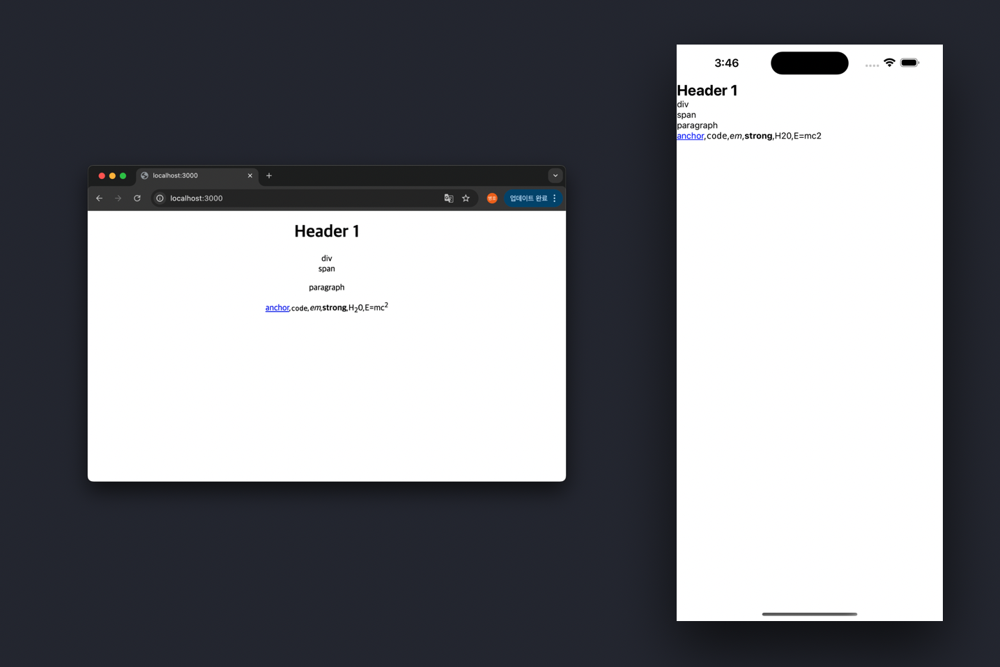

`react-strict-dom` (이하 `RSD`)는 웹 API를 사용하여 크로스 플랫폼 및 플랫폼 기반 인터페이스를 구축하기 위한 실험 단계의 프로젝트이다. 하나의 UI 레이어로 모든 플랫폼을 개발할 수 있도록 지원하는 것인데, 단순히 UI 컴포넌트를 추상화하는 것에 목적을 두는 것이 아닌, UI 개발 페러다임 자체를 통일하는 것에 집중하는 것처럼 느껴진다.

`RSD` 저장소를 처음 보곤 [모노레포](https://github.com/youthfulhps/react-strict-dom-turborepo)를 구성해
빌드까지는 해봤다. 아직 사용에 적용할 수 있는 단계는 아니라지만, `react-native`의 러닝 커브를 줄이고 하나의 코드 베이스를 통해 크로스 플랫폼을 개발할 수 있는 것은 설레이는 일이다.

```html
<html.button>Button</html.button>
```

가령 웹 인터페이스를 구현하기 위한 `div`, `span`, `button`를 통해 `react-native`의 `View`, `Text`, `Pressable`를 대응시키는 방식으로, 웹과 앱 모두에서 공통된 API로 인터페이스를 구성할 수 있는 코드베이스를 만드는 것을 목표로 한다.

하나의 UI 레이어로 모든 플랫폼을 개발할 수 있도록 지원하는 것은 단순히 UI 컴포넌트를 추상화하는 개념보다는 UI 개발 페러다임
자체를 통일하는 모양새이다.

`RSD` 저장소를 처음 보곤 `web`, `native` 앱을 구성하고 하나의 코드베이스의 `ui` 패키지를 통해 인터페이스를 개발할 수 있는 [모노레포](https://github.com/youthfulhps/react-strict-dom-turborepo)를
구성해봤는데 아직 상용에 적용할 수 있는 단계는 아니라지만 `react-native`의 러닝 커브를 줄이고 하나의 코드 베이스를 통해 크로스 플랫폼을 개발할 수 있는 것은
설레는 일이다.



## createStrictDOMComponent

그럼, 어떻게 `RSD`는 여러 플랫폼을 지원하는 컴포넌트를 생산할 수 있도록 하는 것일까? `RSD` 패키지의 컴포넌트 생산은 `createStrictDOMComponent()`에서 시작된다.
