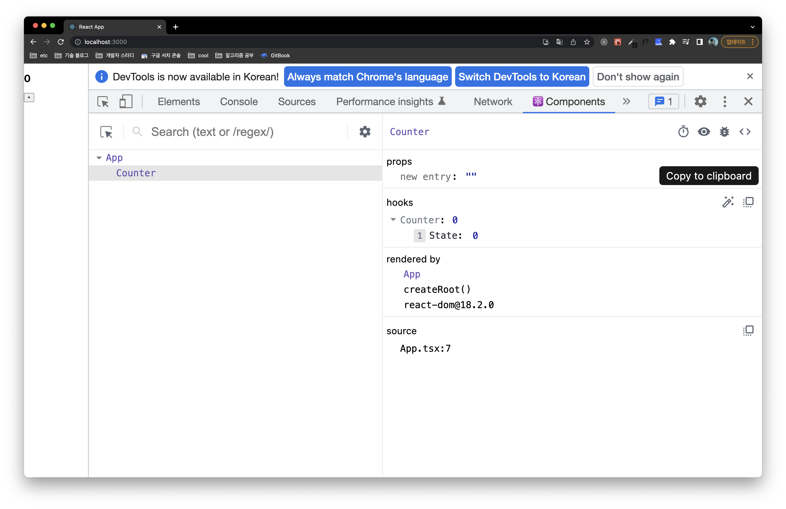
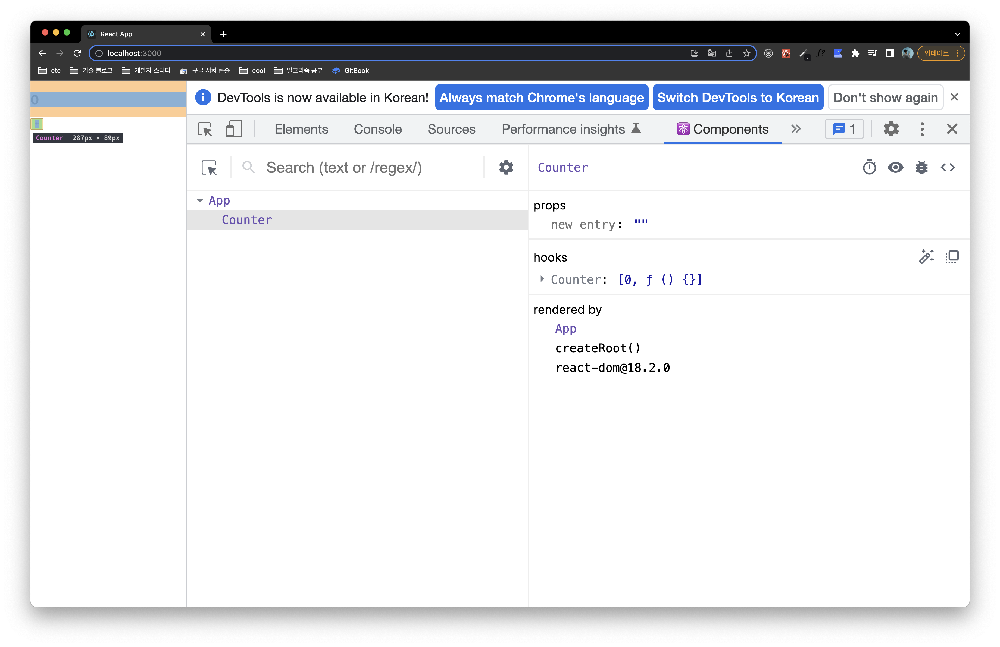
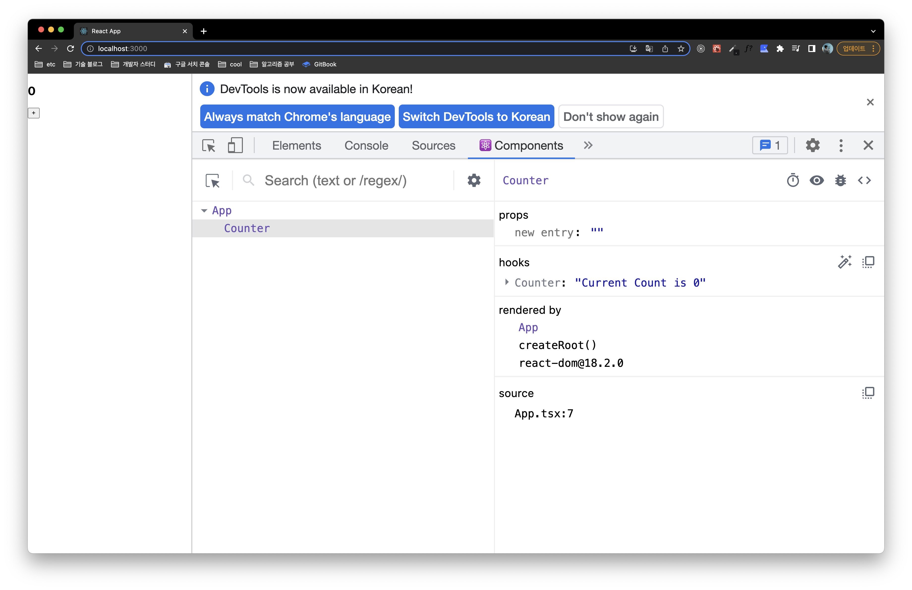
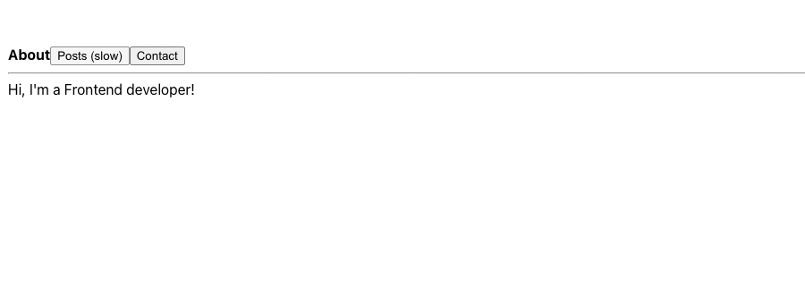

평소에 익숙하지 않은 훅들이 있어 해당 훅들에 대한 기능들과 예제를 살펴보려 합니다.

## useDebugValue

`useDebugValue()`는 `console.log()`를 대체할 수 있습니다. 가령 개발 과정에서 상태 변화를
위해 변경 로그를 찍어보는 경우가 많은데요. `useDebugValue()`를 통해 인자로 전달한 특정값을 구독하고
변경 상태를 로그로 남깁니다. 해당 로그는 [React Developer Tools](https://chrome.google.com/webstore/detail/react-developer-tools/fmkadmapgofadopljbjfkapdkoienihi)
디버깅 익스텐션을 통해 확인할 수 있습니다.

```ts
import { useDebugValue, useState } from 'react';

function useCounter() {
  const [count, setCount] = useState(0);
  useDebugValue(count);

  return { count, setCount };
}

export default useCounter;
```

```tsx
function Counter() {
  const {count, setCount} = useCounter();
  return (
    ...
  )
}

export default Counter;
```



`useDebugValue()`는 훅에서 반환되는 상태에 대해 보다 사람 친화적으로 읽기 쉬운 로그를 제공할 수 있도록
구현되어 있습니다. 가령 하나의 훅에서 여러 개의 상태를 구독했다면, 내부적으로 배열로 결합해서 로그를 제공하거나,

```ts
import { useDebugValue, useState } from 'react';

function useCounter() {
  const [count, setCount] = useState(0);
  useDebugValue(count);
  useDebugValue(setCount);

  return { count, setCount };
}

export default useCounter;
```



상태 반환값에 대한 복잡한 로직이나, 포맷을 지정해서 원하는 포매팅으로 로그를 출력하고 싶은 경우,
다음과 같이 두번째 인자로 함수를 전달해줄 수 있습니다. 이는 실제로 해당 훅을 개발자 도구를 통해
검사하기 전까지 실행되지 않기 때문에 디버깅 로직을 성능과 독립적으로 운용할 수 있게 해줍니다.

```ts
import { useDebugValue, useState } from 'react';

function useCounter() {
  const [count, setCount] = useState(0);
  useDebugValue(count, count => `Current Count is ${count}`);

  return { count, setCount };
}

export default useCounter;
```



## useDeferredValue

`useDeferredValue()`는 일부 UI 업데이트를 연기할 수 있도록 해주는 훅입니다. 리엑트는 유저 인터렉션에 의해
발생한 이벤트 콜백 처리부터 데이터 패칭에 대한 비동기적인 작업까지 사용성을 고려하여 작업에 우선순위를 부여하고
그 순서에 맞게 처리하는데요. (우선순위에 대한 이야기는 [여기](https://youthfulhps.dev/react/react-concurrent-mode-01/#%EB%8F%99%EC%8B%9C%EC%84%B1-%EB%A9%94%EC%BB%A4%EB%8B%88%EC%A6%98-%EC%9A%B0%EC%84%A0%EC%88%9C%EC%9C%84)를 참고하시면 좋습니다!)

`useDeferredValue()`는 이후에 설명할 `useTransition()`과 함께 **리엑트 자체적으로 정한 우선순위와
상충하는 작업 처리를 해야 하는 케이스에 대해 작업자가 우선순위를 인위적으로 변경**할 수 있도록 제공하는 훅이라는
생각이 듭니다.

가령 검색창 입력값이 변경됨에 따라 쿼리를 생성해서 API 요청을 보내야 하는 경우, 사용성을 고려하여 입력창에
입력된 값 변경이 긴급하게 업데이트되어야 합니다. 하지만, 입력값의 완성도를 고려하지 않고 모든 입력값 변경에
요청 이펙트를 발생시키는 것은 좋지 못하다는걸 잘 알고 있습니다. `useDeferredValue()`는 어쩌면 디바운스
기법을 대체할 수 있는 훅일 수도 있겠습니다.

다음 예제와 같이 입력으로 받은 검색어를 통해 `AlbumList` 컴포넌트에서 API 요청을 보낸다고 생각해봅시다.
검색어가 변경될때마다 `AlbumList`에서는 새로운 요청을 보내게 됩니다.

```tsx
import { useDeferredValue, useState, Suspense } from 'react';
import AlbumList from './AlbumList';

function AlbumSearch() {
  const [query, setQuery] = useState('');

  return (
    <div>
      <label>
        Search todo:
        <input value={query} onChange={e => setQuery(e.target.value)} />
      </label>
      <AlbumList query={query} />
    </div>
  );
}

export default AlbumSearch;
```

이제 `useDeferredValue()`를 사용해서 검색어의 완성도를 고려할 수 있도록 `AlbumList`에
속성값으로 전달되는 검색어 업데이트를 지연시켜 봅시다.

```tsx
import { useDeferredValue, useState, Suspense } from 'react';
import AlbumList from './AlbumList';

function AlbumSearch() {
  const [query, setQuery] = useState('');
  const deferredQuery = useDeferredValue(query);
  const isStale = query !== deferredQuery;

  return (
    <div>
      <label>
        Search todo:
        <input value={query} onChange={e => setQuery(e.target.value)} />
      </label>
      <AlbumList query={deferredQuery} />
    </div>
  );
}

export default AlbumSearch;
```

업데이트가 지연된 검색어를 전달함으로서 해당 검색어로 인한 사이드 이펙트 발생을 미루어 조금 더 완성도 높은
검색어에 대한 요청만 기대해볼 수 있습니다.

## useTransition

`useTransition()`은 UI를 차단하지 않고 상태를 업데이트할 수 있는 훅입니다. `useTransition()`을
통해 일부 긴급한 상태 업데이트를 긴급하지 않은 상태 업데이트로 노출시킬 수 있습니다. 이 또한 긴급한 상태
업데이트에 대해 우선순위를 튜닝하여 낮은 우선순위를 갖도록할 수 있다는 점에서 작업자의 자유도를 높여줍니다.

아직 명확히 차이점은 파악하지 못했지만, 값의 업데이트에 낮은 우선순위를 부여하는 `useDeferredValue()`와 달리,
`useTransition()`은 상태 업데이트를 발생시키는 트리거 실행의 우선순위를 낮추는 기능이다 정도로 차이를
이해했습니다.

탭을 통해 컨텐츠를 전환하는 네비게이터가 있다고 생각해봅시다. ([예제](https://react.dev/reference/react/useTransition#usage)는 리엑트 공식 문서에서 발췌했습니다.)

```tsx
import { useState } from 'react';
import TabButton from './TabButton';
import About from './About';
import Contact from './Contact';
import PostsTab from './Posts';

function Navigator() {
  const [tab, setTab] = useState('about');

  return (
    <>
      <nav>
        <TabButton isActive={tab === 'about'} onClick={() => setTab('about')}>
          About
        </TabButton>
        <TabButton isActive={tab === 'posts'} onClick={() => setTab('posts')}>
          Posts (slow)
        </TabButton>
        <TabButton
          isActive={tab === 'contact'}
          onClick={() => setTab('contact')}
        >
          Contact
        </TabButton>
        <hr />
      </nav>
      {tab === 'about' && <About />}
      {tab === 'posts' && <PostsTab />}
      {tab === 'contact' && <Contact />}
    </>
  );
}

export default Navigator;
```

여기서 유독 `Posts` 페이지는 랜더링 과정이 1초가 걸리는 매우 무거운 작업을 수행하도록 구현되어 있어
포스트탭을 클릭하면 잠시 UI 인터렉션이 블로킹되고, 랜더링에 몰두하게 됩니다. 즉 우선순위가 높은 유저
인터렉션 처리를 할 수 없게 됩니다.



여기서 클릭을 통한 선택된 탭 전환 트리거를 `useTransition()`로 감싸주고 우선순위를 낮춰봅시다.

```tsx
import { ReactNode, useTransition } from 'react';

type TabButtonProps = {
  children: ReactNode;
  isActive: boolean;
  onClick: () => void;
};

function TabButton({ children, isActive, onClick }: TabButtonProps) {
  const [isPending, startTransition] = useTransition();
  if (isActive) {
    return <b>{children}</b>;
  }
  if (isPending) {
    return <b className="pending">{children}</b>;
  }
  return (
    <button
      onClick={() => {
        startTransition(() => {
          onClick();
        });
      }}
    >
      {children}
    </button>
  );
}

export default TabButton;
```

이제 다시 포스트탭을 클릭해보면, UI 인터렉션이 블로킹되지 않고 활성화되어 있으며 포스트 컨텐츠를
로딩하다가 발생한 탭 전환 인터렉션에 대해 즉시 처리할 수 있게 됩니다.

리엑트에서 동시성 메커니즘을 구현하기 위해 적용된 '양보'의 개념으로, 탭 전환에 의해 발생한 랜더링 작업을
잘개 쪼개서 작업을 진행하다가 우선순위가 높은 사용자의 인터렉션(이 예제에서는 다른 탭 클릭)이 들어왔을 때,
랜더링 작업이 소유하고 있던 실행권을 우선순위가 높은 작업 처리에 양보하는 모습을 확인할 수 있습니다.
(양보에 대한 이야기는 [여기](https://youthfulhps.dev/react/react-concurrent-mode-01/#%EB%8F%99%EC%8B%9C%EC%84%B1-%EB%A9%94%EC%BB%A4%EB%8B%88%EC%A6%98-%EC%96%91%EB%B3%B4)를 참고하시면 좋습니다!)
