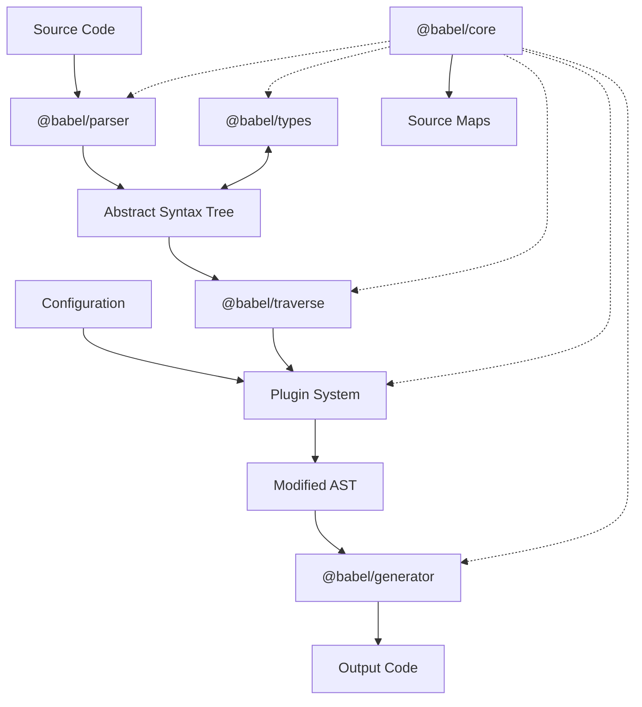
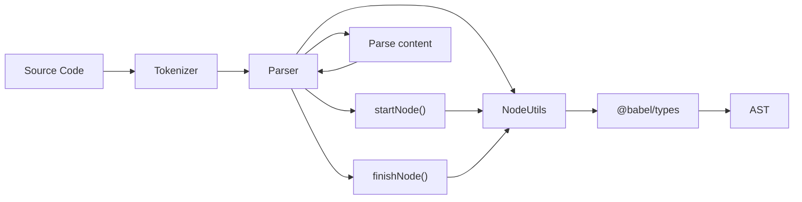
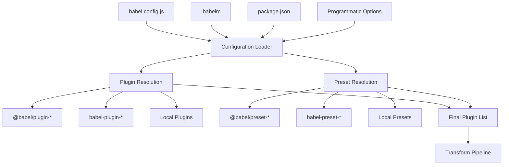
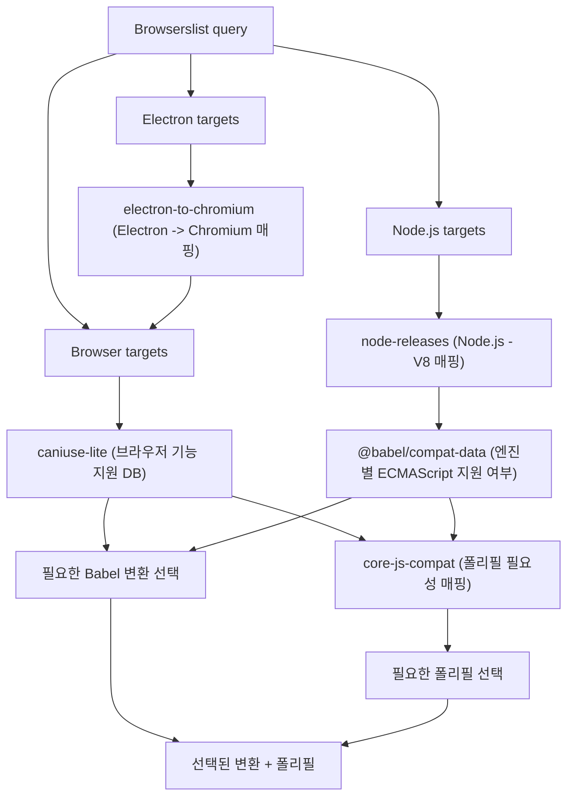
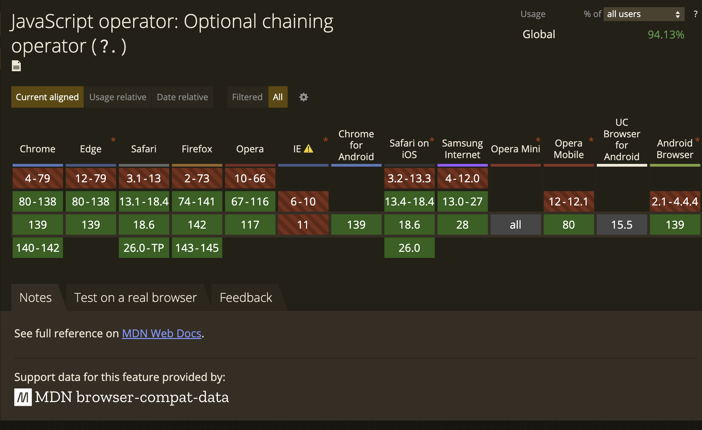
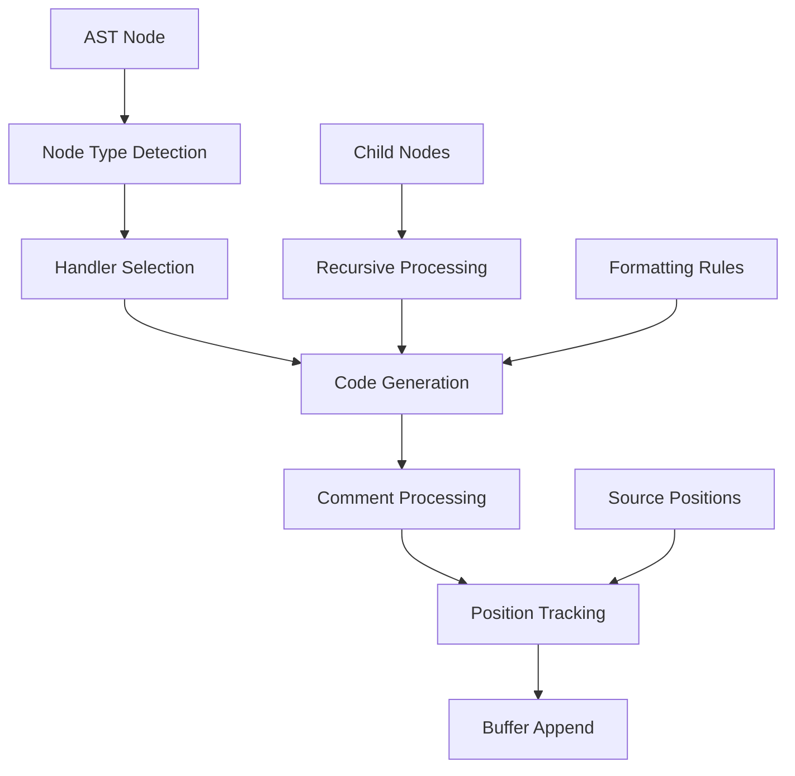

브라우저들이 가지고 있는 자바스크립트 엔진은 일반적으로 표준화되어 있지만, 호환 가능한 코드의 미묘한 차이가 존재한다. `babel`은 개발자가
작성한 최신 `ECMAScript` 기능이 담긴 한 벌의 코드를 통해 제품이 제공되는 이전 환경들과의 호환성을 유지할 수 있도록 하는 사전 설정 도구인 컴파일러 및
변환 시스템이다.

`babel`의 기원은 `ECMAScript6 (ES6)` 코드를 `ECMAScript5 (ES5)`로 변환하기 위해 설계된 [6to5](https://www.npmjs.com/package/6to5)로 시작되어,
그 변환 범위가 확장됨에 따라 [Not Born to Die](https://babeljs.io/blog/2015/02/15/not-born-to-die)를 통해 `babel`이라는 이름으로 재구성되었다.
덕분에 감사하게도 동작 환경에 구애 받지 않고 그저 고급 문법을 사용해 코드를 작성할 수 있게 되었다.

> 6to5 is now Babel. ... Always bet on JavaScript.

## 핵심 아키텍처

`babel` 생태계에서 제공하는 코드 변환 과정의 핵심적인 아키텍처는 다음과 같이 구성되어 있다. 대표적으로 구문 분석에 사용되는 `@babel/parser`,
추상 구문 트리(이하 `AST`)를 효율적으로 순회하기 위한 메커니즘이 담긴 `@babel/traverse`, 그리고 재생성을 담당하는 `@babel/generator`이 있다.
더불어 일관된 구문 분석과 변환을 위해 그 구조를 정의한 `@babel/types`, 마지막으로 이 모든 과정을 중추에서 관장하는 `@babel/core`가 있다.



## 구문 분석

구문 분석은 `@babel/parser`가 담당한다. `babel`의 도구들이 해석하고 조작 가능한 구조인 `AST`로 변환하는 역할을 한다.

```js
const { parse } = require('@babel/parser');

const code = `function greet(input) {
  return input ?? "Hello world";
}`;

const ast = parse(code, {
  sourceType: 'module',
  plugins: [],
});
```

<details>
  <summary><deckgo-highlight-code language="javascript">
<code slot="code">console.log(JSON.stringify(ast, null, 2));</code>
  </deckgo-highlight-code></summary>
  <deckgo-highlight-code language="json">
<code slot="code">
{
  "type": "File",
  "start": 0,
  "end": 58,
  "loc": {
    "start": {
      "line": 1,
      "column": 0,
      "index": 0
    },
    "end": {
      "line": 3,
      "column": 1,
      "index": 58
    }
  },
  "errors": [],
  "program": {
    "type": "Program",
    "start": 0,
    "end": 58,
    "loc": {
      "start": {
        "line": 1,
        "column": 0,
        "index": 0
      },
      "end": {
        "line": 3,
        "column": 1,
        "index": 58
      }
    },
    "sourceType": "module",
    "interpreter": null,
    "body": [
      {
        "type": "FunctionDeclaration",
        "start": 0,
        "end": 58,
        "loc": {
          "start": {
            "line": 1,
            "column": 0,
            "index": 0
          },
          "end": {
            "line": 3,
            "column": 1,
            "index": 58
          }
        },
        "id": {
          "type": "Identifier",
          "start": 9,
          "end": 14,
          "loc": {
            "start": {
              "line": 1,
              "column": 9,
              "index": 9
            },
            "end": {
              "line": 1,
              "column": 14,
              "index": 14
            },
            "identifierName": "greet"
          },
          "name": "greet"
        },
        "generator": false,
        "async": false,
        "params": [
          {
            "type": "Identifier",
            "start": 15,
            "end": 20,
            "loc": {
              "start": {
                "line": 1,
                "column": 15,
                "index": 15
              },
              "end": {
                "line": 1,
                "column": 20,
                "index": 20
              },
              "identifierName": "input"
            },
            "name": "input"
          }
        ],
        "body": {
          "type": "BlockStatement",
          "start": 22,
          "end": 58,
          "loc": {
            "start": {
              "line": 1,
              "column": 22,
              "index": 22
            },
            "end": {
              "line": 3,
              "column": 1,
              "index": 58
            }
          },
          "body": [
            {
              "type": "ReturnStatement",
              "start": 26,
              "end": 56,
              "loc": {
                "start": {
                  "line": 2,
                  "column": 2,
                  "index": 26
                },
                "end": {
                  "line": 2,
                  "column": 32,
                  "index": 56
                }
              },
              "argument": {
                "type": "LogicalExpression",
                "start": 33,
                "end": 55,
                "loc": {
                  "start": {
                    "line": 2,
                    "column": 9,
                    "index": 33
                  },
                  "end": {
                    "line": 2,
                    "column": 31,
                    "index": 55
                  }
                },
                "left": {
                  "type": "Identifier",
                  "start": 33,
                  "end": 38,
                  "loc": {
                    "start": {
                      "line": 2,
                      "column": 9,
                      "index": 33
                    },
                    "end": {
                      "line": 2,
                      "column": 14,
                      "index": 38
                    },
                    "identifierName": "input"
                  },
                  "name": "input"
                },
                "operator": "??",
                "right": {
                  "type": "StringLiteral",
                  "start": 42,
                  "end": 55,
                  "loc": {
                    "start": {
                      "line": 2,
                      "column": 18,
                      "index": 42
                    },
                    "end": {
                      "line": 2,
                      "column": 31,
                      "index": 55
                    }
                  },
                  "extra": {
                    "rawValue": "Hello world",
                    "raw": "\\"Hello world\\""
                  },
                  "value": "Hello world"
                }
              }
            }
          ],
          "directives": []
        }
      }
    ],
    "directives": [],
    "extra": {
      "topLevelAwait": false
    }
  },
  "comments": []
}
</code>
  </deckgo-highlight-code>
</details>

### ECMAScript 기능을 위한 플러그인 시스템

`@babel/parser`는 고전 문법은 물론, 플러그인 시스템을 통한 최신 `ECMAScript` 구문 및 실험적인 기능에 대한 분석을 지원한다.
[TC39](https://tc39.es/)를 통해 제안된 새로운 문법과 기능이 [스테이지 3](https://tc39.es/process-document/)에 도달하면
정식 문법으로 채택될 가능성이 매우 높다고 판단하고, 브라우저와 `babel`과 같은 툴링을 유지보수하는 팀들에 의해 적극적으로 도입이 시도된다.

`babel`의 경우 스테이지 3에 도달한 새로운 기능 제안은 플러그인을 통해 실험적 옵션으로 제공되며, 이를 통해 분석 단계에서 해당 문법을 분석 가능하도록 지원한다.
이후 정식 문법이 되면 해당 플러그인은 기본으로 내장된다.

구문 분석을 돕기 위한 플러그인은 `@babel/plugin-syntax-*` 형식의 이름으로 제공되며, 그 예시로 `optional chaining` 문법을 분석하기 위한
`@babel/plugin-syntax-optional-chaining`이 있다.

```js
// input
const val = obj?.prop;
```

2017년 9월경 [how to add syntax-optional-chaining plugins?](https://github.com/babel/babel/issues/5905)에서
`babel-plugin-syntax-optional-chaining@7.0.0-alpha.17`가 언급되고 `babel v7` 베타 시점에 해당 플러그인이 등장했다. 이후
[babel v7.8.0](https://babeljs.io/docs/babel-plugin-transform-optional-chaining)에서 분석, 변환 단계에서 사용할 수 있는 정식 플러그인으로
추가되어 `preset-env`를 통해 `optional chaining` 문법을 분석 및 변환할 수 있게 되었다.

```js
// output
var _obj;
const val = (_obj = obj) === null || _obj === void 0 ? void 0 : _obj.prop;
```

_`babel-plugin-*`, `@babel/plugin-*`는 시대적 네임스페이스 차이 일뿐 같은 플러그인입니다. `babel v7` 부터 `@babel/plugin-*` 방식으로 공식
패키지의 네임스페이스로 규격화 되었습니다._

### 언어 확장을 위한 플러그인 시스템

`@babel/parser`는 단순히 최신 `ECMAScript` 구문 분석 뿐만 아니라, `JSX`, `typescript`, `flow`와 같은 확장된 언어 또한
플러그인 시스템을 통해 분석을 지원한다.

가령 `typescript`에 대한 언어 확장 분석을 지원하기 위해 기존 `@babel/parser`에 `TypeScriptParserMixin`이 믹스인 플러그인을 통해 부여된다.
해당 믹스인에 포함된 메서드들은 `tsParse*()`라는 이름으로 `type`, `annotation`, `signatureMember`, `modifiers` 구문을 각각 담당하고 있다.
이 중 타입 표현식 분석을 담당하는 `tsParseType()`을 살펴보자.

`tsParseType()`는 현재 파서의 컨텍스트가 타입 컨텍스트에 있는지 확인을 통해 시작한다. 이 검증은 `typescript`와 `JSX` 모두 `<>`와 같은
문법을 사용하고 있기 때문에 타입 컨텍스트에 있는다는 것을 명확히 해야만 `<T>` 구문을 타입 인수로 해석할 수 있기 때문이다.

```ts
// packages/babel-parser/src/plugins/typescript/index.ts
tsParseType(): N.TsType {
  assert(this.state.inType);
  ...
```

이후 토큰화 과정을 통해 생성된 타입 구문의 토큰 시퀸스를 순차적으로 확인하며 타입 구문을 분석한다.
`tsParseType()`은 크게 `extends` 키워드가 토큰 시퀸스에 존재하는지에 따라 분기가 나뉜다.

```ts
// packages/babel-parser/src/plugins/typescript/index.ts
tsParseType(): N.TsType {
  assert(this.state.inType);
  const type = this.tsParseNonConditionalType();

  if (
    ...
    !this.eat(tt._extends) // extends 키워드가 존재하는지 확인
  ) {
    return type; // 기본 타입으로 반환
  }
  // 조건부 타입 분석 진행
```

타입 표현식에서 사용할 수 있는 복잡한 구조인 조건부 타입으로 해당 타입이 선언되었다고 가정해보자.
이는 다음과 같은 토큰들로 이루어진 시퀸스를 구성하게 된다.

```ts
type Example = checkType extends extendsType ? trueType : falseType;
```

```json
type         → tt._type, 타입 선언 키워드
Example      → tt.name, 식별자 토큰
=            → tt.eq, 할당 연산자
checkType    → tt.name, 식별자 토큰
extends      → tt._extends, extends 키워드
extendsType  → tt.name, 식별자 토큰
?            → tt.question, 물음표 연산자
trueType     → tt.name, 식별자 토큰
:            → tt.colon, 콜론 연산자
falseType    → tt.name, 식별자 토큰
;            → tt.semi, 세미콜론 (구문 종료)
```

하지만 구문 분석기는 토큰 시퀸스를 순차적으로 분석할 수 밖에 없기 때문에 `checkType` 이라는 타입 식별자를 분석하는 단계에선
해당 타입 구문이 조건부 타입의 구조를 가지고 있는지 알 수 없다. 즉, 구문 분석기는 토큰 시퀸스 흐름에 따라 먼저 `checkType`을
단순한 타입 식별자로 판단하고 `tsParseNonConditionalType()`를 통해 분석한다.

`_type` 토큰 이후에 등장하는 `name` 토큰은 `tsParseNonConditionalType()`을 통해 분석되고 소비되는데, 이 과정은 해당 식별자 타입이
함수 시그니처나 `new` 키워드로 시작하는 생성자 타입인지 먼저 확인하고,
이후 `tsParseUnionTypeOrHigher()`를 통해 타입 우선순위에 따라 일반적인 타입 표현식을 처리한다.

```ts
// packages/babel-parser/src/plugins/typescript/index.ts
tsParseNonConditionalType(): N.TsType {
  if (this.tsIsStartOfFunctionType()) { // 함수 시그니처 검사
    return this.tsParseFunctionOrConstructorType("TSFunctionType");
  }

  if (this.match(tt._new)) { // 생성자 타입 검사
    return this.tsParseFunctionOrConstructorType("TSConstructorType");
  }

  return this.tsParseUnionTypeOrHigher(); // 일반적인 타입 표현식 처리
}
```

`tsParseUnionTypeOrHigher()`에서는 일반적인 타입 표현식을 처리하게 되는데, 기본 타입을 분석하는 단계까지 가기 위해서
타입 시스템 상의 우선순위에 입각하여 낮은 우선 순위 순서대로 유니언 타입(`|`), 교집합 타입(`&`), 타입 연산자(`keyof`, `readonly` 등),
배열/인덱스 접근과 같은 타입 분석이 순차적으로 이루어진다.

```ts
// packages/babel-parser/src/plugins/typescript/index.ts
tsParseUnionTypeOrHigher() {
  return this.tsParseUnionOrIntersectionType(
    "TSUnionType",
    this.tsParseIntersectionTypeOrHigher.bind(this),
    tt.bitwiseOR
  );
}
```

```ts
// packages/babel-parser/src/plugins/typescript/index.ts
tsParseIntersectionTypeOrHigher() {
  return this.tsParseUnionOrIntersectionType(
    "TSIntersectionType",
    this.tsParseTypeOperatorOrHigher.bind(this),
    tt.bitwiseAND
  );
}
```

```ts
// packages/babel-parser/src/plugins/typescript/index.ts
tsParseTypeOperatorOrHigher(): N.TsType {
  const isTypeOperator = tokenIsTSTypeOperator(this.state.type);
  return isTypeOperator
    ? this.tsParseTypeOperator()
    : this.isContextual(tt._infer)
      ? this.tsParseInferType()
      : this.tsParseArrayTypeOrHigher();
}
```

```ts
// packages/babel-parser/src/plugins/typescript/index.ts
tsParseArrayTypeOrHigher(): N.TsType {
  let type = this.tsParseNonArrayType();

  while (this.eat(tt.bracketL)) {
    if (this.match(tt.bracketR)) {
    } else {
      ...
    }
  }
  return type;
}
```

위 과정은 타입시스템의 우선순위에 따라 낮은 우선 순위의 연산자부터 처리하기 시작하는데, 현재 처리 중인 연산자보다 높은 연산자가 이후에 등장할 것을 감안하여
더 높은 연산자 분석을 담당하는 메서드에게 지속적으로 분석을 위임하는 과정을 거쳐 타입시스템의 우선순위에 입각해 해석할 수 있도록 한다. 최종적으로 더 이상 분해할 수 없는
기본 타입들을 토큰 종류에 따라 처리하게 된다.

```ts
// packages/babel-parser/src/plugins/typescript/index.ts
tsParseNonArrayType(): N.TsType {
  switch (this.state.type) {
    case tt.string:
    case tt.num:
    case tt.bigint:
    case tt._true:
    case tt._false:
      return this.tsParseLiteralTypeNode();
    case tt._this:
      return this.tsParseThisTypeOrThisTypePredicate();
    case tt._typeof:
      return this.tsParseTypeQuery();
    case tt.braceL:
      return this.tsLookAhead(this.tsIsStartOfMappedType.bind(this))
        ? this.tsParseMappedType()
        : this.tsParseTypeLiteral();
    case tt.bracketL:
      return this.tsParseTupleType();
    ...
  }
}
```

이후 `extends` 식별자 토큰을 만나게 되면, `eat()` 메서드를 통해 조건 확인을 거친 후 토큰은 소비되며, 이 과정을 통해
해당 토큰 시퀸스가 조건부 타입임을 확인하고 해당 분기로 분석이 진행된다.

참고로 `eat()`은 토큰 시퀸스에서 등장하는 키워드들이 사전 정의된 타입과 일치하는지 확인하고,
소비하는 역할을 담당하는 메서드로 네이밍이 상당히 직관적이며, 토큰 시퀸스를 읽고 키워드를 확인하는 과정에서 자주 등장한다.

```ts
// packages/babel-parser/src/tokenizer/index.ts
eat(type: TokenType): boolean {
  if (this.match(type)) {
    this.next(); // 소비 후 다음 토큰으로 이동
    return true; // 사전 정의된 타입과 일치하는지 확인
  } else {
    return false;
  }
}
```

소비된 `extends` 토큰 이후로 만나게 되는 `extendsType`, `trueType`, `falseType` 식별자 토큰들은 같은 방식의 재귀적인 방식으로
`tsParseNonConditionalType()`를 통해 분석되고, 최종적으로 `TSConditionalType` 타입을 가지는 노드가 반환된다.

```ts
extendsType ? trueType : falseType;
```

```ts
// packages/babel-parser/src/plugins/typescript/index.ts
tsParseType(): N.TsType {
  ...
  const type = this.tsParseNonConditionalType();

  if (
    this.state.inDisallowConditionalTypesContext ||
    this.hasPrecedingLineBreak() ||
    !this.eat(tt._extends)
  ) {
    return type;
  }
  const node = this.startNodeAtNode<N.TsConditionalType>(type);
  node.checkType = type;

  node.extendsType = this.tsInDisallowConditionalTypesContext(() =>
    this.tsParseNonConditionalType(),
  );

  this.expect(tt.question);
  node.trueType = this.tsInAllowConditionalTypesContext(() =>
    this.tsParseType(),
  );

  this.expect(tt.colon);
  node.falseType = this.tsInAllowConditionalTypesContext(() =>
    this.tsParseType(),
  );

  return this.finishNode(node, "TSConditionalType");
}
```

_그외 `annotation`, `signatureMember`, `modifiers` 구문을 분석하는 메서드들은 각각 `tsParseTypeAnnotation()`,
`tsParseSignatureMember()`, `tsParseModifiers()`로 [@babel/parser](https://github.com/babel/babel/blob/6c8faf172180280cd15b2f9aa1f35ad233f8a8c2/packages/babel-parser/src/plugins/typescript/index.ts)를 살펴보시는 것을
추천드립니다._

### AST 노드 생성 방식

위처럼 플러그인 시스템을 통해 분석이 완료된 토큰들은 `AST`를 구성하는 노드로 생성된다. 그렇다면 노드는 어떻게 생성되는 것일까.



`@babel/parser`에서 생성되는 모든 `AST`의 노드는 `Node` 클래스를 기반으로 생성된다. 이 클래스는 코드상에서의 위치 정보, 타입, 범위 등의 기본 속성을 포함하고 있다.

```ts
// packages/babel-parser/src/parser/node.ts
class Node implements NodeBase {
  constructor(parser: UtilParser, pos: number, loc: Position) {
    this.start = pos;
    this.end = 0;
    this.loc = new SourceLocation(loc);
    if (parser?.optionFlags & OptionFlags.Ranges) this.range = [pos, 0];
    if (parser?.filename) this.loc.filename = parser.filename;
  }

  type: string = '';
  declare start: number;
  declare end: number;
  declare loc: SourceLocation;
  declare range: [number, number];
  declare leadingComments: Array<Comment>;
  declare trailingComments: Array<Comment>;
  declare innerComments: Array<Comment>;
  declare extra: {
    [key: string]: any;
  };
}
```

파싱 과정에서 새로운 `AST` 노드를 생성할때 `startNode()`를 통해 새로운 노드를 생성하고, 현재 파서의 위치 정보를 사용하여
해당 노드의 시작점을 설정한다.

```ts
// packages/babel-parser/src/parser/node.ts
export abstract class NodeUtils extends UtilParser {
  startNode<T extends NodeType = never>(): Undone<T> {
    const loc = this.state.startLoc;
    return new Node(this, loc.index, loc) as unknown as Undone<T>;
  }
  ...
```

이후 구문 파싱을 위한 적절한 메서드를 호출하고, 노드 타입을 결정한다.

```ts
// packages/babel-parser/src/parser/statement.ts
parseStatementContent(
  this: Parser,
  flags: ParseStatementFlag,
  decorators?: N.Decorator[] | null,
): N.Statement {
  const startType = this.state.type;
  const node = this.startNode();
  const allowDeclaration = !!(flags & ParseStatementFlag.AllowDeclaration);
  const allowFunctionDeclaration = !!(
    flags & ParseStatementFlag.AllowFunctionDeclaration
  );
  const topLevel = flags & ParseStatementFlag.AllowImportExport;
  ...
```

분석이 완료된 후 마지막으로 `finishNode()`를 통해 노드의 타입과 끝 위치를 설정하여
노드를 완성한다.

```ts
// packages/babel-parser/src/parser/node.ts
export abstract class NodeUtils extends UtilParser {
  finishNode<T extends NodeType>(node: Undone<T>, type: T["type"]): T {
    return this.finishNodeAt(node, type, this.state.lastTokEndLoc);
  }

  // Finish node at given position
  finishNodeAt<T extends NodeType>(
    node: Omit<T, "type">,
    type: T["type"],
    endLoc: Position,
  ): T {
    if (process.env.NODE_ENV !== "production" && node.end > 0) {
      // throw new Error
    }
    (node as T).type = type;
    node.end = endLoc.index;
    node.loc.end = endLoc;
    if (this.optionFlags & OptionFlags.Ranges) node.range[1] = endLoc.index;
    if (this.optionFlags & OptionFlags.AttachComment) {
      this.processComment(node as T);
    }
    return node as T;
  }
  ...
```

위와 같은 분석 과정을 도와주는 플러그인은 다음과 같이 `parse()` 플러그인 옵션에 추가하여 사용할 수 있다.

```js
parse(code, {
  plugins: [
    ['typescript', { dts: true, disallowAmbiguousJSXLike: true }],
    ['flow', { all: true, enums: true }],
    'jsx',
  ],
});
```

```js
const { parse } = require('@babel/parser');

const typeScriptCode = `
type NumberType = number;
`;

const ast = parse(typeScriptCode, {
  sourceType: 'module',
  plugins: ['typescript'],
});
```

<details>
  <summary><deckgo-highlight-code language="javascript">
<code slot="code">console.log(JSON.stringify(ast, null, 2));</code>
  </deckgo-highlight-code></summary>
  <deckgo-highlight-code language="json">
<code slot="code">
{
  "type": "File",
  "start": 0,
  "end": 27,
  "loc": {
    "start": {
      "line": 1,
      "column": 0,
      "index": 0
    },
    "end": {
      "line": 3,
      "column": 0,
      "index": 27
    }
  },
  "errors": [],
  "program": {
    "type": "Program",
    "start": 0,
    "end": 27,
    "loc": {
      "start": {
        "line": 1,
        "column": 0,
        "index": 0
      },
      "end": {
        "line": 3,
        "column": 0,
        "index": 27
      }
    },
    "sourceType": "module",
    "interpreter": null,
    "body": [
      {
        "type": "TSTypeAliasDeclaration",
        "start": 1,
        "end": 26,
        "loc": {
          "start": {
            "line": 2,
            "column": 0,
            "index": 1
          },
          "end": {
            "line": 2,
            "column": 25,
            "index": 26
          }
        },
        "id": {
          "type": "Identifier",
          "start": 6,
          "end": 16,
          "loc": {
            "start": {
              "line": 2,
              "column": 5,
              "index": 6
            },
            "end": {
              "line": 2,
              "column": 15,
              "index": 16
            },
            "identifierName": "NumberType"
          },
          "name": "NumberType"
        },
        "typeAnnotation": {
          "type": "TSNumberKeyword",
          "start": 19,
          "end": 25,
          "loc": {
            "start": {
              "line": 2,
              "column": 18,
              "index": 19
            },
            "end": {
              "line": 2,
              "column": 24,
              "index": 25
            }
          }
        }
      }
    ],
    "directives": [],
    "extra": {
      "topLevelAwait": false
    }
  },
  "comments": []
}
</code>
  </deckgo-highlight-code>
</details>

## 변환

구문 분석이 완료된 결과로 얻어진 `AST`는 이제 대상 환경에서 해석가능한 문법으로 변환하는 과정을 거치게 된다.
이는 `@babel/traverse`를 통해 트리 구조에 포함된 각각의 노드를 순회하며 개별 노드 혹은 노드 간의 관계를
기반으로 진행된다.

그렇다면 해당 단계에서 지원하고자 하는 대상 환경에 맞게 변환하기 위한 플러그인들은 어떻게 선정되는 것일까.
이는 대표적으로 `@babel/preset-env`를 통해 대상 환경에 필요한 구문 변환을 위해 세부적으로 관리하지 않고도
어떤 변환 플러그인과 폴리필이 필요한지 결정해주는 사전 설정 덕분이다.



가령 '특정 브라우저 혹은 런타임만 지원하겠다.' 라는 설정이 포함되어 있으면, `preset-env`에서 해당
타겟에서 미지원인 문법을 확인해 필요한 플러그인 및 폴리필을 추가해준다. 그리고 이러한 지원 대상을
명시하는 방법은 [`browserslist`](https://github.com/browserslist/browserslist)의 질의어를 통해 가능하다.

_`browserslist`에서 제공하는 [playground](https://browsersl.ist/)에서 질의 테스트를 통해 지원하는 브라우저 리스트를
확인할 수 있습니다._

```json
// packages.json
{
  "browserslist": ["last 2 versions", "> 0.25% and not dead", "ios >= 12"]
}
```

```js
// babel.config.js
presets: [
  ["@babel/preset-env", {
    targets: {
      ios: "12",
      chrome: "80"
    },
    ...
```

### browserslist와 통합된 preset-env

`browserslist`은 질의어를 통해 특정 브라우저 및 런타임 환경 정보를 얻는데까지 여러 채널을 의존하고 있다.



물론 브라우저뿐만 아니라 [`node.js`](https://nodejs.org/ko/), [`electron`](https://www.electronjs.org/)과 같은 런타임 환경도 함께 고려된다. 자바스크립트로 구성된 프로젝트가 브라우저 외 서버사이드, `electron` 환경에서 동작할 수 있기 때문에 해당 매핑 정보 또한 함께
수집되어야 한다.

```json
{
  "browserslist": ["last 2 versions", "node 18", "electron 25"]
}
```

```shell
~$ npx browserslist

and_chr 135
and_ff 137
chrome 124
edge 124
firefox 126
safari 17.4
node 18.19.0
electron 25.3.1
...
```

(다소 다른 길로 새는 감이 없지 않지만) 간단하게 각각의 패키지 역할을 흐름에 따라 알아보자.
앞서 `browserslist`를 통해 지원해야 하는 브라우저와 런타임 환경을 나열했다면, 이제 각 환경이 어떤 기능을 지원하는지 파악해야 한다.

[`caniuse.com`](https://caniuse.com/)의 데이터를 경량화한 버전으로 빌드 도구들이 빠르게 참조할 수
있도록 최적화되어 있는 [`caniuse-lite`](https://github.com/browserslist/caniuse-lite)는 각 브라우저의 버전별로 어떤 웹 표준 기능을 지원하는지에 대한 데이터베이스를 제공한다.
예를 들어 `Chrome 80`에서는 옵셔널 체이닝을 지원하지만, `Internet Explorer 11`에서는 지원하지 않는다는 정보를 담고 있다.



[이미지 출처](https://caniuse.com/?search=optional%20chaining)

`node.js`에서 지원하는 문법 및 내장 정보를 확인하기 위해 특정 버전에서 사용되고 있는 V8 엔진의 버전 정보를 알아야 한다. [`node-releases`](https://github.com/chicoxyzzy/node-releases)는 `node.js`의 각 버전이 어떤 V8 엔진을 사용했는지에 대한 매핑 정보를 경량화하여 관리하고 있다.

```json
[
  ...,
  {
    "name": "nodejs",
    "version": "24.6.0",
    "date": "2025-08-14",
    "lts": false,
    "security": false,
    "v8": "13.6.233.10"
  }
]
```

`electron` 또한 지원하기 위해 [`electron-to-chromium`](https://github.com/kilian/electron-to-chromium)는 `electron` 버전에 해당하는 `Chromium` 버전 간의 매핑을 제공한다.

이렇게 취득된 브라우저 및 런타임 환경 정보를 토대로, 브라우저 및 런타임 환경별로 `ECMAScript` 기능 지원 버전을 담아 관리하고 있는 `@babel/compat-data`를 통해
각각의 해당 환경에서의 기능 지원 여부를 판단한다.

```js
const plugins = require('@babel/compat-data/plugins');
console.log(plugins['transform-async-to-generator']);

// {
//   chrome: '55',
//   opera: '42',
//   edge: '15',
//   firefox: '52',
//   safari: '11',
//   node: '7.6',
//   deno: '1',
//   ios: '11',
//   samsung: '6',
//   opera_mobile: '42',
//   electron: '1.6'
// }
```

취득된 정보들을 토대로 `preset-env`는 타겟 환경에서 지원하지 않은 문법을 변환하기 위한 적절한 `@babel/plugin-transform-*` 플러그인을 선택한다.
예를 들어 옵셔널 체이닝을 지원하지 않는 환경이라면 `@babel/plugin-transform-optional-chaining`을 포함시킨다.

더불어 [`core-js-compat`](https://github.com/zloirock/core-js)를 통해 타겟 환경에 누락되어 있는 내장 객체나 메서드에 대한 폴리필 주입을 결정한다. 가령 `Promise`, `Array.prototype.includes`
와 같은 기능이 없는 환경에서는 해당 폴리필을 주입해 런타임에 문제없이 기능이 동작할 수 있도록 한다.

위 과정이 `preset-env`를 통해 가능한 이유는 `browserslist`와 통합되어 있기 때문이다.
이는 `@babel/helper-compilation-targets`에서 확인할 수 있는데, `getTargets()` 메서드를 통해
`browserslist()`를 직접 호출하여 쿼리에서 대상 브라우저를 해석하는 과정을 포함하고 있다.

```ts
// packages/babel-helper-compilation-targets/src/index.ts
export default function getTargets(
  inputTargets: InputTargets = {},
  options: GetTargetsOption = {}
): Targets {
  ...
  if (!browsers && shouldSearchForConfig) {
    if (configFile != null) {
      ...
    }

    if (browsers == null) {
      if (process.env.BABEL_8_BREAKING) {
        browsers = ['defaults'];
      } else {
        browsers = [];
      }
    }
  }
  ...
  if (esmodules && (esmodules !== 'intersect' || !browsers?.length)) {
    ...
  }
  ...
  outputDecimalWarning(decimalWarnings);
  return result;
}
```

### preset-env의 플러그인 선별 과정

`preset-env`는 내부적으로 `@babel/helper-compilation-targets`의 `getTargets()`를 사용하는 `getLocalTargets()` 메서드를 통해
프로젝트 환경에 설정된 `browserslist` 구성을 기반으로 한 결과를 얻어낸다.

```ts
// packages/babel-preset-env/src/index.ts
function getLocalTargets(
  optionsTargets: Options['targets'],
  ignoreBrowserslistConfig: boolean,
  configPath: string,
  browserslistEnv: string,
  api: PresetAPI
) {
  if (optionsTargets?.esmodules && optionsTargets.browsers) {
    // warning log
  }

  return getTargets(optionsTargets as InputTargets, {
    ignoreBrowserslistConfig,
    configPath,
    browserslistEnv,
    onBrowserslistConfigFound(config) {
      api.addExternalDependency(config);
    },
  });
}
```

리스트업된 대상에 따른 플러그인 선택 과정은 `filterItems()`가 담당한다. 이는 `compatData`를 기반으로
대상 환경을 플러그인 호환성 데이터와 비교하여 각 브라우저의 가장 낮은 구현 버전을 대상 버전과 비교하여
플러그인이 필요한지 여부를 결정하는 역할을 한 후 대상 브라우저와 함께 플러그인 이름 집합을 생성한다.

```ts
// packages/babel-helper-compilation-targets/src/filter-items.ts
export default function filterItems(
  list: { [feature: string]: Targets },
  includes: Set<string>,
  excludes: Set<string>,
  targets: Targets,
  defaultIncludes: Array<string> | null,
  defaultExcludes?: Array<string> | null,
  pluginSyntaxMap?: Map<string, string | null>
) {
  const result = new Set<string>();
  const options = { compatData: list, includes, excludes };

  for (const item in list) {
    if (isRequired(item, targets, options)) {
      result.add(item);
    } else if (pluginSyntaxMap) {
      const shippedProposalsSyntax = pluginSyntaxMap.get(item);

      if (shippedProposalsSyntax) {
        result.add(shippedProposalsSyntax);
      }
    }
  }

  defaultIncludes?.forEach(item => !excludes.has(item) && result.add(item));
  defaultExcludes?.forEach(item => !includes.has(item) && result.delete(item));

  return result;
}
```

이렇게 필요한 플러그인이 선별되면, 이를 `availablePlugins`에서 해당 플러그인을 찾아 실제 플러그인
인스턴스를 생성하여 사용한다.

```ts
// packages/babel-preset-env/src/available-plugins.ts
import syntaxImportAssertions from "@babel/plugin-syntax-import-assertions" with { if: "!process.env.BABEL_8_BREAKING" };
import syntaxImportAttributes from "@babel/plugin-syntax-import-attributes" with { if: "!process.env.BABEL_8_BREAKING" };

import transformAsyncGeneratorFunctions from "@babel/plugin-transform-async-generator-functions";
import transformAsyncToGenerator from "@babel/plugin-transform-async-to-generator";
import transformArrowFunctions from "@babel/plugin-transform-arrow-functions";
import transformBlockScopedFunctions from "@babel/plugin-transform-block-scoped-functions";
import transformBlockScoping from "@babel/plugin-transform-block-scoping";
import transformClasses from "@babel/plugin-transform-classes";
import transformClassProperties from "@babel/plugin-transform-class-properties";
import transformClassStaticBlock from "@babel/plugin-transform-class-static-block";
import transformComputedProperties from "@babel/plugin-transform-computed-properties";
import transformDestructuring from "@babel/plugin-transform-destructuring";
...
```

### 플러그인 방문자를 통한 AST 노드 변환

구문 분석을 통해 생성된 `AST`는 변환 단계에서 `@babel/traverse`를 통해 재귀 순회되며 각각의 노드를 방문해
적절한 방문자(`visitor`)를 호출하여 해당 노드를 추가, 업데이트 혹은 제거하는 과정을 통해 적합한 코드로 변환한다.

여기서 방문자란 `AST` 순회 과정에서 특정 타입의 노드를 만나게 되면 실행해야 하는 함수를 매핑해주는 역할로서,
각각의 플러그인들이 특정 타입의 노드를 방문할때 어떤 조작이 필요한지에 대한 변환 정의를 담은 메서드를 반환하는데,
메서드 이름은 `AST` 노드 타입의 이름을 따서 명명한다.

아래는 특정 플러그인들의 변환 정의를 담은 방문자들의 예시이다. 가령 `arrow function`, `optional chaining`과 같은
문법을 처리하는 방문자는 다음과 같다.

```ts
// packages/babel-plugin-transform-arrow-functions/src/index.ts
import { declare } from '@babel/helper-plugin-utils';

export interface Options {
  spec?: boolean;
}

export default declare((api, options: Options) => {
  api.assertVersion(REQUIRED_VERSION(7));

  const noNewArrows = api.assumption('noNewArrows') ?? !options.spec;

  return {
    name: 'transform-arrow-functions',
    visitor: {
      ArrowFunctionExpression(path) {
        if (!path.isArrowFunctionExpression()) return;

        if (process.env.BABEL_8_BREAKING) {
          path.arrowFunctionToExpression({
            allowInsertArrow: false,
            noNewArrows,
          });
        } else {
          path.arrowFunctionToExpression({
            allowInsertArrow: false,
            noNewArrows,
            specCompliant: !noNewArrows,
          });
        }
      },
    },
  };
});
```

```ts
// packages/babel-plugin-transform-optional-chaining/src/index.ts
import { declare } from "@babel/helper-plugin-utils";
import { transform, transformOptionalChain } from "./transform.ts";
import type { NodePath, types as t } from "@babel/core";

export interface Options {
  loose?: boolean;
}
export default declare((api, options: Options) => {
  api.assertVersion(REQUIRED_VERSION(7));

  const { loose = false } = options;
  const noDocumentAll = api.assumption("noDocumentAll") ?? loose;
  const pureGetters = api.assumption("pureGetters") ?? loose;

  return {
    name: "transform-optional-chaining",
    manipulateOptions: process.env.BABEL_8_BREAKING
      ? undefined
      : (_, parser) => parser.plugins.push("optionalChaining"),

    visitor: {
      "OptionalCallExpression|OptionalMemberExpression"(
        path: NodePath<t.OptionalCallExpression | t.OptionalMemberExpression>,
      ) {
        transform(path, { noDocumentAll, pureGetters });
      },
    },
  };
});

export { transform, transformOptionalChain };
```

특정 타입별 노드를 변환하기 위한 플러그인의 방문자들은 순회를 시작하기 전 하나의 방문자로 병합되며,
이후 방문한 노드의 타입에 따라 해당 타입에 담긴 방문자의 메서드가 실행되어 `AST`를 수정, 교체, 제거한다.

```ts
// packages/babel-traverse/src/visitors.ts
export function merge(
  visitors: any[],
  states: any[] = [],
  wrapper?: VisitWrapper | null,
): ExplodedVisitor {
  const mergedVisitor: ExplodedVisitor = { _verified: true, _exploded: true };
  ...

  for (let i = 0; i < visitors.length; i++) {
    ...
    let topVisitor: ExplVisitNode<unknown, Node> = visitor;
    ...
    mergePair(mergedVisitor, topVisitor);

    for (const key of Object.keys(visitor) as (keyof ExplodedVisitor)[]) {
      if (shouldIgnoreKey(key)) continue;

      let typeVisitor = visitor[key];
      ...
      const nodeVisitor = (mergedVisitor[key] ||= {});
      mergePair(nodeVisitor, typeVisitor);
    }
  }

  return mergedVisitor;
}
```

### AST 노드 변환 방식

가장 간단하게 노드를 변환하는 방식은 전체 노드를 교체하지 않고 기존 노드의 속성을 수정하는 방식이다.
해당 방식은 `AST`의 노드의 위치를 유지하면서 노드의 단순 프로퍼티만을 변경한다.

가령 객체의 프로퍼티 키를 식별자(`Identifier`) 또는 문자열 리터럴(`StringLiteral`)로 변환해주는
`transform-property-literals`의 경우 `ObjectProperty`를 만나면 노드의 내부 프로퍼티만을 변경하여
반환한다.

```ts
// packages/babel-plugin-transform-property-literals/src/index.ts
import { declare } from '@babel/helper-plugin-utils';
import { types as t } from '@babel/core';

export default declare(api => {
  api.assertVersion(REQUIRED_VERSION(7));

  return {
    name: 'transform-property-literals',

    visitor: {
      ObjectProperty: {
        exit({ node }) {
          const key = node.key;
          if (
            !node.computed &&
            t.isIdentifier(key) &&
            !t.isValidES3Identifier(key.name)
          ) {
            // default: "bar" -> "default": "bar"
            node.key = t.stringLiteral(key.name);
          }
        },
      },
    },
  };
});
```

두번째는 `path.replaceWith()`를 통해 노드를 교체하는 방식이다. 가령 정규식의 `y` 플래그를 지원하지 않은
환경을 위해 `g` 플래그 정규식와 추가 로직을 통해 변환하는 플러그인인 `transform-sticky-regex`은
다음과 같이 노드를 교체한다.

```ts
// packages/babel-plugin-transform-sticky-regex/src/index.ts
import { declare } from '@babel/helper-plugin-utils';
import { types as t } from '@babel/core';

export default declare(api => {
  api.assertVersion(REQUIRED_VERSION(7));

  return {
    name: 'transform-sticky-regex',

    visitor: {
      RegExpLiteral(path) {
        const { node } = path;
        if (!node.flags.includes('y')) return;

        path.replaceWith(
          t.newExpression(t.identifier('RegExp'), [
            t.stringLiteral(node.pattern),
            t.stringLiteral(node.flags),
          ])
        );
      },
    },
  };
});
```

마지막으로 단일 노드를 여러 노드로 변환하는 다중 노드 교체 방식이다. 이는 `path.replaceWithMultiple()`를 통해
여러 노드를 삽입하고 순회 상태를 업데이트하는 복잡성을 처리한다.

`async-generator-functions` 플러그인은 비동기 제너레이터 함수를 구형 런타임에서도 동작할 수 있도록 AST를 변환하는 플러그인이다.
해당 과정은 `async function*`을 일반 제너레이터(`function*`)로 바꾸고 제너레이터를 여러 헬퍼 함수를 통해 `AsyncIterator` 프로토콜을 흉내내도록 하며, `await/yield*` 같은 문법을 헬퍼 호출로 치환해 동작이 보존된 노드들을 새롭게 반환한다.

```ts
import { declare } from "@babel/helper-plugin-utils";
import remapAsyncToGenerator from "@babel/helper-remap-async-to-generator";
import type { NodePath, Visitor, PluginPass } from "@babel/core";
import { types as t } from "@babel/core";
import { visitors } from "@babel/traverse";
import rewriteForAwait from "./for-await.ts";

export default declare(api => {
  api.assertVersion(REQUIRED_VERSION(7));

  const yieldStarVisitor = visitors.environmentVisitor<PluginPass>({
    ArrowFunctionExpression(path) {
      path.skip();
    },

    YieldExpression({ node }, state) {
      ...
    },
  });

  const forAwaitVisitor = visitors.environmentVisitor<PluginPass>({
    ArrowFunctionExpression(path) {
      path.skip();
    },

    ForOfStatement(path: NodePath<t.ForOfStatement>, { file }) {
      ...
    },
  });

  const visitor: Visitor<PluginPass> = {
    Function(path, state) {
      ...
      remapAsyncToGenerator(path, {
        wrapAsync: state.addHelper("wrapAsyncGenerator"),
        wrapAwait: state.addHelper("awaitAsyncGenerator"),
      });
    },
  };

  return {
    name: "transform-async-generator-functions",

    manipulateOptions: process.env.BABEL_8_BREAKING
      ? undefined
      : (_, parser) => parser.plugins.push("asyncGenerators"),

    visitor: {
      Program(path, state) {
        path.traverse(visitor, state);
      },
    },
  };
});
```

방문자 패턴을 통해 `AST`의 특정 타입의 노드를 대상으로 하는 플러그인을 통해 복잡한 노드 변환을 독립적으로 관리할 수 있도록 하며
`path` 객체를 통해 노드 조작을 위한 기본 인터페이스를 모두 제공하여 일관된 수정 방법을 제공할 수 있게 된다.

## 생성

생성 단계는 `@babel/generator`가 담당한다. 플러그인에 의해 변환된 `AST`를 다시 자바스크립트 코드로 변환하는 역할이다.
이 과정은 깊이 우선 탐색을 통해 소스맵을 생성하거나, 포매팅 과정도 포함된다.



코드 생성 과정은 변환된 `AST`, 옵션 그리고 원본 코드를 받은 `generate()`에 의해 `Printer` 인스턴스가 생성되는 과정에서부터
시작된다.

```ts
// packages/babel-generator/src/index.ts
export function generate(
  ast: t.Node,
  opts: GeneratorOptions = {},
  code?: string | { [filename: string]: string }
): GeneratorResult {
  const format = normalizeOptions(code, opts, ast);
  const map = opts.sourceMaps ? new SourceMap(opts, code) : null;

  const printer = new Printer(
    format,
    map,
    (ast as any).tokens,
    typeof code === 'string' ? code : null
  );

  return printer.generate(ast);
}
```

`Printer`는 `print()`를 통해 각 `AST` 노드를 방문하여 해당 노드 타입에 맞는 생성 함수를 찾아 실행한다.

```ts
// packages/babel-generator/src/printer.ts
class Printer {
  ...
  print(
    node: t.Node | null,
    noLineTerminatorAfter?: boolean,
    trailingCommentsLineOffset?: number,
  ) {
    ...
    const printMethod =
      this[
        nodeType as Exclude<
          t.Node["type"],
          | DeprecatedBabel7ASTTypes
          | t.DeprecatedAliases["type"]
        >
      ];
    if (printMethod === undefined) {
      throw new ReferenceError(...);
    }
  }
}
```

`AST` 노드 타입별로 특화된 생성 함수들은 가령 조건문 생성을 위한 `IfStatement()`, 반복문 생성을 위한 `ForStatement()`,
변수 선언 생성을 위한 `VariableDeclaration()`가 있다.

```ts
// packages/babel-generator/src/generators/statements.ts
export function IfStatement(this: Printer, node: t.IfStatement) {
  this.word('if');
  this.space();
  this.token('(');
  this.print(node.test);
  this.token(')');
  this.space();

  const needsBlock =
    node.alternate && isIfStatement(getLastStatement(node.consequent));
  if (needsBlock) {
    this.token('{');
    this.newline();
    this.indent();
  }

  this.printAndIndentOnComments(node.consequent);

  if (needsBlock) {
    this.dedent();
    this.newline();
    this.token('}');
  }

  if (node.alternate) {
    if (this.endsWith(charCodes.rightCurlyBrace)) this.space();
    this.word('else');
    this.space();
    this.printAndIndentOnComments(node.alternate);
  }
}
```

그 외 식별자나 키워드를 출력하기 위한 `word()`, 연산자, 괄호, 구두점 등을 출력하기 위한 `token()`,
공백 및 개행을 위한 `space()`, `newline()`과 같은 메서드를 통해 포매팅을 제어한다.

```ts
// packages/babel-generator/src/printer.ts
class Printer {
  ...
  word(str: string, noLineTerminatorAfter: boolean = false): void {
    this.tokenContext &= TokenContext.forInOrInitHeadAccumulatePassThroughMask;
    this._maybePrintInnerComments(str);
    this._maybeAddAuxComment();
    if (this.tokenMap) this._catchUpToCurrentToken(str);

    if (
      this._endsWithWord ||
      (this._endsWithDiv && str.charCodeAt(0) === charCodes.slash)
    ) {
      this._space();
    }
    this._append(str, false);

    this._endsWithWord = true;
    this._noLineTerminator = noLineTerminatorAfter;
  }
}
```

위와 같이 생성된 코드들은 `Buffer` 클래스를 통해 관리되는데, 생성된 코드들을 지속적으로 `append`하며,
더불어 소스맵 정보도 동시에 생성한다.

```ts
export default class Buffer {
  constructor(map: SourceMap | null, indentChar: string) {
    this._map = map;
    this._indentChar = indentChar;

    for (let i = 0; i < 64; i++) {
      this._fastIndentations.push(indentChar.repeat(i));
    }

    this._allocQueue();
  }
  ...
  get() {
    this._flush();

    const map = this._map;
    const result = {
      code: (this._buf + this._str).trimRight(),
      decodedMap: map?.getDecoded(),

      get __mergedMap() {
        return this.map;
      },
      get map() {
        const resultMap = map ? map.get() : null;
        result.map = resultMap;
        return resultMap;
      },
      set map(value) {
        Object.defineProperty(result, "map", { value, writable: true });
      },
      // Retrieving the raw mappings is very memory intensive.
      get rawMappings() {
        const mappings = map?.getRawMappings();
        result.rawMappings = mappings;
        return mappings;
      },
      set rawMappings(value) {
        Object.defineProperty(result, "rawMappings", { value, writable: true });
      },
    };

    return result;
  }
```

## 마치면서

문뜩 `babel` 설정값을 마주할 때나 `prettier` 플러그인을 만들며 사용했던 `babel` 패키지에 대한 궁금증 덕분에
다시 이렇게 블로그로 돌아오게 되었다. 이전에 작성했던 패키지를 톺아보는 블로그 글을 적을 땐 꽤나 힘든 작업이라
글 하나를 작성하는데 두세 달이 걸렸었는데, 이제는 엄청나게 똑똑하고 파괴적인 지능을 통해 정보를 쉽게 얻을 수 있게 되었다.

하지만, 단순히 쉽게 얻은 정보를 활용해 내용을 채우고 싶지는 않았다. 블로그 글이 여전히 정보 전달 채널로서 유효한가에 대해
나는 지식을 뇌에 때려 넣어주는 알약이 나오기 전까진 쉽게 얻어낸 정보를 다듬고 연결하는 역할을 계속하고 싶다.

## Reference

[github/babel](https://github.com/babel/babel)
[deepwiki/babel](https://deepwiki.com/babel/babel)
[github/babel-handbook](https://github.com/jamiebuilds/babel-handbook)
