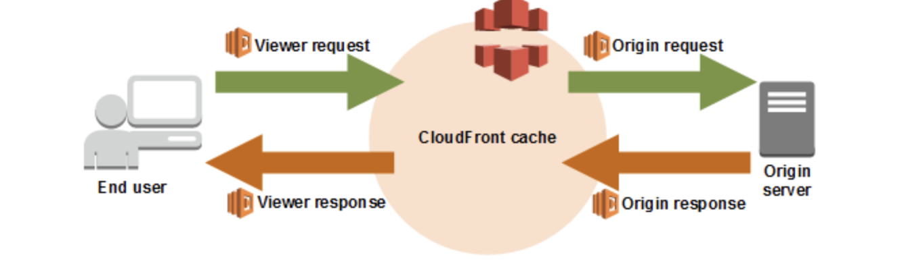

많은 이미지를 다루는 페이지의 경우, 이미지 최적화에 신경쓰지 않으면 사용자 경험 지표에서 많은 감점을 받기 쉽습니다.
사용자 경험 지표를 측정해보면, 이미지 관련된 감점 요소들이 정말 많은데요.

- **Properly size images**
- **Serve images in next-gen formats**
- **Defer offscreen images**
- **Image elements do not have explicit width and height**
- ...

어떻게 하면 유저 경험 측면에서 사랑받을 수 있는 이미지를 랜더링할 수 있을 지에 대해 고민하고 작업한 내용들을 기록해볼 까 합니다.

## 이미지 요소의 속성을 이해하자

``는 필수 속성인 `src`를 포함하여 옵션으로 설정하는 속성들 또한 중요한 역할을 맡고 있습니다.

**`alt`** 속성은 대체 텍스트로서, 이슈로 인해 이미지 랜더링이 어려울 때 이미리를 대신하여 대체 텍스트를 랜더링하는 역할 외에도,
이미지 묘사의 목적으로 사용되는 텍스트로서 스크린 리더에게 전달되어 이미지 대신 낭독되어 접근성을 높일 수 있습니다.

또한, 검색 엔진이 사이트를 크롤링하고 색인을 생성할 때 이미지 해석을 위한 용도로 사용됩니다.

```html

```

**`width, height`** 는 이미지의 치수를 나타내는 속성이지만, 리플로우(reflow)를 방지할 수 있도록
브라우저에게 이미지의 치수를 전달하여 이미지가 로드되는 동안 적절한 공간을 할당할 수 있도록 도와줍니다.

만약 뷰포트 기반 반응형 스타일을 위해 CSS를 통해 치수를 정의했다면, `aspect-ratio` 스타일 속성을
추가하여 레이아웃 시프트를 방지하여 [Cumulative Layout Shift](https://web.dev/i18n/ko/cls/) 의 감점 요소를 제거할 수 있습니다.

```html

```

**`srcset`** 은 동일한 비율의 다양한 사이즈를 가지는 이미지 소스의 세트입니다. 단일 사이즈라면 `src`를 사용하고,
다양한 이미지 소스를 가지고 있을 때 사용합니다.

이미지 소스와 그에 따른 원본 사이즈를 명시해주면, 이미지 소스의 선택권을 브라우저에게 위임할 수 있으며
브라우저 스스로 현재 뷰포트에 최적화된 이미지를 선택할 수 있도록 합니다.

```html

```

**`sizes`** 는 미디어조건(선택적)과 그에 따라 최적화되어 출력될 이미지 크기를 지정합니다. 이 또한
브라우저에게 이미지 크기 선택을 위임할 수 있습니다.

```html

```

## webp 이미지 포맷을 사용하자

`webp`는 이미지 압축 효과를 강점으로 이미지로 인해 발생하는 웹 사이트의 트래픽을 감소시키고,
로딩 시간을 단축하는 데 중점을 두고 있습니다. `JPEG` 와 유사한 손실 압축 포맷이지만,
화질 저하를 최소화하면서 파일 크기를 `JPEG` 대비 10~80% 정도까지 압축이 가능한 포맷입니다.

만약 정적 이미지 파일에 대한 접근이 문제가 없다면, 단순히 이미지 포맷을 변경해도 좋고
`next` 와 함께 사용할 수 있는 [next-optimized-images](https://github.com/cyrilwanner/next-optimized-images)
와 같은 라이브러리를 사용해서 이미지의 확장자를 `webp` 로 쉽게 변환할 수 있습니다.

```shell
~$ yarn add next-optimized-images webp-loader
```

```js
// next.config.js

const withOptimizedImages = require('next-optimized-images')

module.exports = withOptimizedImages({...})
```

```jsx
<picture style={{ objectFit: 'cover' }}>
  <source srcSet={require('../public/NYCpark.png?webp')} type="image/webp" />
  
</picture>
```

## 적절한 이미지 사이즈를 사용하자

적절한 이미지 사이즈를 사용해야 하는 이유는 상당히 직관적입니다. 데스크탑에서 사용되는 이미지를 모바일에서
제공하면 2~4배의 데이터를 소비하게 되니, 다양한 장치를 위한 다양한 사이즈의 이미지를 제공해야 한다는 것인데요.

이에 대한 지표로서, `Lighthouse` 에서는 랜더링된 이미지보다 실제 이미지 사이즈가 크지 않은 것을 이상적인 케이스로
삼고 이에 대한 점수를 부여합니다.

적절한 이미지 사이즈를 사용하기 위해서는 결국 다양한 사이즈의 물리적인 이미지를 제공하는 것이 해결책이며,
노드 환경에서 사용할 수 있는 [sharp.js](https://web.dev/serve-responsive-images/)를 통해
리사이징된 이미지를 만들어 위에서 언급한 `srcset` 속성을 통해 제공해주어야 합니다.

```html
<!-- before -->


<!-- after -->

```

## 이미지 고착과 개선 방안

위에서 이미지를 최적화할 수 있는 코드레벨적으로, 물리적으로의 최적화할 수 있는 방안들을 정리해보았는데요.
하지만, 실무에서 경험상 `webp` 포맷과 다양한 사이즈의 이미지를 제공하지 않거나, 못하겠다 생각한 경우가 많았습니다.

가령, 유저 혹은 컨텐츠 제공자가 직접 이미지를 업로드하는 경우 확장자를 제한하거나 변환 과정을 거쳐야 하며,
회사 규모에 따라 S3와 같은 클라우드에 업로드 되어 있는 객체에 대해 마음껏 접근하기가 어려운 경우가 많고,
만약 가능하다고 해도 확장자와 이미지 사이즈를 메뉴얼하게 변경한다는 것은 하루 아침에 해결될 문제가 아닙니다.

이러한 문제를 당근마켓에서는 [AWS Lambda@Edge에서 실시간 이미지 리사이즈 & WebP 형식으로 변환](https://medium.com/daangn/lambda-edge로-구현하는-on-the-fly-이미지-리사이징-f4e5052d49f3) 하는 방안을 착안하였고
개선점에 대해서 공유해주셨는데요. 개선 방안에 대한 큰 그림을 이해해봅시다.

## Lambda@edge

`Lambda@edge`는 CloudFront에 전달된 이벤트를 트리거 삼아 람다 함수를 실행할 수 있는 기능입니다.
그 이벤트로는 크게 네 가지가 존재합니다.



우선 유저로부터 전달된 요청이 어떻게 처리되는 지 흐름을 파악해봅시다.
`유저로부터 CloudFront로 요청 (뷰어 요청)`이 전달됩니다. 이 때
CloudFront에서는 요청에 대한 응답이 캐싱되어 있다면 캐싱된 컨텐츠를 반환하고,
없다면 `S3로 컨텐츠에 대한 요청 (오리진 요청)`을 전달합니다.
`S3는 CloudFront로부터 전달받은 요청에 대해 응답 (오리진 응답)`합니다.
CloudFront는 S3로 부터 전달받은 컨텐츠를 캐싱하고, `유저에게 컨텐츠를 응답 (뷰어 응답)`합니다.

여기서, `lambda@edge`는 뷰어 요청과 응답, 오리진 요청과 응답의 미들웨어와 같은 기능을 하며
응답과 요청을 가공할 수 있습니다.

## 온디멘드 이미지 리사이징

이제 어떻게 실시간 이미지 요청에 대한 리사이징을 구현할 수 있을까요?
결론부터 말씀드리면, 오리진 응답으로 전달받은 컨텐츠에 대해 `lambda@edge`를 통해
리사이징, webp 포맷이 적용된 이미지를 CloudFront로 전달합니다.

유저로부터 이미지 컨텐츠에 대한 뷰어 요청이 CloudFront에 전달되었다고 생각해봅시다.
CloudFront는 요청에 대한 캐싱되어 있는 컨텐츠 여부를 파악합니다. 만약, 캐싱되어 있다면
빠르게 뷰어 응답으로 이미지 컨텐츠를 반환합니다. 반대로 캐싱되어 있는 컨텐츠가 없다면, S3로 오리진 요청을 보내
이미지 컨텐츠를 오리진 응답으로 반환받습니다.

이 때 `오리진 응답`을 트리거로 하는 `lambda@edge` 를 통해 S3로 부터 전달받은 이미지를 리사이징하고,
webp 이미지 포맷으로 변경하여 CloudFront에게 반환합니다. CloudFront는 이를 캐싱한 후에
뷰어 응답으로 유저에게 이미지 컨텐츠를 반환합니다.

결과적으로, **S3에 존재하는 이미지의 사이즈가 크고 webp 포맷이 아닐지라도, 유저는 리사이징된 webp 파일 확장자의
이미지 컨텐츠를 반환받게 됩니다.**

처음 뷰어 요청으로 지목된 이미지의 경우 이미지 리사이징 과정에서 약간의 시간이 소요되지만,
이후 CloudFront에서 캐싱되어 빠르게 최적화된 이미지를 반환받을 수 있습니다.

## 마치면서

통계적으로, 이미지는 웹 페이지에서 평균 68% 정도의 용량을 차지하는 컨텐츠입니다. 그 만큼
웹 최적화와 사용자 경험 지표에 대해 많은 영향을 끼치는 부분인데요. 이미지 최적화는 다른 최적화 작업에 비해
그 결과가 가시적이고 직관적이기 때문에 최적화 작업을 통해 감점 요소를 제거하는 경험을 해보시길 바랍니다.

온디멘드 이미지 리사이징에 대한 인프라 작업은 따로 포스팅할 예정입니다! 긴 글 읽어주셔서 감사합니다.
