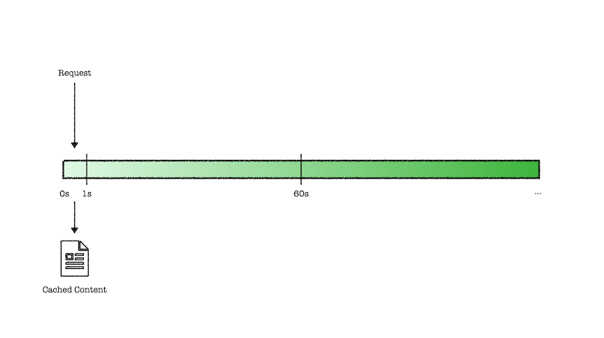
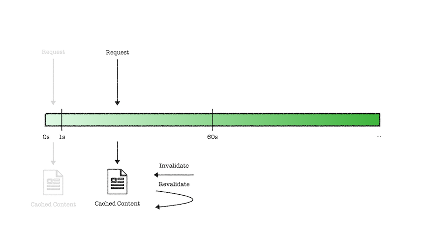

<blockquote class="warning">작성한 지 2년이 지난 글이에요. 지금과는 맞지 않을 수도 있지만, 당시의 고민과 노력이 담겨있습니다.</blockquote>

클라이언트를 개발하면서 [HTTP Cache-Control Extensions for Stale Content](https://datatracker.ietf.org/doc/html/rfc5861)의
`stale-while-revalidate (swr)` 확장 디렉티브 전략을 기반으로한
구현체들을 많이 접하게 되는데요. swr 전략은 무엇인지, 어떻게 활용되고 있는 지
알아보려 합니다.

## stale-while-revalidate

swr 전략은 캐싱된 컨텐츠를 즉시 로드하는 즉시성과 업데이트된 캐싱 컨텐츠가
미래에 사용되도록 보장하기 위한 디렉티브입니다.

브라우저는 Cache-Control의 max-age를 기준으로 캐싱된 컨텐츠의 최신 상태 여부를 판단하게 되는데,
swr은 캐싱된 낡은 컨텐츠에 대한 확장된 지시를 표현합니다.

```yaml
Cache-Control: max-age=1, stale-while-revalidate=59
```

위와 같은 HTTP 해더는 캐싱된 컨텐츠에 대해 아래와 같이 지시를 따르게 됩니다.

1. HTTP 요청이 1초(max-age) 이내에 반복적으로 발생한다면, 유효성 검증 없이 캐싱된 컨텐츠를 반환합니다.



2. HTTP 요청이 1 ~ 60초(max-age ~ swr) 사이에 반복적으로 발생할 경우,
   우선 캐싱된 낡은 컨텐츠를 반환하고, 이와 동시에 캐싱된 컨텐츠를 새로운 컨텐츠로 채우도록 재검증 요청이 발생합니다.



3. HTTP 요청이 60초(swr ~) 이후 시점에 발생한다면, 요청이 서버로 전달되어 컨텐츠를 반환받습니다.

## react-query, swr

[react-query](https://react-query.tanstack.com/)와 [swr](https://swr.vercel.app/ko)는 swr 전략을 취한 대표적인 데이터 패칭 도구입니다.

클라이언트에서 리덕스를 사용한다면 서버로부터 전달받은 값을 리덕스에 저장하고 최신화된 데이터로서 사용됩니다.
하지만 특정 시점의 서버 데이터를 캡쳐한 것이고, 이 데이터가 최신화된 데이터라고 보장하기가 어렵습니다.

그렇다보니 페이지 전환, 유저의 인터렉션이 새롭게 발생되면 새로운 요청을 통해
리덕스 스토어의 값을 업데이트해주어야 하는 최신화에 대한 의무와 시점에 대한 고민,
그리고 중복된 디스패치에 대한 제거는 오로지 클라이언트 개발자의 몫이었습니다.

반면 react-query, swr은 낡은 캐시로부터 빠르게 컨텐츠를 반환하고,
백그라운드에서 요청을 통해 캐싱된 컨텐츠의 재검증을 진행하여 캐싱 레이어에서
최신화된 데이터를 보장할 수 있도록 swr 캐싱 전략을 취하고 있습니다.

react-query의 경우, 비동기 데이터 소스에 대해 쿼리라는 고유키를 통해 관리하며
데이터 상태를 `fresh`, `fetching`, `stale`, `inactive` 로 표현하고,
`staleTime` 을 통해 프레시한 컨텐츠가 낡은 컨텐츠로 전환되는 시간을 설정하여
캐싱된 컨텐츠 특성에 따라 유효 시간을 개별 설정해줄 수 있습니다.

```js
const { data } = useQuery('users', getUsers, {
  staleTime: 5000,
  cacheTime: 1000 * 60 * 5,
});
```

이러한 데이터 패칭 도구들은 클라이언트 개발에서 주기적 혹은 특정 트리거에 의해
서버의 값을 가져와 최신화된 데이터를 가져오려는 노력과 캐싱, 업데이트 및 동기화,
에러 핸들링 등 복잡한 비동기 과정을 앱에게 책임을 전가할 수 있도록 도와줍니다.

## incremental static regeneration

넥스트에서는 애플리케이션을 빌드할 때 `getStaticProps` 를 통해
필요한 서버 데이터를 받아와 json 파일로 저장하고,
마크업 파일을 생성해 두어 요청 시 정적으로 빠르게 페이지를 제공합니다.
이를 정적 사이트 생성([static site generation](https://nextjs.org/docs/basic-features/data-fetching/get-static-props#statically-generates-both-html-and-json)) 이라고 하는데요.

하지만 빌드 시점에 미리 서버 데이터를 받아와 저장을 하다보니,
특정 시점에서 캡쳐된 데이터가 최신화 데이터로서 무효할 수 있습니다.
여기서, 넥스트는 잘 알려진 swr 전략을 취해 증분 정적 재생성([incremental static regeneration](https://nextjs.org/docs/basic-features/data-fetching/incremental-static-regeneration))을 가능케하여 이러한 문제를 해결합니다.

사용법은 매우 간단한데, `getStaticProps` 의 반환 프로퍼티로서
`revalidate` 값을 설정해주면 됩니다.

```js
export async function getStaticProps() {
  const response = await fetch('...');
  const posts = await res.json();

  return {
    props: {
      posts,
    },
    revalidate: 10,
  };
}
```

[증분 정적 재생성 타임라인](https://youthfulhps.dev/nextjs/next-isr/#증분-정적-재생성의-타임라인)은 swr 전략과 동일합니다.
`revalidate` 시간 이내의 페이지 요청은 빌드해 두었던 페이지와 데이터를 정적으로 빠르게 제공하고,
이후 재검증을 통해 페이지와 데이터를 재생성하여 최신화합니다.
이로서 이후 요청에 대해서는 업데이트된 페이지와 데이터 또한 정적으로 빠르게 제공할 수 있게 됩니다.

그냥 `getServerSideProps` 로 요청 시점에 데이터 패칭을 하여 페이지를 제공하면 되지 않나?
싶지만, 서버 사이드 랜더링과 정적 사이트 생성은 단순히 서버 응답 시간(TTFB)를 현저히 향상시킬 수 있기 때문에
isr 적용을 적극적으로 고려해보아야 합니다.

## 마치면서

아직 부족한 경험이지만, 캡쳐된 서버 데이터를 클라이언트에서 관리하기 위해 리덕스와 씨름해 보았거나,
서버 사이드 랜더링으로 인해 페이지 전환 속도에 아쉬움을 느껴보았다면
swr 전략을 기반으로한 구현체들이 주는 개발 경험이 정말 훌륭하다는 것을 공감하실텐데요.

그 근간이 되는 swr 전략에 대해 알아보았습니다. 더 많은 예시들이나, 잘못된 설명이 있다면 언제든 코멘트 주시면 감사하겠습니다 :) 감사합니다.

## Reference

[전역 상태 관리에 대한 단상 (stale-while-revalidate)](https://jbee.io/react/thinking-about-global-state/)

[stale-while-revalidate로 최신 상태 유지](https://web.dev/i18n/ko/stale-while-revalidate/)
