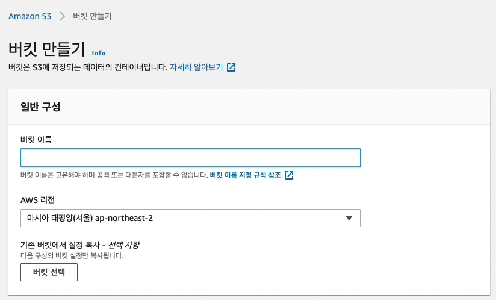
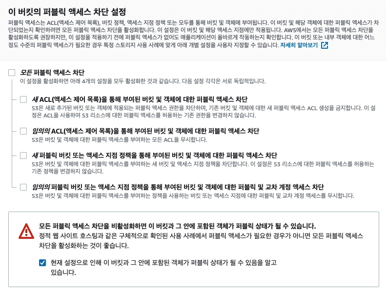
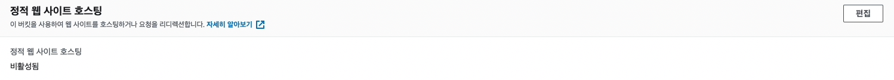
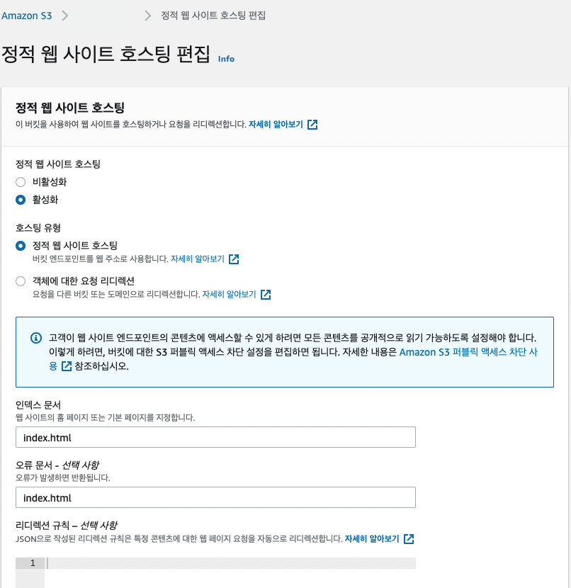
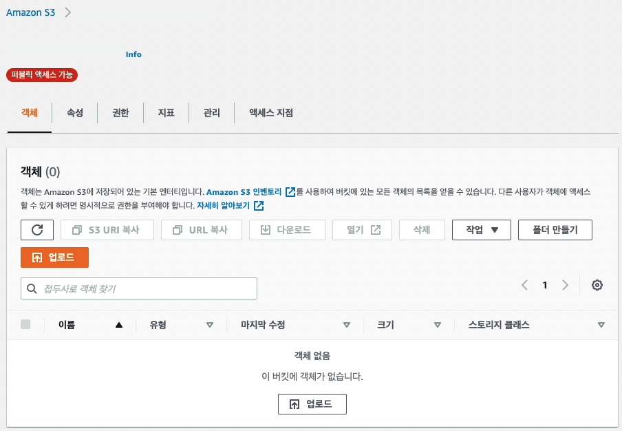
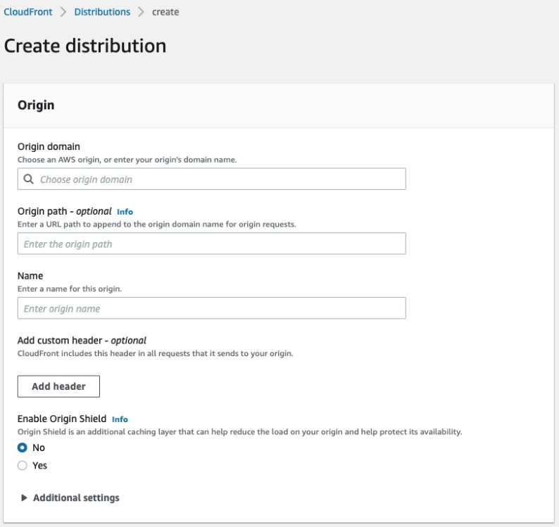
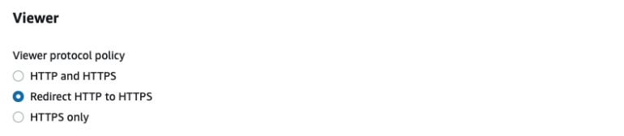
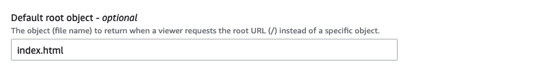
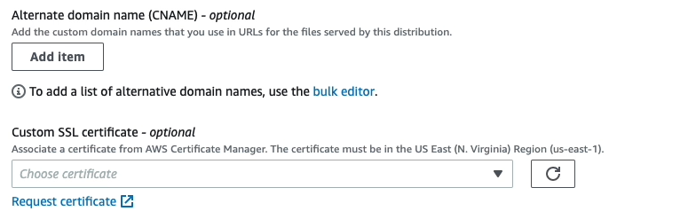
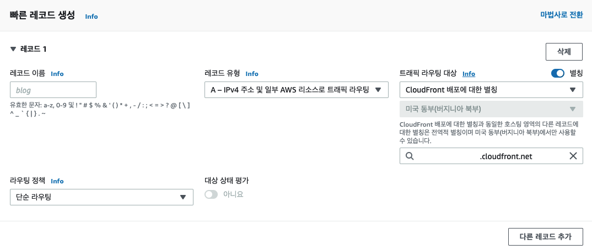

사내에서 새로운 호스트를 구출할 기회가 생겼습니다. 기존 프러덕션들에 대한 인프라는 이미 구축되어 있는 상태여서 클라이언트를 호스팅해볼 기회가 없었는데
마침 웹 채팅 기능이 담긴 프러덕션을 호스팅할 기회가 생겨 그 과정을 정리해볼까 합니다.

### S3, 빌드된 정적파일 업로드하기

[S3](https://docs.aws.amazon.com/ko_kr/AmazonS3/latest/userguide/Welcome.html)는 인터넷 스토리지 서비스입니다.
우선, S3의 컨테이너인 버킷을 생성합니다. 프로젝트의 빌드된 파일을 업로드 해줄거예요!



하단으로 이동하면, '이 버킷의 퍼블릭 엑세스 차단 설정'에서 '모든 퍼블릭 엑세스 차단'을 해제해줍니다. 프로젝트의 빌드된 정적파일이기 때문에 접근을 열어두어야 합니다.



다른 설정을 변경하지 않고, 이제 버킷 생성을 눌러주면 버킷 생성이 완료되고, 속성을 변경시켜주러 갑니다.

방금 생성한 버킷을 클릭하고, 속성 탭 / 정적 웹 사이트 호스팅 을 편집해줍니다.



'정적 웹 사이트 호스팅'을 활성화 시켜주고, 기본 페이지와 에러 발생 시 반환되는 페이지 또한 설정해주어야 합니다.



'변경 사항 저장' 이 완료되었다면, 이제 객체를 업로드만 해주면 됩니다. 프로젝트를 빌드하면 생성되는 모든 파일을
그대로 드래그 & 드랍 해줍니다.



업로드가 모두 완료되었다면, 이전에 편집했던 속성 탭 / 정적 웹 사이트 호스팅 에서 버킷이 호스팅된 URL로 접속해보세요.
index.html 문서의 내용이 랜더링된다면 버킷 생성 과정은 마무리됩니다 :b

### CloudFront, 전세계에 S3 컨텐츠 제공하기

[CloudFront](https://aws.amazon.com/ko/cloudfront/?nc=sn&loc=1)는 컨텐츠 전송 네트워크의 역할을 합니다. S3에 담겨있는 컨텐츠를 가리키고 어디서나 접속 가능하도록 합니다.
전세계 [Edge Location](https://aws.amazon.com/ko/cloudfront/features/?nc=sn&loc=2&whats-new-cloudfront.sort-by=item.additionalFields.postDateTime&whats-new-cloudfront.sort-order=desc)
에 컨텐츠를 전파시키고, 어디서나 컨텐츠에 접근하고자 하는 클라이언트에게 빠르게 제공합니다. 또한, 캐싱과 HTTPS 프로토콜을 적용할 수 있습니다.

우선, CloudFront에서 새로운 [Distributions](https://docs.aws.amazon.com/AmazonCloudFront/latest/DeveloperGuide/GettingStarted.SimpleDistribution.html)을 생성합니다.


(작업 녹화본을 캡쳐한 이미지인데, 갑자기 영문 사이트가 되었네요 :?)

Origin Domain는 어떤 S3를 가리키게 할 것인지 선택합니다. 직전에 생성한 S3 버킷 이름 검색 후 선택해주세요.

버킷을 선택하면 자동으로 버킷 엔드포인트가 Name에 적용되는데, Region이 빠져있다면, Region을 추가해주어야 합니다.

첫 배포 이후 관련 문제가 발생해서 구글링 해봤을 때 CloudFront를 생성 이후 24시간이내에 사용하려면 Region을 추가해주어야 한다는 답변을 받은 것 같아요. :(

```txt
example.com.s3.amazonaws.com (x)
example.com.s3-website.us-east-1.amazonaws.com (O)
```

하단으로 내려가면 여러 세팅을 설정할 수 있습니다. 일반적으로 우선 Viewer Protocol Policy 설정을 변경합니다.
컨텐츠를 요청한 클라이언트가 HTTP 접속을 시도한다면 보안상의 이유로 강제로 HTTPS로 리다이렉션될 수 있도록 합니다.



다음은 Default root object을 index.html로 설정합니다.



여기까지만 진행한다면, CloudFront에서 제공하는 기본 URL을 사용해 배포되게 됩니다. 만약, Alternative Domain Names (CName) 을 사용하고자 한다면,
SSL Certicifate / Custom SSL Certicifate를 선택해 인증서를 넣어주세요. 미리 생성해둔 인증서가 없다면 새롭게 생성해야 합니다.



이후, 컨텐츠를 Edge Location으로 전파시키는 데 시간이 소요됩니다. 'Enabled' 상태가 되면 CloudFront distributions 생성도 완료가 됩니다 :b

### Route53, 도메인 입히기

[Route53](https://aws.amazon.com/ko/route53/)는 AWS에서 제공하는 [DNS](https://aws.amazon.com/ko/route53/what-is-dns/) 서비스 입니다.

우선, 레코드를 생성합니다. 레코드 이름은 사용하고 있는 호스팅 영역이 있다면 도메인 앞에 붙을 값만 설정해주면 됩니다.
레코드 유형은 'A'로, 트래픽 라우팅 대상은 별칭 선택 / CloudFront 배포에 대한 별칭으로 직전 생성한 CloudFront를 선택합니다.



최종적으로, 레코드 이름으로 설정한 값을 도메인으로 CloudFront와 연결되어 호스팅된 것을 확인할 수 있습니다.

### 마치면서

간단하게라도 필수적인 과정을 까먹지 않게 정리해봤습니다:) 사실, '인프라 공부해야지', '직접 구축해봐야지' 하면서 막상 손데기 힘든 게 사실인데
클라이언트를 개발에서 그치지 않고 직접 배포해보면 조금 더 시아가 넓어지는 듯한 경험을 해본 작업이었습니다 :)
