최근 CRA 프로젝트를 넥스트로 이관하는 작업이 한창입니다. 넥스트는 서버 사이드 랜더링과 동시에 클라이언트 사이드 랜더링을
동시에 지원하기 때문에 점진적 이관이 가능했죠. 단순히 빌드가 실패되는 문제들을 제외하면요.

이후 적절한 getStaticProps, getStaticPaths, getServerSideProps를 통해 서버 사이드에서 데이터 패칭이
이루어질 수 있도록 작업했습니다.

작업할 때 서버 사이드 랜더링(Server Side Rendering)보다는 정적 사이트 생성(Static Site Generation) 방식으로
접근하려 했습니다.

### SSR vs SSG

넥스트는 서버 사이드에서 데이터 패칭을 할 수 있도록 두 가지 함수를 제공합니다.
두 함수의 가장 큰 차이점은 단연 데이터 패칭의 시점인데요.

**getServerSideProps의 경우**, 클라이언트에서 요청이 들어올 때
데이터 패칭을 통해 외부 데이터를 json파일에 담고, 마크업을 생성하여 클라이언트로 전달합니다.

반대로 **getStaticProps의 경우**, 빌드 시 한번만 모든 페이지의 마크업과 데이터 패칭을 통해
얻은 외부 데이터를 json파일에 담아두고, 요청 때 캐싱되어 있는 html, json을 클라이언트로 전달합니다.

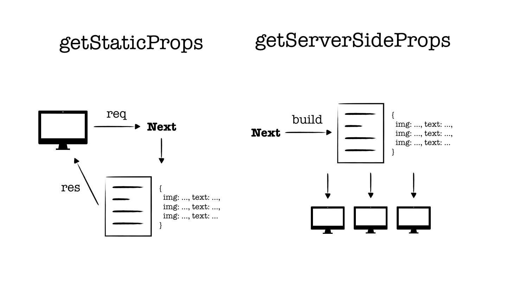

### 정적 생성을 지향했던 이유

정적 생성된 페이지는 클라이언트의 요청 시 상당히 빠르게 제공됩니다.
빌드 시 생성한 마크업과 데이터가 담긴 json을 제공하기 때문인데요.

이는 Time to First Byte (TTFB)를 크게 줄일 수 있을 뿐만 아니라,
First Input Delay (FID)와 같은 Web Vital Score를 개선하는 데 큰 도움이 됩니다.

좋지 못한 네트워크 상에서 비교 측정해봤을 때 초 단위로 측정되는 SSR에 반해 SSG는 밀리 초 단위로
측정되는 것을 확인할 수 있습니다.

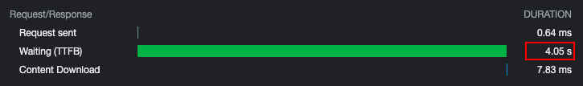
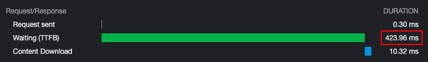

추가적으로 클라이언트의 요청 횟수에 상관없이 서버측은 빌드 시 제공된 한번의 응답이면 충분하게 됩니다.

### 증분 정적 재생성

그러나 한 가지 염두해야 할 것이 있다면, 제공하는 서비스 특성상 데이터가 실시간으로 업데이트되어야 한다면
**빌드되는 시점에 받은 외부 데이터가 최신화된 데이터로서 유효하지 않다는 점**입니다.

그래도 넥스트는 정적 생성을 권장하는 근거가 있다면, [증분 정적 재생성](https://vercel.com/docs/concepts/next.js/incremental-static-regeneration)
(Incremental Static Regeneration)라 생각이 듭니다.

위 문서를 읽어보면 증분 정적 재생성을 하기 위해서는 getStaticProps의 반환 프로퍼티로 revalidate값을
설정하면, 설정된 초 단위 마다 넥스트에서 데이터 유효성 검사를 진행할거다 정도로 쉽게 받아드릴 수 있습니다.

하지만, revalidate가 되는 시점과 트리거에 대한 이해가 필연적입니다.

### 증분 정적 재생성의 타임라인

증분 정적 재생성(ISR)은 SSG과 동일한 넥스트 API(getStaticProps)로 정적 페이지를 생성합니다. revalidate 값을 설정하여
생성된 페이지를 업데이트하도록 알리는데요.

단순하게 revalidate값이 20초라면, 특정 페이지에 대한 첫 요청이
들어온 이후 20초마다 한번 씩 유효성 검사를 한다는 것으로 오해할 수 있습니다.

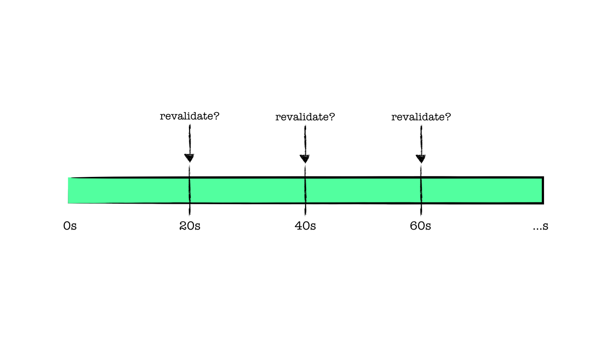

정확한 플로우는 공식 문서에서 다음과 같이 설명하고 있습니다. 이제, 이 플로우를 하나 씩 살펴 봅시다.

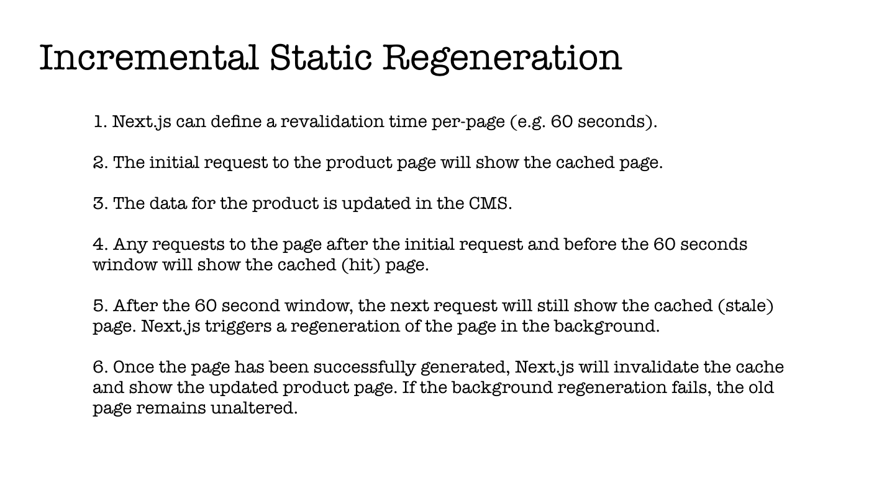

revalidate는 20초, 빌드 시 페이지 정적 생성이 이루어졌다면,
초기 페이지를 요청(1)한다면, 0s 기준으로 캐싱되어 있는 페이지를 응답받습니다.

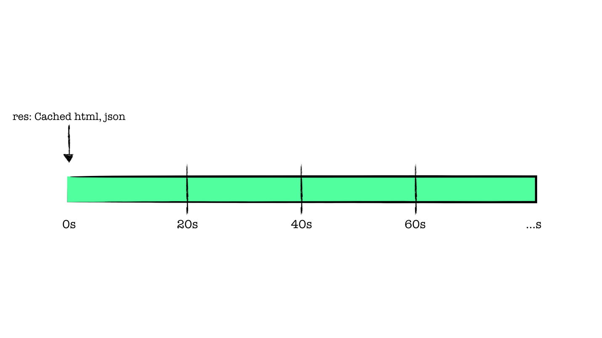

만약, 20초 이내에 새로운 요청(2)을 보냈다면, 이것 또한 기존 캐싱되어 있는 페이지를 응답받습니다.

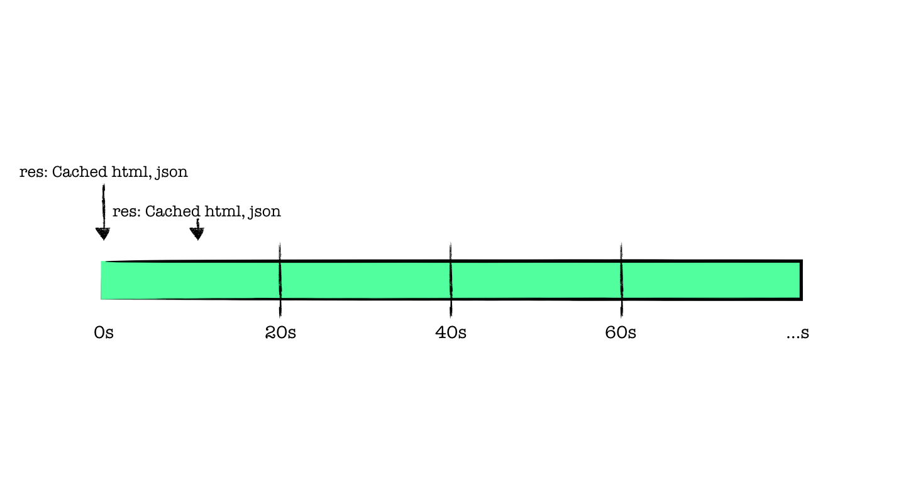

드디어 20초가 지나서 새로운 요청(3)을 보냈습니다. 넥스트에서는 설정해둔 20초가 지났기 때문에
캐싱된 페이지에 대해 유효성 검사를 진행하고, 새롭게 캐싱된 페이지가 전달될 거라 기대하지만, 그렇지 않습니다.
**마찬가지로, 캐싱된 페이지를 응답받습니다.**

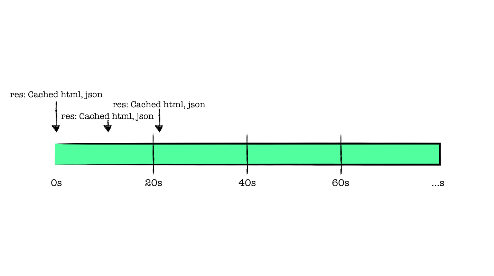

이 단계에서 예상과는 다르게 새롭게 재생성된 페이지를 전달받지 못한 것에 대해 약간의 혼란이 생깁니다.
그렇다면, 넥스트는 어느 시점에서 새롭게 유효성을 검사할까요?

바로, **20초가 지나서 전달된 새로운 요청(3)이 유효성 재검사의 트리거가 됩니다.**

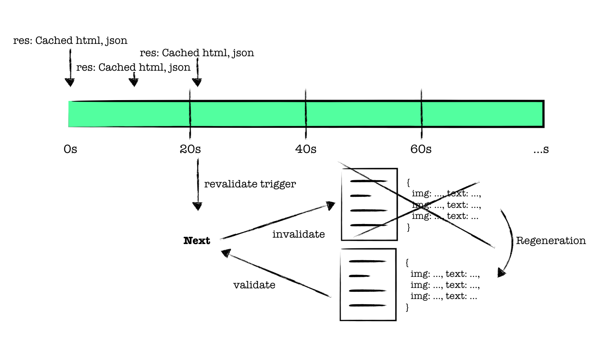

넥스트는 20초가 지난 시점에서 새로운 요청(3)이 들어오면 기존의 캐싱되어 있던 페이지의 유효성을 재검사합니다.
**이때 재생성이 성공한다면, 기존의 캐싱된 페이지는 무효화되며, 재생성된 페이지가 새롭게 캐싱됩니다.**
만약, 모종의 이유로 재생성에 실패한다면, 기존의 캐싱된 페이지가 유효하게 유지됩니다.

이 시점을 왜 재생성의 트리거로 설정했을 까라는 생각을 오래했는데, 20초 마다 조건없이 재생성하기 보다는,
20초 이후 새로운 요청이 들어와 업데이트된 정보를 필요로 하는 클라이언트의 수요를 확인하고
재생성이 이루어지는 것이 훨씬 경제적일 거라는 판단이지 않을까라는 개인적인 생각을 했습니다.

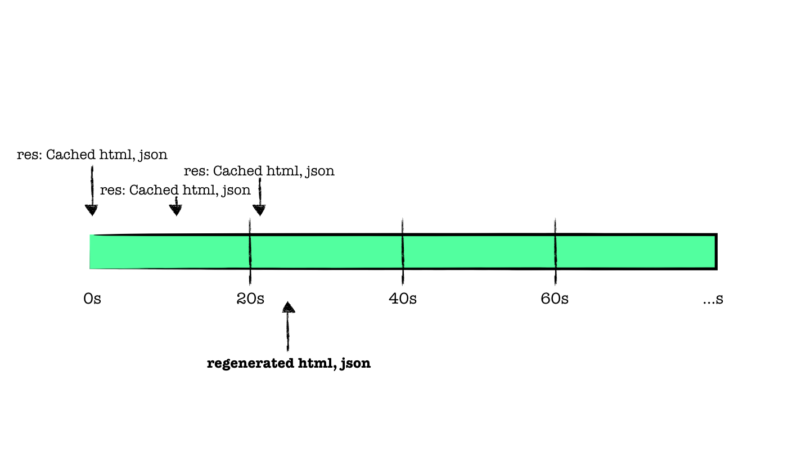

재생성이 완료된 이후 시점에서 새로운 요청(4)이 들어온다면, 재생성이 성공했다는 가정하에 재생성된 페이지를 응답 받게 됩니다.

### ISR를 적용하기 앞서

사실, 실시간으로 업데이트되어야 하는 제품 상세 페이지에 ISR을 적용하기란 생각보다 불안했습니다.
그래서 ISR을 타임라인을 그려보기도 하고, 생각보다 비슷한 걱정을 한 이야기들을 보기 위해 괜히
[디스커션](https://github.com/vercel/next.js/discussions?discussions_q=ecommerce)
을 읽어보기도 했습니다.

맘 편하게 TTFB를 조금 양보하더라도 서버 사이드에서 데이터 패칭하도록 할까 라는 생각도 했었지만,
SSG의 응답 속도를 한번이라도 경험해보신 분들은 절대 포기못 할 속도일 겁니다.

나름의 합의점을 찾자면, ISR을 통해 속도 최적화를 챙기면서
가격 변동이나 남은 수량과 같은 실시간 정보를 필요로 하는 곳은 랜더링 직후 클라이언트에서 데이터 패칭을 통해
UI에 영향이 가지 않는 선에서 스토어를 업데이트해주는 방향을 선택할 수 있습니다.

ISR과 함께 데이터 재검증에 대한 고민을 하다보니 [SWR](https://swr.vercel.app/ko)가 자주 등장하는데요.
ISR를 적용하고 나서 풀어야 할 숙제가 남아 있기 때문에 SWR를 추가적으로 공부해보려 합니다.

SWR을 ISR와 함께 사용한 예제들을 보면 정적 랜더링 이후 포커싱이 돌아오거나, 네트워크가 회복되었을 때 데이터 패칭을 통해 업데이트된 외부 데이터를 UI에
적용시켜줍니다. 어쩌면 스토어 따윈 필요로 하지 않는 클라이언트 개발이 얼마 남지 않은 것 같네요.b

### 마치면서

최근 넥스트로 이관하면서 최적화에 재미가 붙은 것 같습니다. 작업할 때 Web Vital Score을 신경쓰게 되었고,
페이지별로 감점 요소를 찾고 추가 작업을 합니다. 이번 작업을 진행하면서 고민할 것들도 늘었구요.

그러다 오른 점수를 보면 마냥 행복해지는 게 숙명이 아닌 가 싶습니다. 얼른 90점을 넘겨 초록색 게이지를 보고 싶네요!

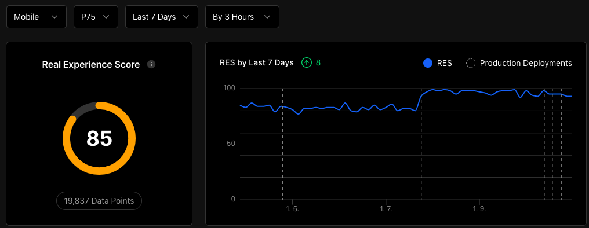
