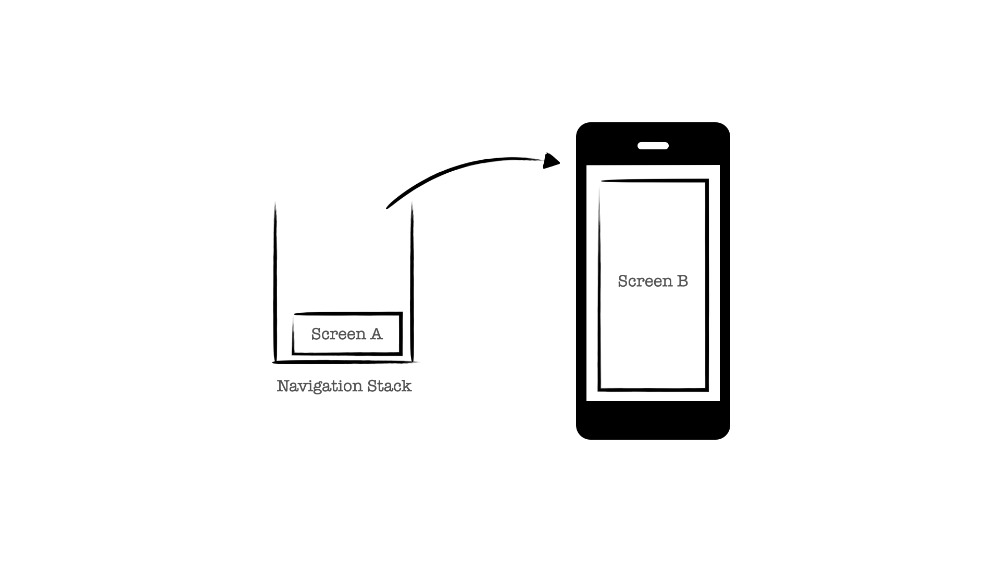

근무하고 있는 회사에서는, 리액트 네이티브로 iOS, Android 앱을 런칭한 후 지속적인 업데이트를 진행중입니다.
웹을 담당하고 있었던 저는 '언젠가 리액트 네이티브도 다루어 보고 싶다' 라는 막연한 생각을 가지고 있었습니다.

그러던 중 네이티브 앱을 담당하던 팀원이 퇴사를 하게 되었는데요, 종종 JS 레벨에서 발생하는 네이티브 앱 이슈를 픽스하며
네이티브 프로젝트 JS 레벨에 얕은 경험을 가지고 있었던 터라 네이티브 프로젝트를 이어서 담당하게 되는 기회가 생겼습니다.

주로 리액트로 개발을 해왔기 때문에, 리액트 네이티브도 무리없이 작업할 수 있겠다는 근거없는 자신감만을 가지고 네이티브 프로젝트를 담당하게 된 제가
느꼈던 내용들을 정리해보려 합니다.

### 나 아직 살아있어

웹에서 페이지가 전환되거나, 새롭게 랜더링될 때의 특정 액션을 위해 라이프 사이클 훅에 콜백을 구현합니다. 가령, A 페이지에서 B 페이지로 전환되면
A는 파괴(WillUnMount)가 되고, B는 마운트(DidMount)가 됩니다.

네, 너무 당연한 라이프 사이클이라 웹 작업을 할 때와 동일하게 라이프 사이클 관련 콜백을 앱에서도 구현했습니다. 그런데, 아니나 다를까 예상과 다르게 동작합니다.


무작정 리액트 네이티브 개발을 시작하고 처음 부딪친 이슈였는데, 라이프사이클에서 이슈가 생기다니 뭐랄까 제가 바보가 된 듯한 기분이 들었습니다.

결론적으로는, [React navigation](https://reactnavigation.org/docs/navigation-lifecycle/)의 라이프 사이클을 전혀 이해하고 있지 않았던
무지함이 반영된 부끄러운 작업 결과였습니다.



앱에서 가령, A 스크린에서 B 스크린으로 전환을 한다고 가정하면 A는 네이게이션의 스택에 마운트된 상태로 쌓여있게 되고, B 스크린이 마운트 (DidMount) 됩니다.

다시 B 스크린에서 A 스크린으로 돌아오면 B 스크린은 파괴(WillUnMount) 되지만, A는 마운트된 상태로 스택에 쌓여있었기 때문에 다시금 마운트(DidMount)되지 않게 됩니다.
즉, A에서 마운트(DidMount) 라이프 사이클 콜백이 매번 호출될 거라는 예상이 웹과는 다르게 동작하지 않았던 이슈였습니다.

리액트를 잘 다루면, 리액트 네이티브 작업도 가능하다는 것이 틀린 이야기는 아니지만, 리액트 네이티브만의 특징적인 예외상황들을 익혀야 하는 것은 필수입니다. 어디까지나
위 이슈는 무턱대고 리액트 네이티브 작업에 뛰어든 주니어가 겪는 이슈 중 하나에 불과하니까요.

### 그만해..이러다 다 죽을 수 있는 성능

어떤 플랫폼이든 성능 최적화를 고민하며 코드를 작성해야 하는 것은 마찬가지이지만, 특히나 리액트 네이티브 코드를 작성할 때는 성능 최적화에 많은 고민이 필요했습니다.
자칫 성능에 신경을 못썼다면, 금방 눈에 띄는 성능 저하를 느끼게 됩니다.

이런 고민들을 꽤나 덜어줄 리액트 네이티브의 내장 컴포넌트들이 있지만 성능에 신경쓰지 않아도 된다는 것은 아닙니다.

예를 들자면, 개인적으로 데이터 순회를 통한 리스트 랜더링을 구현할 때는 [FlatList](https://reactnative.dev/docs/flatlist)를 사용하곤 했는데요.
FlatList의 props로 전달되는 함수들은 최대한 재사용 가능하도록 useCallback으로 감싸주고, 실질적으로 데이터를 순회하여 랜더링되는 컴포넌트 내부 로직 또한
랜더링을 최소화하기 위해 노력했습니다.

```ts
const renderNotificationList = useCallback(
  () => {
  ...
},[]);

const hasProfileImage = useMemo(
  () => !!notification.meta.sender.name,
[...]);

return (
  <FlatList<Notification>
  ...
  />
)
```

추가적으로, 부끄럽지만 앱을 런칭한 지 얼마 되지 않은 시점이라 웹에서 사용되는 이미지 사이즈를 앱에서도 사용하고 있습니다.

최근에 [Ondemand Image Resize](https://medium.com/@vdongbin/lambda-edge%EB%A5%BC-%EC%9D%B4%EC%9A%A9%ED%95%9C-ondemand-image-resize-50794cbcb87f)
를 적용하는 작업을 진행중입니다. 서버 비용을 줄일 뿐만 아니라, 클라이언트에서 메모리 사용량 또한 최적화할 수 있죠.
관련 내용은 따로 정리할 예정입니다. 너무 설레네요!


### 로그켓은 빨간 고양이인가요

리액트를 다룰 줄 알면 리액트 네이티브 또한 시도해볼 수 있는 재밌는 영역입니다. 저 또한 실무에서 JS레벨에서 만큼은 무리없이
적응을 했는데요. 하지만, 네이티브는 네이티브입니다.

매일 아침 구글 스토어와 애플 앱 스토어에 들어가 비정상 종료 및 크래시 로그를 확인합니다. 여기서 하루의 기분이 갈릴 정도로
크래시 로그에 예민한 시기를 보내고 있습니다.

웹처럼 핫픽스가 가능한 것도 아닐 뿐더러, [code push](https://microsoft.github.io/code-push/)가 있다고 하지만
JS레벨에서 이슈 추적이 상당히 어려웠습니다.

반대로, 네이티브 이슈라고 한다면 더더욱 미지의 세계로 떠납니다. 개발팀에 안드로이드, iOS 개발자가 따로 없기 때문에 네이티브에서 발생하는 이슈를
즉시 대응하기엔 아직 많이 부족합니다.

하지만, 마냥 넋놓고 있을 수는 없죠. sentry를 통해 이슈 추적과 동시에 안드로이드 구글 스토어에서 제공하는 비정상 종료 스택스테이스 로그를 [Symbolicating a stack trace](https://reactnative.dev/docs/0.64/symbolication)
에 적용해 추적을 시도하고, Xcode에서 크래시 로그를 추적해 네이티브 이슈와 전쟁을 치르고 있습니다.

### 마치면서

'리액트를 다룰 줄 알면 리액트 네이티브도 개발 가능하다' 라는 말을 많이 들어왔습니다. 그러나, 네이티브 영역에 대한 이해가 조화롭게 이루어져야 한다는 걸
경험하고 있습니다.

언젠가 네이티브 이슈도 훌륭하게 핸들링 가능한 리액트 개발자가 되고 싶다는 생각을 다시금 하게 됩니다:)
