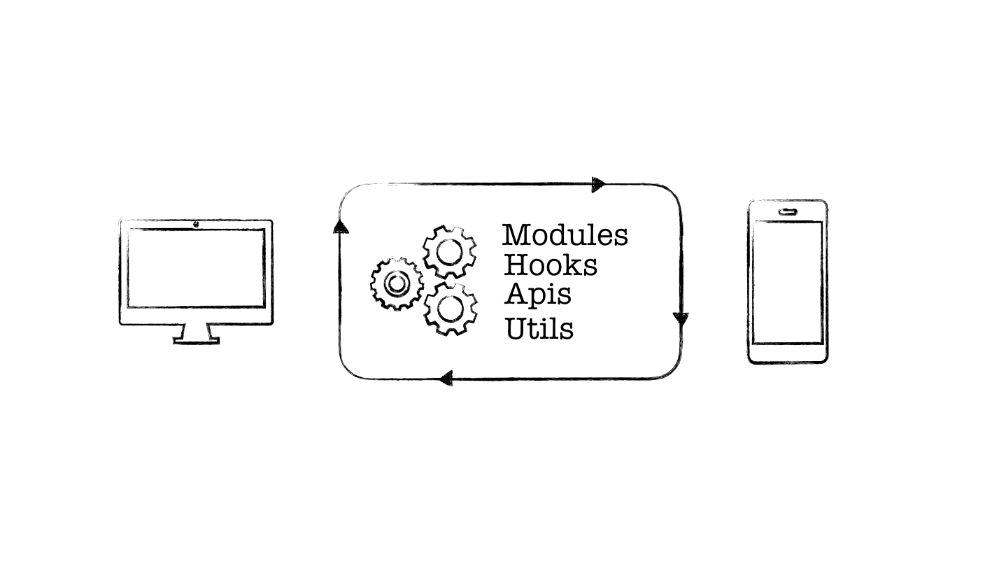

최근 중구난방 여러 플랫폼 블로그에 적었던 글들을 정리하다가 생각지도 못하게 관심을 받았던 글이 있었다는 걸 알게 되었는데요.
리덕스를 공부하던 때 작성해 두었던 [리덕스는 무엇이고, 왜 사용하는가?](https://velog.io/@youthfulhps/What-is-Redux-and-why-use-it) 라는 포스트였습니다.

'에이, 그거 가지고?' 라고 생각하실 수 있겠지만, 조회수 2502, 좋아요 18, 댓글 3를 보고 있자니 정말 뿌듯했던 것 같습니다.


이외에도, 인용글로 사용되는 걸 보면 공부할 때 열심히 정리하던 때가 새록새록 떠오르네요 :)

워낙 규칙이 없는 상태 관리 도구다 보니, 적당한 규칙과 리덕스 관련 좋은 내용을 담은 글들을 보면서 한 번씩 리프레시 시켜주는 것이 중요합니다.
마침, 실무에서 리덕스 관련 리팩토링 작업을 진행하면서 리덕스에 대한 생각, 그리고 접근법에 대해 느낀 점을 정리해볼 까 합니다.

### 리덕스는 비지니스 로직을 담기 위한 그릇

<!-- 프론트엔드 개발자로서 이제 1년 남짓 되는 경력 동안 가장 많이 고민한 키워드는 '의존성 분리' 였습니다. -->

가령, 리덕스에서 사이드 이펙트가 발생할만한 비동기 로직을 담기 위해 타이핑을 해보셨다면, 타이핑이 정말 많다는 것을 공감하실 겁니다.


단순히 사가 동작을 이해하기 위해 공부할 적에는 '사이드 이펙트가 발생할 여지가 있는 비동기 로직을 통해 리덕스에 상태를 담으려면 리덕스 미들웨어를 사용해야해'
라는 글로 배운 지식으로 웹 프러덕션 제작에 뛰어들었기 때문에 적절한 기준과 이유 없이 막연한 타이핑을 치곤 했었습니다.

근데 아무리 생각해도, '랜더링될 때마다 매번 업데이트 시켜주어야 하는 상태값을 리덕스에 담을 필요가 있나?' 라는 생각이 종종 들더라구요.
지금와서 생각해보면 <strong>리덕스를 단순 상태 관리를 하기 위한 도구로만 생각했었던 겁니다.</strong>

사내에서 개인적으로 사수로 모시는(?) [팀원](https://github.com/MaxKim-J)과 함께 리덕스에 대해 이야기를 나눈 적이 있었는데,<strong>'UI 관련 로직은 기획 변동으로 언제든 변경될 수 있다.
실질적인 데이터를 다루는 코어를 잘 다져야 한다.'</strong> 라는 이야기는 왜 사가에 비동기 로직을 가지런히 담아두어야 하는 지 함께 고민해볼만한 답변이었습니다.



타이핑이 많더라도, 리덕스에 비동기적인 비지니스 로직을 담아 코어로 관리하고, 쉽게 변할 수 있는 UI단에서는 액션만 디스패치할 수 있도록 의존성을 클린하게 유지시켜줄 수 있도록 해준다면
합의(?)할만한 노력이죠.

결코, 'UI 로직보다 비지니스 로직이 중요하다!' 라고 단정지을 수는 없지만, 가변성을 생각했을 때 비지니스 로직이 담긴 순수한 코어를 다지는 데 집중하고 있습니다.

### 코어의 순수함을 지키자

순수한 코어 즉, 뚝 떼어 어디에 붙여도 문제없이 동작하는 코어를 만들기 위해 노력합니다. 가령, 앱 프로젝트에서 비지니스 로직을 공유받기 위해 웹 프로젝트 코어를 떼어다가 사용합니다.

하지만, 특정 액션이 비동기적으로 success, failure된 후 특정 알럿을 띄운다던지, 스크롤을 최상단으로 올리기 위해 window객체 등 특정 환경에 종속적이거나, UI 관련 로직이 포함되어 있으면
종속적인 코어로서 순수하지 못하게 됩니다.

UI단에서 액션을 디스패치하기 위한 관련 로직을 [리덕스 훅](https://react-redux.js.org/)을 사용해 상태값과 관련 기능을 담은 메서드를 함께 담아 훅으로 관리한다면,
훅 또한 코어의 일 부분으로 순수함을 지켜주어야 합니다.

예를 들어, 아래와 같이 유저 결제 취소에 대한 로직을 담은 훅을 구현한다면, 앱에서는 사용할 수 없게 됩니다.

```ts

const useUserPayment = () => {
  const history = useHistory();
  ...

  const cancelPayment = (requestBody: CancelRequestBody) => {
    dispatch(
    userActions.cancel({ checkoutId, requestBody }),
    );
  };

  //React router hook is not available in React Native
  useEffect(() => {
    if (userHistory.status ==='success') {
      history.goBack();
    }
  },[historyProjectDetail.status])
  ...
}

```

환경에 종속적일지라도, 일련의 동작을 같이 묶어두는 로직 설계도 직관적인 면에서 좋을 수 있지만, 순수하게 코어 로직을 다진다면, 같은 일련의 로직 구현을 두번해야 하는 일을 방지할 수 있습니다. :b

### 그래도 타이핑이 많은 건 팩트

비동기적인 비지니스 로직을 하나의 그릇에 정갈하게 담아야 하는 이유를 배웠지만, 그래도 타이핑이 많은 건 사실입니다.

안그래도 많은 타이핑에 Typescript로 작성해야 하니 [redux-actions](https://github.com/redux-utilities/redux-actions)이나,
[type-safe-actions](https://github.com/piotrwitek/typesafe-actions)로 타이핑을 줄이려 노력했었는데
최근, 앱에 채팅 기능을 추가하기 위해 관련 모듈 구현을 [redux-toolkit](https://redux-toolkit.js.org/)을 사용해서 리듀서, 액션타입, 액션 생성함수, 초기상태를 한번에 정의해주는 slice를 통해 타이핑을 줄이고 있습니다.

```ts
import { createSlice, PayloadAction } from '@reduxjs/toolkit';

type ChatState = {
  ...
  data: {
    messages: Message[];
  }
}

const initialState: ChatState = {
  ...
  data: {
    messages: [],
  }
}

const reducers = {
  ...
  getMessagesSuccess: (
    state: ChatState,
    action: PayloadAction<{messages: Message[]}>
  ) => {
    state.data.messages = action.payload.messages
  }
}

const chatSlice = createSlice({
  name: 'chat',
  initialState,
  reducers
})
```

액션을 따로 정의할 필요없이 리듀서와 액션 생성 함수 또한 함께 구현되고,
번거로웠던 불변성 유지는 내부적으로 [immer](https://github.com/immerjs/immer)이 내장되어 있어
타이핑을 확실히 줄일 수 있다는 장점이 있습니다.

### 마치면서

개인적으로 순수한 코어를 만들어야 하는 이유와 리덕스 사가는 순수한 코어를 위해 어떤 역할을 할 수 있는지
알게된 계기였던 것 같습니다. 또한, 비지니스 로직을 담을만한 더 적합한 상태 관리 도구들도 사용해 보려 합니다.
더 훌륭한 코어를 만들기 위해!
