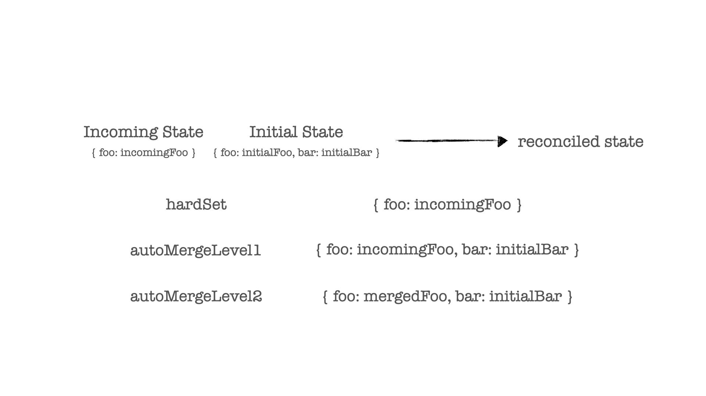

최근, 구매 프로세스의 전반적인 액션과 상태를 관장하고 있는 [Slice](https://redux-toolkit.js.org/api/createslice)가
직관적이지 못한 레거시 코드들로 인해 발목을 잡히게 되는 상황을 염려해
새롭게 리팩토링함과 동시에 죽은 코드들을 처내는 작업을 진행하게 되었습니다.

구매 과정에 대한 정보들을 담고 있는 상태값들은 유저가 구매 중간 과정에서 이탈하게 되더라도 다시금 구매를 진행할 때 이전 단계를 반복하는 일이 없도록
Persist Store에서 관리하고 있었습니다.

문제는, 리팩토링 이후 새로운 버전의 슬라이스로 대체되는 과정에서 발생되었는데요. 로컬 스토리지에 저장되어 있는 이전 버전의 상태값 구조가
새로운 버전의 상태값 구조와 충돌이 일어나는 문제였습니다.

### Redux-Persist 기본 병합 방식

> 들어가기 앞서, 로컬 혹은 세션 스토리지에 저장되어 있는 상태값 객체를 `incomming state`, 현재 리듀서의 상태값 객체를 `initial state` 라고 부르겠습니다.

incoming state와 intial state의 충돌이라 표현했지만,
충돌보단 '덮어쓰기' 라는 표현에 가깝습니다.


페이지가 랜더링되는 직후 Redux-Persist에 의해 `rehydrate` 액션이 발생되면, incoming state를 불러와
최상위 객체의 키(key)값을 비교해 일치하는 키의 value로 incoming state의 값을 세팅해버립니다.

가령, 필요에 의해 리덕스 상태 객체에 새로운 키값을 추가하였지만, 컴포넌트 랜더링 직후 incoming state로 대체되니
컴포넌트단에서 새로운 키에 접근했을 때 타입에러가 발생하게 됩니다.

```ts
// intial  state
const initialState: UserState = {
  user: {
    id: null,
    name: "",
    email: "", //newly added key
  },
};

// Access redux state value through redux hook in component

// TypeError: Cannot read property 'email' of undefined
const { email } = useSelector((state: RootState) => state.userReducer.user);
```

사실 다음 섹션에서 다루겠지만, `autoMergeLevel1` 라는 설정값이 default로 설정되어 있어
위와 같은 병합 과정을 거치게 됩니다. (왜 이런 병합 방식이 디폴트인지는 아직 의문입니다..)

### 병합 과정을 살펴보자

Redux-Persist은 `hardSet`, `autoMergeLevel1`, `autoMergeLevel2` 라는 세 가지 병합 방식을 제공합니다.
각각, incoming 혹은 initial state 중 어떤 값이 최종 세팅되는 상태값 객체의 키를 선점하는 지에 대한 기준으로 구분지을 수 있습니다.



[autoMergeLevel1](https://github.com/rt2zz/redux-persist/blob/master/src/stateReconciler/autoMergeLevel1.js)과
[autoMergeLevel2](https://github.com/rt2zz/redux-persist/blob/master/src/stateReconciler/autoMergeLevel2.js)의 차이를 보면,
단순히 incoming state를 세팅하는 지 혹은 incoming, initial state의 네임스페이스가 겹치지 않은 모든 키값을 살려
병합 후 세팅하는 지의 차이점을 확인 할 수 있습니다.

```js

let newState = {..reducedState};

Object.keys(inboundState).forEach(key => {
  ...

  //[ autoMergeLevel1 ] Set incoming state on the matching key
  newState[key] = inboundState[key];


  //[ autoMergeLevel2 ] Set Merged state on the matching key
  if (isPlainEnoughObject(reducedState[key])) {
    // if object is plain enough shallow merge the new values (hence "Level2")
    newState[key] = { ...newState[key], ...inboundState[key] }
    return
  }
})
```

결론적으로, CI 과정에서 Persist Store에서 관리되는 상태 객체는 얼마든지 추가, 제거될 여지가 존재하기 때문에
병합 과정을 이해하고 적절하게 선택해서 사용할 필요가 있습니다.

### autoMergeLevel2는 문제 없는 것일까

autoMergeLevel2를 병합 방식으로 채택하면 initial state에 새로운 키가 추가되더라도 병합과정에서 이를 포함시키기 때문에
당장은 문제없이 동작합니다.

반대로 initial state에 특정 키가 제거되어 더 이상 사용하지 않지만, 머지된 상태 객체가 다시금 로컬 혹은 세션 스토리지에 저장이 됩니다.
이후, 제거되었던 특정키와 동일한 네이밍의 새로운 키를 생성하여 다른 역할을 담당하게 했지만 incoming state에서
기다렸다는 듯이 키의 레거시 값을 세팅할 여지가 충분합니다.

이러한 상황을 대비하기 위해 Redux-Persist에서는 [Migration](https://github.com/rt2zz/redux-persist#migrations)을 제공하고 있습니다.
버저닝을 통해 상태값 구조에 대한 변경 사항을 알리고, 병합 과정에서 이를 적용할 수 있도록 합니다.

```js
const migrations = {
  0: (state) => {
    // migration clear out device state
    return {
      ...state,
      device: undefined,
    };
  },
  1: (state) => {
    // migration to keep only device state
    return {
      device: state.device,
    };
  },
};

const persistConfig = {
  key: "primary",
  version: 1,
  storage,
  migrate: createMigrate(migrations, { debug: false }),
};
```

### 마치면서

Persist Store에서 관리되는 상태값을 업데이트하면서 충돌한 경험을 정리해보았습니다. 종종 로직상 문제는 없지만,
외부적인 요소에 의해 이슈가 생기면 당황하게 되는데요. 개인적으로 먼저 시크릿창을 열어 확인하거나, 메뉴얼하게 캐시를 제거하곤 하는데
개발단계에서 캐시가 클린해져 해결된 문제가 유저에게 발생하지 않는다는 보장이 절대 없다는 것을 간과해서는 안되는 것을 다시금 느낍니다.

Redux-Persist는 더 다양하게 커스텀하여 사용할 수 있으니, 기획에 맞게 적절한 지속적인 상태 유지 해보시길 바랍니다 :b
